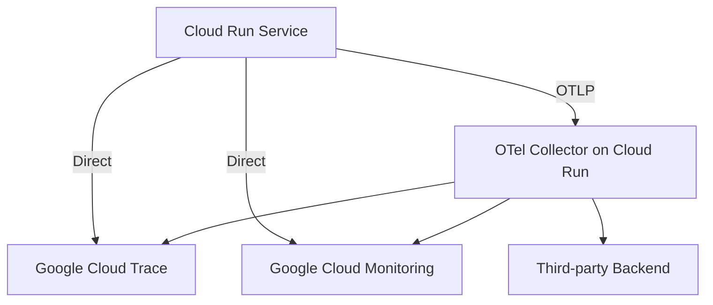

# How to Configure OpenTelemetry for Google Cloud Run

Author: [nawazdhandala](https://www.github.com/nawazdhandala)

Tags: OpenTelemetry, Google Cloud Run, Containers, Tracing, Metrics, Observability

Description: Step-by-step guide to configuring OpenTelemetry tracing and metrics for containerized services running on Google Cloud Run.

---

Google Cloud Run lets you deploy containers without managing infrastructure. You push a container image, Cloud Run handles scaling, networking, and TLS. But when your service starts misbehaving, you need observability. Cloud Run gives you basic request logs and metrics out of the box, but for distributed tracing and custom metrics, you need something more.

OpenTelemetry is the answer. It integrates cleanly with Cloud Run's container-based model, and since Cloud Run services are just containers, you have full control over the instrumentation. This guide walks through configuring OpenTelemetry for a Cloud Run service, covering both tracing and metrics export to Google Cloud's native observability stack.

## Architecture

Cloud Run services can export telemetry in two ways. The first is exporting directly to Google Cloud Trace and Cloud Monitoring. The second is exporting to an OpenTelemetry Collector running as a separate Cloud Run service or on GKE. The direct export approach is simpler. The Collector approach gives you more flexibility for processing and routing.



## Prerequisites

- A Google Cloud project with Cloud Run and Cloud Trace APIs enabled.
- Docker installed locally for building container images.
- The `gcloud` CLI configured with your project.

## Example: Node.js Service with OpenTelemetry

Let's build a simple Express.js service with full OpenTelemetry instrumentation and deploy it to Cloud Run.

### Project Setup

Start by creating the project structure and installing dependencies.

```bash
# Create the project directory
mkdir otel-cloudrun-demo && cd otel-cloudrun-demo

# Initialize the Node.js project
npm init -y

# Install the application dependencies
npm install express

# Install OpenTelemetry packages
npm install @opentelemetry/sdk-node \
  @opentelemetry/api \
  @opentelemetry/auto-instrumentations-node \
  @opentelemetry/exporter-trace-otlp-grpc \
  @opentelemetry/exporter-metrics-otlp-grpc \
  @opentelemetry/sdk-metrics \
  @opentelemetry/resources \
  @opentelemetry/semantic-conventions \
  @google-cloud/opentelemetry-cloud-trace-exporter \
  @google-cloud/opentelemetry-cloud-monitoring-exporter
```

### OpenTelemetry Initialization

Create the instrumentation file. This needs to load before your application code, so we will use Node.js's `--require` flag to preload it.

```javascript
// instrumentation.js - OpenTelemetry setup for Cloud Run
const { NodeSDK } = require('@opentelemetry/sdk-node');
const { getNodeAutoInstrumentations } = require('@opentelemetry/auto-instrumentations-node');
const { OTLPTraceExporter } = require('@opentelemetry/exporter-trace-otlp-grpc');
const { OTLPMetricExporter } = require('@opentelemetry/exporter-metrics-otlp-grpc');
const { PeriodicExportingMetricReader } = require('@opentelemetry/sdk-metrics');
const { Resource } = require('@opentelemetry/resources');
const { ATTR_SERVICE_NAME, ATTR_SERVICE_VERSION } = require('@opentelemetry/semantic-conventions');

// Determine the export endpoint from environment variables
// Cloud Run sets K_SERVICE and K_REVISION automatically
const collectorEndpoint = process.env.OTEL_EXPORTER_OTLP_ENDPOINT || 'http://localhost:4317';

// Build the resource that describes this service
const resource = new Resource({
  [ATTR_SERVICE_NAME]: process.env.K_SERVICE || 'otel-cloudrun-demo',
  [ATTR_SERVICE_VERSION]: process.env.K_REVISION || '1.0.0',
  'cloud.provider': 'gcp',
  'cloud.platform': 'gcp_cloud_run',
  'cloud.region': process.env.CLOUD_RUN_REGION || 'unknown',
});

// Configure the trace exporter
const traceExporter = new OTLPTraceExporter({
  url: collectorEndpoint,
});

// Configure the metric exporter with a 30-second export interval
const metricReader = new PeriodicExportingMetricReader({
  exporter: new OTLPMetricExporter({
    url: collectorEndpoint,
  }),
  exportIntervalMillis: 30000,
});

// Create and start the SDK
const sdk = new NodeSDK({
  resource,
  traceExporter,
  metricReader,
  instrumentations: [
    getNodeAutoInstrumentations({
      // Disable file system instrumentation to reduce noise
      '@opentelemetry/instrumentation-fs': { enabled: false },
    }),
  ],
});

sdk.start();

// Handle graceful shutdown
process.on('SIGTERM', async () => {
  await sdk.shutdown();
  process.exit(0);
});
```

### Application Code

Write the Express application. Since we loaded the instrumentation via `--require`, all HTTP traffic is automatically traced.

```javascript
// app.js - Express application
const express = require('express');
const { trace, metrics } = require('@opentelemetry/api');

const app = express();
const port = process.env.PORT || 8080;

// Get a tracer and meter for custom instrumentation
const tracer = trace.getTracer('otel-cloudrun-demo');
const meter = metrics.getMeter('otel-cloudrun-demo');

// Create custom metrics
const requestCounter = meter.createCounter('app.requests.total', {
  description: 'Total number of requests processed',
});

const processingDuration = meter.createHistogram('app.processing.duration', {
  description: 'Time spent processing requests in milliseconds',
  unit: 'ms',
});

app.get('/', (req, res) => {
  // Increment the request counter
  requestCounter.add(1, { route: '/', method: 'GET' });

  res.json({ status: 'healthy', service: process.env.K_SERVICE });
});

app.get('/api/orders/:id', async (req, res) => {
  const startTime = Date.now();

  // Create a custom span for business logic
  return tracer.startActiveSpan('fetch-order', async (span) => {
    try {
      span.setAttribute('order.id', req.params.id);

      // Simulate database lookup
      const order = await fetchOrder(req.params.id);

      // Record the processing time
      const duration = Date.now() - startTime;
      processingDuration.record(duration, { route: '/api/orders/:id' });
      requestCounter.add(1, { route: '/api/orders/:id', method: 'GET' });

      span.end();
      res.json(order);
    } catch (error) {
      span.recordException(error);
      span.end();
      res.status(500).json({ error: 'Failed to fetch order' });
    }
  });
});

async function fetchOrder(id) {
  // Simulated database call with a child span
  return tracer.startActiveSpan('db.query', async (span) => {
    span.setAttribute('db.system', 'postgresql');
    span.setAttribute('db.statement', 'SELECT * FROM orders WHERE id = $1');

    // Simulate latency
    await new Promise(resolve => setTimeout(resolve, 50));

    span.end();
    return { id, status: 'shipped', total: 42.99 };
  });
}

app.listen(port, () => {
  console.log(`Server listening on port ${port}`);
});
```

### Dockerfile

Build a container image that preloads the instrumentation module.

```dockerfile
# Use the official Node.js image
FROM node:20-slim

# Set the working directory
WORKDIR /app

# Copy package files and install dependencies
COPY package*.json ./
RUN npm ci --only=production

# Copy application code
COPY . .

# Cloud Run sets PORT automatically; default to 8080
ENV PORT=8080

# Use --require to load instrumentation before the app starts
# This ensures all modules are patched before they are imported
CMD ["node", "--require", "./instrumentation.js", "app.js"]
```

### Deploy to Cloud Run

Build and deploy the container.

```bash
# Build the container image using Cloud Build
gcloud builds submit --tag gcr.io/your-project-id/otel-cloudrun-demo

# Deploy to Cloud Run with the collector endpoint configured
gcloud run deploy otel-cloudrun-demo \
  --image gcr.io/your-project-id/otel-cloudrun-demo \
  --region us-central1 \
  --platform managed \
  --allow-unauthenticated \
  --set-env-vars="OTEL_EXPORTER_OTLP_ENDPOINT=https://your-collector:4317" \
  --set-env-vars="CLOUD_RUN_REGION=us-central1" \
  --memory 512Mi \
  --cpu 1
```

## Exporting Directly to Google Cloud Trace

If you do not want to run a separate Collector, you can export traces directly to Google Cloud Trace. Replace the OTLP exporter in your instrumentation file with the Cloud Trace exporter.

```javascript
// instrumentation-gcp.js - Direct export to Google Cloud Trace
const { NodeSDK } = require('@opentelemetry/sdk-node');
const { TraceExporter } = require('@google-cloud/opentelemetry-cloud-trace-exporter');
const { getNodeAutoInstrumentations } = require('@opentelemetry/auto-instrumentations-node');
const { Resource } = require('@opentelemetry/resources');
const { ATTR_SERVICE_NAME } = require('@opentelemetry/semantic-conventions');

// The Cloud Trace exporter uses the service account bound to the Cloud Run service
// No explicit credentials needed - it uses the default service account
const traceExporter = new TraceExporter({
  projectId: process.env.GOOGLE_CLOUD_PROJECT,
});

const sdk = new NodeSDK({
  resource: new Resource({
    [ATTR_SERVICE_NAME]: process.env.K_SERVICE || 'otel-cloudrun-demo',
    'cloud.provider': 'gcp',
    'cloud.platform': 'gcp_cloud_run',
  }),
  traceExporter,
  instrumentations: [
    getNodeAutoInstrumentations({
      '@opentelemetry/instrumentation-fs': { enabled: false },
    }),
  ],
});

sdk.start();
```

When using direct export, make sure the Cloud Run service's service account has the `roles/cloudtrace.agent` role.

```bash
# Grant the Cloud Trace agent role to the service account
gcloud projects add-iam-policy-binding your-project-id \
  --member="serviceAccount:your-service-account@your-project-id.iam.gserviceaccount.com" \
  --role="roles/cloudtrace.agent"
```

## Handling Cloud Run's Scaling Behavior

Cloud Run scales to zero when there is no traffic. This means your container process gets terminated, and the OpenTelemetry SDK needs to flush any pending spans before that happens. Cloud Run sends a `SIGTERM` signal before shutting down, giving you up to 10 seconds (by default) to clean up.

The shutdown handler we added in the instrumentation file handles this. But you should also be aware of the minimum instance setting. If you set minimum instances to 1 or more, your service stays warm, and you avoid the cold start overhead of reinitializing the OpenTelemetry SDK.

```bash
# Set minimum instances to avoid cold starts
gcloud run services update otel-cloudrun-demo \
  --min-instances=1 \
  --region=us-central1
```

## Running the Collector as a Sidecar

Starting with Cloud Run's multi-container support (second generation), you can run the OpenTelemetry Collector as a sidecar container alongside your application. This is the best of both worlds: your app exports to localhost (fast, no network latency), and the Collector handles batching, retry, and export to multiple backends.

```yaml
# service.yaml - Cloud Run service with OTel Collector sidecar
apiVersion: serving.knative.dev/v1
kind: Service
metadata:
  name: otel-cloudrun-demo
spec:
  template:
    metadata:
      annotations:
        # Enable multi-container support
        run.googleapis.com/container-dependencies: '{"app":["collector"]}'
    spec:
      containers:
        # Your application container
        - name: app
          image: gcr.io/your-project-id/otel-cloudrun-demo
          ports:
            - containerPort: 8080
          env:
            # Point to the sidecar collector on localhost
            - name: OTEL_EXPORTER_OTLP_ENDPOINT
              value: "http://localhost:4317"

        # OpenTelemetry Collector sidecar
        - name: collector
          image: otel/opentelemetry-collector-contrib:0.96.0
          args: ["--config=/etc/otelcol/config.yaml"]
          volumeMounts:
            - name: otel-config
              mountPath: /etc/otelcol

      volumes:
        - name: otel-config
          configMap:
            name: otel-collector-config
```

## Trace Context from Cloud Run's Load Balancer

Cloud Run's built-in load balancer adds an `X-Cloud-Trace-Context` header to incoming requests. OpenTelemetry does not parse this header by default because it uses the W3C `traceparent` format. If you want to connect Cloud Run's request logging with your OpenTelemetry traces, you can configure the Google Cloud propagator.

```bash
# Install the GCP propagator package
npm install @google-cloud/opentelemetry-cloud-trace-propagator
```

```javascript
// Add the Google Cloud propagator alongside W3C trace context
const { CloudPropagator } = require('@google-cloud/opentelemetry-cloud-trace-propagator');
const { W3CTraceContextPropagator } = require('@opentelemetry/core');
const { CompositePropagator } = require('@opentelemetry/core');
const { propagation } = require('@opentelemetry/api');

// Use both propagators so you can receive context from GCP infrastructure
// and from other OpenTelemetry-instrumented services
propagation.setGlobalPropagator(
  new CompositePropagator({
    propagators: [
      new W3CTraceContextPropagator(),
      new CloudPropagator(),
    ],
  })
);
```

## Summary

Configuring OpenTelemetry for Cloud Run is straightforward because Cloud Run services are just containers. You have full control over the runtime, so the standard OpenTelemetry SDK setup works without any special adaptations. The main things to pay attention to are: preload the instrumentation before your application starts, handle SIGTERM for graceful span flushing, and choose between direct export to Google Cloud Trace or routing through a Collector based on your needs. With the sidecar Collector pattern now available, you can get the best performance while maintaining flexibility over where your telemetry data goes.
