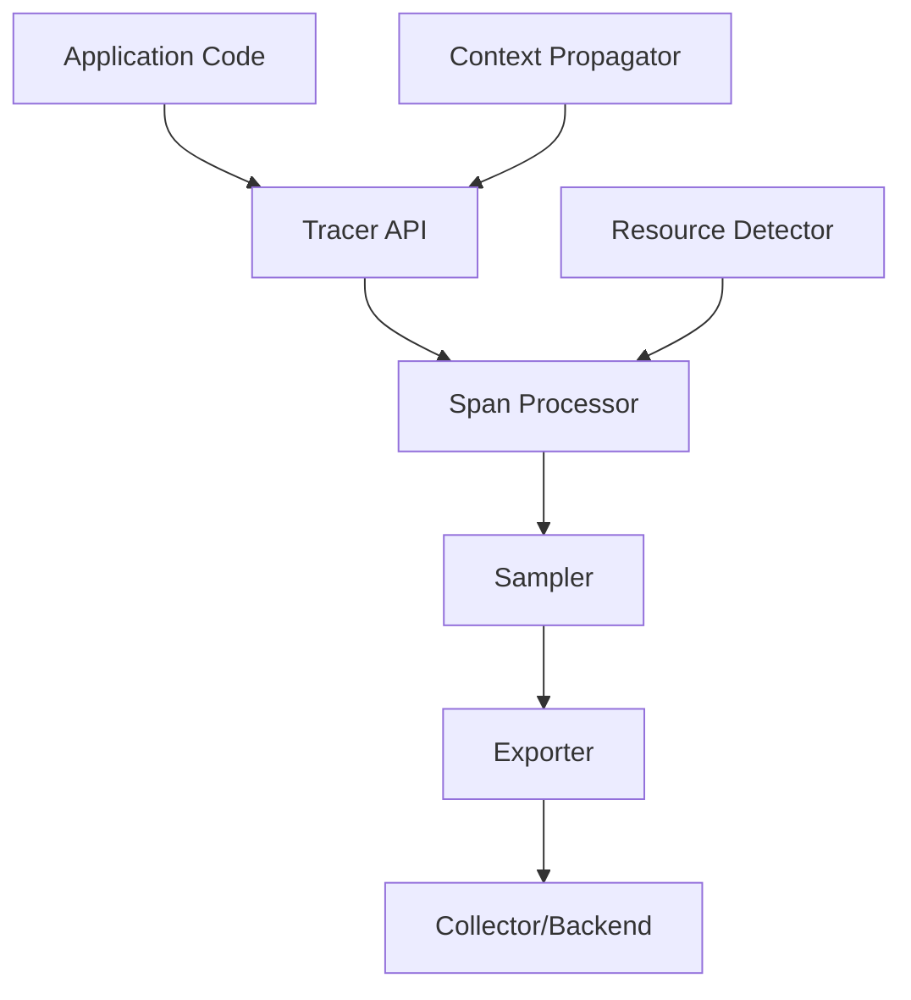

# How to Configure OpenTelemetry SDK in Elixir/Erlang Applications

Author: [nawazdhandala](https://www.github.com/nawazdhandala)

Tags: OpenTelemetry, Elixir, Erlang, SDK, Configuration, BEAM

Description: Complete guide to configuring the OpenTelemetry SDK for production Elixir and Erlang applications including exporters, samplers, resource detection, and performance tuning.

The OpenTelemetry SDK for Elixir/Erlang brings production-grade observability to BEAM applications. While basic instrumentation is straightforward, production deployments require careful configuration of exporters, sampling strategies, resource attributes, and performance settings. This guide covers everything needed to run OpenTelemetry in production Elixir and Erlang applications.

## Understanding the SDK Architecture

The OpenTelemetry SDK consists of several components that work together:



**Tracer API**: The interface your application uses to create spans.

**Span Processor**: Buffers and batches spans before export.

**Sampler**: Decides which traces to record and export.

**Exporter**: Sends telemetry data to backends using protocols like OTLP.

**Resource Detector**: Identifies your service and deployment environment.

**Context Propagator**: Maintains trace context across process and service boundaries.

## Basic SDK Configuration

Start with the minimal configuration in your `config/runtime.exs`:

```elixir
import Config

# Core OpenTelemetry configuration
config :opentelemetry,
  # Define your service identity
  resource: [
    service: [
      name: System.get_env("OTEL_SERVICE_NAME") || "my-elixir-app",
      namespace: System.get_env("OTEL_SERVICE_NAMESPACE") || "production",
      version: System.get_env("APP_VERSION") || "1.0.0",
      instance: [
        id: System.get_env("HOSTNAME") || Node.self() |> to_string()
      ]
    ]
  ],
  # Configure span processors
  processors: [
    otel_batch_processor: %{
      exporter: {:otel_exporter_otlp, %{}}
    }
  ]

# Exporter configuration
config :opentelemetry_exporter,
  otlp_protocol: :http_protobuf,
  otlp_endpoint: System.get_env("OTEL_EXPORTER_OTLP_ENDPOINT") || "http://localhost:4318",
  otlp_headers: parse_headers(System.get_env("OTEL_EXPORTER_OTLP_HEADERS")),
  otlp_compression: :gzip

defp parse_headers(nil), do: []
defp parse_headers(headers) do
  headers
  |> String.split(",")
  |> Enum.map(fn header ->
    [key, value] = String.split(header, "=", parts: 2)
    {String.trim(key), String.trim(value)}
  end)
end
```

This configuration uses environment variables following OpenTelemetry conventions, making it easy to configure different environments.

## Exporter Configuration

The exporter determines how traces reach your observability backend. Configure the OTLP exporter with production settings:

```elixir
config :opentelemetry_exporter,
  # Protocol: http_protobuf (default), grpc
  otlp_protocol: :http_protobuf,

  # Collector endpoint
  otlp_endpoint: System.get_env("OTEL_EXPORTER_OTLP_ENDPOINT"),

  # Separate endpoints for traces, metrics, logs (optional)
  otlp_traces_endpoint: System.get_env("OTEL_EXPORTER_OTLP_TRACES_ENDPOINT"),

  # Authentication headers
  otlp_headers: [
    {"x-api-key", System.get_env("OTEL_API_KEY")},
    {"x-environment", System.get_env("MIX_ENV")}
  ],

  # Compression: gzip, none
  otlp_compression: :gzip,

  # Timeout for export requests (milliseconds)
  otlp_timeout: 10_000,

  # SSL/TLS configuration
  otlp_ssl_options: [
    verify: :verify_peer,
    cacertfile: System.get_env("SSL_CERT_FILE"),
    depth: 3
  ]
```

For gRPC protocol (more efficient for high throughput):

```elixir
config :opentelemetry_exporter,
  otlp_protocol: :grpc,
  otlp_endpoint: "https://collector.example.com:4317",
  # gRPC uses different port (4317 vs 4318 for HTTP)
  otlp_compression: :gzip,
  # gRPC-specific options
  grpc_options: [
    pool_size: 10,
    # Keep connection alive
    keepalive: 60_000
  ]
```

## Span Processor Configuration

The batch processor controls how spans are buffered and exported:

```elixir
config :opentelemetry,
  processors: [
    otel_batch_processor: %{
      # The exporter to use
      exporter: {:otel_exporter_otlp, %{
        protocol: :http_protobuf,
        endpoint: System.get_env("OTEL_EXPORTER_OTLP_ENDPOINT")
      }},

      # Maximum batch size before forcing export
      max_queue_size: 2048,

      # Time to wait before exporting (milliseconds)
      scheduled_delay_ms: 5000,

      # Maximum batch export size
      max_export_batch_size: 512,

      # Export timeout (milliseconds)
      exporting_timeout_ms: 30_000
    }
  ]
```

Tune these settings based on your traffic patterns:

**High Throughput Applications**: Increase `max_queue_size` and `max_export_batch_size` to handle burst traffic without dropping spans.

**Low Latency Requirements**: Decrease `scheduled_delay_ms` to export spans more frequently, reducing the time before traces appear in your backend.

**Resource Constrained**: Lower batch sizes to reduce memory usage, though this increases export frequency and network overhead.

## Sampling Configuration

Sampling controls which traces are recorded. Configure sampling in production to manage costs and volume:

```elixir
config :opentelemetry,
  # Parent-based sampler with ratio-based root sampling
  sampler: {:parent_based, %{
    # Sample 10% of root spans (new traces)
    root: {:trace_id_ratio_based, 0.1},
    # Always sample if parent is sampled
    remote_parent_sampled: :always_on,
    remote_parent_not_sampled: :always_off,
    local_parent_sampled: :always_on,
    local_parent_not_sampled: :always_off
  }}
```

Common sampling strategies:

**Always On** - Record every trace (development/debugging):
```elixir
config :opentelemetry, sampler: :always_on
```

**Always Off** - Record no traces (testing):
```elixir
config :opentelemetry, sampler: :always_off
```

**Ratio-Based** - Sample percentage of traces:
```elixir
config :opentelemetry, sampler: {:trace_id_ratio_based, 0.05}  # 5%
```

**Parent-Based** - Respect parent sampling decisions (recommended for distributed systems):
```elixir
config :opentelemetry, sampler: {:parent_based, %{root: {:trace_id_ratio_based, 0.1}}}
```

## Custom Sampling Logic

Implement custom sampling for more control:

```elixir
defmodule MyApp.CustomSampler do
  @behaviour :otel_sampler

  def setup(_opts) do
    # Initialize sampler state
    %{
      default_ratio: 0.1,
      high_priority_paths: ["/api/critical", "/health/deep"]
    }
  end

  def should_sample(ctx, trace_id, _links, span_name, _span_kind, attributes, config) do
    # Always sample high-priority endpoints
    if high_priority?(attributes, config.high_priority_paths) do
      {:record_and_sample, [], trace_id}
    else
      # Apply ratio sampling to other requests
      if sample_by_trace_id?(trace_id, config.default_ratio) do
        {:record_and_sample, [], trace_id}
      else
        {:drop, [], trace_id}
      end
    end
  end

  defp high_priority?(attributes, priority_paths) do
    case List.keyfind(attributes, "http.target", 0) do
      {"http.target", path} ->
        Enum.any?(priority_paths, &String.starts_with?(path, &1))
      _ ->
        false
    end
  end

  defp sample_by_trace_id?(trace_id, ratio) do
    # Use trace_id for consistent sampling decisions
    :erlang.phash2(trace_id) / :math.pow(2, 32) < ratio
  end

  def description(_config) do
    "Custom sampler with priority-based decisions"
  end
end

# Configure your custom sampler
config :opentelemetry, sampler: {MyApp.CustomSampler, %{}}
```

This sampler always records critical endpoints while sampling others at a lower rate.

## Resource Configuration

Resources describe your service and environment. Configure rich resource attributes:

```elixir
config :opentelemetry,
  resource: [
    # Service identification
    service: [
      name: System.get_env("OTEL_SERVICE_NAME") || "my-app",
      namespace: System.get_env("OTEL_SERVICE_NAMESPACE") || "production",
      version: System.get_env("APP_VERSION") || get_app_version(),
      instance: [
        id: System.get_env("INSTANCE_ID") || generate_instance_id()
      ]
    ],

    # Deployment environment
    deployment: [
      environment: System.get_env("MIX_ENV") || "production"
    ],

    # Container/orchestration info
    container: [
      id: System.get_env("CONTAINER_ID"),
      name: System.get_env("CONTAINER_NAME"),
      image: [
        name: System.get_env("IMAGE_NAME"),
        tag: System.get_env("IMAGE_TAG")
      ]
    ],

    # Kubernetes info
    k8s: [
      cluster: [
        name: System.get_env("K8S_CLUSTER_NAME")
      ],
      namespace: [
        name: System.get_env("K8S_NAMESPACE")
      ],
      pod: [
        name: System.get_env("K8S_POD_NAME"),
        uid: System.get_env("K8S_POD_UID")
      ],
      node: [
        name: System.get_env("K8S_NODE_NAME")
      ]
    ],

    # Cloud provider info
    cloud: [
      provider: detect_cloud_provider(),
      platform: System.get_env("CLOUD_PLATFORM"),
      region: System.get_env("CLOUD_REGION"),
      availability_zone: System.get_env("CLOUD_AZ")
    ],

    # Host information
    host: [
      name: System.get_env("HOSTNAME"),
      type: detect_host_type(),
      arch: to_string(:erlang.system_info(:system_architecture))
    ],

    # Process information
    process: [
      pid: System.get_env("PROCESS_PID") || to_string(System.pid()),
      runtime: [
        name: "BEAM",
        version: System.version(),
        description: "Erlang/OTP #{System.otp_release()}"
      ]
    ]
  ]

defp get_app_version do
  Application.spec(:my_app, :vsn) |> to_string()
end

defp generate_instance_id do
  :crypto.strong_rand_bytes(16) |> Base.encode16(case: :lower)
end

defp detect_cloud_provider do
  cond do
    System.get_env("AWS_REGION") -> "aws"
    System.get_env("GOOGLE_CLOUD_PROJECT") -> "gcp"
    System.get_env("AZURE_RESOURCE_GROUP") -> "azure"
    true -> "unknown"
  end
end

defp detect_host_type do
  if System.get_env("CONTAINER_ID"), do: "container", else: "physical"
end
```

These attributes enable filtering and grouping traces by service, environment, region, and more in your observability platform.

## Context Propagation

Configure how trace context propagates across service boundaries:

```elixir
config :opentelemetry,
  # Configure propagators for different standards
  text_map_propagators: [
    # W3C Trace Context (recommended)
    :trace_context,
    # W3C Baggage
    :baggage,
    # B3 format (Zipkin compatibility)
    :b3multi
  ]
```

Available propagators:

**:trace_context** - W3C Trace Context standard (default, recommended)

**:baggage** - W3C Baggage for key-value propagation

**:b3multi** - B3 multi-header format (Zipkin)

**:b3single** - B3 single-header format

**:jaeger** - Jaeger propagation format

For multi-cloud or polyglot environments, enable multiple propagators:

```elixir
config :opentelemetry,
  text_map_propagators: [:trace_context, :b3multi, :baggage]
```

## Performance Tuning

Optimize OpenTelemetry for your workload:

```elixir
config :opentelemetry,
  # Limit maximum span attributes
  span_attribute_count_limit: 128,
  span_attribute_value_length_limit: 1024,

  # Limit span events
  span_event_count_limit: 128,
  event_attribute_count_limit: 32,

  # Limit span links
  span_link_count_limit: 32,
  link_attribute_count_limit: 32

# Processor performance tuning
config :opentelemetry,
  processors: [
    otel_batch_processor: %{
      exporter: {:otel_exporter_otlp, %{}},
      # Tune for high throughput
      max_queue_size: 4096,
      max_export_batch_size: 1024,
      scheduled_delay_ms: 5000,
      # Handle export failures
      max_retry_count: 3,
      retry_timeout_ms: 1000
    }
  ]
```

Monitor the impact using Erlang observer or Telemetry metrics:

```elixir
defmodule MyApp.OtelMetrics do
  def setup do
    :telemetry.attach_many(
      "otel-metrics",
      [
        [:otel, :batch_processor, :export, :start],
        [:otel, :batch_processor, :export, :stop],
        [:otel, :batch_processor, :export, :exception]
      ],
      &handle_event/4,
      nil
    )
  end

  def handle_event([:otel, :batch_processor, :export, :stop], measurements, _meta, _config) do
    # Log export performance
    IO.puts("Exported batch: #{measurements.count} spans in #{measurements.duration}ms")
  end

  def handle_event([:otel, :batch_processor, :export, :exception], _measurements, meta, _) do
    # Alert on export failures
    IO.warn("Export failed: #{inspect(meta.reason)}")
  end

  def handle_event(_, _, _, _), do: :ok
end
```

## Environment-Specific Configuration

Use different configurations per environment:

```elixir
# config/dev.exs
import Config

config :opentelemetry,
  # Verbose sampling in development
  sampler: :always_on,
  processors: [
    otel_batch_processor: %{
      exporter: {:otel_exporter_stdout, %{}}  # Print to console
    }
  ]

# config/test.exs
import Config

config :opentelemetry,
  # Disable in tests by default
  sampler: :always_off

# config/prod.exs
import Config

config :opentelemetry,
  # Production sampling
  sampler: {:parent_based, %{
    root: {:trace_id_ratio_based, 0.1}
  }},
  processors: [
    otel_batch_processor: %{
      exporter: {:otel_exporter_otlp, %{
        protocol: :grpc,
        endpoint: {:system, "OTEL_EXPORTER_OTLP_ENDPOINT"}
      }},
      max_queue_size: 4096
    }
  ]
```

## Health Checks and Monitoring

Monitor OpenTelemetry SDK health:

```elixir
defmodule MyAppWeb.HealthController do
  use MyAppWeb, :controller

  def otel_status(conn, _params) do
    # Check if processors are running
    processor_status = check_processors()

    # Check exporter connectivity
    exporter_status = check_exporter()

    status = if processor_status and exporter_status do
      :healthy
    else
      :unhealthy
    end

    conn
    |> put_status(if status == :healthy, do: 200, else: 503)
    |> json(%{
      status: status,
      processors: processor_status,
      exporter: exporter_status,
      sdk_version: get_sdk_version()
    })
  end

  defp check_processors do
    # Verify batch processor is running
    case Process.whereis(:otel_batch_processor) do
      pid when is_pid(pid) -> Process.alive?(pid)
      _ -> false
    end
  end

  defp check_exporter do
    # Attempt test export
    try do
      :otel_exporter_otlp.export([], 1000)
      true
    rescue
      _ -> false
    end
  end

  defp get_sdk_version do
    Application.spec(:opentelemetry, :vsn) |> to_string()
  end
end
```

## Distributed Tracing Across Nodes

Configure tracing in distributed Erlang clusters:

```elixir
defmodule MyApp.Application do
  use Application

  def start(_type, _args) do
    # Setup OpenTelemetry before starting application
    setup_opentelemetry()

    children = [
      MyApp.Repo,
      MyAppWeb.Endpoint,
      # Cluster supervisor for distributed Erlang
      {Cluster.Supervisor, [topologies(), [name: MyApp.ClusterSupervisor]]}
    ]

    opts = [strategy: :one_for_one, name: MyApp.Supervisor]
    Supervisor.start_link(children, opts)
  end

  defp setup_opentelemetry do
    # Ensure unique instance ID per node
    node_id = Node.self() |> to_string()

    :opentelemetry.set_default_resource([
      service: [
        instance: [
          id: node_id
        ]
      ]
    ])

    # Setup instrumentations
    OpentelemetryPhoenix.setup(adapter: :cowboy2)
    OpentelemetryEcto.setup([:my_app, :repo])
  end

  defp topologies do
    [
      my_app: [
        strategy: Cluster.Strategy.Epmd,
        config: [hosts: Application.get_env(:my_app, :cluster_nodes, [])]
      ]
    ]
  end
end
```

Trace context automatically propagates across nodes when using standard BEAM messaging.

## Troubleshooting

Common issues and solutions:

**Spans not exported**: Check exporter endpoint connectivity, verify authentication headers, and review processor logs.

**High memory usage**: Reduce `max_queue_size`, increase export frequency by lowering `scheduled_delay_ms`, or increase sampling rate.

**Missing traces**: Verify sampling configuration, check that instrumentation is attached before application starts, and confirm trace context propagation.

**Export failures**: Enable verbose logging, verify network connectivity, check SSL/TLS certificates, and monitor exporter health checks.

Enable debug logging:

```elixir
config :logger, level: :debug

config :opentelemetry,
  processors: [
    otel_batch_processor: %{
      exporter: {:otel_exporter_otlp, %{
        # Enable debug output
        debug: true
      }}
    }
  ]
```

## Conclusion

Proper OpenTelemetry SDK configuration is crucial for production deployments. This guide covered exporters, sampling strategies, resource configuration, performance tuning, and troubleshooting. With these settings, your Elixir/Erlang application has production-grade observability that scales with your traffic and provides the visibility needed to maintain reliable services.

Combined with the instrumentation techniques from previous posts, you now have a complete OpenTelemetry setup for Phoenix applications, covering HTTP requests, database queries, real-time features, and frontend interactions. This foundation enables data-driven performance optimization and rapid incident resolution.
