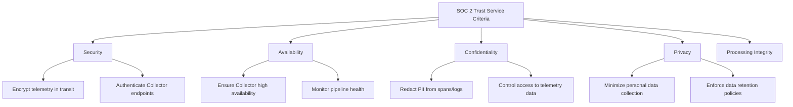
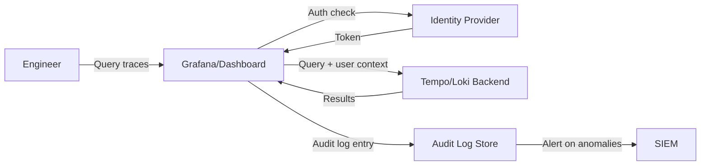

# How to Configure OpenTelemetry for SOC 2 Compliance Requirements

Author: [nawazdhandala](https://www.github.com/nawazdhandala)

Tags: OpenTelemetry, SOC 2, Compliance, Security, Observability, Auditing

Description: A practical guide to configuring your OpenTelemetry pipeline to meet SOC 2 Trust Service Criteria for security, availability, and confidentiality.

---

SOC 2 compliance affects how you collect, transport, store, and access telemetry data. If your organization is working toward or maintaining SOC 2 certification, your observability pipeline is in scope. Auditors will want to know how you handle sensitive data in logs and traces, how you secure the transport layer, who has access to telemetry backends, and how long you retain data.

This guide maps SOC 2 Trust Service Criteria to specific OpenTelemetry configuration decisions. We will cover data handling, encryption, access controls, retention, and audit logging with concrete configuration examples.

## SOC 2 and Telemetry: What is Actually in Scope

SOC 2 is organized around five Trust Service Criteria: Security, Availability, Processing Integrity, Confidentiality, and Privacy. Not all of them apply equally to telemetry, but several criteria directly affect how you configure OpenTelemetry.



Let us work through each relevant criterion with specific configurations.

## Security: Encrypt All Telemetry in Transit

SOC 2 CC6.1 requires that you protect information during transmission. For OpenTelemetry, this means TLS on every connection in your pipeline: from SDKs to the Collector, between Collector tiers, and from the Collector to your backend.

This Collector configuration enforces TLS on both the receiver (incoming) and exporter (outgoing) sides.

```yaml
# collector-tls.yaml
receivers:
  otlp:
    protocols:
      grpc:
        endpoint: 0.0.0.0:4317
        tls:
          # Require TLS for all incoming telemetry
          cert_file: /certs/collector-server.crt
          key_file: /certs/collector-server.key
          # Require client certificates for mutual TLS
          client_ca_file: /certs/ca.crt
      http:
        endpoint: 0.0.0.0:4318
        tls:
          cert_file: /certs/collector-server.crt
          key_file: /certs/collector-server.key
          client_ca_file: /certs/ca.crt

exporters:
  otlp/backend:
    endpoint: "telemetry-backend.internal:4317"
    tls:
      # Use TLS for outgoing connections to the backend
      cert_file: /certs/collector-client.crt
      key_file: /certs/collector-client.key
      ca_file: /certs/backend-ca.crt
      # Do not allow insecure connections
      insecure: false
```

On the SDK side, configure your applications to use TLS when sending telemetry.

This environment variable configuration ensures the SDK uses HTTPS to communicate with the Collector.

```bash
# Application environment variables for secure telemetry export
# Use HTTPS endpoint for the Collector
export OTEL_EXPORTER_OTLP_ENDPOINT="https://collector.internal:4317"

# Provide client certificate for mutual TLS
export OTEL_EXPORTER_OTLP_CERTIFICATE="/certs/app-client.crt"
export OTEL_EXPORTER_OTLP_CLIENT_KEY="/certs/app-client.key"
```

## Security: Authenticate Collector Endpoints

SOC 2 CC6.1 also covers logical access controls. Your Collector should not accept telemetry from unauthenticated sources. Use the bearer token authentication extension or mTLS (shown above) to verify that only authorized services send data.

This configuration adds bearer token authentication to the Collector receiver.

```yaml
# collector-auth.yaml
extensions:
  # Configure bearer token authentication
  bearertokenauth:
    token: "${env:COLLECTOR_AUTH_TOKEN}"

receivers:
  otlp:
    protocols:
      grpc:
        endpoint: 0.0.0.0:4317
        # Require authentication on incoming connections
        auth:
          authenticator: bearertokenauth

service:
  extensions: [bearertokenauth]
  pipelines:
    traces:
      receivers: [otlp]
      processors: [batch]
      exporters: [otlp/backend]
```

## Confidentiality: Redact PII from Telemetry

SOC 2 CC6.5 requires protection of confidential information. Traces and logs frequently contain personally identifiable information: email addresses, user IDs, IP addresses, and sometimes even credit card numbers embedded in HTTP request attributes.

Use the redaction processor in the Collector to strip sensitive data patterns before they reach your backend.

This configuration uses the transform processor to redact common PII patterns from span attributes.

```yaml
# collector-pii-redaction.yaml
processors:
  # Redact sensitive patterns from all span attributes
  transform/redact-pii:
    trace_statements:
      - context: span
        statements:
          # Redact email addresses
          - replace_all_patterns(attributes, "value", "(?i)[a-zA-Z0-9._%+-]+@[a-zA-Z0-9.-]+\\.[a-zA-Z]{2,}", "[REDACTED-EMAIL]")
          # Redact credit card numbers (basic pattern)
          - replace_all_patterns(attributes, "value", "\\b\\d{4}[- ]?\\d{4}[- ]?\\d{4}[- ]?\\d{4}\\b", "[REDACTED-CC]")
          # Redact US Social Security Numbers
          - replace_all_patterns(attributes, "value", "\\b\\d{3}-\\d{2}-\\d{4}\\b", "[REDACTED-SSN]")

  # Remove specific attributes that commonly contain PII
  attributes/strip-pii:
    actions:
      - key: enduser.id
        action: delete
      - key: http.request.header.cookie
        action: delete
      - key: http.request.header.authorization
        action: delete
      - key: http.request.header.x-forwarded-for
        action: delete

service:
  pipelines:
    traces:
      receivers: [otlp]
      # Apply both PII redaction processors
      processors: [transform/redact-pii, attributes/strip-pii, batch]
      exporters: [otlp/backend]
    logs:
      receivers: [otlp]
      processors: [transform/redact-pii, attributes/strip-pii, batch]
      exporters: [otlp/backend]
```

## Availability: High Availability Collector Deployment

SOC 2 A1.1 requires systems to meet availability commitments. Your telemetry pipeline should be resilient to failures. Deploy multiple Collector instances behind a load balancer, and use persistent queuing to handle backend outages.

This Collector configuration enables persistent storage for the sending queue, preventing data loss during backend downtime.

```yaml
# collector-ha.yaml
exporters:
  otlp/backend:
    endpoint: "telemetry-backend.internal:4317"
    sending_queue:
      # Enable persistent queue for durability
      enabled: true
      storage: file_storage
      # Buffer up to 10000 batches during backend outages
      queue_size: 10000
    retry_on_failure:
      enabled: true
      initial_interval: 5s
      max_interval: 60s
      max_elapsed_time: 300s

extensions:
  # Configure file-based persistent storage
  file_storage:
    directory: /var/lib/otelcol/queue
    timeout: 10s
    compaction:
      on_start: true
      directory: /var/lib/otelcol/queue/compaction

service:
  extensions: [file_storage]
```

For Kubernetes deployments, use a Deployment with multiple replicas and a horizontal pod autoscaler.

```yaml
# collector-hpa.yaml
apiVersion: autoscaling/v2
kind: HorizontalPodAutoscaler
metadata:
  name: otel-collector
  namespace: observability
spec:
  scaleTargetRef:
    apiVersion: apps/v1
    kind: Deployment
    name: otel-collector
  minReplicas: 3
  maxReplicas: 10
  metrics:
    # Scale based on CPU usage
    - type: Resource
      resource:
        name: cpu
        target:
          type: Utilization
          averageUtilization: 70
```

## Privacy: Enforce Data Retention Policies

SOC 2 P6.1 covers data retention and disposal. You need to define how long telemetry data is kept and ensure it is deleted when the retention period expires. This is typically enforced at the backend level, but the Collector can help by adding metadata.

This configuration adds retention metadata to all telemetry, making it easier to enforce deletion policies at the backend.

```yaml
# collector-retention.yaml
processors:
  # Add retention metadata to all telemetry
  resource/retention:
    attributes:
      - key: data.retention_days
        action: upsert
        value: "90"
      - key: data.classification
        action: upsert
        value: "internal"
      - key: compliance.framework
        action: upsert
        value: "soc2"
```

On the backend side, configure automatic data expiration. Here is an example for Grafana Tempo.

```yaml
# tempo-config.yaml
compactor:
  compaction:
    # Automatically delete trace data older than 90 days
    block_retention: 2160h  # 90 days
storage:
  trace:
    backend: s3
    s3:
      bucket: telemetry-traces
      endpoint: s3.amazonaws.com
    blocklist_poll: 5m
```

## Audit Logging: Track Access to Telemetry

SOC 2 CC7.2 requires monitoring for anomalies and security events. You need to log who accesses telemetry data and what queries they run. Most observability backends support audit logging.



Enable audit logging in your dashboard tool. Here is an example for Grafana.

```ini
# grafana.ini
[log]
# Enable detailed request logging
mode = console file
level = info

[auditing]
# Enable audit logging for all user actions
enabled = true
# Log to both file and Loki for analysis
loggers = file loki

[auditing.logs.file]
path = /var/log/grafana/audit.log
```

## SOC 2 Compliance Checklist for OpenTelemetry

Here is a summary of what you need to configure for each relevant Trust Service Criterion.

| SOC 2 Criterion | OpenTelemetry Configuration |
|---|---|
| CC6.1 - Logical Access | mTLS on receivers, bearer token auth, RBAC on backends |
| CC6.1 - Encryption | TLS on all Collector connections, HTTPS SDK endpoints |
| CC6.5 - Confidential Data | PII redaction processors, attribute filtering |
| CC7.2 - Monitoring | Collector health metrics, pipeline alerting |
| A1.1 - Availability | Multi-replica Collectors, persistent queuing, HPA |
| P6.1 - Retention | Backend retention policies, automatic data expiration |

## Documenting Your Configuration for Auditors

SOC 2 auditors will want documentation. Keep a record of your Collector configuration files, network diagrams showing the telemetry data flow, access control policies for your observability backend, and data retention policies.

Store your Collector configurations in version control (with secrets properly externalized, of course). Use infrastructure-as-code tools like Terraform or Helm to manage deployments so there is a clear audit trail for every configuration change.

## Wrapping Up

Configuring OpenTelemetry for SOC 2 compliance is not about adding a single feature. It is about making deliberate choices at every layer of your telemetry pipeline. Encrypt everything in transit. Authenticate all connections. Redact PII before it reaches your backend. Deploy for high availability. Enforce retention policies. And log all access.

The good news is that the OpenTelemetry Collector gives you the building blocks to address all of these requirements. You just need to wire them together thoughtfully and keep your configurations documented and version-controlled for audit season.
