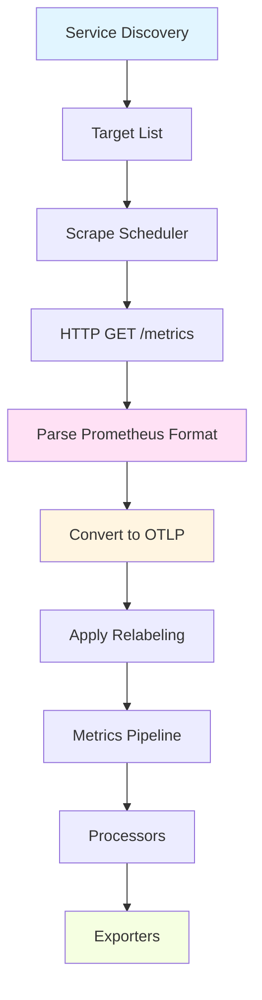

# How to Configure the Prometheus Receiver for Metric Scraping in the OpenTelemetry Collector

Author: [nawazdhandala](https://www.github.com/nawazdhandala)

Tags: OpenTelemetry, Collector, Prometheus, Receiver, Metric Scraping

Description: Complete guide to configuring the Prometheus receiver in the OpenTelemetry Collector for scraping metrics from Prometheus-compatible endpoints.

The Prometheus receiver transforms the OpenTelemetry Collector into a Prometheus-compatible scraper. This allows you to collect metrics from existing Prometheus exporters, /metrics endpoints, and any application exposing Prometheus-formatted metrics, without changing your instrumentation. The collector becomes a drop-in replacement for Prometheus server while adding the flexibility of OpenTelemetry's processing and exporting capabilities.

Understanding the Prometheus receiver enables you to gradually migrate from Prometheus to OpenTelemetry, or run a hybrid system that leverages both ecosystems.

## Understanding Prometheus Scraping Model

Prometheus uses a pull-based model where the server periodically scrapes HTTP endpoints for metrics. Each scrape retrieves the current state of all metrics, with timestamps assigned by the scraper. This differs from OpenTelemetry's push-based OTLP where applications send metrics to the collector.

The Prometheus receiver implements this pull model within the collector. It discovers targets, schedules scrapes, parses the exposition format, and converts Prometheus metrics to OpenTelemetry's data model.

## Basic Prometheus Receiver Configuration

Starting with a simple static scrape configuration demonstrates the core concepts.

```yaml
# collector-config.yaml - basic Prometheus receiver setup
receivers:
  prometheus:
    config:
      # Scrape configuration follows Prometheus syntax
      scrape_configs:
        - job_name: 'node-exporter'
          scrape_interval: 30s
          scrape_timeout: 10s
          static_configs:
            - targets:
                - 'localhost:9100'
              labels:
                env: 'production'
                region: 'us-west-2'

processors:
  batch:
    timeout: 10s
    send_batch_size: 1024

exporters:
  logging:
    loglevel: info

  prometheusremotewrite:
    endpoint: http://prometheus:9090/api/v1/write

service:
  pipelines:
    metrics:
      receivers: [prometheus]
      processors: [batch]
      exporters: [logging, prometheusremotewrite]
```

This configuration scrapes a node exporter every 30 seconds. The `labels` section adds static labels to all metrics from these targets, useful for adding environment or region context.

## Multi-Target Scrape Configuration

Real deployments monitor multiple services across different environments.

```yaml
receivers:
  prometheus:
    config:
      global:
        # Default scrape settings for all jobs
        scrape_interval: 60s
        scrape_timeout: 10s
        external_labels:
          cluster: 'production-cluster'
          collector: 'otel-collector-01'

      scrape_configs:
        # Application metrics
        - job_name: 'api-servers'
          scrape_interval: 15s
          metrics_path: /metrics
          static_configs:
            - targets:
                - 'api-01:8080'
                - 'api-02:8080'
                - 'api-03:8080'
              labels:
                service: 'api'
                tier: 'frontend'

        # Database exporters
        - job_name: 'postgres-exporter'
          scrape_interval: 30s
          static_configs:
            - targets:
                - 'db-exporter-01:9187'
                - 'db-exporter-02:9187'
              labels:
                service: 'database'
                db_type: 'postgresql'

        # Kubernetes pods with annotations
        - job_name: 'kubernetes-pods'
          scrape_interval: 30s
          kubernetes_sd_configs:
            - role: pod
          relabel_configs:
            # Only scrape pods with prometheus.io/scrape annotation
            - source_labels: [__meta_kubernetes_pod_annotation_prometheus_io_scrape]
              action: keep
              regex: true
            # Use custom metrics path if specified
            - source_labels: [__meta_kubernetes_pod_annotation_prometheus_io_path]
              action: replace
              target_label: __metrics_path__
              regex: (.+)
            # Use custom port if specified
            - source_labels: [__address__, __meta_kubernetes_pod_annotation_prometheus_io_port]
              action: replace
              regex: ([^:]+)(?::\d+)?;(\d+)
              replacement: $1:$2
              target_label: __address__
            # Add pod metadata as labels
            - source_labels: [__meta_kubernetes_namespace]
              action: replace
              target_label: kubernetes_namespace
            - source_labels: [__meta_kubernetes_pod_name]
              action: replace
              target_label: kubernetes_pod_name
```

The `global` section sets defaults that apply to all scrape jobs unless overridden. External labels get added to every metric, identifying which collector instance scraped it.

## Kubernetes Service Discovery

The Prometheus receiver supports the same service discovery mechanisms as Prometheus server, making migration straightforward.

```yaml
receivers:
  prometheus:
    config:
      scrape_configs:
        # Scrape Kubernetes pods
        - job_name: 'kubernetes-pods'
          kubernetes_sd_configs:
            - role: pod
              namespaces:
                names:
                  - production
                  - staging

          relabel_configs:
            # Keep only pods with scrape annotation
            - source_labels: [__meta_kubernetes_pod_annotation_prometheus_io_scrape]
              action: keep
              regex: true

            # Drop pods in system namespaces
            - source_labels: [__meta_kubernetes_namespace]
              action: drop
              regex: kube-system|kube-public

            # Use annotation-specified port or default to pod port
            - source_labels: [__meta_kubernetes_pod_annotation_prometheus_io_port]
              action: replace
              regex: (\d+)
              target_label: __meta_kubernetes_pod_container_port_number

            # Set metrics path from annotation
            - source_labels: [__meta_kubernetes_pod_annotation_prometheus_io_path]
              action: replace
              target_label: __metrics_path__
              regex: (.+)
              replacement: $1

            # Set scheme (http/https) from annotation
            - source_labels: [__meta_kubernetes_pod_annotation_prometheus_io_scheme]
              action: replace
              target_label: __scheme__
              regex: (https?)

            # Enrich with Kubernetes metadata
            - source_labels: [__meta_kubernetes_namespace]
              target_label: namespace
            - source_labels: [__meta_kubernetes_pod_name]
              target_label: pod
            - source_labels: [__meta_kubernetes_pod_label_app]
              target_label: app
            - source_labels: [__meta_kubernetes_pod_label_version]
              target_label: version

        # Scrape Kubernetes services
        - job_name: 'kubernetes-services'
          kubernetes_sd_configs:
            - role: service

          relabel_configs:
            - source_labels: [__meta_kubernetes_service_annotation_prometheus_io_scrape]
              action: keep
              regex: true
            - source_labels: [__meta_kubernetes_service_annotation_prometheus_io_path]
              action: replace
              target_label: __metrics_path__
            - source_labels: [__address__, __meta_kubernetes_service_annotation_prometheus_io_port]
              action: replace
              regex: ([^:]+)(?::\d+)?;(\d+)
              replacement: $1:$2
              target_label: __address__

        # Scrape node exporters via endpoints
        - job_name: 'kubernetes-nodes'
          kubernetes_sd_configs:
            - role: node

          relabel_configs:
            - source_labels: [__address__]
              regex: '(.*):10250'
              replacement: '${1}:9100'
              target_label: __address__
            - source_labels: [__meta_kubernetes_node_name]
              target_label: node
```

This configuration automatically discovers pods and services in your Kubernetes cluster. Pods need annotations like `prometheus.io/scrape: "true"` and optionally `prometheus.io/port: "8080"` to be scraped.

## Authentication and TLS Configuration

Scraping secured endpoints requires proper authentication configuration.

```yaml
receivers:
  prometheus:
    config:
      scrape_configs:
        # Basic authentication
        - job_name: 'protected-metrics'
          static_configs:
            - targets: ['secure-app:8080']
          basic_auth:
            username: 'metrics-reader'
            password: 'secret-password'

        # Bearer token authentication
        - job_name: 'token-auth-metrics'
          static_configs:
            - targets: ['api:9090']
          bearer_token: 'your-bearer-token-here'

        # Bearer token from file
        - job_name: 'token-file-auth'
          static_configs:
            - targets: ['api:9090']
          bearer_token_file: /etc/otel/secrets/bearer-token

        # TLS with client certificate
        - job_name: 'mtls-metrics'
          static_configs:
            - targets: ['secure-service:8443']
          scheme: https
          tls_config:
            ca_file: /etc/otel/certs/ca.crt
            cert_file: /etc/otel/certs/client.crt
            key_file: /etc/otel/certs/client.key
            insecure_skip_verify: false

        # TLS without client cert
        - job_name: 'https-metrics'
          static_configs:
            - targets: ['app:8443']
          scheme: https
          tls_config:
            ca_file: /etc/otel/certs/ca.crt
```

Never commit passwords or tokens directly in configuration files. Use environment variable substitution or external secret management:

```yaml
receivers:
  prometheus:
    config:
      scrape_configs:
        - job_name: 'protected-metrics'
          static_configs:
            - targets: ['secure-app:8080']
          basic_auth:
            username: ${METRICS_USERNAME}
            password: ${METRICS_PASSWORD}
```

## Advanced Relabeling

Relabeling provides powerful control over target discovery and metric labels.

```yaml
receivers:
  prometheus:
    config:
      scrape_configs:
        - job_name: 'advanced-relabeling'
          static_configs:
            - targets:
                - 'server-1.example.com:9090'
                - 'server-2.example.com:9090'
              labels:
                datacenter: 'us-west'

          relabel_configs:
            # Extract hostname from target address
            - source_labels: [__address__]
              regex: '([^:]+):\d+'
              replacement: '$1'
              target_label: instance_hostname

            # Drop targets based on label
            - source_labels: [__meta_kubernetes_pod_label_skip_metrics]
              regex: 'true'
              action: drop

            # Keep only specific targets
            - source_labels: [__address__]
              regex: '.*prod.*'
              action: keep

            # Modify the scrape URL
            - source_labels: [__address__]
              target_label: __param_target
            - target_label: __address__
              replacement: 'blackbox-exporter:9115'

            # Add computed labels
            - source_labels: [datacenter]
              regex: 'us-(.*)'
              replacement: 'america-$1'
              target_label: region

          metric_relabel_configs:
            # Drop expensive metrics
            - source_labels: [__name__]
              regex: 'histogram_bucket.*'
              action: drop

            # Rename metrics
            - source_labels: [__name__]
              regex: 'old_metric_name'
              replacement: 'new_metric_name'
              target_label: __name__

            # Drop specific label from all metrics
            - regex: 'temporary_label'
              action: labeldrop

            # Keep only metrics with specific labels
            - source_labels: [status]
              regex: 'error|warning'
              action: keep
```

`relabel_configs` operates on target labels before scraping, affecting which targets get scraped. `metric_relabel_configs` operates on scraped metrics, filtering or transforming metric labels.

## Scraping Intervals and Timeouts

Balancing scrape frequency with resource usage requires understanding the trade-offs.

```yaml
receivers:
  prometheus:
    config:
      global:
        # Default for all jobs
        scrape_interval: 60s
        scrape_timeout: 10s

      scrape_configs:
        # High-frequency scraping for critical metrics
        - job_name: 'critical-metrics'
          scrape_interval: 5s
          scrape_timeout: 3s
          static_configs:
            - targets: ['slo-service:8080']

        # Low-frequency scraping for slow-changing metrics
        - job_name: 'infrastructure-metrics'
          scrape_interval: 300s  # 5 minutes
          scrape_timeout: 30s
          static_configs:
            - targets: ['node-exporter:9100']

        # Sample limit prevents excessive cardinality
        - job_name: 'app-metrics'
          scrape_interval: 30s
          sample_limit: 10000
          static_configs:
            - targets: ['app:9090']
```

The `sample_limit` parameter prevents scraping targets that expose excessive numbers of metrics, protecting against cardinality explosions that can overwhelm storage.

## Handling Prometheus Exporters

Many third-party exporters follow Prometheus conventions and work seamlessly with the receiver.

```yaml
receivers:
  prometheus:
    config:
      scrape_configs:
        # Node exporter (system metrics)
        - job_name: 'node-exporter'
          scrape_interval: 30s
          static_configs:
            - targets:
                - 'node-01:9100'
                - 'node-02:9100'
              labels:
                job: 'node'

        # PostgreSQL exporter
        - job_name: 'postgres-exporter'
          scrape_interval: 30s
          static_configs:
            - targets: ['postgres-exporter:9187']
              labels:
                database: 'main-db'

        # Redis exporter
        - job_name: 'redis-exporter'
          scrape_interval: 15s
          static_configs:
            - targets: ['redis-exporter:9121']

        # Blackbox exporter (probe metrics)
        - job_name: 'blackbox-http'
          scrape_interval: 60s
          metrics_path: /probe
          params:
            module: [http_2xx]
          static_configs:
            - targets:
                - https://example.com
                - https://api.example.com
          relabel_configs:
            - source_labels: [__address__]
              target_label: __param_target
            - source_labels: [__param_target]
              target_label: instance
            - target_label: __address__
              replacement: blackbox-exporter:9115

        # Custom application metrics
        - job_name: 'myapp'
          scrape_interval: 15s
          static_configs:
            - targets: ['app-01:8080', 'app-02:8080']
              labels:
                service: 'api'
                env: 'prod'
```

The blackbox exporter configuration demonstrates the probe pattern where the exporter scrapes external targets. The relabeling moves the actual target to a parameter and points scraping at the exporter itself.

## File-Based Service Discovery

For dynamic environments without Kubernetes, file-based service discovery provides flexibility.

```yaml
receivers:
  prometheus:
    config:
      scrape_configs:
        - job_name: 'file-sd'
          scrape_interval: 30s
          file_sd_configs:
            - files:
                - /etc/otel/targets/*.json
                - /etc/otel/targets/*.yaml
              refresh_interval: 60s
```

Target files use JSON or YAML format:

```json
[
  {
    "targets": ["server-01:9090", "server-02:9090"],
    "labels": {
      "env": "production",
      "service": "api"
    }
  },
  {
    "targets": ["db-01:9187"],
    "labels": {
      "env": "production",
      "service": "database"
    }
  }
]
```

The collector watches these files and automatically updates targets when they change.

## DNS Service Discovery

DNS-based discovery works well for dynamic cloud environments.

```yaml
receivers:
  prometheus:
    config:
      scrape_configs:
        - job_name: 'dns-sd'
          scrape_interval: 30s
          dns_sd_configs:
            - names:
                - '_metrics._tcp.service.consul'
                - 'metrics.example.internal'
              type: SRV
              port: 9090
              refresh_interval: 30s

          relabel_configs:
            # Extract labels from DNS records
            - source_labels: [__meta_dns_name]
              target_label: dns_name
```

This queries DNS SRV records to discover targets dynamically. Works with Consul, etcd, and standard DNS servers.

## Metric Filtering and Transformation

The Prometheus receiver can filter metrics before they enter the pipeline.

```yaml
receivers:
  prometheus:
    config:
      scrape_configs:
        - job_name: 'filtered-metrics'
          static_configs:
            - targets: ['app:8080']

          metric_relabel_configs:
            # Keep only specific metric families
            - source_labels: [__name__]
              regex: 'http_requests_total|http_request_duration_seconds.*'
              action: keep

            # Drop debug metrics
            - source_labels: [__name__]
              regex: '.*_debug_.*'
              action: drop

            # Remove PII from labels
            - source_labels: [user_id]
              action: labeldrop

            # Aggregate high-cardinality labels
            - source_labels: [path]
              regex: '/api/users/.*'
              replacement: '/api/users/:id'
              target_label: path
```

Filtering at the receiver level reduces data volume early in the pipeline, improving performance and reducing costs.

## Prometheus Receiver Data Flow

Understanding how scraped metrics flow through the collector helps with debugging.



Service discovery generates targets, the scheduler scrapes them, the parser converts Prometheus format to OpenTelemetry metrics, and the pipeline processes them.

## Performance Tuning

Scraping many targets requires careful resource management.

```yaml
receivers:
  prometheus:
    config:
      global:
        scrape_interval: 30s
        scrape_timeout: 10s

      scrape_configs:
        - job_name: 'high-volume'
          scrape_interval: 15s
          sample_limit: 50000  # Prevent cardinality explosion
          label_limit: 100     # Limit labels per metric
          label_name_length_limit: 200
          label_value_length_limit: 200

processors:
  memory_limiter:
    check_interval: 1s
    limit_mib: 2048
    spike_limit_mib: 512

  batch:
    timeout: 10s
    send_batch_size: 10000

  # Filter metrics early to reduce volume
  filter/metrics:
    metrics:
      exclude:
        match_type: regexp
        metric_names:
          - '.*_bucket$'  # Drop histogram buckets if not needed

service:
  pipelines:
    metrics:
      receivers: [prometheus]
      processors: [memory_limiter, filter/metrics, batch]
      exporters: [prometheusremotewrite]
```

## Monitoring Scrape Health

The collector exposes metrics about its own scraping activity.

```yaml
receivers:
  prometheus:
    config:
      scrape_configs:
        - job_name: 'myapp'
          static_configs:
            - targets: ['app:8080']

  # Scrape the collector's own metrics
  prometheus/self:
    config:
      scrape_configs:
        - job_name: 'otel-collector'
          scrape_interval: 10s
          static_configs:
            - targets: ['localhost:8888']

exporters:
  prometheusremotewrite:
    endpoint: http://prometheus:9090/api/v1/write

service:
  telemetry:
    metrics:
      level: detailed
      address: localhost:8888

  pipelines:
    metrics:
      receivers: [prometheus, prometheus/self]
      exporters: [prometheusremotewrite]
```

Monitoring metrics like `scrape_duration_seconds`, `scrape_samples_scraped`, and `scrape_samples_post_metric_relabeling` helps identify issues with specific targets or jobs.

## Migration from Prometheus Server

Migrating from Prometheus server to OpenTelemetry Collector with Prometheus receiver is straightforward.

```yaml
# Nearly identical to prometheus.yml syntax
receivers:
  prometheus:
    config:
      # Copy your existing scrape_configs here
      scrape_configs:
        - job_name: 'app'
          static_configs:
            - targets: ['app:8080']

exporters:
  # Export to Prometheus remote write
  prometheusremotewrite:
    endpoint: http://prometheus:9090/api/v1/write

  # Or export to other backends
  otlp:
    endpoint: backend:4317

service:
  pipelines:
    metrics:
      receivers: [prometheus]
      exporters: [prometheusremotewrite, otlp]
```

The configuration syntax is compatible with Prometheus, making migration a matter of copying your `scrape_configs` section.

The Prometheus receiver enables the OpenTelemetry Collector to work with the extensive Prometheus ecosystem. Whether you're migrating from Prometheus, integrating existing exporters, or building a hybrid observability stack, understanding how to configure scraping, service discovery, and relabeling unlocks the full power of both platforms. Start with simple static targets and progressively add dynamic discovery and advanced filtering as your deployment grows.
