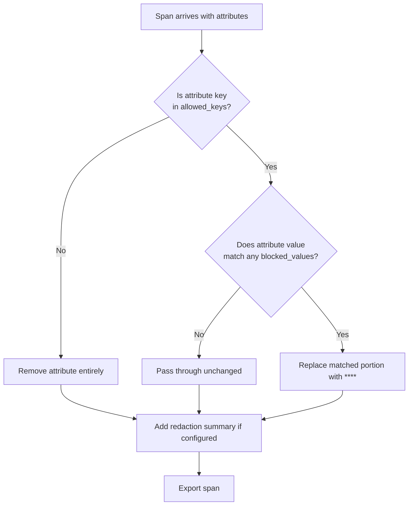

# How to Configure the Redaction Processor to Block Sensitive Attributes

Author: [nawazdhandala](https://www.github.com/nawazdhandala)

Tags: OpenTelemetry, Redaction Processor, Data Privacy, Security, Collector, Configuration

Description: Step-by-step guide to configuring the OpenTelemetry Collector redaction processor for blocking sensitive span and log attributes using allowlists and pattern matching.

---

The redaction processor is one of the most powerful tools in the OpenTelemetry Collector for protecting sensitive data. Unlike other processors that require you to enumerate every attribute you want to remove, the redaction processor flips the model. You define what is allowed, and everything else gets blocked by default.

This allowlist approach is fundamentally safer. You do not have to predict every possible attribute that might contain sensitive information. If a developer adds a new custom attribute called `customer.ssn` tomorrow, the redaction processor will block it automatically because it is not on the allowlist. You only need to maintain a list of known-safe attributes.

This guide covers everything you need to configure the redaction processor correctly, from basic setup through advanced pattern matching and production deployment.

## Prerequisites

The redaction processor is part of the OpenTelemetry Collector Contrib distribution. It is not included in the core distribution. Make sure you are running `otel/opentelemetry-collector-contrib` or a custom build that includes the `redaction` processor.

Check if your Collector includes it by running the following.

```bash
# List all available components in your Collector build
otelcol-contrib components
# Look for "redaction" in the processors section
```

If you are building a custom Collector with the OpenTelemetry Collector Builder (ocb), add the redaction processor to your build manifest.

```yaml
# builder-config.yaml
# Include the redaction processor in a custom Collector build
dist:
  name: custom-collector
  output_path: ./dist

processors:
  - gomod: github.com/open-telemetry/opentelemetry-collector-contrib/processor/redactionprocessor v0.96.0
```

## Basic Configuration

The redaction processor has three main configuration options: `allowed_keys`, `blocked_values`, and `summary`. Let's start with a minimal configuration.

This configuration allows only a small set of standard attributes through and blocks everything else.

```yaml
# basic-redaction.yaml
# Minimal redaction processor config - allowlist approach
processors:
  redaction:
    # Attribute keys that are allowed to pass through unchanged
    # Everything not listed here gets removed from the span
    allowed_keys:
      - http.method
      - http.status_code
      - http.route
      - service.name
      - service.version

    # Optional: summary adds a debug attribute showing redaction stats
    summary: debug
```

With this configuration, a span that arrives with these attributes:

```
http.method: GET
http.status_code: 200
http.route: /api/users
user.email: alice@example.com
user.id: 12345
custom.payment_token: tok_abc123
```

Would be exported with only:

```
http.method: GET
http.status_code: 200
http.route: /api/users
redaction.redacted.count: 3
redaction.redacted.keys: user.email, user.id, custom.payment_token
```

The `summary: debug` setting adds those `redaction.redacted.*` attributes so you can see what was removed. In production, set `summary: info` or `summary: silent` to avoid leaking the blocked attribute keys themselves.

## Understanding Allowed Keys

The `allowed_keys` list supports exact matches and regex patterns. This gives you flexibility to allow groups of related attributes without listing each one.

This configuration uses regex patterns to allow all standard HTTP and RPC semantic convention attributes.

```yaml
# allowed-keys-regex.yaml
# Use regex patterns to allow families of attributes
processors:
  redaction:
    allowed_keys:
      # Exact matches for common attributes
      - service.name
      - service.version
      - service.namespace
      - deployment.environment

      # Regex: allow all http.* attributes from semantic conventions
      - "http\\..*"

      # Regex: allow all rpc.* attributes
      - "rpc\\..*"

      # Regex: allow all db.* attributes (careful - db.statement may contain PII)
      - "db\\.system"
      - "db\\.operation"
      - "db\\.name"
      # Deliberately NOT allowing db.statement

      # Regex: allow all network.* attributes
      - "net\\..*"
      - "network\\..*"

      # Allow OpenTelemetry resource attributes
      - "telemetry\\..*"
      - "os\\..*"
      - "process\\..*"
      - "host\\.name"
      - "k8s\\..*"

    summary: info
```

Notice that we deliberately exclude `db.statement` from the allowed list. Database query text frequently contains PII in WHERE clauses, parameter values, and INSERT data. If you need `db.statement` for debugging, consider allowing it but adding a `blocked_values` pattern to redact the sensitive parts.

## Configuring Blocked Values

Even allowed attributes can contain sensitive data in their values. The `blocked_values` option lets you define regex patterns that should be redacted from the values of allowed attributes.

This configuration redacts common PII patterns (credit cards, SSNs, emails) from the values of any allowed attribute.

```yaml
# blocked-values.yaml
# Block sensitive patterns in attribute values
processors:
  redaction:
    allowed_keys:
      - http.method
      - http.status_code
      - http.route
      - url.full
      - url.path
      - url.query
      - service.name
      - db.system
      - db.operation
      - db.statement  # Allowed, but values will be scrubbed

    blocked_values:
      # Credit card numbers: 16 digits with optional separators
      - "\\b[0-9]{4}[- ]?[0-9]{4}[- ]?[0-9]{4}[- ]?[0-9]{4}\\b"

      # US Social Security Numbers: XXX-XX-XXXX
      - "\\b[0-9]{3}-[0-9]{2}-[0-9]{4}\\b"

      # Email addresses
      - "[a-zA-Z0-9._%+-]+@[a-zA-Z0-9.-]+\\.[a-zA-Z]{2,}"

      # US phone numbers: various formats
      - "\\b(\\+1[- ]?)?\\(?[0-9]{3}\\)?[- ]?[0-9]{3}[- ]?[0-9]{4}\\b"

      # IPv4 addresses (use cautiously - may over-match version numbers)
      - "\\b(?:25[0-5]|2[0-4][0-9]|[01]?[0-9][0-9]?)\\.(?:25[0-5]|2[0-4][0-9]|[01]?[0-9][0-9]?)\\.(?:25[0-5]|2[0-4][0-9]|[01]?[0-9][0-9]?)\\.(?:25[0-5]|2[0-4][0-9]|[01]?[0-9][0-9]?)\\b"

      # JWT tokens (base64-encoded segments separated by dots)
      - "eyJ[A-Za-z0-9_-]+\\.eyJ[A-Za-z0-9_-]+\\.[A-Za-z0-9_-]+"

    summary: debug
```

When a `blocked_values` pattern matches, the processor replaces the matched portion with `****`. For example, a `db.statement` value of `SELECT * FROM users WHERE email = 'alice@example.com'` becomes `SELECT * FROM users WHERE email = '****'`.

## How the Processor Works Internally

Understanding the processing order helps you debug unexpected behavior.



Key things to note:

1. The `allowed_keys` check happens first. If an attribute key is not allowed, it is removed entirely regardless of its value.
2. The `blocked_values` patterns are only applied to attributes that pass the `allowed_keys` check.
3. The `blocked_values` replacement is partial. Only the matched portion of the value is replaced, not the entire value.
4. Resource attributes are NOT processed by the redaction processor. It only operates on span attributes, span event attributes, and log record attributes.

## Production Configuration Example

Here is a complete production-ready Collector configuration with the redaction processor.

```yaml
# production-collector.yaml
# Full Collector config with redaction processor for production use
receivers:
  otlp:
    protocols:
      grpc:
        endpoint: "0.0.0.0:4317"
      http:
        endpoint: "0.0.0.0:4318"

processors:
  # Redaction processor - runs before batch for security
  redaction:
    allowed_keys:
      # OpenTelemetry semantic conventions - HTTP
      - "http\\.method"
      - "http\\.status_code"
      - "http\\.route"
      - "http\\.scheme"
      - "http\\.response_content_length"
      - "http\\.request_content_length"

      # URL attributes (path is safe, query and full may contain PII)
      - url.path
      - url.scheme

      # Network attributes
      - "net\\..*"
      - "network\\..*"
      - server.address
      - server.port

      # RPC attributes
      - "rpc\\..*"

      # Database attributes (excluding db.statement for safety)
      - db.system
      - db.name
      - db.operation

      # Messaging attributes
      - "messaging\\..*"

      # Service identity
      - service.name
      - service.version
      - service.namespace
      - deployment.environment

      # Kubernetes attributes
      - "k8s\\..*"

      # OpenTelemetry internals
      - "otel\\..*"
      - span.kind
      - status.code
      - status.message

    blocked_values:
      # Credit card numbers
      - "\\b[0-9]{4}[- ]?[0-9]{4}[- ]?[0-9]{4}[- ]?[0-9]{4}\\b"
      # SSN
      - "\\b[0-9]{3}-[0-9]{2}-[0-9]{4}\\b"
      # Email
      - "[a-zA-Z0-9._%+-]+@[a-zA-Z0-9.-]+\\.[a-zA-Z]{2,}"
      # JWT
      - "eyJ[A-Za-z0-9_-]+\\.eyJ[A-Za-z0-9_-]+\\.[A-Za-z0-9_-]+"

    # Use "info" in production to avoid leaking blocked key names
    summary: info

  # Batch processor for efficiency
  batch:
    send_batch_size: 8192
    timeout: 5s

  # Memory limiter to prevent OOM
  memory_limiter:
    check_interval: 1s
    limit_mib: 4096
    spike_limit_mib: 1024

exporters:
  otlp:
    endpoint: "tempo.monitoring.svc:4317"
    tls:
      insecure: false
      ca_file: /etc/ssl/certs/ca.crt

service:
  pipelines:
    traces:
      receivers: [otlp]
      # memory_limiter should be first, redaction before batch
      processors: [memory_limiter, redaction, batch]
      exporters: [otlp]

  telemetry:
    metrics:
      address: ":8888"
```

## Handling Edge Cases

There are a few gotchas to be aware of when deploying the redaction processor.

### Span Events and Links

The redaction processor processes attributes on span events (like exception events) in addition to the span's own attributes. This is important because exception stack traces often contain PII. However, the exception message itself is stored in the `exception.message` attribute, so make sure you either allow it with blocked value patterns or exclude it from your allowlist.

```yaml
# Handle exception events carefully
processors:
  redaction:
    allowed_keys:
      - exception.type           # Safe: just the exception class name
      - exception.stacktrace     # Risky: may contain PII in variable values
      # exception.message deliberately excluded - often contains user data
    blocked_values:
      - "[a-zA-Z0-9._%+-]+@[a-zA-Z0-9.-]+\\.[a-zA-Z]{2,}"
```

### Performance Considerations

The redaction processor adds latency proportional to the number of attributes per span and the number of `blocked_values` regex patterns. For most deployments, this is negligible. But if you have spans with 100+ attributes and 20+ blocked value patterns, you might see measurable overhead.

Benchmark with your actual data. You can measure the processor's impact by checking the `otelcol_processor_latency` metric (if available) or by comparing end-to-end pipeline latency with and without the processor.

### Multiple Redaction Processor Instances

You can run multiple instances of the redaction processor with different configurations. This is useful when different pipelines need different allowlists.

```yaml
# Multiple redaction instances for different pipelines
processors:
  redaction/strict:
    allowed_keys:
      - service.name
      - http.method
      - http.status_code
    summary: silent

  redaction/relaxed:
    allowed_keys:
      - "http\\..*"
      - "db\\..*"
      - "service\\..*"
    blocked_values:
      - "[a-zA-Z0-9._%+-]+@[a-zA-Z0-9.-]+\\.[a-zA-Z]{2,}"
    summary: info

service:
  pipelines:
    traces/external:
      receivers: [otlp]
      processors: [redaction/strict, batch]
      exporters: [otlp/external-vendor]
    traces/internal:
      receivers: [otlp]
      processors: [redaction/relaxed, batch]
      exporters: [otlp/internal-backend]
```

This lets you apply stricter redaction for data leaving your network while keeping more detail for internal observability.

## Monitoring Redaction in Production

After deploying the redaction processor, monitor it to make sure it is working as expected and not over-redacting.

Watch for two things. First, check the `redaction.redacted.count` summary attribute on your spans to see how many attributes are being removed. If this number is consistently zero, your allowlist might be too broad. If it is very high, you might need to add more legitimate attributes to the allowlist.

Second, compare your trace data before and after enabling redaction. Are there spans that are now useless because too many attributes were stripped? Adjust your allowlist iteratively.

A good practice is to deploy the redaction processor with `summary: debug` in a staging environment first. Review the `redaction.redacted.keys` attribute to see exactly what is being removed. Once you are satisfied, promote to production with `summary: info` or `summary: silent`.

## Wrapping Up

The redaction processor gives you a strong default posture for protecting sensitive data. By allowing only known-safe attributes and blocking sensitive patterns in values, you create a pipeline that is safe by default. New attributes are blocked until explicitly approved, which is exactly the behavior you want for compliance and security.

Start with a conservative allowlist based on OpenTelemetry semantic conventions. Add attributes as your teams request them, after confirming they do not contain sensitive information. And always test in staging before production. The redaction processor is powerful but unforgiving - if you forget to add a key attribute to the allowlist, your traces will be missing data until you update the configuration.
