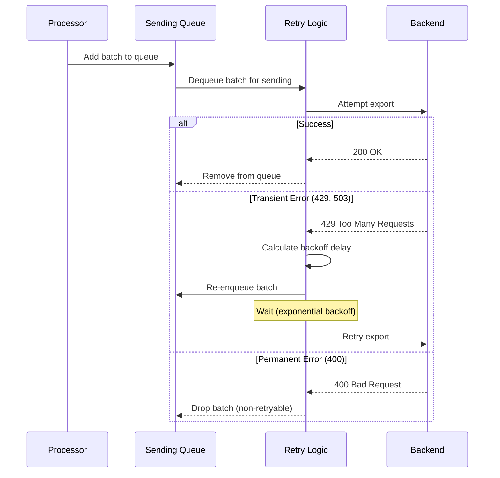

# How to Configure Sending Queues and Retry Logic in the Collector

Author: [nawazdhandala](https://www.github.com/nawazdhandala)

Tags: OpenTelemetry, Collector, Queue, Retry, Reliability, Configuration

Description: Master sending queue and retry configuration in OpenTelemetry Collector to ensure reliable telemetry delivery through network issues, backend outages, and traffic spikes.

Network issues and backend outages are inevitable in distributed systems. When your observability backend becomes temporarily unavailable or slow, your telemetry data shouldn't be lost. The OpenTelemetry Collector provides robust queueing and retry mechanisms to handle transient failures gracefully, ensuring reliable delivery of your telemetry data.

This guide explains how to configure sending queues and retry logic to build resilient telemetry pipelines that survive real-world operational challenges.

## Understanding Sending Queues and Retry Logic

The collector's exporters include two key reliability features:

**Sending Queue**: Buffers telemetry data in memory or on disk when the backend is slow or temporarily unavailable. This prevents data loss during brief outages and absorbs traffic spikes.

**Retry Logic**: Automatically retries failed export attempts with exponential backoff, handling transient network errors and temporary backend unavailability.

These features work together to create a robust delivery system:



## Basic Sending Queue Configuration

Enable and configure the sending queue in your exporter:

```yaml
exporters:
  otlp/backend:
    endpoint: backend.example.com:4317

    # Sending queue configuration
    sending_queue:
      # Enable the queue
      enabled: true

      # Maximum number of batches in the queue
      # Each batch can contain thousands of spans
      queue_size: 5000

      # Number of concurrent workers sending data
      # More workers = higher throughput, more connections
      num_consumers: 10

exporters:
  otlp/backend:
    endpoint: backend.example.com:4317

processors:
  batch:
    timeout: 10s
    send_batch_size: 8192

service:
  pipelines:
    traces:
      receivers: [otlp]
      processors: [batch]
      exporters: [otlp/backend]
```

This basic configuration provides in-memory buffering for up to 5,000 batches with 10 concurrent senders.

## Persistent Queue Configuration

For critical deployments, enable persistent queues that survive collector restarts:

```yaml
exporters:
  otlp/backend:
    endpoint: backend.example.com:4317

    sending_queue:
      enabled: true
      queue_size: 10000

      # Enable persistent storage
      storage: file_storage

extensions:
  # Configure file storage for persistent queues
  file_storage:
    # Directory for storing queue data
    directory: /var/lib/otel-collector/storage

    # Timeout for read/write operations
    timeout: 10s

    # Compaction settings for managing storage space
    compaction:
      directory: /var/lib/otel-collector/storage
      on_start: true
      on_rebound: true
      rebound_needed_threshold_mib: 100
      rebound_trigger_threshold_mib: 10
      max_transaction_size: 65536

service:
  # Enable the file_storage extension
  extensions: [file_storage]

  pipelines:
    traces:
      receivers: [otlp]
      processors: [batch]
      exporters: [otlp/backend]
```

With persistent queues, data survives collector restarts, crashes, or container rescheduling. This is essential for preventing data loss in production environments.

### Persistent Queue Storage Considerations

When using persistent queues, plan for storage capacity:

**Storage Size Calculation**:
```
Storage Needed = Queue Size × Average Batch Size × Safety Factor

Example:
- Queue size: 10,000 batches
- Average batch size: 100 KB (after compression)
- Safety factor: 1.5x
- Storage needed: 10,000 × 100 KB × 1.5 = 1.5 GB
```

Ensure your storage volume has adequate space and consider using fast storage (SSD) for better performance.

## Retry Configuration

Configure exponential backoff retry logic for handling transient failures:

```yaml
exporters:
  otlp/backend:
    endpoint: backend.example.com:4317
    compression: gzip

    # Retry configuration
    retry_on_failure:
      # Enable retry logic
      enabled: true

      # Initial delay before first retry
      initial_interval: 5s

      # Maximum delay between retries
      max_interval: 30s

      # Maximum total time spent retrying before giving up
      # After this time, data is dropped
      max_elapsed_time: 300s  # 5 minutes

    sending_queue:
      enabled: true
      queue_size: 10000
      storage: file_storage

extensions:
  file_storage:
    directory: /var/lib/otel-collector/storage

service:
  extensions: [file_storage]
  pipelines:
    traces:
      receivers: [otlp]
      processors: [batch]
      exporters: [otlp/backend]
```

### How Exponential Backoff Works

The retry logic uses exponential backoff to avoid overwhelming a struggling backend:

```
Retry Attempt    Delay
1                5s
2                10s
3                20s
4                30s (capped at max_interval)
5                30s
...              30s

After 300s (max_elapsed_time): data is dropped
```

This approach gives the backend time to recover while preventing aggressive retries from making the situation worse.

## Tuning Queue Size for Different Scenarios

### Low-Latency Applications

Prioritize quick delivery over buffering:

```yaml
exporters:
  otlp/backend:
    endpoint: backend.example.com:4317

    sending_queue:
      enabled: true
      # Smaller queue for lower latency
      queue_size: 1000
      # Fewer consumers reduce connection overhead
      num_consumers: 5

    retry_on_failure:
      enabled: true
      # Faster retry attempts
      initial_interval: 1s
      max_interval: 10s
      # Give up sooner
      max_elapsed_time: 60s
```

**Trade-off**: Less buffering capacity, but lower end-to-end latency when the backend is healthy.

### High-Throughput Applications

Maximize buffering to handle burst traffic:

```yaml
exporters:
  otlp/backend:
    endpoint: backend.example.com:4317

    sending_queue:
      enabled: true
      # Large queue absorbs traffic spikes
      queue_size: 50000
      # More consumers for higher throughput
      num_consumers: 20
      storage: file_storage

    retry_on_failure:
      enabled: true
      initial_interval: 5s
      max_interval: 60s
      # Longer retry window
      max_elapsed_time: 600s  # 10 minutes

extensions:
  file_storage:
    directory: /var/lib/otel-collector/storage
    timeout: 10s
```

**Trade-off**: Higher memory/disk usage, but better resilience to backend issues and traffic spikes.

### Cost-Sensitive Deployments

Balance reliability with resource constraints:

```yaml
exporters:
  otlp/backend:
    endpoint: backend.example.com:4317

    sending_queue:
      enabled: true
      # Moderate queue size
      queue_size: 5000
      num_consumers: 10
      # Use memory-only queue to save on storage costs
      # storage: null  # Not specified = in-memory only

    retry_on_failure:
      enabled: true
      initial_interval: 5s
      max_interval: 30s
      # Standard retry window
      max_elapsed_time: 300s
```

**Trade-off**: Data loss if collector crashes, but lower operational costs.

## Multi-Backend Configuration with Different Retry Policies

Configure different retry and queue settings for different backends:

```yaml
exporters:
  # Primary backend: aggressive retries
  otlp/primary:
    endpoint: primary-backend.example.com:4317

    sending_queue:
      enabled: true
      queue_size: 10000
      storage: file_storage

    retry_on_failure:
      enabled: true
      initial_interval: 5s
      max_interval: 30s
      max_elapsed_time: 600s  # Try for 10 minutes

  # Backup backend: less aggressive
  otlp/backup:
    endpoint: backup-backend.example.com:4317

    sending_queue:
      enabled: true
      queue_size: 5000
      # In-memory queue for backup

    retry_on_failure:
      enabled: true
      initial_interval: 10s
      max_interval: 60s
      max_elapsed_time: 300s  # Try for 5 minutes

  # Analytics backend: best-effort
  otlp/analytics:
    endpoint: analytics-backend.example.com:4317

    sending_queue:
      enabled: true
      queue_size: 2000

    retry_on_failure:
      enabled: true
      initial_interval: 5s
      max_interval: 30s
      max_elapsed_time: 120s  # Give up after 2 minutes

extensions:
  file_storage:
    directory: /var/lib/otel-collector/storage

service:
  extensions: [file_storage]

  pipelines:
    traces:
      receivers: [otlp]
      processors: [batch]
      # Send to multiple backends
      exporters: [otlp/primary, otlp/backup, otlp/analytics]
```

This configuration sends data to three backends with different reliability requirements.

## Monitoring Queue and Retry Health

Track these metrics to understand queue and retry behavior:

```yaml
receivers:
  # Collect collector's own metrics
  prometheus:
    config:
      scrape_configs:
        - job_name: 'otel-collector'
          scrape_interval: 10s
          static_configs:
            - targets: ['localhost:8888']

processors:
  batch:
    timeout: 30s

exporters:
  prometheusremotewrite:
    endpoint: http://prometheus:9090/api/v1/write

service:
  telemetry:
    metrics:
      level: detailed
      address: :8888

  pipelines:
    metrics/internal:
      receivers: [prometheus]
      processors: [batch]
      exporters: [prometheusremotewrite]
```

Key metrics to monitor:

```promql
# Current queue size (how many batches are buffered)
otelcol_exporter_queue_size{exporter="otlp/backend"}

# Queue capacity
otelcol_exporter_queue_capacity{exporter="otlp/backend"}

# Queue utilization percentage
100 * (otelcol_exporter_queue_size / otelcol_exporter_queue_capacity)

# Items added to retry queue
rate(otelcol_exporter_enqueue_failed_spans[5m])

# Failed send attempts
rate(otelcol_exporter_send_failed_spans[5m])

# Successful sends
rate(otelcol_exporter_sent_spans[5m])
```

## Alerting on Queue Issues

Define alerts for queue-related problems:

```yaml
# prometheus-alerts.yml
groups:
  - name: otel_collector_queue
    rules:
      # Critical: Queue is full
      - alert: CollectorQueueFull
        expr: |
          (otelcol_exporter_queue_size / otelcol_exporter_queue_capacity) >= 0.95
        for: 5m
        labels:
          severity: critical
        annotations:
          summary: "Collector queue is full"
          description: "Collector {{ $labels.instance }} queue for {{ $labels.exporter }} is {{ $value | humanizePercentage }} full"

      # Warning: Queue filling up
      - alert: CollectorQueueFillingUp
        expr: |
          (otelcol_exporter_queue_size / otelcol_exporter_queue_capacity) > 0.8
        for: 15m
        labels:
          severity: warning
        annotations:
          summary: "Collector queue filling up"
          description: "Collector {{ $labels.instance }} queue for {{ $labels.exporter }} is {{ $value | humanizePercentage }} full"

      # Critical: High retry rate
      - alert: CollectorHighRetryRate
        expr: |
          rate(otelcol_exporter_enqueue_failed_spans[5m]) > 100
        for: 10m
        labels:
          severity: warning
        annotations:
          summary: "High collector retry rate"
          description: "Collector {{ $labels.instance }} experiencing {{ $value }} retries/sec for {{ $labels.exporter }}"

      # Critical: Persistent export failures
      - alert: CollectorExportFailures
        expr: |
          rate(otelcol_exporter_send_failed_spans[5m]) > 0
        for: 10m
        labels:
          severity: critical
        annotations:
          summary: "Collector export failures"
          description: "Collector {{ $labels.instance }} failing to export to {{ $labels.exporter }}"
```

## Handling Backend Rate Limiting

When backends implement rate limiting, configure retry logic to respect limits:

```yaml
exporters:
  otlp/rate-limited-backend:
    endpoint: backend.example.com:4317
    compression: gzip

    # Adjust batch size to stay under rate limits
    # If backend limits to 10,000 spans/sec and you have 5 collectors:
    # Each collector should send ~2,000 spans/sec
    # With 10s batch timeout: batch_size = 20,000

    sending_queue:
      enabled: true
      queue_size: 20000
      # Reduce concurrent consumers to avoid hitting rate limits
      num_consumers: 5
      storage: file_storage

    retry_on_failure:
      enabled: true
      # Longer backoff intervals for rate limiting
      initial_interval: 10s
      max_interval: 120s
      max_elapsed_time: 600s

processors:
  batch:
    timeout: 10s
    # Smaller batches to avoid rate limit spikes
    send_batch_size: 4096
    send_batch_max_size: 8192

extensions:
  file_storage:
    directory: /var/lib/otel-collector/storage

service:
  extensions: [file_storage]
  pipelines:
    traces:
      receivers: [otlp]
      processors: [batch]
      exporters: [otlp/rate-limited-backend]
```

## Kubernetes Deployment with Persistent Queues

Deploy collectors with persistent storage in Kubernetes:

```yaml
apiVersion: v1
kind: PersistentVolumeClaim
metadata:
  name: otel-collector-storage
  namespace: observability
spec:
  accessModes:
    - ReadWriteOnce
  storageClassName: fast-ssd
  resources:
    requests:
      storage: 10Gi
---
apiVersion: apps/v1
kind: Deployment
metadata:
  name: otel-collector
  namespace: observability
spec:
  replicas: 3
  selector:
    matchLabels:
      app: otel-collector
  template:
    metadata:
      labels:
        app: otel-collector
    spec:
      containers:
      - name: otel-collector
        image: otel/opentelemetry-collector-contrib:latest
        resources:
          requests:
            cpu: 2000m
            memory: 4Gi
          limits:
            cpu: 4000m
            memory: 8Gi
        volumeMounts:
        - name: config
          mountPath: /etc/otel
        # Mount persistent storage for queues
        - name: storage
          mountPath: /var/lib/otel-collector/storage
        ports:
        - containerPort: 4317
          name: otlp-grpc
        - containerPort: 8888
          name: metrics
      volumes:
      - name: config
        configMap:
          name: otel-collector-config
      - name: storage
        persistentVolumeClaim:
          claimName: otel-collector-storage
---
apiVersion: v1
kind: ConfigMap
metadata:
  name: otel-collector-config
  namespace: observability
data:
  config.yaml: |
    receivers:
      otlp:
        protocols:
          grpc:
            endpoint: 0.0.0.0:4317

    processors:
      memory_limiter:
        check_interval: 1s
        limit_percentage: 80

      batch:
        timeout: 10s
        send_batch_size: 8192

    exporters:
      otlp/backend:
        endpoint: backend.example.com:4317
        compression: gzip

        sending_queue:
          enabled: true
          queue_size: 10000
          num_consumers: 10
          storage: file_storage

        retry_on_failure:
          enabled: true
          initial_interval: 5s
          max_interval: 30s
          max_elapsed_time: 300s

    extensions:
      file_storage:
        directory: /var/lib/otel-collector/storage
        timeout: 10s

      health_check:
        endpoint: :13133

    service:
      extensions: [file_storage, health_check]

      telemetry:
        metrics:
          level: detailed
          address: :8888

      pipelines:
        traces:
          receivers: [otlp]
          processors: [memory_limiter, batch]
          exporters: [otlp/backend]
```

## StatefulSet for Dedicated Persistent Storage

For better storage isolation, use StatefulSet with per-pod persistent volumes:

```yaml
apiVersion: v1
kind: Service
metadata:
  name: otel-collector
  namespace: observability
spec:
  ports:
  - name: otlp-grpc
    port: 4317
    targetPort: 4317
  selector:
    app: otel-collector
  clusterIP: None  # Headless service for StatefulSet
---
apiVersion: apps/v1
kind: StatefulSet
metadata:
  name: otel-collector
  namespace: observability
spec:
  serviceName: otel-collector
  replicas: 3
  selector:
    matchLabels:
      app: otel-collector
  template:
    metadata:
      labels:
        app: otel-collector
    spec:
      containers:
      - name: otel-collector
        image: otel/opentelemetry-collector-contrib:latest
        volumeMounts:
        - name: config
          mountPath: /etc/otel
        - name: storage
          mountPath: /var/lib/otel-collector/storage
      volumes:
      - name: config
        configMap:
          name: otel-collector-config
  # Each pod gets its own persistent volume
  volumeClaimTemplates:
  - metadata:
      name: storage
    spec:
      accessModes: ["ReadWriteOnce"]
      storageClassName: fast-ssd
      resources:
        requests:
          storage: 10Gi
```

## Compression for Efficient Queue Usage

Enable compression to fit more data in memory/disk queues:

```yaml
exporters:
  otlp/backend:
    endpoint: backend.example.com:4317

    # Compression reduces queue memory/disk usage
    # Options: gzip, zstd, snappy, none
    compression: gzip

    sending_queue:
      enabled: true
      # With compression, effective capacity is 2-5x larger
      queue_size: 10000
      storage: file_storage

    retry_on_failure:
      enabled: true
      initial_interval: 5s
      max_interval: 30s
      max_elapsed_time: 300s
```

Compression trade-offs:

- **gzip**: Good compression ratio (2-3x), moderate CPU usage
- **zstd**: Better compression (3-5x), higher CPU usage
- **snappy**: Fast, lower compression (1.5-2x), lowest CPU usage
- **none**: No compression, fastest, largest queue usage

## Production-Ready Configuration

Here's a comprehensive production configuration with robust queueing and retry logic:

```yaml
receivers:
  otlp:
    protocols:
      grpc:
        endpoint: 0.0.0.0:4317
        max_recv_msg_size_mib: 32

processors:
  # Protect against memory exhaustion
  memory_limiter:
    check_interval: 1s
    limit_percentage: 75
    spike_limit_percentage: 20

  # Efficient batching
  batch:
    timeout: 10s
    send_batch_size: 8192
    send_batch_max_size: 16384

  # Add resource attributes
  resource:
    attributes:
      - key: collector.instance
        value: ${HOSTNAME}
        action: insert

exporters:
  # Primary backend with aggressive persistence
  otlp/primary:
    endpoint: primary-backend.example.com:4317
    compression: gzip

    timeout: 30s

    sending_queue:
      enabled: true
      queue_size: 20000
      num_consumers: 15
      storage: file_storage

    retry_on_failure:
      enabled: true
      initial_interval: 5s
      max_interval: 30s
      max_elapsed_time: 600s

  # Backup backend with moderate settings
  otlp/backup:
    endpoint: backup-backend.example.com:4317
    compression: gzip

    timeout: 30s

    sending_queue:
      enabled: true
      queue_size: 10000
      num_consumers: 10
      storage: file_storage

    retry_on_failure:
      enabled: true
      initial_interval: 10s
      max_interval: 60s
      max_elapsed_time: 300s

extensions:
  file_storage:
    directory: /var/lib/otel-collector/storage
    timeout: 10s
    compaction:
      directory: /var/lib/otel-collector/storage
      on_start: true
      on_rebound: true
      rebound_needed_threshold_mib: 100
      rebound_trigger_threshold_mib: 10

  health_check:
    endpoint: :13133
    check_collector_pipeline:
      enabled: true
      interval: 5m
      exporter_failure_threshold: 5

  zpages:
    endpoint: :55679

service:
  extensions: [file_storage, health_check, zpages]

  telemetry:
    logs:
      level: info
    metrics:
      level: detailed
      address: :8888

  pipelines:
    traces:
      receivers: [otlp]
      processors: [memory_limiter, resource, batch]
      exporters: [otlp/primary, otlp/backup]

    metrics:
      receivers: [otlp]
      processors: [memory_limiter, resource, batch]
      exporters: [otlp/primary, otlp/backup]

    logs:
      receivers: [otlp]
      processors: [memory_limiter, resource, batch]
      exporters: [otlp/primary, otlp/backup]
```

## Related Resources

For more information on building reliable telemetry pipelines:

- [How to Tune Batch Processor Settings for Optimal Collector Performance](https://oneuptime.com/blog/post/2026-02-06-tune-batch-processor-optimal-collector-performance/view)
- [How to Scale the OpenTelemetry Collector for High-Throughput Environments](https://oneuptime.com/blog/post/2026-02-06-scale-opentelemetry-collector-high-throughput/view)
- [How to Monitor the Collector with Its Internal Metrics](https://oneuptime.com/blog/post/2026-02-06-monitor-collector-internal-metrics/view)
- [How to Set Up Load Balancing Across Multiple Collector Instances](https://oneuptime.com/blog/post/2026-02-06-load-balancing-multiple-collector-instances/view)

Properly configured sending queues and retry logic are fundamental to building reliable telemetry pipelines. By understanding how to tune these settings for your specific environment and monitoring their behavior through internal metrics, you can ensure that your observability data reaches its destination even in the face of network issues, backend outages, and traffic spikes.
