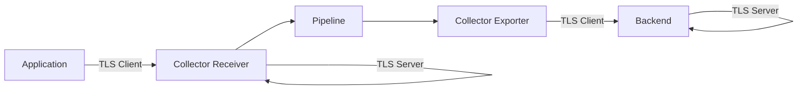

# How to Configure TLS Encryption for the OpenTelemetry Collector

Author: [nawazdhandala](https://www.github.com/nawazdhandala)

Tags: OpenTelemetry, Collector, TLS, Security, Encryption, mTLS

Description: Secure your OpenTelemetry Collector deployments with TLS encryption for receivers, exporters, and internal communications using certificates and mutual TLS authentication.

Transport Layer Security (TLS) is essential for securing telemetry data in transit between applications, collectors, and observability backends. The OpenTelemetry Collector supports TLS encryption for all network communication, including both server-side and client-side configurations, as well as mutual TLS (mTLS) for bidirectional authentication.

## Understanding TLS in OpenTelemetry Collector

TLS provides encryption and authentication for network communications. The collector uses TLS in two primary modes:

**Server Mode**: When the collector receives data (receivers), it acts as a TLS server, presenting certificates to clients.

**Client Mode**: When the collector sends data (exporters), it acts as a TLS client, validating server certificates and optionally presenting client certificates.



## Generating TLS Certificates

Before configuring TLS, generate the necessary certificates. For production, use certificates from a trusted Certificate Authority (CA). For testing, generate self-signed certificates.

Generate a self-signed CA certificate:

```bash
#!/bin/bash
# generate-ca.sh

# Generate CA private key
openssl genrsa -out ca.key 4096

# Generate CA certificate
openssl req -new -x509 -days 365 -key ca.key -out ca.crt \
  -subj "/C=US/ST=State/L=City/O=Organization/CN=OpenTelemetry CA"

echo "CA certificate generated: ca.crt"
```

Generate server certificates for collector receivers:

```bash
#!/bin/bash
# generate-server-cert.sh

SERVER_NAME=${1:-otel-collector}

# Generate server private key
openssl genrsa -out ${SERVER_NAME}.key 4096

# Generate certificate signing request (CSR)
openssl req -new -key ${SERVER_NAME}.key -out ${SERVER_NAME}.csr \
  -subj "/C=US/ST=State/L=City/O=Organization/CN=${SERVER_NAME}"

# Create extension configuration for SAN
cat > ${SERVER_NAME}.ext << EOF
authorityKeyIdentifier=keyid,issuer
basicConstraints=CA:FALSE
keyUsage = digitalSignature, nonRepudiation, keyEncipherment, dataEncipherment
subjectAltName = @alt_names

[alt_names]
DNS.1 = ${SERVER_NAME}
DNS.2 = ${SERVER_NAME}.observability.svc
DNS.3 = ${SERVER_NAME}.observability.svc.cluster.local
DNS.4 = localhost
IP.1 = 127.0.0.1
EOF

# Sign certificate with CA
openssl x509 -req -in ${SERVER_NAME}.csr -CA ca.crt -CAkey ca.key \
  -CAcreateserial -out ${SERVER_NAME}.crt -days 365 \
  -extfile ${SERVER_NAME}.ext

echo "Server certificate generated: ${SERVER_NAME}.crt"
```

Generate client certificates for collector exporters:

```bash
#!/bin/bash
# generate-client-cert.sh

CLIENT_NAME=${1:-otel-client}

# Generate client private key
openssl genrsa -out ${CLIENT_NAME}.key 4096

# Generate certificate signing request
openssl req -new -key ${CLIENT_NAME}.key -out ${CLIENT_NAME}.csr \
  -subj "/C=US/ST=State/L=City/O=Organization/CN=${CLIENT_NAME}"

# Sign certificate with CA
openssl x509 -req -in ${CLIENT_NAME}.csr -CA ca.crt -CAkey ca.key \
  -CAcreateserial -out ${CLIENT_NAME}.crt -days 365

echo "Client certificate generated: ${CLIENT_NAME}.crt"
```

## Configuring TLS for Receivers

Enable TLS encryption on collector receivers to secure incoming telemetry data:

```yaml
# collector-config.yaml
receivers:
  # OTLP receiver with TLS enabled
  otlp:
    protocols:
      grpc:
        endpoint: 0.0.0.0:4317

        # TLS server configuration
        tls:
          # Path to server certificate
          cert_file: /etc/certs/server.crt

          # Path to server private key
          key_file: /etc/certs/server.key

          # Minimum TLS version (TLS 1.2 recommended)
          min_version: "1.2"

          # Maximum TLS version
          max_version: "1.3"

          # Cipher suites (optional, defaults to secure set)
          cipher_suites:
            - TLS_ECDHE_RSA_WITH_AES_128_GCM_SHA256
            - TLS_ECDHE_RSA_WITH_AES_256_GCM_SHA384
            - TLS_ECDHE_ECDSA_WITH_AES_128_GCM_SHA256
            - TLS_ECDHE_ECDSA_WITH_AES_256_GCM_SHA384

          # Client certificate verification (optional)
          client_ca_file: /etc/certs/ca.crt

          # Reload certificates on change
          reload_interval: 1h

      http:
        endpoint: 0.0.0.0:4318

        tls:
          cert_file: /etc/certs/server.crt
          key_file: /etc/certs/server.key
          min_version: "1.2"

  # Jaeger receiver with TLS
  jaeger:
    protocols:
      grpc:
        endpoint: 0.0.0.0:14250
        tls:
          cert_file: /etc/certs/server.crt
          key_file: /etc/certs/server.key

  # Zipkin receiver with TLS
  zipkin:
    endpoint: 0.0.0.0:9411
    tls:
      cert_file: /etc/certs/server.crt
      key_file: /etc/certs/server.key

exporters:
  debug:
    verbosity: basic

service:
  pipelines:
    traces:
      receivers: [otlp, jaeger, zipkin]
      exporters: [debug]
```

## Configuring TLS for Exporters

Configure TLS for exporters to secure outgoing connections to observability backends:

```yaml
# collector-config.yaml
receivers:
  otlp:
    protocols:
      grpc:
        endpoint: 0.0.0.0:4317

exporters:
  # OTLP exporter with TLS client configuration
  otlp/tempo:
    endpoint: tempo.observability.svc:4317

    # TLS client configuration
    tls:
      # Validate server certificate
      insecure: false

      # Skip server certificate verification (NOT recommended for production)
      insecure_skip_verify: false

      # Path to CA certificate for server validation
      ca_file: /etc/certs/ca.crt

      # Client certificate for mutual TLS
      cert_file: /etc/certs/client.crt
      key_file: /etc/certs/client.key

      # Minimum TLS version
      min_version: "1.2"

      # Server name for certificate validation
      server_name_override: tempo.observability.svc

      # Reload certificates on change
      reload_interval: 1h

  # OTLP HTTP exporter with TLS
  otlphttp/jaeger:
    endpoint: https://jaeger.example.com:4318
    tls:
      ca_file: /etc/certs/ca.crt
      cert_file: /etc/certs/client.crt
      key_file: /etc/certs/client.key

  # Prometheus remote write with TLS
  prometheusremotewrite:
    endpoint: https://prometheus.example.com/api/v1/write
    tls:
      ca_file: /etc/certs/ca.crt
      insecure: false

  # Elasticsearch exporter with TLS
  elasticsearch:
    endpoints:
      - https://elasticsearch.example.com:9200
    tls:
      ca_file: /etc/certs/ca.crt
      cert_file: /etc/certs/client.crt
      key_file: /etc/certs/client.key

service:
  pipelines:
    traces:
      receivers: [otlp]
      exporters: [otlp/tempo, otlphttp/jaeger]

    metrics:
      receivers: [otlp]
      exporters: [prometheusremotewrite]
```

## Implementing Mutual TLS (mTLS)

Mutual TLS provides bidirectional authentication where both client and server verify each other's certificates:

```yaml
# collector-config.yaml
receivers:
  otlp:
    protocols:
      grpc:
        endpoint: 0.0.0.0:4317

        tls:
          # Server certificates
          cert_file: /etc/certs/server.crt
          key_file: /etc/certs/server.key

          # CA certificate for client verification
          client_ca_file: /etc/certs/ca.crt

          # Require client certificates (mTLS)
          # Options: NoClientCert, RequestClientCert, RequireAnyClientCert,
          #          VerifyClientCertIfGiven, RequireAndVerifyClientCert
          client_auth_type: RequireAndVerifyClientCert

processors:
  # Extract client certificate information
  attributes:
    actions:
      # Add client certificate subject as attribute
      - key: tls.client.subject
        from_context: tls.client.subject
        action: insert

      # Add client certificate issuer
      - key: tls.client.issuer
        from_context: tls.client.issuer
        action: insert

exporters:
  debug:
    verbosity: detailed

service:
  pipelines:
    traces:
      receivers: [otlp]
      processors: [attributes]
      exporters: [debug]
```

Configure applications to send data with client certificates:

```yaml
# application-otel-config.yaml
exporters:
  otlp:
    endpoint: collector.observability.svc:4317

    # Client certificates for mTLS
    tls:
      ca_file: /etc/certs/ca.crt
      cert_file: /etc/certs/app-client.crt
      key_file: /etc/certs/app-client.key
      insecure: false
```

## Certificate Rotation and Reloading

Implement automatic certificate rotation to maintain security without downtime:

```yaml
# collector-config.yaml
receivers:
  otlp:
    protocols:
      grpc:
        endpoint: 0.0.0.0:4317
        tls:
          cert_file: /etc/certs/server.crt
          key_file: /etc/certs/server.key

          # Reload certificates every hour
          reload_interval: 1h

exporters:
  otlp:
    endpoint: backend.example.com:4317
    tls:
      ca_file: /etc/certs/ca.crt
      cert_file: /etc/certs/client.crt
      key_file: /etc/certs/client.key

      # Reload client certificates periodically
      reload_interval: 1h

service:
  pipelines:
    traces:
      receivers: [otlp]
      exporters: [otlp]
```

Create a script to rotate certificates automatically:

```bash
#!/bin/bash
# rotate-certs.sh

CERT_DIR="/etc/certs"
BACKUP_DIR="/etc/certs/backup"
NEW_CERT_DIR="/tmp/new-certs"

# Create backup of current certificates
mkdir -p ${BACKUP_DIR}
cp ${CERT_DIR}/*.crt ${CERT_DIR}/*.key ${BACKUP_DIR}/

# Generate new certificates (using previously defined scripts)
./generate-server-cert.sh otel-collector
./generate-client-cert.sh otel-client

# Copy new certificates to certificate directory
cp ${NEW_CERT_DIR}/*.crt ${NEW_CERT_DIR}/*.key ${CERT_DIR}/

# Collector automatically reloads based on reload_interval
echo "Certificates rotated successfully"
echo "Collector will reload certificates within reload_interval"
```

## Kubernetes Deployment with TLS

Deploy collectors with TLS in Kubernetes using cert-manager for automated certificate management:

```yaml
# k8s-certificate.yaml
apiVersion: cert-manager.io/v1
kind: Certificate
metadata:
  name: otel-collector-server
  namespace: observability
spec:
  # Certificate details
  secretName: otel-collector-server-tls
  duration: 2160h  # 90 days
  renewBefore: 360h  # 15 days

  # Subject information
  subject:
    organizations:
      - OpenTelemetry

  # DNS names for certificate
  dnsNames:
    - otel-collector
    - otel-collector.observability
    - otel-collector.observability.svc
    - otel-collector.observability.svc.cluster.local

  # IP addresses
  ipAddresses:
    - 127.0.0.1

  # Issuer reference
  issuerRef:
    name: ca-issuer
    kind: ClusterIssuer

---
apiVersion: cert-manager.io/v1
kind: Certificate
metadata:
  name: otel-collector-client
  namespace: observability
spec:
  secretName: otel-collector-client-tls
  duration: 2160h
  renewBefore: 360h

  subject:
    organizations:
      - OpenTelemetry

  # Client certificate usage
  usages:
    - digital signature
    - key encipherment
    - client auth

  issuerRef:
    name: ca-issuer
    kind: ClusterIssuer
```

Collector deployment with TLS certificates:

```yaml
# k8s-collector-deployment.yaml
apiVersion: apps/v1
kind: Deployment
metadata:
  name: otel-collector
  namespace: observability
spec:
  replicas: 3
  selector:
    matchLabels:
      app: otel-collector
  template:
    metadata:
      labels:
        app: otel-collector
    spec:
      containers:
      - name: otel-collector
        image: otel/opentelemetry-collector-contrib:latest
        args:
          - --config=/etc/otel/config.yaml
        ports:
        - containerPort: 4317
          name: otlp-grpc
        - containerPort: 4318
          name: otlp-http

        volumeMounts:
        # Configuration
        - name: config
          mountPath: /etc/otel
          readOnly: true

        # Server certificates
        - name: server-certs
          mountPath: /etc/certs/server
          readOnly: true

        # Client certificates
        - name: client-certs
          mountPath: /etc/certs/client
          readOnly: true

        # CA certificate
        - name: ca-cert
          mountPath: /etc/certs/ca
          readOnly: true

      volumes:
      - name: config
        configMap:
          name: otel-collector-config

      # Server certificates from cert-manager
      - name: server-certs
        secret:
          secretName: otel-collector-server-tls

      # Client certificates from cert-manager
      - name: client-certs
        secret:
          secretName: otel-collector-client-tls

      # CA certificate
      - name: ca-cert
        secret:
          secretName: ca-certificate

---
apiVersion: v1
kind: Service
metadata:
  name: otel-collector
  namespace: observability
spec:
  selector:
    app: otel-collector
  ports:
  - port: 4317
    targetPort: 4317
    name: otlp-grpc
  - port: 4318
    targetPort: 4318
    name: otlp-http
  type: ClusterIP
```

Collector configuration using mounted certificates:

```yaml
# k8s-configmap.yaml
apiVersion: v1
kind: ConfigMap
metadata:
  name: otel-collector-config
  namespace: observability
data:
  config.yaml: |
    receivers:
      otlp:
        protocols:
          grpc:
            endpoint: 0.0.0.0:4317
            tls:
              cert_file: /etc/certs/server/tls.crt
              key_file: /etc/certs/server/tls.key
              client_ca_file: /etc/certs/ca/ca.crt
              client_auth_type: RequireAndVerifyClientCert
              reload_interval: 1h

          http:
            endpoint: 0.0.0.0:4318
            tls:
              cert_file: /etc/certs/server/tls.crt
              key_file: /etc/certs/server/tls.key
              reload_interval: 1h

    exporters:
      otlp:
        endpoint: tempo.observability.svc:4317
        tls:
          ca_file: /etc/certs/ca/ca.crt
          cert_file: /etc/certs/client/tls.crt
          key_file: /etc/certs/client/tls.key
          insecure: false
          reload_interval: 1h

    service:
      pipelines:
        traces:
          receivers: [otlp]
          exporters: [otlp]
```

## Troubleshooting TLS Issues

Common TLS configuration issues and solutions:

**Certificate Validation Failures**: Verify that the CA certificate is correctly specified and matches the certificate chain.

```yaml
exporters:
  otlp:
    endpoint: backend.example.com:4317
    tls:
      # Ensure CA certificate includes the full chain
      ca_file: /etc/certs/ca-bundle.crt
      insecure: false

      # Enable detailed TLS logging
      insecure_skip_verify: false
```

**Hostname Verification Errors**: Use `server_name_override` when the server hostname doesn't match the certificate:

```yaml
exporters:
  otlp:
    endpoint: 10.0.1.100:4317
    tls:
      ca_file: /etc/certs/ca.crt

      # Override server name for certificate validation
      server_name_override: backend.example.com
```

Enable debug logging to troubleshoot TLS issues:

```yaml
service:
  telemetry:
    logs:
      # Enable debug logging for TLS troubleshooting
      level: debug

      # Output logs to file
      output_paths:
        - /var/log/otel-collector.log
```

Test TLS connections using OpenSSL:

```bash
# Test server certificate
openssl s_client -connect collector.example.com:4317 \
  -CAfile ca.crt \
  -showcerts

# Test mutual TLS
openssl s_client -connect collector.example.com:4317 \
  -CAfile ca.crt \
  -cert client.crt \
  -key client.key \
  -showcerts
```

## Best Practices

**Use Strong Cipher Suites**: Configure only modern, secure cipher suites and disable weak protocols like TLS 1.0 and 1.1.

**Implement Certificate Rotation**: Automate certificate rotation before expiration to prevent outages.

**Use Mutual TLS**: Implement mTLS for sensitive environments to ensure bidirectional authentication.

**Monitor Certificate Expiration**: Set up alerts for certificates approaching expiration.

**Keep Private Keys Secure**: Store private keys with restrictive permissions (600) and never commit them to version control.

**Validate Certificates**: Always verify server certificates in production environments (avoid `insecure: true`).

For comprehensive collector security, combine TLS with [environment variable management](https://oneuptime.com/blog/post/environment-variables-opentelemetry-collector-configuration/view) and [remote configuration management](https://oneuptime.com/blog/post/manage-collector-configuration-opamp/view).

## Conclusion

TLS encryption is fundamental to securing OpenTelemetry Collector deployments. By implementing proper TLS configuration for both receivers and exporters, organizations can ensure that telemetry data remains confidential and authenticated throughout its journey. Mutual TLS provides an additional layer of security for sensitive environments, while automated certificate management tools like cert-manager simplify operations in Kubernetes deployments. Proper TLS configuration, combined with certificate rotation and monitoring, creates a robust security foundation for observability infrastructure.
