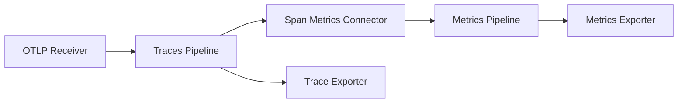

# How to Use the Connector to Bridge Traces and Metrics Pipelines

Author: [nawazdhandala](https://www.github.com/nawazdhandala)

Tags: OpenTelemetry, Collector, Connectors, Traces, Metrics, Pipelines, Observability

Description: Learn how to use OpenTelemetry Collector connectors to derive metrics from traces, bridging signal pipelines for richer observability.

---

The OpenTelemetry Collector processes traces, metrics, and logs through separate pipelines. Traditionally, these pipelines operate independently. You receive traces in one pipeline and export them, receive metrics in another and export those. But what if you want to generate metrics from your trace data? That is exactly what connectors solve.

A connector acts as both an exporter in one pipeline and a receiver in another. It sits at the boundary between two pipelines, consuming data from the first and producing derived data for the second. The most common use case is generating RED metrics (Rate, Errors, Duration) directly from span data, eliminating the need for application-level metric instrumentation for these standard signals.

## Understanding Connectors

Before connectors existed, teams that wanted span-derived metrics had two options. They could instrument their application code to emit both traces and metrics, duplicating effort and risking inconsistency. Or they could run a separate processor outside the collector to analyze exported spans and generate metrics after the fact, adding latency and operational complexity.

Connectors solve this cleanly within the collector itself.



The connector appears as an exporter in the traces pipeline and as a receiver in the metrics pipeline. Data flows through the traces pipeline, hits the connector, and the connector generates metrics that feed into the metrics pipeline. The original traces continue to their own exporter unaffected.

## The Span Metrics Connector

The `spanmetrics` connector is the most widely used connector. It generates request count, error count, and duration histogram metrics from span data. This gives you service-level indicators without writing a single line of metric instrumentation code.

Here is a basic configuration:

```yaml
# Collector configuration with spanmetrics connector
receivers:
  otlp:
    protocols:
      grpc:
        endpoint: 0.0.0.0:4317
      http:
        endpoint: 0.0.0.0:4318

connectors:
  # The spanmetrics connector generates metrics from trace spans
  spanmetrics:
    # Define histogram buckets for duration metrics
    histogram:
      explicit:
        # Buckets in milliseconds covering typical web request latencies
        buckets: [5ms, 10ms, 25ms, 50ms, 100ms, 250ms, 500ms, 1s, 2.5s, 5s, 10s]
    # Dimensions extracted from span attributes to add as metric labels
    dimensions:
      - name: http.method
      - name: http.status_code
      - name: http.route
    # Namespace prefix for generated metrics
    namespace: traces.spanmetrics

exporters:
  otlp/traces:
    endpoint: traces-backend.example.com:4317
  otlp/metrics:
    endpoint: metrics-backend.example.com:4317

service:
  pipelines:
    # Traces pipeline exports to both the trace backend and the connector
    traces:
      receivers: [otlp]
      exporters: [otlp/traces, spanmetrics]
    # Metrics pipeline receives from the connector and exports to metrics backend
    metrics:
      receivers: [spanmetrics]
      exporters: [otlp/metrics]
```

Notice how `spanmetrics` appears in the `exporters` list of the traces pipeline and in the `receivers` list of the metrics pipeline. This dual role is what makes it a connector. The traces pipeline processes spans normally and sends them to both the trace backend and the connector. The connector then produces metrics that flow through the metrics pipeline to the metrics backend.

## Configuring Histogram Buckets

Getting histogram buckets right is important for useful latency metrics. The default buckets may not match your application's latency profile.

```yaml
connectors:
  spanmetrics:
    histogram:
      explicit:
        # For a low-latency API service, use tighter buckets
        buckets: [1ms, 2ms, 5ms, 10ms, 25ms, 50ms, 100ms, 250ms, 500ms, 1s]
    # You can also use exponential histograms for automatic bucket selection
    # histogram:
    #   exponential:
    #     max_size: 160  # Maximum number of buckets
```

Explicit buckets give you precise control over the boundaries, which is useful when you know your latency distribution. Exponential histograms adapt automatically to the data, which is better when latency patterns vary across services and you want a single configuration that works everywhere.

## Adding Dimensions from Span Attributes

Dimensions turn span attributes into metric labels. This is where the connector becomes really powerful, because you can slice your derived metrics by any span attribute.

```yaml
connectors:
  spanmetrics:
    histogram:
      explicit:
        buckets: [5ms, 10ms, 25ms, 50ms, 100ms, 250ms, 500ms, 1s, 5s]
    dimensions:
      # Standard HTTP attributes become metric labels
      - name: http.method
      - name: http.status_code
      - name: http.route
      # Custom application attributes
      - name: rpc.method
      - name: db.system
      # You can set a default value for when the attribute is missing
      - name: deployment.environment
        default: "unknown"
      # Map span attribute to a different metric dimension name
      - name: enduser.id
        default: "anonymous"
    # Control dimension cardinality by limiting which spans generate metrics
    dimensions_cache_size: 1000
    # Aggregation temporality for generated metrics
    aggregation_temporality: "AGGREGATION_TEMPORALITY_CUMULATIVE"
```

Be careful with dimension cardinality. Every unique combination of dimension values creates a separate time series. Adding `enduser.id` as a dimension might sound useful, but if you have millions of users, you will generate millions of time series and overwhelm your metrics backend. Stick to low-cardinality attributes like HTTP methods, status codes, and route patterns.

## Combining with Processors

Connectors work within the standard pipeline model, so you can add processors to either side. This is useful for filtering, transforming, or enriching data before or after the connector.

```yaml
receivers:
  otlp:
    protocols:
      grpc:
        endpoint: 0.0.0.0:4317

connectors:
  spanmetrics:
    histogram:
      explicit:
        buckets: [5ms, 25ms, 50ms, 100ms, 250ms, 500ms, 1s, 5s]
    dimensions:
      - name: http.method
      - name: http.status_code
      - name: http.route

processors:
  # Filter out health check spans before they reach the connector
  filter/traces:
    traces:
      span:
        - 'attributes["http.route"] == "/healthz"'
        - 'attributes["http.route"] == "/readyz"'

  # Add resource attributes to metrics after the connector
  resource/metrics:
    attributes:
      - key: service.pipeline
        value: "spanmetrics"
        action: upsert

exporters:
  otlp/traces:
    endpoint: traces-backend.example.com:4317
  otlp/metrics:
    endpoint: metrics-backend.example.com:4317

service:
  pipelines:
    traces:
      receivers: [otlp]
      # Filter health checks before they reach the connector
      processors: [filter/traces]
      exporters: [otlp/traces, spanmetrics]
    metrics:
      receivers: [spanmetrics]
      # Enrich metrics with additional resource attributes
      processors: [resource/metrics]
      exporters: [otlp/metrics]
```

Filtering health check spans before the connector prevents them from polluting your RED metrics. Adding resource attributes after the connector helps you identify metrics that came from span derivation versus direct instrumentation.

## The Count Connector

Besides `spanmetrics`, the `count` connector is another useful option. It counts telemetry items based on conditions, producing simple counter metrics.

```yaml
connectors:
  # Count connector generates count metrics from traces
  count:
    traces:
      # Count spans matching specific conditions
      spans:
        # Count all error spans
        errors.count:
          description: "Count of error spans"
          conditions:
            - 'status.code == STATUS_CODE_ERROR'
        # Count database spans specifically
        db.request.count:
          description: "Count of database operation spans"
          conditions:
            - 'attributes["db.system"] != nil'
      # Count entire span events
      spanevents:
        exception.count:
          description: "Count of exception events"
          conditions:
            - 'name == "exception"'

service:
  pipelines:
    traces:
      receivers: [otlp]
      exporters: [otlp/traces, count]
    metrics:
      receivers: [count]
      exporters: [otlp/metrics]
```

The count connector uses OTTL (OpenTelemetry Transformation Language) conditions to filter which items get counted. This gives you precise control over what gets measured without writing custom code.

## Routing Connector for Multi-Pipeline Architectures

The `routing` connector routes telemetry to different pipelines based on content. This is useful when you need different processing or export paths for different types of data.

```yaml
connectors:
  # Route traces to different pipelines based on attributes
  routing:
    table:
      # High-priority traces go to a dedicated pipeline
      - statement: 'route() where attributes["priority"] == "high"'
        pipelines: [traces/priority]
      # Everything else goes to the default pipeline
      - statement: 'route()'
        pipelines: [traces/default]

service:
  pipelines:
    traces:
      receivers: [otlp]
      exporters: [routing]
    traces/priority:
      receivers: [routing]
      processors: [batch]
      exporters: [otlp/priority-backend]
    traces/default:
      receivers: [routing]
      processors: [batch, probabilistic_sampler]
      exporters: [otlp/default-backend]
```

This configuration samples default traces but keeps all high-priority traces, routing them to a dedicated backend for thorough analysis.

## Monitoring Connector Performance

Connectors add processing overhead, so monitor their impact. The collector exposes internal metrics you should watch:

```yaml
service:
  # Enable internal telemetry for monitoring the collector itself
  telemetry:
    metrics:
      level: detailed
      address: 0.0.0.0:8888
```

Key metrics to watch include `otelcol_connector_accepted_spans` (how many spans the connector processed), `otelcol_connector_refused_spans` (how many were rejected), and the connector's own processing latency. If you see refused spans increasing, check whether the downstream metrics pipeline is backed up.

Connectors are one of the most powerful features in the OpenTelemetry Collector. They let you derive new signals from existing telemetry without modifying application code, keep your instrumentation focused on traces while automatically getting standard metrics, and build sophisticated multi-pipeline architectures. Start with the `spanmetrics` connector for RED metrics, and expand to other connector types as your observability needs grow.
