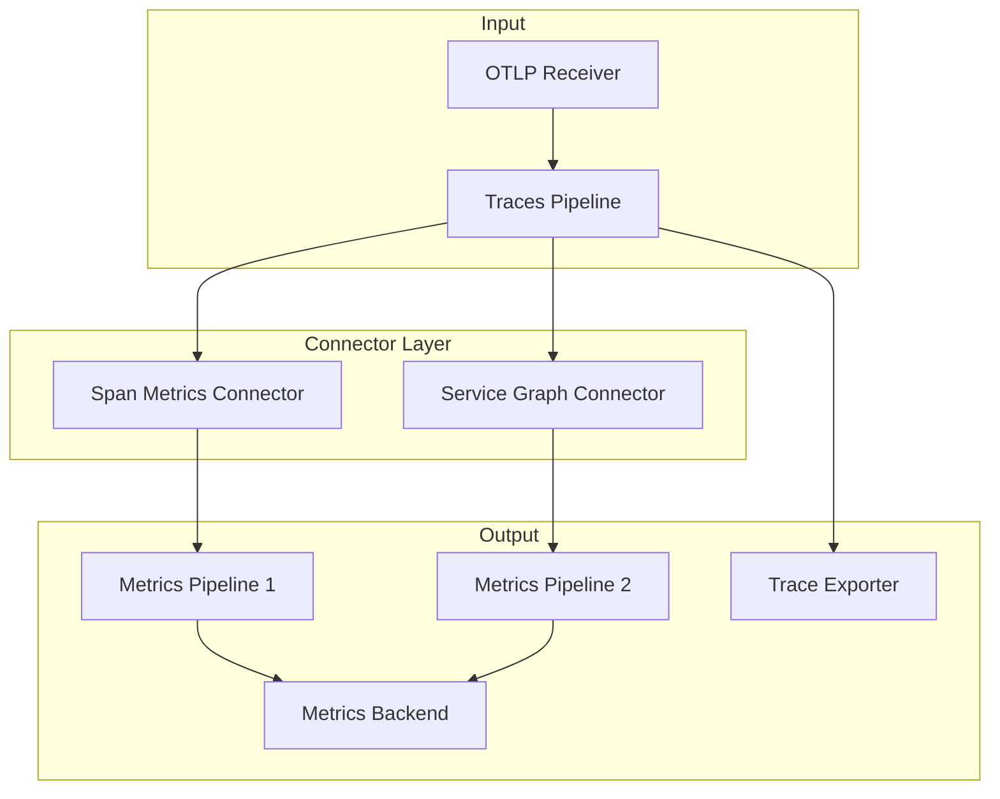

# How to Use Connectors to Link Traces and Metrics Pipelines

Author: [nawazdhandala](https://www.github.com/nawazdhandala)

Tags: OpenTelemetry, Collector, Connectors, Traces, Metrics, Pipeline Architecture

Description: Master the art of linking traces and metrics pipelines in OpenTelemetry Collector using connectors to create unified observability workflows and derive metrics from traces.

Connectors in the OpenTelemetry Collector represent a paradigm shift in how we process and correlate telemetry data. Unlike traditional receivers and exporters that communicate with external systems, connectors link pipelines within the same Collector instance, enabling sophisticated data transformations and correlations. This capability is particularly powerful when linking traces and metrics pipelines, allowing you to derive metrics from traces, enrich traces with metric context, and create unified observability workflows.

## Understanding Connectors in OpenTelemetry

Connectors serve as both an exporter and a receiver simultaneously. They act as the endpoint for one pipeline while serving as the starting point for another. This dual nature enables data to flow between pipelines, allowing transformations, aggregations, and correlations that would otherwise require external systems or complex routing.

When linking traces and metrics pipelines, connectors enable several critical capabilities:

**Metric Generation from Traces**: Automatically derive RED (Rate, Error, Duration) metrics from trace data without separate instrumentation.

**Trace Context in Metrics**: Enrich metric data with trace identifiers for correlation in analysis tools.

**Multi-Signal Processing**: Process traces and metrics in coordinated workflows where each signal informs the other.

**Pipeline Orchestration**: Create complex data flows where trace processing triggers metric generation, which may then trigger additional processing.

## Connector Architecture and Data Flow

Understanding how connectors fit into the Collector architecture is essential:



Traces enter through a receiver, flow through a trace pipeline, and then feed into connectors. These connectors generate metrics that enter metrics pipelines, while the original traces continue to their own exporters.

## Basic Trace to Metrics Connection

The most common use case is generating metrics from traces. Here's a foundational configuration:

```yaml
receivers:
  otlp:
    protocols:
      grpc:
        endpoint: 0.0.0.0:4317

processors:
  batch:
    timeout: 10s
    send_batch_size: 1024

connectors:
  # Span metrics connector generates metrics from traces
  spanmetrics:
    # Define histogram buckets for latency metrics
    histogram:
      explicit:
        buckets: [10ms, 50ms, 100ms, 250ms, 500ms, 1s, 2.5s, 5s, 10s]

    # Define dimensions for generated metrics
    dimensions:
      - name: service.name
      - name: http.method
      - name: http.status_code

    # Configure metric names
    namespace: traces.span.metrics

exporters:
  # Export traces to Jaeger
  otlp/traces:
    endpoint: jaeger:4317
    tls:
      insecure: true

  # Export metrics to Prometheus
  prometheusremotewrite:
    endpoint: http://prometheus:9090/api/v1/write

service:
  pipelines:
    # Traces pipeline feeds the connector
    traces:
      receivers: [otlp]
      processors: [batch]
      exporters: [spanmetrics, otlp/traces]

    # Metrics pipeline receives from connector
    metrics:
      receivers: [spanmetrics]
      processors: [batch]
      exporters: [prometheusremotewrite]
```

This configuration creates a direct link between traces and metrics. Every trace that flows through the traces pipeline generates corresponding metrics that flow through the metrics pipeline.

## Generating RED Metrics from Traces

Rate, Error, and Duration (RED) metrics are essential for service monitoring. Connectors can automatically generate these from traces:

```yaml
receivers:
  otlp:
    protocols:
      grpc:
        endpoint: 0.0.0.0:4317
      http:
        endpoint: 0.0.0.0:4318

processors:
  # Add resource attributes before metric generation
  resource:
    attributes:
      - key: environment
        value: production
        action: insert

  batch:
    timeout: 10s
    send_batch_size: 1024

connectors:
  spanmetrics/red:
    # Configure histogram for duration (D in RED)
    histogram:
      explicit:
        buckets: [5ms, 10ms, 25ms, 50ms, 100ms, 250ms, 500ms, 1s, 2.5s, 5s, 10s]

    # Dimensions for all generated metrics
    dimensions:
      - name: service.name
      - name: span.kind
      - name: http.method
      - name: http.route
      - name: http.status_code
      - name: status.code

    # Exclude internal spans from metrics
    exclude_dimensions:
      - name: span.name
        value: "internal.*"

    # Metrics configuration
    metrics_expiration: 5m

    # Generate call metrics (R in RED)
    aggregation:
      # Count all requests
      calls:
        enabled: true
      # Track errors (E in RED)
      errors:
        enabled: true
        conditions:
          - key: status.code
            value: ERROR

exporters:
  otlp/traces:
    endpoint: jaeger:4317

  prometheusremotewrite/metrics:
    endpoint: http://prometheus:9090/api/v1/write
    headers:
      X-Prometheus-Remote-Write-Version: "0.1.0"

service:
  pipelines:
    traces:
      receivers: [otlp]
      processors: [resource, batch]
      exporters: [spanmetrics/red, otlp/traces]

    metrics/from-traces:
      receivers: [spanmetrics/red]
      processors: [batch]
      exporters: [prometheusremotewrite/metrics]
```

This configuration automatically generates:

- Request rate (calls per second)
- Error rate (errors per second)
- Duration distribution (latency histogram)

All derived from trace data, eliminating the need for separate metric instrumentation.

## Creating Service Dependency Graphs

Connectors can analyze trace relationships to generate service graph metrics:

```yaml
receivers:
  otlp:
    protocols:
      grpc:
        endpoint: 0.0.0.0:4317

processors:
  batch:
    timeout: 10s

connectors:
  # Service graph connector analyzes trace relationships
  servicegraph:
    # Configure how long to store trace relationships
    store:
      max_items: 10000
      ttl: 2s

    # Latency histogram for service-to-service calls
    latency_histogram_buckets: [10ms, 50ms, 100ms, 250ms, 500ms, 1s, 2.5s, 5s, 10s]

    # Dimensions for service graph metrics
    dimensions:
      - service.name
      - service.namespace

    # Generate specific graph metrics
    metrics:
      # Track calls between services
      calls:
        enabled: true

      # Track request duration between services
      duration:
        enabled: true

      # Track request sizes
      request_size:
        enabled: true

      # Track response sizes
      response_size:
        enabled: true

exporters:
  otlp/traces:
    endpoint: tempo:4317

  prometheusremotewrite/graph:
    endpoint: http://prometheus:9090/api/v1/write

service:
  pipelines:
    traces:
      receivers: [otlp]
      processors: [batch]
      exporters: [servicegraph, otlp/traces]

    metrics/service-graph:
      receivers: [servicegraph]
      processors: [batch]
      exporters: [prometheusremotewrite/graph]
```

The service graph connector analyzes parent-child relationships in traces to understand which services call which other services, generating metrics like `traces_service_graph_request_total{client="frontend", server="api"}`.

## Multi-Connector Pipeline Architecture

You can use multiple connectors to create sophisticated processing workflows:

```yaml
receivers:
  otlp:
    protocols:
      grpc:
        endpoint: 0.0.0.0:4317

processors:
  batch:
    timeout: 10s

  # Filter traces for specific processing
  filter/http-only:
    traces:
      span:
        - 'attributes["http.method"] != nil'

  filter/db-only:
    traces:
      span:
        - 'attributes["db.system"] != nil'

connectors:
  # Generate HTTP metrics from traces
  spanmetrics/http:
    histogram:
      explicit:
        buckets: [10ms, 50ms, 100ms, 250ms, 500ms, 1s, 2.5s, 5s]
    dimensions:
      - name: service.name
      - name: http.method
      - name: http.route
      - name: http.status_code
    namespace: http

  # Generate database metrics from traces
  spanmetrics/database:
    histogram:
      explicit:
        buckets: [1ms, 5ms, 10ms, 25ms, 50ms, 100ms, 250ms, 500ms, 1s]
    dimensions:
      - name: service.name
      - name: db.system
      - name: db.operation
      - name: db.name
    namespace: database

  # Generate service graph
  servicegraph:
    latency_histogram_buckets: [10ms, 50ms, 100ms, 250ms, 500ms, 1s, 2.5s, 5s]

exporters:
  otlp/traces:
    endpoint: jaeger:4317

  prometheusremotewrite:
    endpoint: http://prometheus:9090/api/v1/write

service:
  pipelines:
    # Main traces pipeline
    traces/input:
      receivers: [otlp]
      processors: [batch]
      exporters: [otlp/traces, servicegraph]
      # Send to multiple downstream pipelines

    # HTTP trace processing
    traces/http:
      receivers: [otlp]
      processors: [filter/http-only, batch]
      exporters: [spanmetrics/http]

    # Database trace processing
    traces/database:
      receivers: [otlp]
      processors: [filter/db-only, batch]
      exporters: [spanmetrics/database]

    # HTTP metrics pipeline
    metrics/http:
      receivers: [spanmetrics/http]
      exporters: [prometheusremotewrite]

    # Database metrics pipeline
    metrics/database:
      receivers: [spanmetrics/database]
      exporters: [prometheusremotewrite]

    # Service graph metrics pipeline
    metrics/service-graph:
      receivers: [servicegraph]
      exporters: [prometheusremotewrite]
```

This architecture splits trace processing into specialized paths, each generating domain-specific metrics through dedicated connectors.

## Enriching Traces with Metric Context

While the primary flow is traces to metrics, you can also use connectors to enrich traces with metric-derived information:

```yaml
receivers:
  otlp:
    protocols:
      grpc:
        endpoint: 0.0.0.0:4317

  prometheus:
    config:
      scrape_configs:
        - job_name: 'app-metrics'
          scrape_interval: 15s
          static_configs:
            - targets: ['app:8080']

processors:
  # Enrich traces with metric data
  attributes/from-metrics:
    actions:
      - key: current.load
        from_context: metric.cpu.usage
        action: insert
      - key: memory.pressure
        from_context: metric.memory.usage
        action: insert

connectors:
  # Generate metrics from traces
  spanmetrics:
    histogram:
      explicit:
        buckets: [10ms, 50ms, 100ms, 250ms, 500ms, 1s, 2.5s, 5s]
    dimensions:
      - name: service.name

exporters:
  otlp/traces:
    endpoint: jaeger:4317

  prometheusremotewrite:
    endpoint: http://prometheus:9090/api/v1/write

service:
  pipelines:
    # Metrics input
    metrics/input:
      receivers: [prometheus]
      exporters: [prometheusremotewrite]

    # Traces with metric enrichment
    traces:
      receivers: [otlp]
      processors: [attributes/from-metrics]
      exporters: [spanmetrics, otlp/traces]

    # Generated metrics from traces
    metrics/from-traces:
      receivers: [spanmetrics]
      exporters: [prometheusremotewrite]
```

This bidirectional flow allows traces to carry metric context, useful for understanding system state at the time of trace capture.

## Sampling Decisions Based on Metrics

Use connectors to implement intelligent sampling based on derived metrics:

```yaml
receivers:
  otlp:
    protocols:
      grpc:
        endpoint: 0.0.0.0:4317

processors:
  # Probabilistic sampling based on derived metrics
  probabilistic_sampler:
    sampling_percentage: 10.0

  # Tail-based sampling using connector-generated metrics
  tail_sampling:
    policies:
      - name: sample-errors
        type: status_code
        status_code:
          status_codes: [ERROR]

      - name: sample-slow-requests
        type: latency
        latency:
          threshold_ms: 1000

      - name: sample-random
        type: probabilistic
        probabilistic:
          sampling_percentage: 5.0

connectors:
  # Generate metrics to inform sampling
  spanmetrics/sampling:
    histogram:
      explicit:
        buckets: [10ms, 50ms, 100ms, 250ms, 500ms, 1s, 2.5s, 5s]
    dimensions:
      - name: service.name
      - name: sampled

    # Track sampling rates
    sampling:
      enabled: true

exporters:
  otlp/traces:
    endpoint: jaeger:4317

  prometheusremotewrite:
    endpoint: http://prometheus:9090/api/v1/write

service:
  pipelines:
    # Pre-sampling traces
    traces/pre-sample:
      receivers: [otlp]
      exporters: [spanmetrics/sampling]

    # Sampled traces
    traces/sampled:
      receivers: [otlp]
      processors: [tail_sampling]
      exporters: [otlp/traces]

    # Sampling metrics
    metrics/sampling:
      receivers: [spanmetrics/sampling]
      exporters: [prometheusremotewrite]
```

This configuration generates metrics about sampling decisions, helping you understand what portion of traces are being captured and why.

## Chaining Connectors for Complex Workflows

Connectors can be chained to create multi-stage processing:

```yaml
receivers:
  otlp:
    protocols:
      grpc:
        endpoint: 0.0.0.0:4317

connectors:
  # Stage 1: Generate basic span metrics
  spanmetrics:
    histogram:
      explicit:
        buckets: [10ms, 50ms, 100ms, 250ms, 500ms, 1s, 2.5s, 5s]
    dimensions:
      - name: service.name
      - name: http.method

  # Stage 2: Aggregate metrics across services
  sum:
    metrics:
      - name: span.duration
      - name: span.count
    aggregation:
      group_by:
        - http.method

  # Stage 3: Generate service graph from traces
  servicegraph:
    latency_histogram_buckets: [10ms, 50ms, 100ms, 250ms, 500ms, 1s, 2.5s, 5s]

exporters:
  otlp/traces:
    endpoint: jaeger:4317

  prometheusremotewrite/detailed:
    endpoint: http://prometheus:9090/api/v1/write
    headers:
      X-Metric-Type: detailed

  prometheusremotewrite/aggregated:
    endpoint: http://prometheus:9090/api/v1/write
    headers:
      X-Metric-Type: aggregated

service:
  pipelines:
    # Stage 1: Process traces
    traces:
      receivers: [otlp]
      exporters: [spanmetrics, servicegraph, otlp/traces]

    # Stage 2: Process span metrics
    metrics/detailed:
      receivers: [spanmetrics]
      exporters: [prometheusremotewrite/detailed, sum]

    # Stage 3: Process aggregated metrics
    metrics/aggregated:
      receivers: [sum]
      exporters: [prometheusremotewrite/aggregated]

    # Stage 3: Process service graph metrics
    metrics/service-graph:
      receivers: [servicegraph]
      exporters: [prometheusremotewrite/detailed]
```

This multi-stage pipeline creates both detailed and aggregated views of your telemetry, with each stage building on the previous one.

## Real-World Example: Comprehensive Microservices Monitoring

Here's a complete configuration for monitoring a microservices architecture:

```yaml
receivers:
  otlp:
    protocols:
      grpc:
        endpoint: 0.0.0.0:4317
      http:
        endpoint: 0.0.0.0:4318

processors:
  # Resource detection
  resourcedetection:
    detectors: [env, system, docker]
    timeout: 5s

  # Batch processing
  batch:
    timeout: 10s
    send_batch_size: 1024

  # Memory limiter to prevent overload
  memory_limiter:
    check_interval: 1s
    limit_mib: 1024

  # Add environment tags
  resource:
    attributes:
      - key: environment
        value: production
        action: insert

connectors:
  # Generate RED metrics from traces
  spanmetrics/red:
    histogram:
      explicit:
        buckets: [5ms, 10ms, 25ms, 50ms, 100ms, 250ms, 500ms, 1s, 2.5s, 5s, 10s]
    dimensions:
      - name: service.name
      - name: service.namespace
      - name: span.kind
      - name: http.method
      - name: http.route
      - name: http.status_code
      - name: status.code
    namespace: traces.span.metrics
    metrics_expiration: 5m

  # Generate service dependency graph
  servicegraph:
    store:
      max_items: 100000
      ttl: 2s
    latency_histogram_buckets: [10ms, 50ms, 100ms, 250ms, 500ms, 1s, 2.5s, 5s, 10s]
    dimensions:
      - service.name
      - service.namespace
    metrics:
      calls:
        enabled: true
      duration:
        enabled: true

  # Aggregate metrics by service
  sum/by-service:
    metrics:
      - name: span.duration
      - name: span.count
    aggregation:
      group_by:
        - service.name
        - service.namespace

exporters:
  # Export traces to Tempo
  otlp/tempo:
    endpoint: tempo:4317
    compression: gzip
    tls:
      insecure: true

  # Export metrics to Prometheus
  prometheusremotewrite/prom:
    endpoint: http://prometheus:9090/api/v1/write
    compression: snappy

  # Export aggregated metrics to separate backend
  prometheusremotewrite/aggregated:
    endpoint: http://prometheus-aggregated:9090/api/v1/write
    compression: snappy

service:
  telemetry:
    logs:
      level: info
    metrics:
      level: detailed
      address: 0.0.0.0:8888

  pipelines:
    # Main traces pipeline
    traces/main:
      receivers: [otlp]
      processors: [memory_limiter, resourcedetection, resource, batch]
      exporters: [spanmetrics/red, servicegraph, otlp/tempo]

    # Detailed metrics from traces
    metrics/detailed:
      receivers: [spanmetrics/red, servicegraph]
      processors: [batch]
      exporters: [prometheusremotewrite/prom, sum/by-service]

    # Aggregated service-level metrics
    metrics/aggregated:
      receivers: [sum/by-service]
      processors: [batch]
      exporters: [prometheusremotewrite/aggregated]
```

This configuration creates a complete observability pipeline:

1. Traces are ingested and processed
2. RED metrics are automatically generated from traces
3. Service dependency graphs are created
4. Metrics are aggregated at the service level
5. All data is exported to appropriate backends

## Performance Optimization

When linking traces and metrics pipelines, consider these performance optimizations:

**Batch Processing**: Always use batch processors to reduce network overhead and improve throughput.

**Memory Management**: Connectors maintain state for metric generation. Use memory limiters to prevent resource exhaustion.

**Selective Processing**: Use filters to process only relevant traces, reducing connector load.

**Cardinality Control**: Limit dimensions in metric generation to control cardinality and storage costs.

```yaml
processors:
  # Batch for efficiency
  batch:
    timeout: 10s
    send_batch_size: 1024

  # Memory protection
  memory_limiter:
    check_interval: 1s
    limit_mib: 512

  # Filter high-value traces
  filter/important:
    traces:
      span:
        - 'attributes["http.status_code"] >= 400'
        - 'duration > 1000000000'  # 1 second in nanoseconds

service:
  pipelines:
    traces:
      receivers: [otlp]
      processors: [memory_limiter, filter/important, batch]
      exporters: [spanmetrics]
```

## Monitoring Connector Health

Monitor your connectors to ensure they're functioning correctly:

```yaml
service:
  telemetry:
    logs:
      level: info
    metrics:
      level: detailed
      address: 0.0.0.0:8888

exporters:
  prometheus:
    endpoint: 0.0.0.0:8889

service:
  pipelines:
    metrics/internal:
      receivers: [prometheus]
      exporters: [prometheus]
```

Key metrics to monitor:

- `otelcol_connector_spanmetrics_spans_processed`: Spans processed by spanmetrics connector
- `otelcol_connector_servicegraph_edges`: Number of service relationships tracked
- `otelcol_processor_batch_batch_send_size`: Batch sizes in metric pipelines

## Related Resources

For more specific connector implementations and use cases:

- [How to Convert Spans to Metrics Using the Span Metrics Connector](https://oneuptime.com/blog/post/2026-02-06-convert-spans-to-metrics-span-metrics-connector/view)
- [How to Generate Service Graph Metrics from Traces in the Collector](https://oneuptime.com/blog/post/2026-02-06-generate-service-graph-metrics-traces-collector/view)
- [How to Configure the Round Robin Connector in the OpenTelemetry Collector](https://oneuptime.com/blog/post/2026-02-06-round-robin-connector-opentelemetry-collector/view)

Connectors provide the glue that binds your observability pipelines together, enabling sophisticated correlations between traces and metrics while maintaining the flexibility to process each signal type according to its specific requirements.
