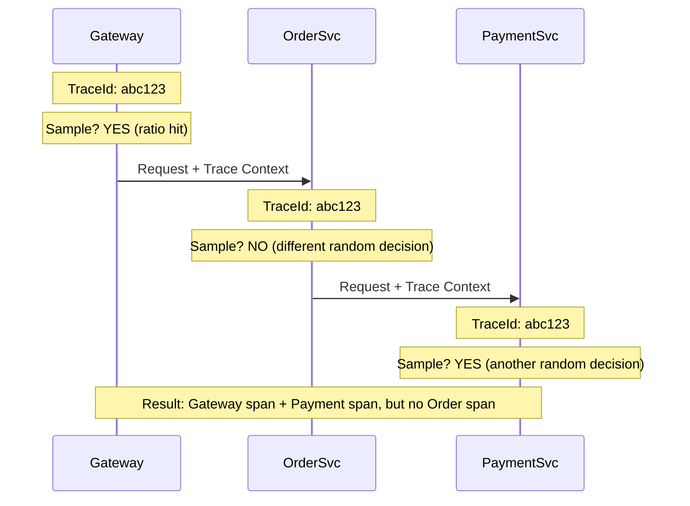
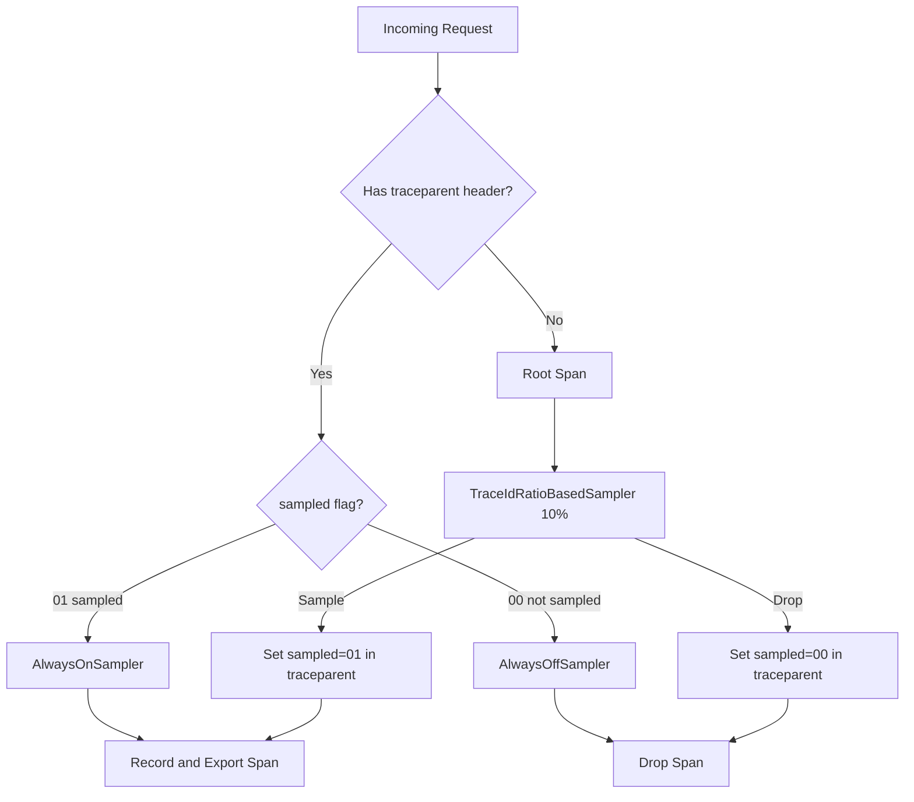

# How to Configure Consistent Probability Sampling Across Services

Author: [nawazdhandala](https://www.github.com/nawazdhandala)

Tags: OpenTelemetry, Sampling, Distributed Tracing, Microservices, Consistency, Observability

Description: Set up consistent probability sampling so every service in your distributed system makes the same sampling decision for each trace.

---

In a distributed system, a single request can touch dozens of services. If each service makes its own independent sampling decision, you end up with fragmented traces where some spans are present and others are missing. This makes the trace useless for debugging.

Consistent probability sampling solves this by ensuring that every service evaluating the same trace ID arrives at the same decision. If the root service decides to sample a trace, every downstream service will also sample it. If the root drops it, everyone drops it.

This guide covers how to set up consistent sampling across a polyglot microservice architecture, including the propagation mechanisms that make it work.

---

## The Inconsistency Problem

Consider three services: an API gateway, an order service, and a payment service. Each uses `TraceIdRatioBasedSampler(0.1)` independently.



The trace is broken. You see the start and the end, but the middle is missing. This happens because each service is rolling its own dice.

---

## How TraceIdRatioBasedSampler Achieves Consistency

The OpenTelemetry `TraceIdRatioBasedSampler` is already designed to be consistent. It does not use random numbers. Instead, it hashes the trace ID and compares the result against a threshold derived from the sampling ratio.

```typescript
// Simplified view of how TraceIdRatioBasedSampler works internally
function shouldSample(traceId: string, ratio: number): boolean {
  // Extract the last 8 bytes of the trace ID
  const traceIdBytes = hexToBytes(traceId);
  const lowerLong = bytesToLong(traceIdBytes.slice(8, 16));

  // Compare against threshold
  // For ratio 0.1, threshold is roughly 0.1 * MAX_LONG
  const threshold = Math.floor(ratio * Number.MAX_SAFE_INTEGER);

  // Same traceId always produces the same result
  return lowerLong < threshold;
}
```

Because the decision is based entirely on the trace ID, and every service in the trace shares the same trace ID, they all arrive at the same answer. No randomness involved.

The catch: this only works if every service uses the same ratio. If the gateway uses 0.1 and the order service uses 0.5, they will disagree on some traces.

---

## Configuring Consistent Ratios Across Services

### Option 1: Environment Variable

The simplest approach is to set the sampling ratio through an environment variable that all services read.

```bash
# Set in your deployment manifest (Kubernetes, Docker Compose, etc.)
OTEL_TRACES_SAMPLER=parentbased_traceidratio
OTEL_TRACES_SAMPLER_ARG=0.1
```

These are standard OpenTelemetry environment variables. Every OpenTelemetry SDK recognizes them.

For Kubernetes, define them in a ConfigMap shared across all deployments:

```yaml
# sampling-config.yaml
apiVersion: v1
kind: ConfigMap
metadata:
  name: otel-sampling-config
  namespace: production
data:
  OTEL_TRACES_SAMPLER: "parentbased_traceidratio"
  OTEL_TRACES_SAMPLER_ARG: "0.1"
```

```yaml
# deployment.yaml (for each service)
apiVersion: apps/v1
kind: Deployment
metadata:
  name: order-service
spec:
  template:
    spec:
      containers:
        - name: order-service
          image: order-service:latest
          envFrom:
            - configMapRef:
                name: otel-sampling-config
```

Every service reads the same ConfigMap, so they all use the same ratio. To change the sampling rate, update the ConfigMap and restart services.

### Option 2: ParentBasedSampler (Recommended)

The `ParentBasedSampler` adds an important layer: it respects the sampling decision made by the parent span. This means only the root service needs to make the ratio decision. Every downstream service simply follows along.

```typescript
// This configuration works in any language SDK
// Node.js / TypeScript example
import { NodeSDK } from '@opentelemetry/sdk-node';
import {
  ParentBasedSampler,
  TraceIdRatioBasedSampler,
  AlwaysOnSampler,
  AlwaysOffSampler,
} from '@opentelemetry/sdk-trace-base';

const sampler = new ParentBasedSampler({
  // Only root spans use the ratio sampler
  root: new TraceIdRatioBasedSampler(0.1),
  // If the parent was sampled, continue sampling
  remoteParentSampled: new AlwaysOnSampler(),
  // If the parent was not sampled, do not sample
  remoteParentNotSampled: new AlwaysOffSampler(),
  // Same for local parent spans
  localParentSampled: new AlwaysOnSampler(),
  localParentNotSampled: new AlwaysOffSampler(),
});

const sdk = new NodeSDK({
  sampler,
  // ... other configuration
});
```

The equivalent in Python:

```python
# Python SDK configuration
from opentelemetry.sdk.trace.sampling import (
    ParentBasedTraceIdRatio,
)
from opentelemetry.sdk.trace import TracerProvider

# ParentBasedTraceIdRatio combines ParentBased + TraceIdRatio
# It respects parent decisions and uses ratio for root spans
provider = TracerProvider(
    sampler=ParentBasedTraceIdRatio(rate=0.1)
)
```

And in Go:

```go
// Go SDK configuration
package main

import (
    "go.opentelemetry.io/otel/sdk/trace"
)

func initTracer() *trace.TracerProvider {
    // ParentBased wraps the ratio sampler
    // Root spans: 10% sampling
    // Child spans: follow parent decision
    sampler := trace.ParentBased(
        trace.TraceIDRatioBased(0.1),
    )

    tp := trace.NewTracerProvider(
        trace.WithSampler(sampler),
    )

    return tp
}
```

With `ParentBasedSampler`, the ratio only matters at the entry point (the root span). All downstream services respect the decision propagated through the trace context headers.

---

## How the Decision Propagates

The sampling decision travels in the W3C Trace Context `traceparent` header. The `sampled` flag in the trace flags field tells downstream services whether the trace is sampled.

```
traceparent: 00-4bf92f3577b34da6a3ce929d0e0e4736-00f067aa0ba902b7-01
              ^                                                      ^
              version                                                flags (01 = sampled)
```

When a downstream service receives this header and uses `ParentBasedSampler`:

1. It parses the `traceparent` header
2. It sees the `sampled` flag is set to `01`
3. It delegates to `remoteParentSampled`, which is `AlwaysOnSampler`
4. The span is recorded and exported

If the flag were `00` (not sampled), it would delegate to `remoteParentNotSampled`, which is `AlwaysOffSampler`, and the span would be dropped.



---

## Handling Mixed Sampling Rates

Sometimes you want different services to have different baseline rates. For example, a high-traffic frontend gateway at 5% and a low-traffic batch processor at 50%.

The trick is to use `ParentBasedSampler` everywhere, but configure different root ratios. Since child spans always follow the parent, the root ratio of the entry-point service determines the effective rate for the entire trace.

```yaml
# Gateway ConfigMap (entry point for most traffic)
data:
  OTEL_TRACES_SAMPLER: "parentbased_traceidratio"
  OTEL_TRACES_SAMPLER_ARG: "0.05"

# Batch processor ConfigMap (entry point for batch jobs)
data:
  OTEL_TRACES_SAMPLER: "parentbased_traceidratio"
  OTEL_TRACES_SAMPLER_ARG: "0.5"

# Internal services ConfigMap (never the root)
data:
  OTEL_TRACES_SAMPLER: "parentbased_traceidratio"
  OTEL_TRACES_SAMPLER_ARG: "0.1"
```

Internal services set a ratio too, but it only applies when they are the root of a trace (for example, when processing a message from a queue with no trace context). For HTTP requests from the gateway, they follow the gateway's decision.

---

## Verifying Consistency

To verify that your sampling is consistent, check three things.

First, look for orphaned spans. An orphaned span is a child span whose parent span was not sampled. If you see these, a service is not respecting parent decisions.

```bash
# Query your backend for spans where parent_span_id is set
# but no parent span exists in the trace
# This indicates inconsistent sampling
```

Second, check the sampled flag in your trace context propagation. Add logging at the boundary of each service:

```typescript
// Middleware to log sampling decisions at service boundaries
import { trace, context } from '@opentelemetry/api';

function samplingDebugMiddleware(req: any, res: any, next: any) {
  const span = trace.getActiveSpan();
  if (span) {
    const spanContext = span.spanContext();
    const isSampled = (spanContext.traceFlags & 0x01) === 1;
    console.log(
      `[sampling-debug] traceId=${spanContext.traceId} ` +
      `sampled=${isSampled} ` +
      `service=order-service`
    );
  }
  next();
}
```

Third, compare trace counts across services. If the gateway exports 1000 traces per minute and the order service exports 950, you have roughly consistent sampling (the 5% difference is from traces that do not reach the order service). If the order service exports 5000 while the gateway exports 1000, something is wrong.

---

## Common Mistakes

**Using `AlwaysOnSampler` without `ParentBased` wrapping.** This samples everything regardless of parent decisions, causing inconsistency when combined with services that do sample.

**Different SDK versions with different hashing algorithms.** Older SDK versions might hash the trace ID differently. Keep SDKs at compatible versions across services.

**Forgetting to propagate context.** If a service does not extract and inject the `traceparent` header, downstream services treat requests as new root spans. Make sure your HTTP clients and servers are instrumented for context propagation.

**Queue-based systems without context propagation.** Messages in Kafka, RabbitMQ, or SQS need trace context attached as message attributes. Without this, the consumer creates a new root span with a new trace ID.

---

## Key Takeaways

1. Use `TraceIdRatioBasedSampler` with the same ratio across all services for deterministic, consistent decisions
2. Wrap it in `ParentBasedSampler` so only root spans make the ratio decision and all child spans follow
3. Set sampling configuration through shared ConfigMaps or environment variables
4. The W3C `traceparent` header carries the sampling decision between services automatically
5. Different entry-point services can use different root ratios without breaking consistency
6. Verify consistency by checking for orphaned spans and comparing trace counts across services

Consistent sampling is the foundation of reliable distributed tracing. Get this right, and your traces will always be complete, regardless of how many services they touch.
