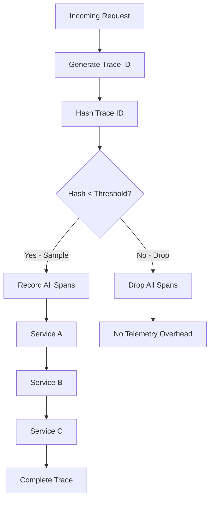

# How to Use Consistent Probability Sampling for Predictable Overhead

Author: [nawazdhandala](https://www.github.com/nawazdhandala)

Tags: OpenTelemetry, Sampling, Performance, Cost Optimization, Traces

Description: Master consistent probability sampling in OpenTelemetry to achieve predictable observability overhead while maintaining statistically valid trace data across distributed systems.

Observability at scale comes with a significant cost: the sheer volume of telemetry data generated by modern distributed systems can overwhelm both your network infrastructure and storage backend. Capturing every trace from every request is neither practical nor necessary for effective observability.

Consistent probability sampling offers a solution by reducing data volume while maintaining statistical validity. Unlike head-based sampling, which makes decisions at the trace root, consistent probability sampling ensures that all spans in a distributed trace are sampled consistently, preventing incomplete traces and sampling bias.

## Understanding Consistent Probability Sampling

Consistent probability sampling works by using a deterministic hash of the trace ID to make sampling decisions. Since all services in a distributed trace share the same trace ID, they all arrive at the same sampling decision, ensuring complete traces are either fully sampled or fully dropped.

This approach provides two critical benefits:

1. **Predictable overhead**: You can precisely control the percentage of traces sampled
2. **Complete traces**: All spans in a sampled trace are collected, enabling full distributed tracing



## The Math Behind Probability Sampling

The sampling decision is based on comparing a hash of the trace ID against a threshold value. For a sampling rate of P (where 0 < P <= 1):

```
threshold = P * MAX_UINT64
sample = hash(trace_id) < threshold
```

For example, with a 10% sampling rate (P = 0.1):
- Threshold = 0.1 * 18,446,744,073,709,551,615 = 1,844,674,407,370,955,161
- Any trace ID whose hash falls below this threshold is sampled

This deterministic approach ensures consistency across all services processing the same trace.

## Configuring Consistent Probability Sampling in the Collector

The OpenTelemetry Collector provides the `probabilistic_sampler` processor for implementing consistent probability sampling. Here's a complete configuration:

```yaml
# otel-collector-config.yaml
receivers:
  otlp:
    protocols:
      grpc:
        endpoint: 0.0.0.0:4317
      http:
        endpoint: 0.0.0.0:4318

processors:
  # Probabilistic sampler for consistent sampling
  probabilistic_sampler:
    # Sample 10% of traces using consistent probability sampling
    # This provides a 90% reduction in trace volume
    sampling_percentage: 10.0

    # Hash seed for consistent hashing (optional)
    # Use the same seed across all collectors for consistency
    hash_seed: 22

  # Batch processor to optimize export efficiency
  batch:
    send_batch_size: 1024
    timeout: 10s
    send_batch_max_size: 2048

  # Memory limiter to prevent OOM
  memory_limiter:
    check_interval: 1s
    limit_mib: 512
    spike_limit_mib: 128

exporters:
  otlp:
    endpoint: backend:4317
    tls:
      insecure: false

  # Export collector metrics to monitor sampling
  prometheus:
    endpoint: 0.0.0.0:8889

service:
  pipelines:
    traces:
      receivers: [otlp]
      # Order matters: memory_limiter first, then sampling, then batch
      processors: [memory_limiter, probabilistic_sampler, batch]
      exporters: [otlp]

  telemetry:
    metrics:
      level: detailed
      address: 0.0.0.0:8888
```

## SDK-Side Sampling Configuration

For optimal efficiency, configure sampling at the SDK level to avoid collecting and transmitting data that will be dropped by the collector. Here's how to implement consistent probability sampling in different SDKs:

### Go SDK

```go
package main

import (
    "context"
    "go.opentelemetry.io/otel"
    "go.opentelemetry.io/otel/exporters/otlp/otlptrace/otlptracegrpc"
    "go.opentelemetry.io/otel/sdk/trace"
)

func initTracer() (*trace.TracerProvider, error) {
    // Create OTLP exporter
    exporter, err := otlptracegrpc.New(
        context.Background(),
        otlptracegrpc.WithEndpoint("collector:4317"),
        otlptracegrpc.WithInsecure(),
    )
    if err != nil {
        return nil, err
    }

    // Configure tracer provider with probability sampler
    // Sample 10% of traces using consistent sampling
    tp := trace.NewTracerProvider(
        // ParentBased ensures consistent sampling across trace spans
        trace.WithSampler(trace.ParentBased(
            // Root spans use probability sampler
            trace.TraceIDRatioBased(0.1), // 10% sampling rate
        )),
        trace.WithBatcher(exporter,
            trace.WithMaxExportBatchSize(512),
            trace.WithMaxQueueSize(2048),
        ),
    )

    otel.SetTracerProvider(tp)
    return tp, nil
}
```

### Python SDK

```python
from opentelemetry import trace
from opentelemetry.sdk.trace import TracerProvider
from opentelemetry.sdk.trace.sampling import (
    ParentBasedTraceIdRatioBased,
)
from opentelemetry.sdk.trace.export import BatchSpanProcessor
from opentelemetry.exporter.otlp.proto.grpc.trace_exporter import OTLPSpanExporter

def init_tracer():
    """Initialize tracer with consistent probability sampling."""

    # Configure parent-based trace ID ratio sampler
    # This ensures consistent sampling across all spans in a trace
    sampler = ParentBasedTraceIdRatioBased(
        # Sample 10% of traces (0.1 ratio)
        # All spans in sampled traces will be collected
        rate=0.1
    )

    # Create tracer provider with sampler
    provider = TracerProvider(sampler=sampler)

    # Configure OTLP exporter
    otlp_exporter = OTLPSpanExporter(
        endpoint="collector:4317",
        insecure=True
    )

    # Add batch processor for efficient export
    provider.add_span_processor(
        BatchSpanProcessor(
            otlp_exporter,
            max_export_batch_size=512,
            max_queue_size=2048,
            schedule_delay_millis=5000
        )
    )

    trace.set_tracer_provider(provider)
    return provider
```

### Java SDK

```java
import io.opentelemetry.api.OpenTelemetry;
import io.opentelemetry.sdk.OpenTelemetrySdk;
import io.opentelemetry.sdk.trace.SdkTracerProvider;
import io.opentelemetry.sdk.trace.export.BatchSpanProcessor;
import io.opentelemetry.sdk.trace.samplers.Sampler;
import io.opentelemetry.exporter.otlp.trace.OtlpGrpcSpanExporter;

public class TracingConfig {

    public static OpenTelemetry initTracer() {
        // Configure OTLP exporter
        OtlpGrpcSpanExporter spanExporter = OtlpGrpcSpanExporter.builder()
            .setEndpoint("http://collector:4317")
            .build();

        // Configure consistent probability sampler (10% rate)
        // ParentBased ensures child spans follow parent sampling decision
        Sampler sampler = Sampler.parentBased(
            Sampler.traceIdRatioBased(0.1)  // Sample 10% of traces
        );

        // Build tracer provider with sampler
        SdkTracerProvider tracerProvider = SdkTracerProvider.builder()
            .setSampler(sampler)
            .addSpanProcessor(
                BatchSpanProcessor.builder(spanExporter)
                    .setMaxExportBatchSize(512)
                    .setMaxQueueSize(2048)
                    .build()
            )
            .build();

        // Return configured OpenTelemetry instance
        return OpenTelemetrySdk.builder()
            .setTracerProvider(tracerProvider)
            .build();
    }
}
```

## Calculating Overhead Reduction

Consistent probability sampling provides predictable overhead reduction. Calculate your expected savings:

```
Original volume = requests_per_second * avg_spans_per_trace * span_size
Sampled volume = original_volume * sampling_rate
Savings = original_volume - sampled_volume
```

Example calculation for a system with:
- 10,000 requests/second
- Average 15 spans per trace
- Average span size 2 KB

```
Original: 10,000 * 15 * 2 KB = 300 MB/sec = 25.9 TB/day
With 10% sampling: 300 MB/sec * 0.1 = 30 MB/sec = 2.59 TB/day
Savings: 23.31 TB/day (90% reduction)
```

## Adaptive Sampling Rates

For production systems, you may want different sampling rates based on conditions. Here's how to implement adaptive sampling:

```yaml
processors:
  # Use tail sampling for more sophisticated sampling logic
  tail_sampling:
    # Wait for complete trace before sampling decision
    decision_wait: 10s
    num_traces: 50000
    expected_new_traces_per_sec: 1000

    policies:
      # Always sample error traces
      - name: error-traces
        type: status_code
        status_code:
          status_codes: [ERROR]

      # Sample 50% of slow traces (>1s duration)
      - name: slow-traces
        type: latency
        latency:
          threshold_ms: 1000
        probabilistic:
          sampling_percentage: 50

      # Sample 5% of normal traces
      - name: normal-traces
        type: probabilistic
        probabilistic:
          sampling_percentage: 5

      # Always sample traces with specific attributes
      - name: important-customers
        type: string_attribute
        string_attribute:
          key: customer.tier
          values: [premium, enterprise]
```

## Monitoring Sampling Effectiveness

Track these metrics to ensure your sampling strategy is working correctly:

```yaml
# Enable detailed telemetry
service:
  telemetry:
    metrics:
      level: detailed
      address: 0.0.0.0:8888
    logs:
      level: info
```

Key metrics to monitor:
- `otelcol_processor_probabilistic_sampler_count_traces_sampled`: Number of sampled traces
- `otelcol_processor_probabilistic_sampler_count_traces_not_sampled`: Number of dropped traces
- `otelcol_receiver_accepted_spans`: Total spans received
- `otelcol_exporter_sent_spans`: Total spans exported

Calculate actual sampling rate:

```
actual_rate = sampled_traces / (sampled_traces + dropped_traces)
```

Verify this matches your configured rate.

## Maintaining Statistical Validity

While sampling reduces volume, it must maintain statistical validity for your metrics and analysis. Follow these guidelines:

**Sample size requirements**: For 95% confidence with 5% margin of error:

```
min_samples = (1.96^2 * 0.5 * 0.5) / 0.05^2 = 384 traces
```

Ensure your sampling rate provides sufficient samples during your analysis window.

**Bias prevention**: Consistent probability sampling is unbiased because it doesn't depend on request characteristics. However, be aware of:

- Time-based patterns (sample across full day/week cycles)
- Geographic distribution (ensure all regions are represented)
- Customer segments (verify sampling across all user types)

## Combining with Other Sampling Strategies

Consistent probability sampling works well with other techniques:

**Head-based + Probability**: Make quick sampling decisions at the root, then use consistent probability for the full trace

**Tail-based + Probability**: Use probability sampling as a fallback for traces that don't match tail sampling rules

**Priority sampling**: Override probability sampling for high-priority traces

```yaml
processors:
  # First check for priority sampling
  attributes:
    actions:
      - key: sampling.priority
        action: insert
        value: high
        from_attribute: request.priority

  # Then apply probability sampling to non-priority traces
  tail_sampling:
    policies:
      # High priority traces always sampled
      - name: priority-traces
        type: string_attribute
        string_attribute:
          key: sampling.priority
          values: [high]
          invert_match: false

      # Other traces use probability sampling
      - name: sampled-traces
        type: probabilistic
        probabilistic:
          sampling_percentage: 10
```

## Cost-Performance Trade-offs

Choosing the right sampling rate requires balancing costs against observability needs:

| Sampling Rate | Use Case | Trade-offs |
|--------------|----------|------------|
| 100% | Development, critical services | Maximum visibility, highest cost |
| 50% | Pre-production, moderate traffic | Good visibility, moderate cost |
| 10-20% | Production, high traffic | Statistical validity, 80-90% savings |
| 1-5% | Production, very high traffic | Basic visibility, 95-99% savings |

Start with a higher rate and reduce based on your budget and observability requirements. For more strategies on reducing costs, see our guide on [building cost-effective observability platforms](https://oneuptime.com/blog/post/cost-effective-observability-platform-opentelemetry/view).

## Troubleshooting Common Issues

**Problem**: Sampling rate doesn't match configuration
- **Solution**: Verify SDK and collector configurations match, check for tail sampling conflicts

**Problem**: Incomplete traces in sampled data
- **Solution**: Ensure all services use the same hash seed, verify ParentBased sampler is configured

**Problem**: Important traces being dropped
- **Solution**: Implement tail sampling with error/latency policies to catch critical traces

**Problem**: High memory usage despite sampling
- **Solution**: Configure [proper message size limits](https://oneuptime.com/blog/post/configure-max-recv-msg-size-prevent-dropped-data/view) and batch processors

Consistent probability sampling is a powerful tool for managing observability costs while maintaining trace integrity. By understanding the principles and implementing proper configuration, you can achieve predictable overhead and reliable distributed tracing at any scale.
