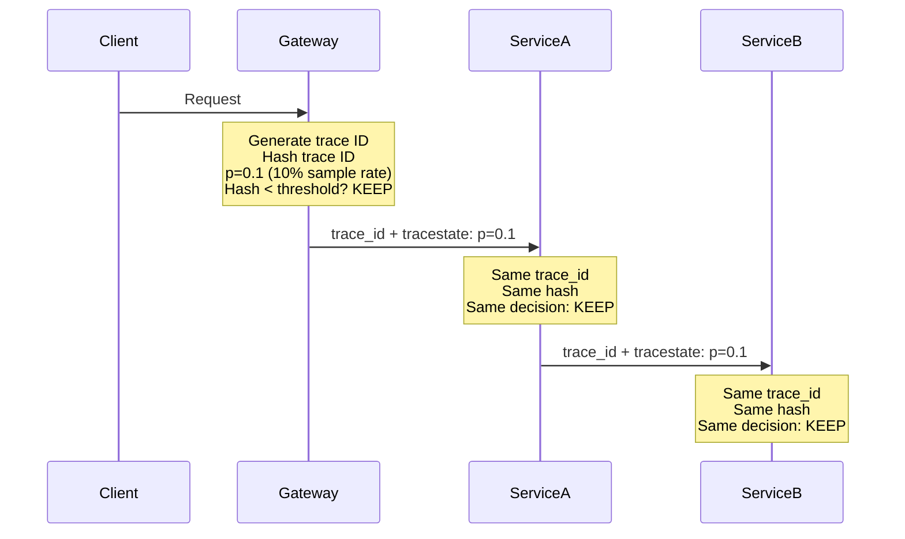

# How to Use Consistent Probability Sampling to Achieve Predictable Observability Spending

Author: [nawazdhandala](https://www.github.com/nawazdhandala)

Tags: OpenTelemetry, Sampling, Probability, Cost Control

Description: Implement consistent probability sampling in OpenTelemetry to control trace volume and achieve predictable monthly costs.

Trace sampling is the most direct lever you have for controlling observability costs. But naive sampling - randomly dropping a percentage of traces at each service - produces inconsistent results. A parent span might be sampled while its child spans are dropped, leaving broken traces in your backend. Consistent probability sampling solves this by ensuring that all services in a request chain make the same sampling decision for any given trace, producing complete traces at a predictable, reduced volume.

## How Consistent Probability Sampling Works

The core idea is simple: the sampling decision is derived from the trace ID itself. Since the trace ID is shared across all services in a request chain, every service independently arrives at the same keep/drop decision without needing to communicate.

OpenTelemetry implements this through the W3C Trace Context `tracestate` header using a field called `p` (for probability). The `p` value encodes the sampling threshold so downstream services can respect the same decision.



## Configuring the SDK Sampler

OpenTelemetry SDKs include a built-in `TraceIdRatioBased` sampler. For consistent sampling across services, combine it with the `ParentBased` sampler:

```python
# Configure consistent probability sampling at the SDK level.
# All services in the chain must use the same base probability
# to maintain consistency.
from opentelemetry.sdk.trace import TracerProvider
from opentelemetry.sdk.trace.sampling import (
    ParentBasedTraceIdRatio,
    TraceIdRatioBased,
)

# Sample 10% of traces. The TraceIdRatioBased sampler hashes
# the trace ID and compares it against the threshold, ensuring
# the same trace ID always produces the same decision.
sampler = ParentBasedTraceIdRatio(rate=0.10)

# ParentBased wrapping means:
# - Root spans: use TraceIdRatioBased at 10%
# - Child spans with sampled parent: always sample (RECORD_AND_SAMPLE)
# - Child spans with unsampled parent: never sample (DROP)
provider = TracerProvider(sampler=sampler)
```

For Java applications:

```java
// Java SDK configuration for consistent probability sampling.
// Set via environment variables for deployment-level control.
// OTEL_TRACES_SAMPLER=parentbased_traceidratio
// OTEL_TRACES_SAMPLER_ARG=0.10

import io.opentelemetry.sdk.trace.SdkTracerProvider;
import io.opentelemetry.sdk.trace.samplers.Sampler;

SdkTracerProvider provider = SdkTracerProvider.builder()
    .setSampler(
        Sampler.parentBasedBuilder(
            // Root span sampler: 10% probability
            Sampler.traceIdRatioBased(0.10)
        )
        // Always sample when parent is sampled
        .setRemoteParentSampled(Sampler.alwaysOn())
        // Never sample when parent is not sampled
        .setRemoteParentNotSampled(Sampler.alwaysOff())
        .build()
    )
    .build();
```

## Setting the Right Sample Rate

The sample rate should be driven by your budget. Here is how to calculate it:

```python
# Calculate the required sample rate to hit a target monthly budget.
monthly_budget_usd = 2000
cost_per_million_spans = 0.30

# Current unsampled volume
spans_per_second = 50000
seconds_per_month = 60 * 60 * 24 * 30

# Total unsampled monthly volume
total_monthly_spans = spans_per_second * seconds_per_month  # 129.6 billion
total_monthly_cost_unsampled = (total_monthly_spans / 1e6) * cost_per_million_spans
# $38,880/month without sampling

# Required sample rate to meet budget
required_rate = monthly_budget_usd / total_monthly_cost_unsampled
print(f"Required sample rate: {required_rate:.4f}")  # 0.0514 = ~5%
print(f"Monthly cost at {required_rate:.1%}: ${monthly_budget_usd}")
```

## Collector-Level Probability Sampling

If you cannot modify all application SDKs, apply consistent sampling at the Collector using the `probabilisticsampler` processor:

```yaml
# Collector config using the probabilistic sampler processor.
# This provides consistent sampling based on trace ID hash,
# matching the same algorithm used by the SDK sampler.
receivers:
  otlp:
    protocols:
      grpc:
        endpoint: 0.0.0.0:4317

processors:
  # The probabilistic sampler uses the trace ID hash to make
  # deterministic keep/drop decisions. A 10% rate means any
  # trace ID that hashes below the 10th percentile is kept.
  probabilisticsampler:
    sampling_percentage: 10
    # Use the trace ID for the hash source to ensure
    # consistency across all services and Collectors.
    hash_seed: 22  # Fixed seed for consistent hashing

  batch:
    send_batch_size: 8192
    timeout: 5s

exporters:
  otlphttp:
    endpoint: https://trace-backend.internal:4318

service:
  pipelines:
    traces:
      receivers: [otlp]
      processors: [probabilisticsampler, batch]
      exporters: [otlphttp]
```

## Tiered Sampling for Different Traffic Types

A flat 10% sample rate treats all traffic equally, but error traces and slow requests are more valuable than successful fast ones. Use a tiered approach:

```yaml
# Tiered sampling config that applies different rates
# based on signal importance.
processors:
  # First, sample 100% of error traces
  # The routing connector sends errors to a dedicated pipeline.
  probabilisticsampler/errors:
    sampling_percentage: 100

  # Sample 50% of slow requests (above p99 latency)
  probabilisticsampler/slow:
    sampling_percentage: 50

  # Sample 5% of normal successful requests
  probabilisticsampler/normal:
    sampling_percentage: 5

connectors:
  routing/by_importance:
    default_pipelines: [traces/normal]
    error_mode: ignore
    table:
      - condition: status.code == STATUS_CODE_ERROR
        pipelines: [traces/errors]
      - condition: duration > 5000000000
        pipelines: [traces/slow]

service:
  pipelines:
    traces/ingest:
      receivers: [otlp]
      exporters: [routing/by_importance]

    traces/errors:
      receivers: [routing/by_importance]
      processors: [probabilisticsampler/errors, batch]
      exporters: [otlphttp]

    traces/slow:
      receivers: [routing/by_importance]
      processors: [probabilisticsampler/slow, batch]
      exporters: [otlphttp]

    traces/normal:
      receivers: [routing/by_importance]
      processors: [probabilisticsampler/normal, batch]
      exporters: [otlphttp]
```

## Adjusting Sample Rates for Volume

When your traffic spikes (during sales events or outages), your observability costs spike too. Implement dynamic sampling by updating the Collector config through a ConfigMap that your platform team can adjust:

```yaml
# ConfigMap that controls sampling rates. Update this during
# high-traffic events to maintain budget targets.
apiVersion: v1
kind: ConfigMap
metadata:
  name: sampling-config
data:
  # Normal operations: 10% sample rate
  # High traffic events: reduce to 2%
  # Incidents: increase to 50% for better visibility
  SAMPLING_PERCENTAGE: "10"
```

## Validating Sampling Accuracy

After enabling sampling, verify that your sampled data accurately represents the full population:

```promql
# Compare the sampled error rate against the actual error rate.
# If sampling is consistent, the ratio should be close to 1.0.
(
  sum(rate(sampled_errors_total[1h])) / sum(rate(sampled_requests_total[1h]))
)
/
(
  sum(rate(actual_errors_total[1h])) / sum(rate(actual_requests_total[1h]))
)
```

A ratio between 0.95 and 1.05 indicates that your sampled data is representative. If it deviates significantly, your sample size may be too small for the metric you are measuring.

Consistent probability sampling gives you a predictable, mathematically grounded way to control trace costs. Combined with tiered rates for different traffic classes, it ensures you keep the traces that matter most while staying within budget every month.
