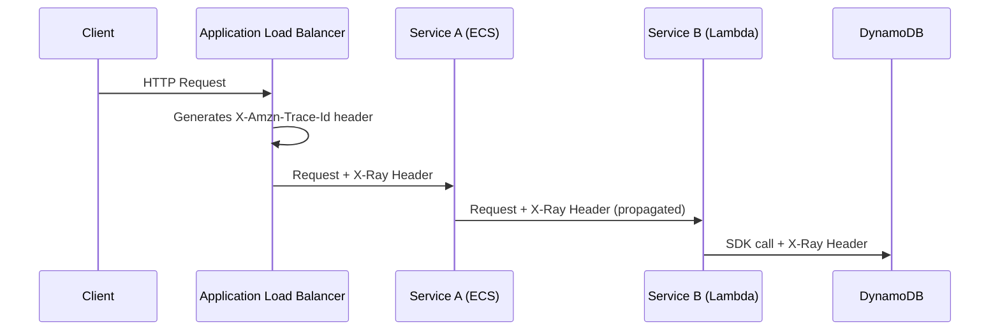

# How to Handle Context Propagation with AWS X-Ray Format

Author: [nawazdhandala](https://www.github.com/nawazdhandala)

Tags: OpenTelemetry, AWS X-Ray, Context Propagation, Distributed Tracing, AWS

Description: Learn how to configure OpenTelemetry to propagate trace context using the AWS X-Ray format across your services and AWS-managed infrastructure.

---

If you run services on AWS, you have probably encountered X-Ray trace headers showing up in your requests. AWS injects these headers automatically through load balancers, API Gateway, and Lambda. When you adopt OpenTelemetry, you need your instrumentation to understand and continue these traces rather than starting new ones. That is what context propagation with the AWS X-Ray format is all about.

This guide walks through setting up OpenTelemetry to read, write, and forward trace context in the X-Ray header format. We will cover the header structure, SDK configuration for multiple languages, and how to run both W3C Trace Context and X-Ray formats side by side.

## Understanding the X-Ray Trace Header

AWS X-Ray uses a custom HTTP header called `X-Amzn-Trace-Id` to carry trace context between services. The format looks like this:

```
X-Amzn-Trace-Id: Root=1-65a8c9d2-0abcdef1234567890abcdef0;Parent=53995c3f42cd8ad8;Sampled=1
```

Breaking this apart:

- **Root** contains the trace ID. The `1-` prefix is a version indicator. The next 8 hex characters represent a Unix epoch timestamp, and the remaining 24 hex characters are a unique identifier. Together they form a 32-character trace ID that maps directly to the OpenTelemetry trace ID.
- **Parent** is a 16-character hex string representing the parent span ID.
- **Sampled** is either `1` (sampled) or `0` (not sampled), controlling whether downstream services should record trace data.

The key thing to understand is that OpenTelemetry trace IDs and X-Ray trace IDs are compatible. They are both 128-bit identifiers. The only difference is formatting: X-Ray splits the trace ID with dashes and a version prefix.

## How AWS Services Inject the Header

Before diving into configuration, it helps to see where these headers come from in a typical AWS setup.



AWS Application Load Balancers, API Gateway, and other managed services automatically generate or forward the `X-Amzn-Trace-Id` header. If your services do not propagate this header, you end up with broken traces where the ALB sees one trace and your backend starts a completely separate one.

## Configuring the X-Ray Propagator in Node.js

The OpenTelemetry JavaScript SDK has a dedicated package for X-Ray propagation. Start by installing the required dependencies.

```bash
# Install the core OpenTelemetry packages along with the AWS X-Ray propagator
npm install @opentelemetry/sdk-node \
  @opentelemetry/api \
  @opentelemetry/auto-instrumentations-node \
  @opentelemetry/propagator-aws-xray
```

Now configure the SDK to use the X-Ray propagator.

```javascript
// tracing.js - OpenTelemetry setup with AWS X-Ray context propagation
const { NodeSDK } = require('@opentelemetry/sdk-node');
const { getNodeAutoInstrumentations } = require('@opentelemetry/auto-instrumentations-node');
const { AWSXRayPropagator } = require('@opentelemetry/propagator-aws-xray');
const { OTLPTraceExporter } = require('@opentelemetry/exporter-trace-otlp-grpc');
const { CompositePropagator, W3CTraceContextPropagator } = require('@opentelemetry/core');

// Use a composite propagator to handle both W3C and X-Ray formats.
// This lets your services work with AWS-managed infrastructure
// and non-AWS services at the same time.
const propagator = new CompositePropagator({
  propagators: [
    new W3CTraceContextPropagator(),
    new AWSXRayPropagator(),
  ],
});

const sdk = new NodeSDK({
  // The composite propagator reads and writes both header formats
  textMapPropagator: propagator,
  traceExporter: new OTLPTraceExporter({
    url: 'http://localhost:4317',
  }),
  instrumentations: [getNodeAutoInstrumentations()],
});

sdk.start();
```

The `CompositePropagator` is the important piece here. When extracting context from an incoming request, it tries each propagator in order. When injecting context into an outgoing request, it writes headers for all propagators. This means your outgoing requests will carry both `traceparent` (W3C) and `X-Amzn-Trace-Id` (X-Ray) headers.

## Configuring the X-Ray Propagator in Python

The Python setup follows the same pattern. Install the propagator package and wire it into the SDK.

```bash
# Install OpenTelemetry SDK and the AWS X-Ray propagator extension
pip install opentelemetry-sdk \
  opentelemetry-propagator-aws-xray \
  opentelemetry-exporter-otlp \
  opentelemetry-instrumentation
```

```python
# tracing_setup.py - Configure OpenTelemetry with X-Ray propagation
from opentelemetry import trace
from opentelemetry.sdk.trace import TracerProvider
from opentelemetry.sdk.trace.export import BatchSpanProcessor
from opentelemetry.exporter.otlp.proto.grpc.trace_exporter import OTLPSpanExporter
from opentelemetry.propagators.aws import AwsXRayPropagator
from opentelemetry.propagate import set_global_textmap
from opentelemetry.propagators.composite import CompositePropagator
from opentelemetry.trace.propagation import TraceContextTextMapPropagator

# Build a composite propagator that understands both formats.
# The order matters for extraction: the first propagator that
# finds valid context wins.
composite_propagator = CompositePropagator([
    TraceContextTextMapPropagator(),
    AwsXRayPropagator(),
])

# Register the composite propagator globally so all instrumentation
# libraries use it automatically
set_global_textmap(composite_propagator)

# Set up the tracer provider with OTLP export
provider = TracerProvider()
processor = BatchSpanProcessor(OTLPSpanExporter(endpoint="http://localhost:4317"))
provider.add_span_processor(processor)
trace.set_tracer_provider(provider)
```

With this configuration, Flask, Django, FastAPI, and other instrumented frameworks will automatically extract the X-Ray header from incoming requests and inject it into outgoing HTTP calls.

## Configuring the X-Ray Propagator in Java

For Java services, you add the X-Ray propagator through the OpenTelemetry Java agent or SDK.

```xml
<!-- Add to your pom.xml alongside the OpenTelemetry SDK dependencies -->
<dependency>
    <groupId>io.opentelemetry.contrib</groupId>
    <artifactId>opentelemetry-aws-xray-propagator</artifactId>
    <version>1.37.0-alpha</version>
</dependency>
```

If you are using the Java agent (the most common approach for Java services), you can configure the propagator through environment variables without changing code.

```bash
# Set the propagators via environment variable.
# Comma-separated list tells the agent which propagators to load.
# "tracecontext" is W3C Trace Context, "xray" is AWS X-Ray.
export OTEL_PROPAGATORS=tracecontext,xray

# Point the agent at your collector
export OTEL_EXPORTER_OTLP_ENDPOINT=http://localhost:4317

# Launch your Java application with the agent attached
java -javaagent:opentelemetry-javaagent.jar -jar myapp.jar
```

The `OTEL_PROPAGATORS` environment variable works across all OpenTelemetry SDKs. You can use it in Node.js and Python too, which is handy when you want to keep propagator configuration outside your application code.

## Handling the X-Ray ID Generator

There is a subtle but important detail about trace ID generation. AWS X-Ray expects the first 8 characters of the trace ID (after the version prefix) to be a valid Unix timestamp. Standard OpenTelemetry ID generators produce fully random 128-bit trace IDs, which X-Ray will reject.

If your service is the one starting traces (not receiving them from an ALB or API Gateway), you need to use an X-Ray-compatible ID generator.

```javascript
// Use the X-Ray ID generator when your service originates traces
const { AWSXRayIdGenerator } = require('@opentelemetry/id-generator-aws-xray');
const { NodeSDK } = require('@opentelemetry/sdk-node');
const { AWSXRayPropagator } = require('@opentelemetry/propagator-aws-xray');

const sdk = new NodeSDK({
  textMapPropagator: new AWSXRayPropagator(),
  // The X-Ray ID generator embeds a timestamp in the trace ID,
  // which X-Ray requires for proper trace correlation and TTL
  idGenerator: new AWSXRayIdGenerator(),
  // ... other configuration
});
```

Without this generator, traces that start in your service will have random trace IDs. These traces will propagate just fine through OpenTelemetry, but they will appear as invalid or missing in the AWS X-Ray console.

## Collector Configuration for X-Ray Export

If you want to send traces to AWS X-Ray as a backend (alongside or instead of your primary observability platform), configure the OpenTelemetry Collector with the AWS X-Ray exporter.

```yaml
# collector-config.yaml
receivers:
  otlp:
    protocols:
      grpc:
        endpoint: 0.0.0.0:4317
      http:
        endpoint: 0.0.0.0:4318

processors:
  batch:
    # Batch spans before sending to reduce API calls
    timeout: 5s
    send_batch_size: 50

exporters:
  # Send traces to AWS X-Ray
  awsxray:
    region: us-east-1
    # The exporter handles converting OTLP spans to X-Ray segments
    # including trace ID format conversion

  # Also send to your primary backend
  otlp:
    endpoint: your-backend:4317

service:
  pipelines:
    traces:
      receivers: [otlp]
      processors: [batch]
      exporters: [awsxray, otlp]
```

The `awsxray` exporter handles the conversion between OpenTelemetry span format and X-Ray segment format. It also takes care of trace ID format differences, so you do not need to worry about that at the application level.

## Testing Your Propagation Setup

A quick way to verify everything works is to send a request with an X-Ray header and check that the trace ID carries through.

```bash
# Send a test request with an X-Ray trace header to your service
curl -H "X-Amzn-Trace-Id: Root=1-65a8c9d2-0abcdef1234567890abcdef0;Parent=53995c3f42cd8ad8;Sampled=1" \
  http://localhost:8080/api/test
```

In your trace backend, look for a trace with ID `65a8c9d20abcdef1234567890abcdef0` (the X-Ray root without dashes or version prefix). If the trace appears with spans from your service, propagation is working correctly.

## Common Pitfalls

A few things that trip people up when working with X-Ray propagation:

First, make sure your services are not stripping unknown headers. Some reverse proxies and API frameworks drop headers they do not recognize. The `X-Amzn-Trace-Id` header must pass through untouched to reach your application.

Second, watch out for double instrumentation. If you have both the AWS X-Ray SDK and OpenTelemetry running in the same service, they will compete for the same headers and produce confusing results. Pick one and remove the other.

Third, remember that the X-Ray propagator only handles the `X-Amzn-Trace-Id` header. It does not carry baggage or other context. If you need to propagate additional context (like user IDs or feature flags), use W3C Baggage alongside the X-Ray propagator.

## Wrapping Up

Handling X-Ray context propagation with OpenTelemetry comes down to three things: installing the right propagator package, using a composite propagator so you support both W3C and X-Ray formats, and remembering to use the X-Ray ID generator when your service starts traces. With these pieces in place, your OpenTelemetry-instrumented services will participate seamlessly in traces that flow through AWS-managed infrastructure.
