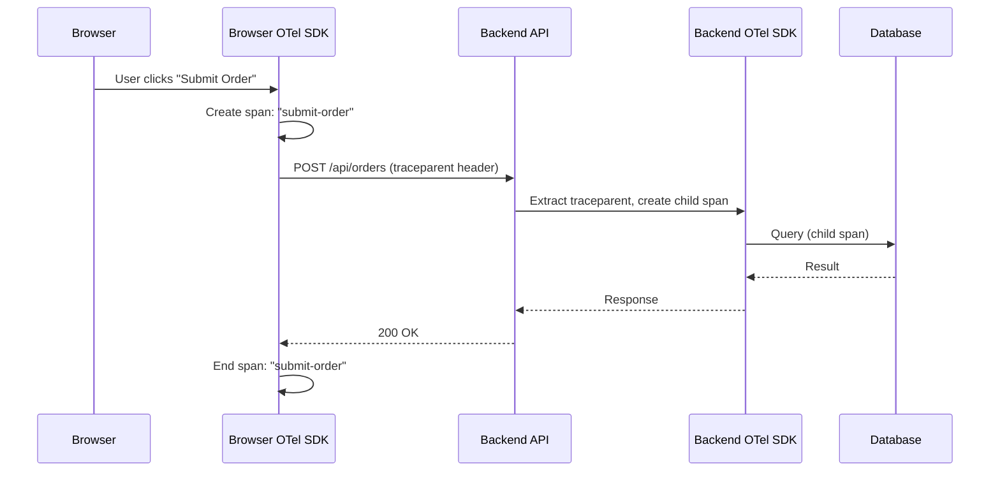

# How to Handle Context Propagation in Browser-to-Server Traces

Author: [nawazdhandala](https://www.github.com/nawazdhandala)

Tags: OpenTelemetry, Browser, Frontend, Context Propagation, Distributed Tracing, Web Performance

Description: Learn how to connect browser-side OpenTelemetry traces to backend spans using context propagation over HTTP requests and fetch calls.

---

When a user clicks a button in your web application and something takes too long, you want to see the full picture. What happened in the browser? How long did the API call take? Which backend services were involved? Without context propagation between the browser and server, you end up with two separate traces that you have to manually correlate by timestamp.

This guide shows you how to set up OpenTelemetry in the browser, propagate trace context to your backend through HTTP headers, handle CORS, and connect the dots into a single end-to-end trace.

## How Browser-to-Server Propagation Works

The browser SDK creates a span when the user triggers an action. When that action results in a fetch or XMLHttpRequest call, the SDK injects the `traceparent` header (W3C Trace Context format) into the outgoing request. Your backend extracts that header and creates child spans under the same trace.



The `traceparent` header is the bridge. It carries the trace ID, parent span ID, and sampling decision from the browser to the server. Everything hinges on this header making it through.

## Setting Up the Browser SDK

Start by installing the OpenTelemetry web packages. You need the core SDK, the fetch instrumentation (which handles context injection), and an exporter.

```bash
# Install browser-specific OpenTelemetry packages
npm install @opentelemetry/sdk-trace-web \
  @opentelemetry/instrumentation-fetch \
  @opentelemetry/instrumentation-xml-http-request \
  @opentelemetry/context-zone \
  @opentelemetry/exporter-trace-otlp-http \
  @opentelemetry/resources \
  @opentelemetry/semantic-conventions
```

Now set up the tracer provider with fetch instrumentation.

```javascript
// browser-tracing.js - OpenTelemetry setup for browser applications
import { WebTracerProvider } from '@opentelemetry/sdk-trace-web';
import { BatchSpanProcessor } from '@opentelemetry/sdk-trace-base';
import { OTLPTraceExporter } from '@opentelemetry/exporter-trace-otlp-http';
import { FetchInstrumentation } from '@opentelemetry/instrumentation-fetch';
import { XMLHttpRequestInstrumentation } from '@opentelemetry/instrumentation-xml-http-request';
import { ZoneContextManager } from '@opentelemetry/context-zone';
import { registerInstrumentations } from '@opentelemetry/instrumentation';
import { Resource } from '@opentelemetry/resources';
import { ATTR_SERVICE_NAME } from '@opentelemetry/semantic-conventions';
import { W3CTraceContextPropagator } from '@opentelemetry/core';
import { propagation } from '@opentelemetry/api';

// Register the W3C propagator so fetch instrumentation
// knows how to inject trace headers
propagation.setGlobalPropagator(new W3CTraceContextPropagator());

const provider = new WebTracerProvider({
  resource: new Resource({
    [ATTR_SERVICE_NAME]: 'frontend-web',
  }),
});

// Export spans to your collector via OTLP/HTTP.
// The browser cannot use gRPC, so use the HTTP exporter.
provider.addSpanProcessor(
  new BatchSpanProcessor(
    new OTLPTraceExporter({
      url: 'https://otel-collector.example.com/v1/traces',
    })
  )
);

// The ZoneContextManager uses Zone.js to maintain context
// across async operations in the browser. Without it,
// context gets lost when promises resolve.
provider.register({
  contextManager: new ZoneContextManager(),
});

// Register auto-instrumentation for fetch and XHR.
// This is where the magic happens: these instrumentations
// automatically inject traceparent into outgoing requests.
registerInstrumentations({
  instrumentations: [
    new FetchInstrumentation({
      // Only propagate context to your own domains.
      // Never send trace headers to third-party APIs.
      propagateTraceHeaderCorsUrls: [
        /https:\/\/api\.example\.com\/.*/,
        /https:\/\/.*\.example\.com\/api\/.*/,
      ],
    }),
    new XMLHttpRequestInstrumentation({
      propagateTraceHeaderCorsUrls: [
        /https:\/\/api\.example\.com\/.*/,
      ],
    }),
  ],
});
```

The `propagateTraceHeaderCorsUrls` option is critical. It tells the fetch instrumentation which URLs should receive the `traceparent` header. You want to restrict this to your own API domains. Sending trace headers to third-party services is a privacy concern and will likely be blocked by CORS anyway.

## The ZoneContextManager Explained

Browsers do not have the async context tracking that Node.js provides through `AsyncLocalStorage`. The `ZoneContextManager` uses Zone.js (the same library Angular uses) to patch async APIs and maintain context through promise chains, setTimeout callbacks, and event handlers.

```javascript
// Without ZoneContextManager, context is lost after await
import { trace, context } from '@opentelemetry/api';

const tracer = trace.getTracer('frontend');

async function submitOrder(orderData) {
  // Start a span for the entire order submission flow
  return tracer.startActiveSpan('submit-order', async (span) => {
    try {
      // This fetch call happens inside the span context.
      // The fetch instrumentation will see the active span
      // and inject traceparent into the request headers.
      const response = await fetch('https://api.example.com/orders', {
        method: 'POST',
        headers: { 'Content-Type': 'application/json' },
        body: JSON.stringify(orderData),
      });

      if (!response.ok) {
        span.setStatus({ code: 2, message: 'Order submission failed' });
      }

      return response.json();
    } catch (error) {
      span.recordException(error);
      span.setStatus({ code: 2, message: error.message });
      throw error;
    } finally {
      span.end();
    }
  });
}
```

With the `ZoneContextManager` in place, the fetch call inside `submitOrder` correctly picks up the active span context, even though the `await` would normally break context propagation in the browser.

## Configuring CORS on Your Backend

The browser will only send custom headers (like `traceparent`) in cross-origin requests if the server explicitly allows them. This is where most people get stuck. Your backend must be configured to accept and expose the right headers.

```javascript
// Express.js CORS configuration for OpenTelemetry propagation
const express = require('express');
const cors = require('cors');

const app = express();

app.use(cors({
  // Allow requests from your frontend origin
  origin: 'https://app.example.com',

  // Allow the traceparent and tracestate headers in requests.
  // Without this, the browser will strip these headers
  // from preflight requests.
  allowedHeaders: [
    'Content-Type',
    'Authorization',
    'traceparent',
    'tracestate',
    'baggage',
  ],

  // Expose the server timing header so the browser SDK
  // can read backend timing information
  exposedHeaders: [
    'Server-Timing',
  ],
}));
```

For Python backends using FastAPI or Flask, the CORS middleware needs the same configuration.

```python
# FastAPI CORS setup for OpenTelemetry context propagation
from fastapi import FastAPI
from fastapi.middleware.cors import CORSMiddleware

app = FastAPI()

app.add_middleware(
    CORSMiddleware,
    # Specify your frontend origin explicitly.
    # Avoid using "*" because it disables credentials.
    allow_origins=["https://app.example.com"],
    allow_methods=["*"],
    # Include the trace propagation headers
    allow_headers=[
        "Content-Type",
        "Authorization",
        "traceparent",
        "tracestate",
        "baggage",
    ],
    expose_headers=["Server-Timing"],
)
```

If you forget to add `traceparent` to `allow_headers`, the browser will make the request without the header. Your backend will still work, but it will start a new trace instead of continuing the one from the browser. This is a silent failure that is easy to miss.

## Server-Timing Header for Response Correlation

The `Server-Timing` header lets the backend send trace information back to the browser. This is useful because it allows the browser SDK to correlate the outgoing request span with the server-side span, even in cases where response headers are the only available channel.

```javascript
// Express middleware to add Server-Timing header with trace info
const { trace } = require('@opentelemetry/api');

function serverTimingMiddleware(req, res, next) {
  // After the backend SDK creates a span for this request,
  // read the span context and include it in Server-Timing.
  const originalEnd = res.end;
  res.end = function(...args) {
    const span = trace.getActiveSpan();
    if (span) {
      const spanContext = span.spanContext();
      // The Server-Timing header format includes the trace ID
      // and span ID so the browser can link its span to the server span
      res.setHeader(
        'Server-Timing',
        `traceparent;desc="00-${spanContext.traceId}-${spanContext.spanId}-01"`
      );
    }
    originalEnd.apply(this, args);
  };
  next();
}
```

The browser fetch instrumentation can read this header (if it is in `exposedHeaders`) and use it to create a more accurate parent-child relationship between the browser fetch span and the server request span.

## Creating Custom User Interaction Spans

Auto-instrumentation covers fetch and XHR calls, but you often want to trace higher-level user interactions like form submissions, page navigations, or multi-step workflows.

```javascript
// Tracing a multi-step user interaction
import { trace, context } from '@opentelemetry/api';

const tracer = trace.getTracer('frontend');

class CheckoutFlow {
  async start(cart) {
    // This top-level span will be the parent of all
    // fetch calls made during the checkout process
    return tracer.startActiveSpan('checkout-flow', async (flowSpan) => {
      try {
        // Step 1: Validate the cart
        await tracer.startActiveSpan('validate-cart', async (span) => {
          await fetch('https://api.example.com/cart/validate', {
            method: 'POST',
            headers: { 'Content-Type': 'application/json' },
            body: JSON.stringify(cart),
          });
          span.end();
        });

        // Step 2: Process payment
        await tracer.startActiveSpan('process-payment', async (span) => {
          span.setAttribute('payment.method', cart.paymentMethod);
          await fetch('https://api.example.com/payments', {
            method: 'POST',
            headers: { 'Content-Type': 'application/json' },
            body: JSON.stringify(cart.payment),
          });
          span.end();
        });

        // Step 3: Confirm order
        await tracer.startActiveSpan('confirm-order', async (span) => {
          await fetch('https://api.example.com/orders/confirm', {
            method: 'POST',
            headers: { 'Content-Type': 'application/json' },
            body: JSON.stringify({ cartId: cart.id }),
          });
          span.end();
        });

        flowSpan.setStatus({ code: 1 });
      } catch (error) {
        flowSpan.recordException(error);
        flowSpan.setStatus({ code: 2, message: error.message });
        throw error;
      } finally {
        flowSpan.end();
      }
    });
  }
}
```

Each `fetch` call inside these spans automatically inherits the trace context. The backend sees three separate requests, all connected to the same `checkout-flow` trace. This gives you a complete picture of what the user experienced and where time was spent.

## Handling Single-Page Application Route Changes

In SPAs, route changes do not trigger full page loads. You can create spans around route transitions to track navigation timing.

```javascript
// React Router integration for route change tracing
import { trace } from '@opentelemetry/api';
import { useEffect } from 'react';
import { useLocation } from 'react-router-dom';

const tracer = trace.getTracer('frontend-router');

export function RouteTracer() {
  const location = useLocation();

  useEffect(() => {
    // Create a span for each route change.
    // Any fetch calls triggered by components mounting
    // on the new route will be children of this span.
    const span = tracer.startSpan('route-change', {
      attributes: {
        'http.route': location.pathname,
        'navigation.type': 'spa',
      },
    });

    // End the span after the next frame paint,
    // giving data-fetching components time to start their requests
    requestAnimationFrame(() => {
      requestAnimationFrame(() => {
        span.end();
      });
    });
  }, [location.pathname]);

  return null;
}
```

## Common Pitfalls and Debugging Tips

When traces are not connecting between browser and server, check these things in order:

Open your browser developer tools and look at the network tab. Find a request to your API and check if the `traceparent` header is present in the request headers. If it is missing, the issue is on the browser side, likely a `propagateTraceHeaderCorsUrls` mismatch.

If the header is present but your backend still starts a new trace, your backend instrumentation is not extracting the header. Make sure your server framework instrumentation is loaded and the propagator is configured.

If CORS preflight requests are failing, you will see an `OPTIONS` request with an error. This means your backend is not returning the correct `Access-Control-Allow-Headers` response.

You can verify the trace ID matches by logging it on both sides:

```javascript
// Browser side: log the trace ID before sending
const span = trace.getActiveSpan();
console.log('Browser trace ID:', span.spanContext().traceId);
```

```javascript
// Server side: log the trace ID from the incoming request
const span = trace.getActiveSpan();
console.log('Server trace ID:', span.spanContext().traceId);
```

If both log the same trace ID, propagation is working. If the server shows a different trace ID, the header is being lost somewhere in transit.

## Wrapping Up

Browser-to-server context propagation relies on three things working together: the browser SDK injecting `traceparent` headers into fetch/XHR requests, CORS configuration allowing those headers through, and the backend SDK extracting them. Once these pieces are in place, you get unified traces that show you exactly what happened from the moment a user clicked a button to the database query that fulfilled their request. The `propagateTraceHeaderCorsUrls` setting and proper CORS headers are the two most common sticking points, so start your debugging there if traces are not connecting.
