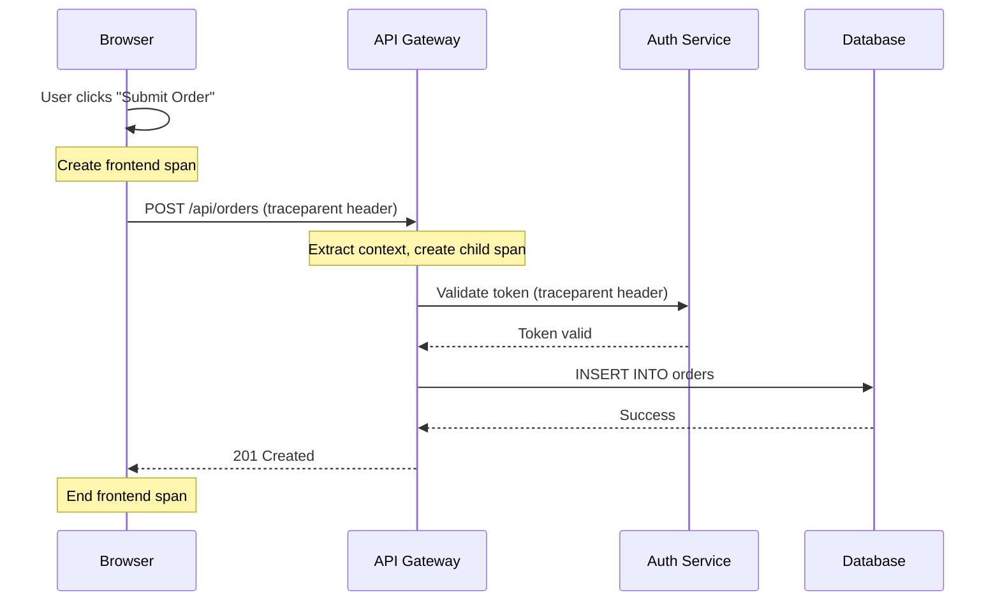
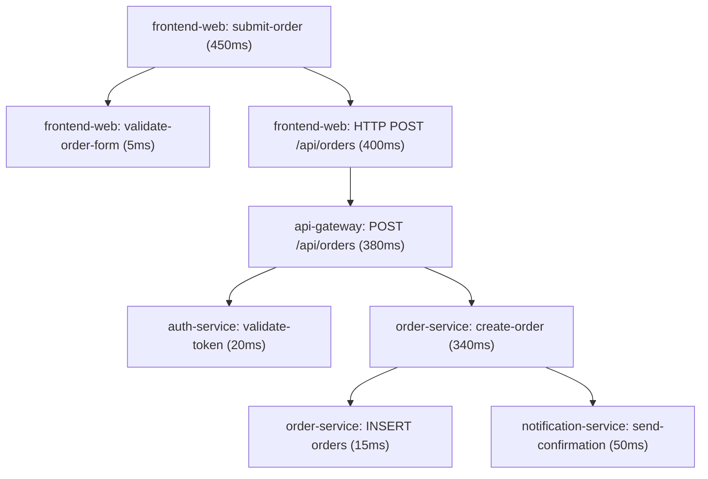

# How to Use Context Propagation Between Frontend and Backend Services

Author: [nawazdhandala](https://www.github.com/nawazdhandala)

Tags: OpenTelemetry, Context Propagation, Frontend, Backend, Distributed Tracing, Browser SDK

Description: Learn how to propagate trace context from browser-based frontend applications to backend services using OpenTelemetry for end-to-end distributed tracing.

---

Most observability setups start at the backend. You instrument your APIs, your databases, and your message queues, and you get traces that show how requests flow through your server-side infrastructure. But the user experience starts in the browser. A page load involves DNS resolution, TLS handshake, resource downloads, JavaScript execution, and then one or more API calls to your backend. If your trace starts at the API gateway, you are missing the first half of the story.

OpenTelemetry provides a browser SDK that lets you trace user interactions from the frontend and propagate the trace context to your backend APIs. This means a single trace can start when a user clicks a button in the browser and continue through your API gateway, your microservices, and your database. This post shows how to set this up end to end.

## How Context Propagation Works

When your frontend makes an API call, the OpenTelemetry browser SDK injects trace context headers into the HTTP request. The backend service extracts those headers and continues the trace. This is the same W3C Trace Context mechanism used between backend services, extended to the browser.



The trace ID is the same from the browser click all the way to the database query. This gives you full visibility into the user experience.

## Setting Up the Browser SDK

Install the OpenTelemetry browser packages:

```bash
# Install the OpenTelemetry web SDK and auto-instrumentations
npm install @opentelemetry/sdk-trace-web \
  @opentelemetry/instrumentation-fetch \
  @opentelemetry/instrumentation-xml-http-request \
  @opentelemetry/context-zone \
  @opentelemetry/exporter-trace-otlp-http \
  @opentelemetry/resources \
  @opentelemetry/semantic-conventions
```

Initialize the SDK in your frontend application:

```javascript
// otel-browser.js
// Initialize OpenTelemetry for the browser. This must run before
// any fetch() or XMLHttpRequest calls to ensure they are instrumented.
import { WebTracerProvider } from '@opentelemetry/sdk-trace-web';
import { BatchSpanProcessor } from '@opentelemetry/sdk-trace-base';
import { OTLPTraceExporter } from '@opentelemetry/exporter-trace-otlp-http';
import { ZoneContextManager } from '@opentelemetry/context-zone';
import { FetchInstrumentation } from '@opentelemetry/instrumentation-fetch';
import { XMLHttpRequestInstrumentation } from '@opentelemetry/instrumentation-xml-http-request';
import { registerInstrumentations } from '@opentelemetry/instrumentation';
import { Resource } from '@opentelemetry/resources';
import { ATTR_SERVICE_NAME } from '@opentelemetry/semantic-conventions';

// Create the trace exporter pointing to your collector or backend
const exporter = new OTLPTraceExporter({
  url: 'https://otel-collector.yourdomain.com/v1/traces',
});

// Configure the tracer provider with the browser-specific context manager
const provider = new WebTracerProvider({
  resource: new Resource({
    [ATTR_SERVICE_NAME]: 'frontend-web',
  }),
});

// Use batch processing to avoid sending a network request per span
provider.addSpanProcessor(new BatchSpanProcessor(exporter, {
  maxQueueSize: 100,
  maxExportBatchSize: 10,
  scheduledDelayMillis: 5000,
}));

// ZoneContextManager uses Zone.js to maintain context across async operations
provider.register({
  contextManager: new ZoneContextManager(),
});

// Instrument fetch and XMLHttpRequest to automatically propagate trace context
registerInstrumentations({
  instrumentations: [
    new FetchInstrumentation({
      // Only propagate context to your own backend domains
      propagateTraceHeaderCorsUrls: [
        /https:\/\/api\.yourdomain\.com/,
        /https:\/\/.*\.yourdomain\.com/,
      ],
    }),
    new XMLHttpRequestInstrumentation({
      propagateTraceHeaderCorsUrls: [
        /https:\/\/api\.yourdomain\.com/,
      ],
    }),
  ],
});
```

The `propagateTraceHeaderCorsUrls` configuration is critical. It controls which domains receive the `traceparent` header. You must restrict this to your own domains. Sending trace context headers to third-party APIs is both a security risk and a protocol violation.

## Handling CORS for Trace Headers

Your backend must accept the `traceparent` and `tracestate` headers in CORS requests. Configure your API to allow these headers:

```javascript
// Express.js CORS configuration for accepting trace context headers.
// Without this, the browser will strip the traceparent header from requests.
const cors = require('cors');

app.use(cors({
  origin: 'https://app.yourdomain.com',
  allowedHeaders: [
    'Content-Type',
    'Authorization',
    'traceparent',
    'tracestate',
    'baggage',
  ],
  // The browser needs to see these headers in the response
  // for the fetch instrumentation to capture response metadata
  exposedHeaders: [
    'Server-Timing',
  ],
}));
```

If you are using the OpenTelemetry Collector as a proxy for browser traces, configure its CORS settings:

```yaml
# Collector CORS configuration for accepting browser traces.
# The browser sends traces directly to the collector via OTLP/HTTP.
receivers:
  otlp:
    protocols:
      http:
        endpoint: 0.0.0.0:4318
        cors:
          allowed_origins:
            - "https://app.yourdomain.com"
            - "https://*.yourdomain.com"
          allowed_headers:
            - "Content-Type"
            - "X-Requested-With"
          max_age: 7200
```

## Creating Custom Frontend Spans

Beyond automatic fetch/XHR instrumentation, create custom spans for user interactions:

```javascript
// Create custom spans for meaningful user interactions.
// These give you visibility into what the user was doing when they
// triggered a backend request.
import { trace, context } from '@opentelemetry/api';

const tracer = trace.getTracer('frontend-web', '1.0.0');

async function handleSubmitOrder(orderData) {
  // Create a span that represents the entire user action
  const span = tracer.startSpan('submit-order', {
    attributes: {
      'user.action': 'submit_order',
      'order.item_count': orderData.items.length,
    },
  });

  // Make the span the active context so that child spans
  // (including the fetch instrumentation) are linked to it
  return context.with(trace.setSpan(context.active(), span), async () => {
    try {
      // Validate the form locally
      const validationSpan = tracer.startSpan('validate-order-form');
      validateOrderForm(orderData);
      validationSpan.end();

      // Call the backend API. The fetch instrumentation will
      // automatically create a child span and inject traceparent.
      const response = await fetch('https://api.yourdomain.com/orders', {
        method: 'POST',
        headers: { 'Content-Type': 'application/json' },
        body: JSON.stringify(orderData),
      });

      if (!response.ok) {
        span.setStatus({ code: 2, message: 'Order submission failed' });
      }

      return response.json();
    } catch (error) {
      span.recordException(error);
      span.setStatus({ code: 2, message: error.message });
      throw error;
    } finally {
      span.end();
    }
  });
}
```

## Backend Context Extraction

On the backend side, most OpenTelemetry auto-instrumentations automatically extract the `traceparent` header from incoming requests. But if you are doing manual instrumentation, here is how to extract the context:

```javascript
// Express middleware that extracts trace context from incoming requests.
// This is usually handled automatically by the HTTP instrumentation,
// but here is the manual approach for reference.
const { propagation, context, trace } = require('@opentelemetry/api');

app.use((req, res, next) => {
  // Extract the trace context from the incoming HTTP headers
  const extractedContext = propagation.extract(context.active(), req.headers);

  // Run the rest of the request handling within the extracted context
  context.with(extractedContext, () => {
    const tracer = trace.getTracer('api-gateway');
    const span = tracer.startSpan(`${req.method} ${req.path}`);

    // Store the span in the request for downstream middleware
    req.span = span;

    res.on('finish', () => {
      span.setAttribute('http.response.status_code', res.statusCode);
      span.end();
    });

    next();
  });
});
```

## Handling Single Page Application Navigation

In SPAs, page navigations happen client-side without full page reloads. Create spans for route changes:

```javascript
// Track SPA route changes as spans.
// This gives you visibility into navigation performance.
import { trace } from '@opentelemetry/api';

const tracer = trace.getTracer('frontend-web');

// For React Router
function useRouteTracing() {
  const location = useLocation();

  useEffect(() => {
    const span = tracer.startSpan('route-change', {
      attributes: {
        'route.path': location.pathname,
        'route.search': location.search,
      },
    });

    // End the span after the component has rendered
    requestAnimationFrame(() => {
      requestAnimationFrame(() => {
        span.end();
      });
    });
  }, [location.pathname]);
}
```

## Sampling Strategy for Frontend Traces

Frontend applications generate far more telemetry than backend services because every user interaction is a potential trace. Use a sampling strategy that keeps costs manageable:

```javascript
// Configure a sampler that reduces the volume of frontend traces.
// Use parent-based sampling so that if the backend decides to sample
// a trace, the frontend follows along.
import { ParentBasedSampler, TraceIdRatioBasedSampler } from '@opentelemetry/sdk-trace-base';

const provider = new WebTracerProvider({
  resource: new Resource({
    [ATTR_SERVICE_NAME]: 'frontend-web',
  }),
  sampler: new ParentBasedSampler({
    // Sample 10% of new traces originating from the frontend
    root: new TraceIdRatioBasedSampler(0.1),
  }),
});
```

## The Resulting Trace

With everything connected, a single trace tells the complete story:



You can see every step from the user clicking "Submit Order" to the database insert and notification. This is the power of end-to-end context propagation.

## Conclusion

Context propagation between frontend and backend closes the biggest gap in most observability setups. The OpenTelemetry browser SDK handles the heavy lifting of injecting trace context into fetch and XHR requests, and backend auto-instrumentations extract it automatically. The main things to get right are CORS configuration (so the browser is allowed to send and receive trace headers), URL filtering (so you only propagate context to your own domains), and sampling (so you do not drown in frontend telemetry). Once these pieces are in place, you get traces that span the entire user experience from click to database.
