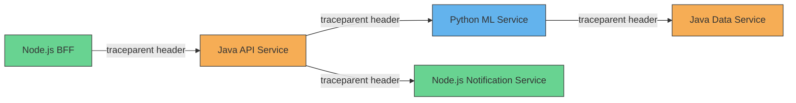
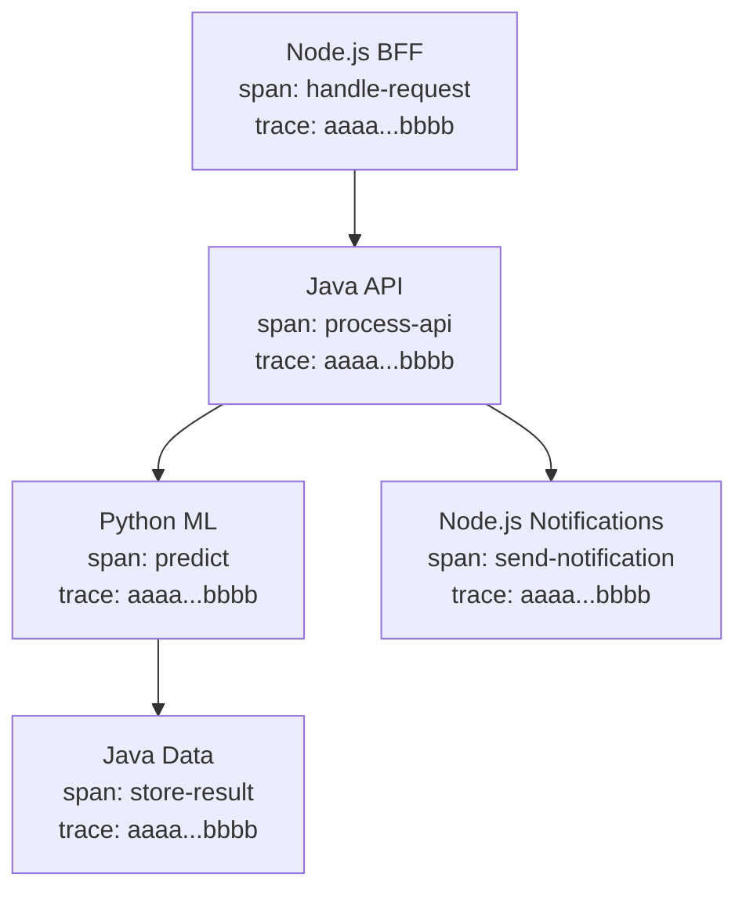

# How to Configure Context Propagation in Mixed Java/Python/Node.js Systems

Author: [nawazdhandala](https://www.github.com/nawazdhandala)

Tags: OpenTelemetry, Context Propagation, Java, Python, Node.js, Distributed Tracing, Polyglot

Description: Learn how to configure consistent OpenTelemetry context propagation across services written in Java, Python, and Node.js for unified distributed traces.

---

Most production systems are not written in a single language. You might have a Java API gateway, Python machine learning services, and Node.js BFF (backend-for-frontend) layers all working together. Each language has its own OpenTelemetry SDK with slightly different configuration patterns, default behaviors, and package names. Getting context propagation right across all of them is the difference between seeing a unified trace and seeing disconnected fragments.

This guide walks through configuring each SDK so they all speak the same propagation format, handle edge cases consistently, and produce traces that connect cleanly across language boundaries.

## The Propagation Compatibility Problem

Each OpenTelemetry SDK defaults to the W3C Trace Context propagator, which is great because it means they should work together out of the box. In practice, things are not always that simple. Teams often add extra propagators for backward compatibility with Jaeger or Zipkin headers, configure them in inconsistent orders, or forget to configure them at all in one service.



The colors in this diagram represent different languages. Every arrow is an HTTP call that must carry the `traceparent` header. If any one of these services fails to extract or inject that header, the trace breaks at that point.

## Establishing a Propagation Standard

Before touching any code, agree on which propagators every service must support. A solid default for most organizations is:

1. **W3C Trace Context** (`traceparent` and `tracestate` headers) as the primary format
2. **W3C Baggage** (`baggage` header) for cross-service context like tenant IDs or feature flags

That is it. Unless you have a specific need for Jaeger or Zipkin header formats (because you are migrating from those systems), stick with W3C. All three SDKs support it natively, and it is the industry standard.

You can enforce this through a single environment variable that works across all SDKs:

```bash
# Set this in your deployment configuration for every service,
# regardless of language. All OpenTelemetry SDKs read this variable.
export OTEL_PROPAGATORS=tracecontext,baggage
```

This is the simplest approach. Set it once in your Kubernetes deployment template or Docker Compose file, and every service picks it up.

## Node.js Configuration

For Node.js services, context propagation usually works with minimal setup when you use the SDK. Here is a complete configuration.

```javascript
// tracing.js - Node.js OpenTelemetry setup with explicit propagation
const { NodeSDK } = require('@opentelemetry/sdk-node');
const { getNodeAutoInstrumentations } = require('@opentelemetry/auto-instrumentations-node');
const { OTLPTraceExporter } = require('@opentelemetry/exporter-trace-otlp-grpc');
const {
  CompositePropagator,
  W3CTraceContextPropagator,
  W3CBaggagePropagator,
} = require('@opentelemetry/core');

// Explicitly set propagators rather than relying on defaults.
// This makes the configuration self-documenting and ensures
// consistency across your Node.js services.
const propagator = new CompositePropagator({
  propagators: [
    new W3CTraceContextPropagator(),
    new W3CBaggagePropagator(),
  ],
});

const sdk = new NodeSDK({
  textMapPropagator: propagator,
  traceExporter: new OTLPTraceExporter({
    url: process.env.OTEL_EXPORTER_OTLP_ENDPOINT || 'http://localhost:4317',
  }),
  instrumentations: [
    getNodeAutoInstrumentations({
      // The HTTP instrumentation handles injecting/extracting
      // trace headers automatically for all http/https calls
      '@opentelemetry/instrumentation-http': {
        enabled: true,
      },
    }),
  ],
  serviceName: process.env.OTEL_SERVICE_NAME || 'node-service',
});

sdk.start();
```

The `getNodeAutoInstrumentations` package includes HTTP instrumentation that automatically injects `traceparent` into outgoing requests and extracts it from incoming ones. You do not need to touch request headers manually for standard HTTP calls.

One thing to watch out for in Node.js: if you use a library like `axios` with custom interceptors that modify headers, make sure your interceptors do not accidentally overwrite or remove the `traceparent` header.

## Java Configuration

Java has two common approaches: the auto-instrumentation agent and manual SDK setup. The agent is more popular because it requires zero code changes.

### Using the Java Agent

```bash
# Launch the Java service with the OpenTelemetry agent.
# The agent auto-instruments common libraries like Spring,
# JAX-RS, JDBC, and HTTP clients.
java \
  -javaagent:/opt/opentelemetry-javaagent.jar \
  -Dotel.service.name=java-api-service \
  -Dotel.propagators=tracecontext,baggage \
  -Dotel.exporter.otlp.endpoint=http://localhost:4317 \
  -jar api-service.jar
```

The `otel.propagators` system property does the same thing as the `OTEL_PROPAGATORS` environment variable. Use whichever fits better with your deployment tooling.

### Using the SDK Directly

If you need programmatic control (for example, in a Spring Boot application where you want to register custom components), configure the SDK in code.

```java
// TracingConfig.java - Spring Boot OpenTelemetry configuration
import io.opentelemetry.api.OpenTelemetry;
import io.opentelemetry.api.trace.propagation.W3CTraceContextPropagator;
import io.opentelemetry.api.baggage.propagation.W3CBaggagePropagator;
import io.opentelemetry.context.propagation.ContextPropagators;
import io.opentelemetry.context.propagation.TextMapPropagator;
import io.opentelemetry.exporter.otlp.trace.OtlpGrpcSpanExporter;
import io.opentelemetry.sdk.OpenTelemetrySdk;
import io.opentelemetry.sdk.trace.SdkTracerProvider;
import io.opentelemetry.sdk.trace.export.BatchSpanProcessor;
import io.opentelemetry.sdk.resources.Resource;
import io.opentelemetry.semconv.ResourceAttributes;
import org.springframework.context.annotation.Bean;
import org.springframework.context.annotation.Configuration;

@Configuration
public class TracingConfig {

    @Bean
    public OpenTelemetry openTelemetry() {
        // Build the resource with service name
        Resource resource = Resource.getDefault()
            .merge(Resource.create(
                io.opentelemetry.api.common.Attributes.of(
                    ResourceAttributes.SERVICE_NAME, "java-api-service"
                )
            ));

        // Configure the span exporter
        OtlpGrpcSpanExporter exporter = OtlpGrpcSpanExporter.builder()
            .setEndpoint("http://localhost:4317")
            .build();

        // Build the tracer provider
        SdkTracerProvider tracerProvider = SdkTracerProvider.builder()
            .setResource(resource)
            .addSpanProcessor(BatchSpanProcessor.builder(exporter).build())
            .build();

        // Create a composite propagator with W3C Trace Context and Baggage.
        // This must match what your Node.js and Python services use.
        TextMapPropagator propagator = TextMapPropagator.composite(
            W3CTraceContextPropagator.getInstance(),
            W3CBaggagePropagator.getInstance()
        );

        return OpenTelemetrySdk.builder()
            .setTracerProvider(tracerProvider)
            .setPropagators(ContextPropagators.create(propagator))
            .buildAndRegisterGlobal();
    }
}
```

A common gotcha with Java: if you are using Spring Cloud Gateway or similar proxy frameworks, make sure the proxy forwards the `traceparent` and `tracestate` headers. Some gateway configurations strip unrecognized headers by default.

## Python Configuration

Python services need the OpenTelemetry SDK and the appropriate instrumentation packages for your framework.

```bash
# Install core SDK plus common instrumentations
pip install opentelemetry-sdk \
  opentelemetry-exporter-otlp \
  opentelemetry-instrumentation-flask \
  opentelemetry-instrumentation-requests \
  opentelemetry-instrumentation-fastapi
```

```python
# tracing_setup.py - Python OpenTelemetry configuration
from opentelemetry import trace, propagate
from opentelemetry.sdk.trace import TracerProvider
from opentelemetry.sdk.trace.export import BatchSpanProcessor
from opentelemetry.exporter.otlp.proto.grpc.trace_exporter import OTLPSpanExporter
from opentelemetry.sdk.resources import Resource, SERVICE_NAME
from opentelemetry.propagators.composite import CompositePropagator
from opentelemetry.trace.propagation import TraceContextTextMapPropagator
from opentelemetry.baggage.propagation import W3CBaggagePropagator

def configure_tracing(service_name: str):
    """Set up OpenTelemetry with consistent propagation configuration."""

    resource = Resource.create({SERVICE_NAME: service_name})

    # Create the tracer provider
    provider = TracerProvider(resource=resource)
    provider.add_span_processor(
        BatchSpanProcessor(OTLPSpanExporter(endpoint="localhost:4317"))
    )
    trace.set_tracer_provider(provider)

    # Configure the same propagators as Java and Node.js.
    # The order should be consistent across all services,
    # though in practice the order only matters when multiple
    # propagators could match the same header.
    propagator = CompositePropagator([
        TraceContextTextMapPropagator(),
        W3CBaggagePropagator(),
    ])
    propagate.set_global_textmap(propagator)
```

Then in your Flask or FastAPI application, wire up the instrumentation.

```python
# app.py - Flask application with OpenTelemetry instrumentation
from flask import Flask
from opentelemetry.instrumentation.flask import FlaskInstrumentor
from opentelemetry.instrumentation.requests import RequestsInstrumentor
from tracing_setup import configure_tracing

# Initialize tracing before creating the app
configure_tracing("python-ml-service")

app = Flask(__name__)

# FlaskInstrumentor automatically extracts traceparent from
# incoming requests and creates server spans
FlaskInstrumentor().instrument_app(app)

# RequestsInstrumentor automatically injects traceparent into
# outgoing requests made with the requests library
RequestsInstrumentor().instrument()

@app.route("/predict", methods=["POST"])
def predict():
    # Any outgoing HTTP call from this handler will
    # automatically carry the trace context forward
    import requests
    result = run_model_inference(request.json)

    # This call to the Java data service will include traceparent
    requests.post("http://java-data-service:8080/store", json=result)

    return {"prediction": result}
```

A Python-specific issue to watch for: if you use `httpx` instead of `requests`, you need `opentelemetry-instrumentation-httpx`. Each HTTP library needs its own instrumentation package.

## Propagating Baggage Across All Languages

Baggage lets you attach key-value pairs to the trace context that propagate through all services. This is useful for things like tenant IDs, request priorities, or A/B test variants.

```javascript
// Node.js: Setting baggage that will propagate to Java and Python
const { propagation, context, baggage } = require('@opentelemetry/api');

function handleRequest(req, res) {
  // Create a baggage entry for the tenant ID.
  // This will be included in the baggage header on all
  // outgoing requests from this context.
  const tenantBaggage = propagation.createBaggage({
    'tenant.id': { value: req.headers['x-tenant-id'] },
    'request.priority': { value: 'high' },
  });

  // Activate the baggage in the current context
  const ctx = propagation.setBaggage(context.active(), tenantBaggage);

  context.with(ctx, () => {
    // All downstream calls from here will carry the baggage
    processRequest(req, res);
  });
}
```

```python
# Python: Reading baggage set by the Node.js service
from opentelemetry import baggage, context

def process_prediction(request_data):
    # The baggage was automatically extracted from the incoming
    # request headers by the Flask instrumentation
    tenant_id = baggage.get_baggage("tenant.id")
    priority = baggage.get_baggage("request.priority")

    if priority == "high":
        # Route to the fast model
        return run_fast_model(request_data, tenant_id)
    else:
        return run_standard_model(request_data, tenant_id)
```

Baggage propagation works because all three SDKs are configured with the `W3CBaggagePropagator`. The Node.js service sets the baggage, the baggage header flows through the Java service (which forwards it even if it does not read it), and the Python service reads it.

## Testing Cross-Language Propagation

Here is a practical approach to verifying that propagation works across all your services.

```bash
# Send a request to the Node.js entry point with a known trace ID.
# Using a pre-set traceparent lets you search for this exact trace.
curl -H "traceparent: 00-aaaabbbbccccddddeeeeffffaaaabbbb-1234567890abcdef-01" \
  -H "baggage: tenant.id=test-tenant,request.priority=high" \
  -H "Content-Type: application/json" \
  -d '{"input": "test data"}' \
  http://localhost:3000/api/process
```

After sending this request, search your trace backend for trace ID `aaaabbbbccccddddeeeeffffaaaabbbb`. You should see spans from all three services under the same trace. If a service is missing, that is where propagation is breaking.



All five services share the same trace ID. If any one of them shows a different trace ID, that service is not extracting the incoming context correctly.

## Common Issues and Fixes

A few patterns that cause problems in polyglot environments:

If your Java service uses RestTemplate and you see trace breaks, make sure Spring Web MVC instrumentation is loaded. The agent handles this automatically, but manual SDK setups sometimes miss it.

If your Python service uses async frameworks like FastAPI with `httpx`, the synchronous `requests` instrumentation will not help. Install `opentelemetry-instrumentation-httpx` and instrument it separately.

If baggage is not flowing through, check that all services have the baggage propagator configured. A service without the baggage propagator will still forward the `baggage` header if it uses auto-instrumentation (because the HTTP instrumentation typically forwards all headers), but it will not be able to read or modify the baggage values.

Watch header size limits. If you put too much data in baggage, the `baggage` header can grow large enough to hit proxy or load balancer header size limits (often 8KB). Keep baggage values small and use them for identifiers, not full data payloads.

## Wrapping Up

Getting context propagation right in a mixed-language system comes down to consistency. Every service needs the same set of propagators configured. The simplest way to achieve this is the `OTEL_PROPAGATORS=tracecontext,baggage` environment variable, which works across Java, Python, and Node.js. Beyond that, make sure each service has HTTP client instrumentation that handles injection and server framework instrumentation that handles extraction. Test with a known trace ID to verify the chain end to end, and fix breaks one service at a time.
