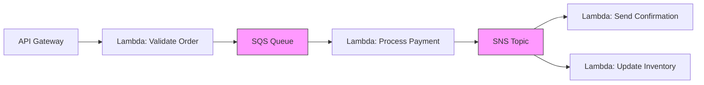

# How to Propagate Context Through Serverless Function Chains

Author: [nawazdhandala](https://www.github.com/nawazdhandala)

Tags: OpenTelemetry, Serverless, Context Propagation, AWS Lambda, Distributed Tracing

Description: Learn how to maintain distributed trace context across chains of serverless functions using OpenTelemetry propagation techniques.

---

Serverless functions are great for building loosely coupled architectures. One function triggers another through a queue, an API call, or an event bridge rule, and each function handles its own piece of work independently. The problem shows up when something goes wrong and you need to trace a request across a chain of five or six functions. Without context propagation, each function appears as an isolated trace with no connection to the others.

This guide covers practical approaches to propagating OpenTelemetry trace context through serverless function chains. We will work through direct invocations, event-driven chains using SQS and SNS, and Step Functions orchestrations.

## The Serverless Tracing Problem

In a traditional microservices setup, HTTP headers carry trace context from one service to the next. Serverless functions break this model because they often communicate through intermediary services like message queues, event buses, and orchestration engines. These intermediaries do not always forward custom headers or metadata.



The pink nodes in this diagram are the places where trace context gets lost. SQS and SNS do not automatically propagate trace headers. You need to manually inject context into message attributes and extract it on the other side.

## Setting Up OpenTelemetry in Lambda Functions

Before tackling propagation, let us establish a solid base configuration for Lambda functions. The OpenTelemetry Lambda layer handles most of the setup.

```bash
# Add the OpenTelemetry Lambda layer to your function.
# This layer includes the SDK, auto-instrumentation, and a collector.
aws lambda update-function-configuration \
  --function-name my-function \
  --layers arn:aws:lambda:us-east-1:901920570463:layer:aws-otel-nodejs-amd64-ver-1-18-1:1 \
  --environment "Variables={
    AWS_LAMBDA_EXEC_WRAPPER=/opt/otel-handler,
    OPENTELEMETRY_COLLECTOR_CONFIG_FILE=/var/task/collector.yaml,
    OTEL_PROPAGATORS=tracecontext
  }"
```

For cases where you need more control, you can configure the SDK manually in your function code.

```javascript
// tracing.js - Manual OpenTelemetry setup for Lambda
const { NodeTracerProvider } = require('@opentelemetry/sdk-trace-node');
const { BatchSpanProcessor } = require('@opentelemetry/sdk-trace-base');
const { OTLPTraceExporter } = require('@opentelemetry/exporter-trace-otlp-http');
const { W3CTraceContextPropagator } = require('@opentelemetry/core');
const { propagation, context, trace } = require('@opentelemetry/api');

// Register the W3C propagator globally so we can use it
// for manual injection and extraction
propagation.setGlobalPropagator(new W3CTraceContextPropagator());

const provider = new NodeTracerProvider();
provider.addSpanProcessor(
  new BatchSpanProcessor(new OTLPTraceExporter({
    url: 'http://localhost:4318/v1/traces',
  }))
);
provider.register();

const tracer = trace.getTracer('order-service');
module.exports = { tracer };
```

This gives you a configured tracer and a registered propagator that you can use to manually inject and extract context when communicating through message queues.

## Propagating Context Through SQS

SQS supports message attributes, which give you a place to stash trace context. The trick is injecting the context as message attributes when sending and extracting them when receiving.

```javascript
// send-to-sqs.js - Inject trace context into SQS message attributes
const { propagation, context, trace } = require('@opentelemetry/api');
const { SQSClient, SendMessageCommand } = require('@aws-sdk/client-sqs');

const sqs = new SQSClient({ region: 'us-east-1' });
const tracer = trace.getTracer('order-service');

async function sendOrderToQueue(order) {
  // Start a span for the send operation
  return tracer.startActiveSpan('send-order-to-queue', async (span) => {
    // Create a carrier object to hold the propagation headers.
    // We will convert these into SQS message attributes.
    const carrier = {};
    propagation.inject(context.active(), carrier);

    // Convert the carrier entries into SQS MessageAttributes format.
    // SQS attributes have a specific structure with DataType and StringValue.
    const messageAttributes = {};
    for (const [key, value] of Object.entries(carrier)) {
      messageAttributes[key] = {
        DataType: 'String',
        StringValue: value,
      };
    }

    const command = new SendMessageCommand({
      QueueUrl: process.env.ORDER_QUEUE_URL,
      MessageBody: JSON.stringify(order),
      MessageAttributes: messageAttributes,
    });

    await sqs.send(command);
    span.end();
  });
}
```

On the receiving side, you extract the context from message attributes and use it as the parent for your processing span.

```javascript
// receive-from-sqs.js - Extract trace context from SQS message attributes
const { propagation, context, trace, ROOT_CONTEXT } = require('@opentelemetry/api');

const tracer = trace.getTracer('payment-service');

// This is your Lambda handler that processes SQS messages
exports.handler = async (event) => {
  for (const record of event.Records) {
    // Build a carrier from the SQS message attributes.
    // We need to reverse the transformation we did on the send side.
    const carrier = {};
    if (record.messageAttributes) {
      for (const [key, attr] of Object.entries(record.messageAttributes)) {
        // SQS Lambda trigger uses 'stringValue' (camelCase)
        // while the SDK uses 'StringValue' (PascalCase)
        carrier[key] = attr.stringValue || attr.StringValue;
      }
    }

    // Extract the parent context from the carrier
    const parentContext = propagation.extract(ROOT_CONTEXT, carrier);

    // Start a new span linked to the parent context.
    // This connects our processing span to the original trace.
    await context.with(parentContext, async () => {
      return tracer.startActiveSpan('process-payment', async (span) => {
        const order = JSON.parse(record.body);
        await processPayment(order);
        span.end();
      });
    });
  }
};
```

The key insight here is that `propagation.inject` serializes the current trace context into a plain object, and `propagation.extract` deserializes it back. SQS message attributes are just the transport mechanism between those two operations.

## Propagating Context Through SNS

SNS works similarly to SQS but uses the `MessageAttributes` parameter on the publish call.

```python
# publish_to_sns.py - Inject trace context into SNS message attributes
import json
import boto3
from opentelemetry import trace, context, propagate

tracer = trace.get_tracer("confirmation-service")
sns = boto3.client("sns", region_name="us-east-1")

def publish_order_event(order_data):
    with tracer.start_as_current_span("publish-order-confirmed") as span:
        # Inject current context into a carrier dictionary
        carrier = {}
        propagate.inject(carrier)

        # Convert carrier to SNS MessageAttributes format.
        # SNS requires a DataType field for each attribute.
        message_attributes = {}
        for key, value in carrier.items():
            message_attributes[key] = {
                "DataType": "String",
                "StringValue": value,
            }

        sns.publish(
            TopicArn="arn:aws:sns:us-east-1:123456789:order-events",
            Message=json.dumps(order_data),
            MessageAttributes=message_attributes,
        )
```

When SNS delivers to a Lambda subscriber, the message attributes arrive inside the `Sns` object of each record. The extraction looks slightly different from SQS.

```python
# handle_sns_event.py - Extract trace context from SNS event in Lambda
from opentelemetry import trace, context, propagate

tracer = trace.get_tracer("notification-service")

def handler(event, lambda_context):
    for record in event["Records"]:
        sns_message = record["Sns"]

        # Build carrier from SNS message attributes.
        # The structure nests the value under 'Value' in the SNS event format.
        carrier = {}
        if "MessageAttributes" in sns_message:
            for key, attr in sns_message["MessageAttributes"].items():
                carrier[key] = attr.get("Value", "")

        # Extract and activate the parent context
        parent_ctx = propagate.extract(carrier=carrier)

        with trace.get_tracer_provider().get_tracer(__name__).start_as_current_span(
            "send-confirmation-email",
            context=parent_ctx,
        ) as span:
            message = json.loads(sns_message["Message"])
            send_email(message)
```

## Propagating Context Through Step Functions

AWS Step Functions present a different challenge. You cannot inject headers into state machine transitions because the states communicate through JSON input and output. The approach here is to include trace context in the state input itself.

```javascript
// start-step-function.js - Pass trace context as part of Step Functions input
const { SFNClient, StartExecutionCommand } = require('@aws-sdk/client-sfn');
const { propagation, context, trace } = require('@opentelemetry/api');

const sfn = new SFNClient({ region: 'us-east-1' });
const tracer = trace.getTracer('orchestrator');

async function startOrderWorkflow(order) {
  return tracer.startActiveSpan('start-order-workflow', async (span) => {
    // Inject trace context into a carrier
    const traceContext = {};
    propagation.inject(context.active(), traceContext);

    // Include the trace context alongside the business data.
    // Each step in the state machine will pass this through.
    const input = {
      order: order,
      _traceContext: traceContext,
    };

    await sfn.send(new StartExecutionCommand({
      stateMachineArn: process.env.STATE_MACHINE_ARN,
      input: JSON.stringify(input),
    }));

    span.end();
  });
}
```

Each Lambda function in the Step Functions workflow extracts the context from its input, does its work, and passes the context along in its output.

```javascript
// step-function-task.js - Extract and forward context in a Step Functions task
const { propagation, context, trace, ROOT_CONTEXT } = require('@opentelemetry/api');

const tracer = trace.getTracer('validation-step');

exports.handler = async (event) => {
  // Extract trace context from the Step Functions input
  const parentContext = propagation.extract(
    ROOT_CONTEXT,
    event._traceContext || {}
  );

  return context.with(parentContext, () => {
    return tracer.startActiveSpan('validate-order', (span) => {
      // Do the actual work for this step
      const result = validateOrder(event.order);

      // Re-inject the current context so downstream steps
      // see this span as their parent
      const updatedContext = {};
      propagation.inject(context.active(), updatedContext);

      span.end();

      // Return the result with updated trace context
      return {
        order: event.order,
        validationResult: result,
        _traceContext: updatedContext,
      };
    });
  });
};
```

This pattern works because Step Functions pass the output of one state as the input to the next. By including `_traceContext` in every output, the trace context flows through the entire workflow.

## Handling Cold Starts and Flush Timing

Lambda functions can be shut down immediately after the handler returns. If your spans have not been exported yet, they will be lost. This is especially problematic with the `BatchSpanProcessor`, which buffers spans before sending.

```javascript
// handler-with-flush.js - Ensure spans are exported before Lambda freezes
const { trace } = require('@opentelemetry/api');

exports.handler = async (event) => {
  const result = await processEvent(event);

  // Force flush all pending spans before the function returns.
  // Without this, buffered spans may be lost when Lambda
  // freezes the execution environment.
  const provider = trace.getTracerProvider();
  if (provider.forceFlush) {
    await provider.forceFlush();
  }

  return result;
};
```

Always call `forceFlush` at the end of your handler. The OpenTelemetry Lambda layer does this automatically if you use it, but if you are managing the SDK yourself, this step is essential.

## Visualizing the Connected Trace

When everything is wired correctly, your trace backend will show a single connected trace spanning all your serverless functions.

```mermaid
gantt
    title Order Processing Trace
    dateFormat X
    axisFormat %s

    section API Gateway
    Receive Request          :0, 50

    section Validate Order Lambda
    Extract Context          :50, 60
    Validate                 :60, 150
    Send to SQS              :150, 200

    section Process Payment Lambda
    Extract from SQS         :250, 260
    Charge Card              :260, 500
    Publish to SNS           :500, 550

    section Send Confirmation Lambda
    Extract from SNS         :600, 610
    Send Email               :610, 800
```



Each section in this timeline is a separate Lambda function, but they all share the same trace ID. The gaps between sections represent time spent in the queue or topic.

## Wrapping Up

Propagating trace context through serverless function chains requires manual work at each boundary. The pattern is consistent regardless of the transport: inject context into whatever metadata the intermediary supports (message attributes, input JSON, HTTP headers), and extract it on the other side. The combination of `propagation.inject` and `propagation.extract` from the OpenTelemetry API handles the serialization. Your job is to find the right place to carry that serialized context through each intermediary service.
