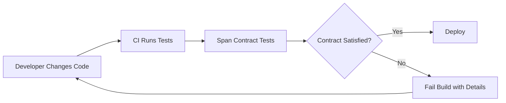

# How to Implement Contract Testing for OpenTelemetry Spans

Author: [nawazdhandala](https://www.github.com/nawazdhandala)

Tags: OpenTelemetry, Contract Testing, Spans, Testing, Semantic Conventions, Quality Assurance

Description: Learn how to implement contract testing for OpenTelemetry spans to ensure your instrumentation consistently produces correct and complete telemetry data.

---

When multiple teams contribute instrumentation across a large codebase, span quality tends to drift. One team names their spans differently from another. Required attributes go missing. Span kinds get set incorrectly. Over time, the telemetry your system produces becomes inconsistent and unreliable. Contract testing for spans fixes this by defining explicit rules about what your telemetry should look like and automatically verifying that every span meets those rules.

This is the same idea as API contract testing, applied to your observability data. You define a contract that specifies span names, required attributes, valid attribute values, expected events, and correct span relationships. Then you run automated tests that verify every span your application produces conforms to that contract.

## Why Contract Testing for Spans?

Consider what happens without span contracts. A developer renames a span from `db.query` to `database-query`. Another developer adds a new service but forgets to set the `service.name` resource attribute. A third developer sets `http.status_code` as a string instead of an integer. Each of these small mistakes degrades the value of your telemetry.

Contract testing catches these issues in CI before they reach production:



## Defining Span Contracts

A span contract is a specification that describes what a valid span looks like for a given operation. Start by defining contracts as structured data:

```yaml
# span-contracts/http-server.yaml
# Contract for HTTP server spans

name: "http-server-span"
description: "Contract for spans created by HTTP server instrumentation"

span:
  # Span name should follow the pattern: HTTP_METHOD
  name_pattern: "^(GET|POST|PUT|DELETE|PATCH|HEAD|OPTIONS)$"
  kind: SERVER

  # Required attributes that must be present on every span
  required_attributes:
    - key: http.request.method
      type: string
      allowed_values: [GET, POST, PUT, DELETE, PATCH, HEAD, OPTIONS]

    - key: url.path
      type: string

    - key: http.response.status_code
      type: int
      range:
        min: 100
        max: 599

    - key: server.address
      type: string

  # Optional attributes that should have correct types if present
  optional_attributes:
    - key: http.request.body.size
      type: int
    - key: http.response.body.size
      type: int
    - key: user_agent.original
      type: string
    - key: url.query
      type: string

  # Error status requirements
  error_conditions:
    - when: 'http.response.status_code >= 500'
      status: ERROR
```

```yaml
# span-contracts/database.yaml
# Contract for database spans

name: "database-span"
description: "Contract for spans created by database instrumentation"

span:
  name_pattern: "^(SELECT|INSERT|UPDATE|DELETE|CREATE|DROP|ALTER)\\s"
  kind: CLIENT

  required_attributes:
    - key: db.system
      type: string
      allowed_values: [postgresql, mysql, sqlite, mongodb, redis]

    - key: db.name
      type: string

    - key: db.operation
      type: string

  optional_attributes:
    - key: db.statement
      type: string
      max_length: 4096

    - key: server.address
      type: string

    - key: server.port
      type: int
```

These contracts serve as the single source of truth for what your telemetry should look like.

## Building the Contract Validator

Now build a validator that checks spans against their contracts. Here is a Python implementation:

```python
# span_contract_validator.py
# Validates OpenTelemetry spans against defined contracts

import re
import yaml
from dataclasses import dataclass, field
from typing import Optional


@dataclass
class ValidationError:
    """Represents a single contract violation."""
    span_name: str
    rule: str
    message: str


@dataclass
class ValidationResult:
    """Result of validating spans against a contract."""
    contract_name: str
    total_spans: int
    errors: list = field(default_factory=list)

    @property
    def passed(self):
        return len(self.errors) == 0


class SpanContractValidator:
    def __init__(self, contract_path):
        """Load a contract from a YAML file."""
        with open(contract_path, 'r') as f:
            self.contract = yaml.safe_load(f)
        self.span_spec = self.contract['span']

    def validate_span(self, span):
        """Validate a single span against the contract."""
        errors = []

        # Check span name matches the pattern
        name_pattern = self.span_spec.get('name_pattern')
        if name_pattern and not re.match(name_pattern, span.name):
            errors.append(ValidationError(
                span_name=span.name,
                rule="name_pattern",
                message=f"Span name '{span.name}' does not match "
                        f"pattern '{name_pattern}'",
            ))

        # Check span kind
        expected_kind = self.span_spec.get('kind')
        if expected_kind:
            actual_kind = span.kind.name
            if actual_kind != expected_kind:
                errors.append(ValidationError(
                    span_name=span.name,
                    rule="kind",
                    message=f"Expected kind {expected_kind}, "
                            f"got {actual_kind}",
                ))

        # Validate required attributes
        attrs = dict(span.attributes) if span.attributes else {}
        for attr_spec in self.span_spec.get('required_attributes', []):
            key = attr_spec['key']

            # Check attribute exists
            if key not in attrs:
                errors.append(ValidationError(
                    span_name=span.name,
                    rule="required_attribute",
                    message=f"Missing required attribute '{key}'",
                ))
                continue

            value = attrs[key]

            # Check type
            errors.extend(
                self._validate_attribute_type(span.name, key, value, attr_spec)
            )

            # Check allowed values
            if 'allowed_values' in attr_spec:
                if value not in attr_spec['allowed_values']:
                    errors.append(ValidationError(
                        span_name=span.name,
                        rule="allowed_values",
                        message=f"Attribute '{key}' value '{value}' "
                                f"not in allowed values: "
                                f"{attr_spec['allowed_values']}",
                    ))

            # Check range
            if 'range' in attr_spec:
                range_spec = attr_spec['range']
                if value < range_spec.get('min', float('-inf')):
                    errors.append(ValidationError(
                        span_name=span.name,
                        rule="range",
                        message=f"Attribute '{key}' value {value} "
                                f"below minimum {range_spec['min']}",
                    ))
                if value > range_spec.get('max', float('inf')):
                    errors.append(ValidationError(
                        span_name=span.name,
                        rule="range",
                        message=f"Attribute '{key}' value {value} "
                                f"above maximum {range_spec['max']}",
                    ))

        return errors

    def _validate_attribute_type(self, span_name, key, value, spec):
        """Validate that an attribute value matches the expected type."""
        errors = []
        expected_type = spec.get('type')

        type_map = {
            'string': str,
            'int': int,
            'float': float,
            'bool': bool,
        }

        if expected_type in type_map:
            if not isinstance(value, type_map[expected_type]):
                errors.append(ValidationError(
                    span_name=span_name,
                    rule="attribute_type",
                    message=f"Attribute '{key}' expected type "
                            f"{expected_type}, got {type(value).__name__}",
                ))

        return errors
```

This validator loads a YAML contract and checks each span against it. The `ValidationError` dataclass provides clear, actionable error messages when a span violates the contract.

## Integrating Contract Tests into Your Test Suite

Wire the validator into your existing test framework:

```python
# test_span_contracts.py
# Contract tests that run as part of the standard test suite

import unittest
from opentelemetry import trace
from opentelemetry.sdk.trace import TracerProvider
from opentelemetry.sdk.trace.export import SimpleSpanProcessor
from opentelemetry.sdk.trace.export.in_memory import InMemorySpanExporter
from span_contract_validator import SpanContractValidator

# Set up tracing for tests
exporter = InMemorySpanExporter()
provider = TracerProvider()
provider.add_span_processor(SimpleSpanProcessor(exporter))
trace.set_tracer_provider(provider)


class TestHTTPSpanContract(unittest.TestCase):
    """Test that HTTP server spans conform to the contract."""

    def setUp(self):
        exporter.clear()
        self.validator = SpanContractValidator(
            'span-contracts/http-server.yaml'
        )

    def test_get_request_span_matches_contract(self):
        """A GET request should produce a span that satisfies the contract."""
        # Trigger the instrumented code
        response = simulate_get_request('/api/users')

        # Get the spans produced
        spans = exporter.get_finished_spans()
        http_spans = [s for s in spans if s.kind.name == 'SERVER']

        self.assertTrue(len(http_spans) > 0, "No HTTP server spans found")

        # Validate each span against the contract
        for span in http_spans:
            errors = self.validator.validate_span(span)
            if errors:
                error_messages = '\n'.join(
                    f"  - [{e.rule}] {e.message}" for e in errors
                )
                self.fail(
                    f"Span '{span.name}' violates contract:\n{error_messages}"
                )

    def test_error_response_span_has_error_status(self):
        """5xx responses should produce spans with ERROR status."""
        response = simulate_get_request('/api/error-endpoint')

        spans = exporter.get_finished_spans()
        http_spans = [s for s in spans if s.kind.name == 'SERVER']

        for span in http_spans:
            status_code = span.attributes.get('http.response.status_code')
            if status_code and status_code >= 500:
                self.assertEqual(
                    span.status.status_code.name,
                    'ERROR',
                    f"Span with status code {status_code} should have "
                    f"ERROR status",
                )


class TestDatabaseSpanContract(unittest.TestCase):
    """Test that database spans conform to the contract."""

    def setUp(self):
        exporter.clear()
        self.validator = SpanContractValidator(
            'span-contracts/database.yaml'
        )

    def test_query_span_matches_contract(self):
        """Database queries should produce contract-compliant spans."""
        # Trigger a database operation
        result = fetch_users_from_db()

        spans = exporter.get_finished_spans()
        db_spans = [s for s in spans if s.kind.name == 'CLIENT']

        for span in db_spans:
            errors = self.validator.validate_span(span)
            if errors:
                error_messages = '\n'.join(
                    f"  - [{e.rule}] {e.message}" for e in errors
                )
                self.fail(
                    f"Span '{span.name}' violates contract:\n{error_messages}"
                )
```

When a span violates its contract, the test failure message clearly explains which rule was broken and what the expected value should be.

## Contract Testing in JavaScript/TypeScript

Here is the same concept in a JavaScript test:

```typescript
// test/span-contracts.test.ts
import { exporter, resetTracing } from './setup';
import { SpanKind, SpanStatusCode } from '@opentelemetry/api';
import { ReadableSpan } from '@opentelemetry/sdk-trace-base';

// Define the contract as a TypeScript interface
interface SpanContract {
  namePattern: RegExp;
  kind: SpanKind;
  requiredAttributes: {
    key: string;
    type: 'string' | 'number' | 'boolean';
    allowedValues?: any[];
  }[];
}

// HTTP server span contract
const httpServerContract: SpanContract = {
  namePattern: /^(GET|POST|PUT|DELETE|PATCH)$/,
  kind: SpanKind.SERVER,
  requiredAttributes: [
    { key: 'http.request.method', type: 'string' },
    { key: 'url.path', type: 'string' },
    { key: 'http.response.status_code', type: 'number' },
  ],
};

function validateSpanAgainstContract(
  span: ReadableSpan,
  contract: SpanContract
): string[] {
  const errors: string[] = [];

  // Check name pattern
  if (!contract.namePattern.test(span.name)) {
    errors.push(
      `Span name "${span.name}" does not match ${contract.namePattern}`
    );
  }

  // Check kind
  if (span.kind !== contract.kind) {
    errors.push(
      `Expected kind ${SpanKind[contract.kind]}, got ${SpanKind[span.kind]}`
    );
  }

  // Check required attributes
  for (const attr of contract.requiredAttributes) {
    const value = span.attributes[attr.key];

    if (value === undefined) {
      errors.push(`Missing required attribute "${attr.key}"`);
      continue;
    }

    // Type check
    if (typeof value !== attr.type) {
      errors.push(
        `Attribute "${attr.key}" expected type ${attr.type}, ` +
        `got ${typeof value}`
      );
    }

    // Allowed values check
    if (attr.allowedValues && !attr.allowedValues.includes(value)) {
      errors.push(
        `Attribute "${attr.key}" value "${value}" not in ` +
        `allowed values: ${attr.allowedValues}`
      );
    }
  }

  return errors;
}

describe('HTTP Span Contracts', () => {
  beforeEach(resetTracing);

  it('all HTTP server spans should match the contract', async () => {
    // Trigger instrumented HTTP handling
    await handleTestRequest('GET', '/api/users');

    const spans = exporter.getFinishedSpans();
    const serverSpans = spans.filter((s) => s.kind === SpanKind.SERVER);

    for (const span of serverSpans) {
      const errors = validateSpanAgainstContract(span, httpServerContract);
      if (errors.length > 0) {
        fail(
          `Span "${span.name}" contract violations:\n` +
          errors.map((e) => `  - ${e}`).join('\n')
        );
      }
    }
  });
});
```

## Evolving Contracts Over Time

Span contracts should be versioned and evolved carefully. When you need to add a new required attribute, follow a phased approach:

```yaml
# Phase 1: Add as optional attribute with a deprecation notice
optional_attributes:
  - key: url.full
    type: string
    note: "Will become required in v2.0"

# Phase 2: Make it required in the next contract version
required_attributes:
  - key: url.full
    type: string
```

This gives teams time to update their instrumentation before the contract enforcement kicks in.

## Generating Contracts from Semantic Conventions

Instead of writing contracts from scratch, generate them from the OpenTelemetry semantic conventions:

```python
# generate_contracts.py
# Generate span contracts from OpenTelemetry semantic conventions

import yaml


def generate_http_server_contract():
    """Generate the HTTP server contract from semconv definitions."""
    # Based on OpenTelemetry HTTP semantic conventions
    contract = {
        'name': 'http-server-span',
        'description': 'Auto-generated from OTel semantic conventions',
        'span': {
            'kind': 'SERVER',
            'required_attributes': [
                {'key': 'http.request.method', 'type': 'string'},
                {'key': 'url.scheme', 'type': 'string'},
                {'key': 'url.path', 'type': 'string'},
                {'key': 'http.response.status_code', 'type': 'int'},
                {'key': 'server.address', 'type': 'string'},
                {'key': 'server.port', 'type': 'int'},
            ],
            'optional_attributes': [
                {'key': 'http.request.body.size', 'type': 'int'},
                {'key': 'http.response.body.size', 'type': 'int'},
                {'key': 'url.query', 'type': 'string'},
                {'key': 'user_agent.original', 'type': 'string'},
            ],
        },
    }

    with open('span-contracts/http-server.yaml', 'w') as f:
        yaml.dump(contract, f, default_flow_style=False)

    print("Generated http-server contract")
```

Generating contracts from semantic conventions ensures your telemetry stays aligned with the OpenTelemetry standard, which makes it portable across different backends and tools.

## Running Contract Tests in CI

Add contract tests to your CI pipeline so that every pull request is validated:

```yaml
# .github/workflows/span-contracts.yaml
name: Span Contract Tests

on: [pull_request]

jobs:
  contract-tests:
    runs-on: ubuntu-latest
    steps:
      - uses: actions/checkout@v4

      - name: Install dependencies
        run: pip install -r requirements-test.txt

      - name: Run span contract tests
        run: python -m pytest test_span_contracts.py -v

      - name: Report contract violations
        if: failure()
        run: echo "Span contract violations detected. Check test output above."
```

## Wrapping Up

Contract testing for OpenTelemetry spans brings the same rigor to observability that API contract testing brings to service interfaces. By defining explicit contracts for your spans and validating them automatically, you prevent the gradual drift that makes telemetry unreliable over time. Start by defining contracts for your most critical spans, wire the validation into your test suite, and expand coverage as your team builds the habit of treating telemetry as a first-class output of your code.
