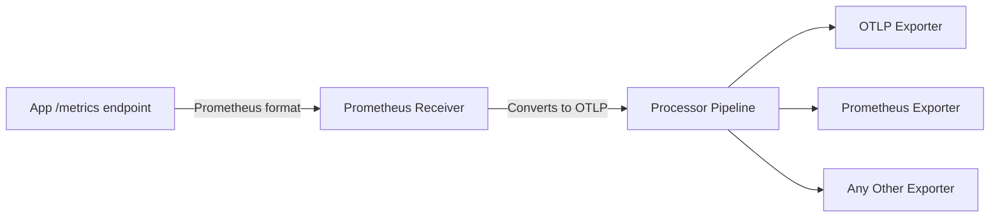

# How to Convert Prometheus Metrics to OTLP Format Using the Collector

Author: [nawazdhandala](https://www.github.com/nawazdhandala)

Tags: OpenTelemetry, Prometheus, OTLP, Metrics, Collector, Migration

Description: A practical guide to converting Prometheus metrics into OTLP format using the OpenTelemetry Collector for unified observability pipelines.

---

Many organizations have years of investment in Prometheus metrics. Applications expose `/metrics` endpoints, dashboards query PromQL, and alerting rules reference Prometheus metric names. But as teams adopt OpenTelemetry for a unified observability standard, there is often a need to convert those existing Prometheus metrics into OTLP format so they can flow through a single pipeline alongside traces and logs.

The OpenTelemetry Collector makes this conversion straightforward. It can scrape Prometheus endpoints, convert the data to OTLP internally, process it through the standard pipeline, and export it to any OTLP-compatible backend. This guide walks through the full process.

## Why Convert Prometheus to OTLP

There are several practical reasons to convert Prometheus metrics into OTLP format.

First, you may be migrating to an OTLP-native backend like Grafana Mimir, Datadog, or OneUptime. These backends accept OTLP natively and may offer better performance or features when metrics arrive in OTLP format rather than through Prometheus remote write.

Second, converting to OTLP lets you route metrics through the same pipeline as your traces and logs. This means you can apply consistent processing, filtering, and enrichment across all signal types in a single collector configuration.

Third, OTLP carries richer metadata than the Prometheus exposition format. Resource attributes, instrumentation scope, and metric descriptions all survive the conversion and can be used for filtering and routing downstream.

## How the Conversion Works

The OpenTelemetry Collector uses the Prometheus receiver to scrape Prometheus endpoints. Internally, the scraped data is immediately converted to the OTLP metric data model. From that point forward, the data flows through the collector pipeline as OTLP and can be exported in any format.



The conversion handles type mapping automatically. Prometheus counters become OTel monotonic sums. Prometheus gauges become OTel gauges. Prometheus histograms become OTel histograms. Prometheus summaries become OTel summaries. The receiver also extracts the `job` and `instance` labels and maps them to resource attributes.

## Basic Configuration

Here is a minimal collector configuration that scrapes a Prometheus endpoint and exports the metrics as OTLP.

```yaml
# otel-collector-config.yaml
receivers:
  # Scrape Prometheus metrics from application endpoints
  prometheus:
    config:
      scrape_configs:
        # Scrape a single static target
        - job_name: "my-application"
          scrape_interval: 30s
          static_configs:
            - targets: ["app-server:8080"]
              labels:
                environment: "production"

processors:
  # Batch metrics for efficient export
  batch:
    timeout: 15s
    send_batch_size: 2048

exporters:
  # Export as OTLP to a backend
  otlp:
    endpoint: otel-backend.example.com:4317
    tls:
      insecure: false

service:
  pipelines:
    metrics:
      receivers: [prometheus]
      processors: [batch]
      exporters: [otlp]
```

This configuration tells the collector to scrape `app-server:8080/metrics` every 30 seconds, convert the scraped data to OTLP, batch it, and send it to an OTLP backend. The application does not need to change at all. It keeps exposing its standard Prometheus metrics endpoint.

## Scraping Multiple Targets with Service Discovery

In real deployments, you rarely have just one target. The Prometheus receiver supports the same service discovery mechanisms as Prometheus itself, including Kubernetes, Consul, DNS, and file-based discovery.

Here is a configuration that discovers and scrapes all Kubernetes pods with Prometheus annotations.

```yaml
receivers:
  prometheus:
    config:
      scrape_configs:
        # Discover Kubernetes pods with prometheus.io annotations
        - job_name: "kubernetes-pods"
          scrape_interval: 30s

          kubernetes_sd_configs:
            # Discover pods in the cluster
            - role: pod

          relabel_configs:
            # Only scrape pods with prometheus.io/scrape=true
            - source_labels: [__meta_kubernetes_pod_annotation_prometheus_io_scrape]
              action: keep
              regex: true

            # Use the prometheus.io/path annotation for the metrics path
            - source_labels: [__meta_kubernetes_pod_annotation_prometheus_io_path]
              action: replace
              target_label: __metrics_path__
              regex: (.+)

            # Use the prometheus.io/port annotation for the scrape port
            - source_labels:
                [__address__, __meta_kubernetes_pod_annotation_prometheus_io_port]
              action: replace
              regex: ([^:]+)(?::\d+)?;(\d+)
              replacement: $1:$2
              target_label: __address__

            # Add namespace as a label
            - source_labels: [__meta_kubernetes_namespace]
              action: replace
              target_label: namespace

            # Add pod name as a label
            - source_labels: [__meta_kubernetes_pod_name]
              action: replace
              target_label: pod

processors:
  batch:
    timeout: 15s
    send_batch_size: 2048

  # Add Kubernetes resource attributes
  resource:
    attributes:
      - key: k8s.cluster.name
        value: "production-us-east"
        action: upsert

exporters:
  otlp:
    endpoint: otel-backend.example.com:4317
    tls:
      insecure: false

service:
  pipelines:
    metrics:
      receivers: [prometheus]
      processors: [resource, batch]
      exporters: [otlp]
```

This is functionally identical to how you would configure Prometheus itself. The relabel configs work the same way. The only difference is that the scraped metrics get converted to OTLP and sent to an OTLP backend instead of being stored in Prometheus TSDB.

## Enriching Converted Metrics

Once the Prometheus metrics are in OTLP format inside the collector, you can apply any OTel processor to them. This is one of the biggest advantages of the conversion approach. You can enrich, transform, and filter metrics in ways that would be difficult or impossible in pure Prometheus.

```yaml
processors:
  # Transform metric names to match OTLP conventions
  metricstransform:
    transforms:
      # Rename a metric to follow OTel semantic conventions
      - include: http_request_duration_seconds
        match_type: strict
        action: update
        new_name: http.server.request.duration

      # Add a prefix to all metrics from a specific job
      - include: ^node_(.*)
        match_type: regexp
        action: update
        new_name: system.$1

      # Aggregate across instances
      - include: http_requests_total
        match_type: strict
        action: update
        operations:
          # Add a new label based on existing ones
          - action: add_label
            new_label: service_tier
            new_value: "web"

  # Filter out metrics you do not need
  filter:
    metrics:
      # Exclude internal Go runtime metrics
      exclude:
        match_type: regexp
        metric_names:
          - go_.*
          - process_.*
          - promhttp_.*

  # Convert resource attributes for OTLP compatibility
  resource:
    attributes:
      # Map the Prometheus job label to service.name
      - key: service.name
        from_attribute: job
        action: upsert

      # Map instance to service.instance.id
      - key: service.instance.id
        from_attribute: instance
        action: upsert

  batch:
    timeout: 15s
    send_batch_size: 2048

service:
  pipelines:
    metrics:
      receivers: [prometheus]
      processors: [resource, metricstransform, filter, batch]
      exporters: [otlp]
```

The metricstransform processor is particularly useful during migration. You can rename Prometheus metrics to follow OpenTelemetry semantic conventions without changing the application code. This lets you gradually align naming while keeping backward compatibility.

## Running Prometheus and OTLP Side by Side

During a migration, you often want to send converted metrics to both the old Prometheus backend and a new OTLP backend simultaneously. This lets you validate that the new system produces the same results before cutting over.

```yaml
receivers:
  prometheus:
    config:
      scrape_configs:
        - job_name: "my-app"
          scrape_interval: 30s
          static_configs:
            - targets: ["app-server:8080"]

exporters:
  # Send to new OTLP backend
  otlp:
    endpoint: new-backend.example.com:4317
    tls:
      insecure: false

  # Also expose a Prometheus scrape endpoint for the existing Prometheus
  prometheus:
    endpoint: 0.0.0.0:8889
    resource_to_telemetry_conversion:
      enabled: true

processors:
  batch:
    timeout: 15s
    send_batch_size: 2048

service:
  pipelines:
    metrics:
      receivers: [prometheus]
      processors: [batch]
      # Fan out to both backends
      exporters: [otlp, prometheus]
```

With this setup, metrics flow through the collector, get converted to OTLP, and then get exported to both the new OTLP backend and a Prometheus scrape endpoint that your existing Prometheus server can pull from. Once you confirm the new backend is working correctly, you remove the Prometheus exporter.

## Handling Staleness and Gaps

One thing to be aware of during conversion is how staleness works. Prometheus has a specific staleness model where a metric that is no longer present in a scrape gets marked as stale after a certain period. The OpenTelemetry Collector's Prometheus receiver respects this behavior and generates appropriate data points.

However, if you are exporting to an OTLP backend that has a different staleness model, you may see differences in how gaps and missing data points are handled. Test your alerting rules against the new backend to make sure they fire correctly during gaps.

You can also configure the Prometheus receiver to handle specific edge cases.

```yaml
receivers:
  prometheus:
    config:
      scrape_configs:
        - job_name: "my-app"
          scrape_interval: 30s
          scrape_timeout: 10s
          # Honor timestamps from the application (default: true)
          honor_timestamps: true
          # Honor labels from the target, do not overwrite with job/instance
          honor_labels: false
          static_configs:
            - targets: ["app-server:8080"]

    # Trim metric suffixes to match OTel conventions
    # Removes _total, _count, _sum, _bucket suffixes
    trim_metric_suffixes: true

    # Report extra scrape metrics for debugging
    report_extra_scrape_metrics: true
```

The `trim_metric_suffixes` option is particularly useful when converting to OTLP. It removes the Prometheus-specific suffixes so that the OTLP metric names match what you would get from native OTel instrumentation. A counter called `http_requests_total` in Prometheus becomes `http_requests` in OTLP, which is the convention for OTel counters.

## Validating the Conversion

After setting up the conversion pipeline, verify that metrics are arriving correctly at your OTLP backend. Use the collector's built-in telemetry to monitor the pipeline.

```yaml
service:
  telemetry:
    logs:
      level: info
    metrics:
      level: detailed
      address: 0.0.0.0:8888

  pipelines:
    metrics:
      receivers: [prometheus]
      processors: [batch]
      exporters: [otlp]
```

Key metrics to check include `otelcol_receiver_accepted_metric_points` (how many data points the Prometheus receiver ingested), `otelcol_exporter_sent_metric_points` (how many were exported), and `otelcol_exporter_send_failed_metric_points` (how many failed to export). If the accepted count is much higher than the sent count, check your filter and processor configurations.

Converting Prometheus metrics to OTLP is a practical first step toward a unified observability pipeline. It lets you preserve your existing instrumentation investment while gaining the flexibility of OTLP for routing, processing, and backend choice. Start with a single application, validate the conversion, and expand from there.
