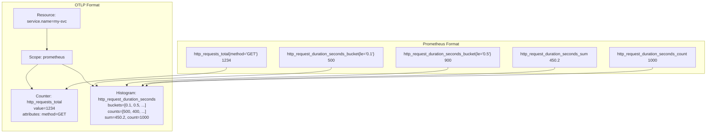

# How to Convert Prometheus Metrics to OTLP Format

Author: [nawazdhandala](https://www.github.com/nawazdhandala)

Tags: OpenTelemetry, Prometheus, OTLP, Metrics Conversion, Collector, Migration

Description: A detailed guide to converting Prometheus exposition format metrics into OTLP, covering data model differences, collector configuration, and handling edge cases in the translation.

---

Converting Prometheus metrics to OTLP (OpenTelemetry Protocol) format is a key step in migrating to an OpenTelemetry-native observability stack. While the OpenTelemetry Collector handles much of this conversion automatically, understanding the data model differences and translation rules will help you avoid surprises and keep your dashboards accurate through the transition.

This guide covers how the conversion works under the hood, how to configure the Collector for it, and how to handle the edge cases that trip up most teams.

## Data Model Differences

Before diving into configuration, it is important to understand how Prometheus and OTLP represent metrics differently.

Prometheus uses a text-based exposition format where each metric is a flat series of name-value label pairs with a timestamp and a float64 value. Histograms and summaries are decomposed into multiple individual series (`_bucket`, `_sum`, `_count`).

OTLP uses a structured protobuf format where metrics are organized into resources, scopes (instrumentation libraries), and metric data points. Histograms are first-class types with bucket counts, sum, and count all packed into a single data point.



The key differences are:

- **Structure**: Prometheus is flat, OTLP is hierarchical (resource -> scope -> metric -> data points)
- **Histograms**: Prometheus uses separate series per bucket, OTLP packs everything into one data point
- **Labels vs Attributes**: Prometheus labels map to OTLP attributes, but OTLP also has resource-level attributes that apply to all metrics from a source
- **Temporality**: Prometheus counters are cumulative (always increasing). OTLP supports both cumulative and delta temporality. The conversion defaults to cumulative to match Prometheus semantics.

## Basic Conversion with the Collector

The most common way to convert Prometheus metrics to OTLP is using the Collector's Prometheus receiver. It scrapes Prometheus endpoints and outputs OTLP metrics internally.

```yaml
# collector-config.yaml
receivers:
  # Scrape Prometheus endpoints and convert to OTLP internally
  prometheus:
    config:
      scrape_configs:
        - job_name: "my-service"
          scrape_interval: 15s
          static_configs:
            - targets: ["my-service:9090"]

processors:
  batch:
    timeout: 10s

exporters:
  # Export as OTLP to a compatible backend
  otlp:
    endpoint: "oneuptime.example.com:4317"
    tls:
      insecure: false

service:
  pipelines:
    metrics:
      receivers: [prometheus]
      processors: [batch]
      exporters: [otlp]
```

With this configuration, the Collector scrapes `my-service:9090/metrics`, parses the Prometheus exposition format, converts each metric into the OTLP data model, and exports it over gRPC. No application changes are needed.

## How Counter Conversion Works

Prometheus counters are monotonically increasing values. When the Collector converts them, it preserves the cumulative temporality and tracks resets.

Given this Prometheus output:

```
# HELP http_requests_total Total HTTP requests
# TYPE http_requests_total counter
http_requests_total{method="GET",status="200"} 15832
http_requests_total{method="POST",status="201"} 4521
```

The Collector produces an OTLP Sum metric with:

- **Name**: `http_requests_total`
- **Type**: Sum (monotonic, cumulative)
- **Data points**: Two points, each with the label values as attributes and the cumulative value

The `_total` suffix is preserved by default. If you want to strip it to follow OpenTelemetry naming conventions, you can use the metrics transform processor:

```yaml
processors:
  metricstransform:
    transforms:
      # Strip the _total suffix from counter names
      - include: "^(.+)_total$"
        match_type: regexp
        action: update
        new_name: "$${1}"
```

Be careful with this if you plan to export back to Prometheus later, since Prometheus expects the `_total` suffix on counters.

## How Histogram Conversion Works

Prometheus histograms are the most complex conversion. A Prometheus histogram consists of multiple series:

```
# HELP http_request_duration_seconds Request duration
# TYPE http_request_duration_seconds histogram
http_request_duration_seconds_bucket{le="0.005"} 24054
http_request_duration_seconds_bucket{le="0.01"} 33444
http_request_duration_seconds_bucket{le="0.025"} 100392
http_request_duration_seconds_bucket{le="0.05"} 129389
http_request_duration_seconds_bucket{le="0.1"} 133988
http_request_duration_seconds_bucket{le="+Inf"} 144320
http_request_duration_seconds_sum 53423.906
http_request_duration_seconds_count 144320
```

The Collector consolidates all of these into a single OTLP Histogram data point:

- **Name**: `http_request_duration_seconds`
- **Type**: Histogram
- **Bucket boundaries**: `[0.005, 0.01, 0.025, 0.05, 0.1]`
- **Bucket counts**: `[24054, 9390, 66948, 28997, 4599, 10332]` (delta counts per bucket)
- **Sum**: `53423.906`
- **Count**: `144320`

Notice that OTLP histogram bucket counts are delta counts (how many values fell into each bucket), while Prometheus uses cumulative counts (how many values were at or below each boundary). The Collector handles this conversion automatically.

## How Gauge Conversion Works

Gauges are the simplest conversion. A Prometheus gauge maps directly to an OTLP Gauge:

```
# HELP process_resident_memory_bytes Resident memory size in bytes
# TYPE process_resident_memory_bytes gauge
process_resident_memory_bytes 1.24813312e+08
```

This becomes an OTLP Gauge metric with a single data point containing the value `124813312`. No temporality is involved since gauges represent instantaneous values.

## Handling Resource Attributes

In Prometheus, all metadata is carried as labels on individual time series. In OTLP, there is a distinction between resource attributes (which describe the source entity) and metric attributes (which describe specific dimensions of the measurement).

The Collector's Prometheus receiver automatically creates resource attributes from certain labels:

```yaml
processors:
  # Move specific labels to resource attributes
  # This improves data organization in OTLP backends
  resource:
    attributes:
      - key: service.name
        from_attribute: job
        action: upsert
      - key: service.instance.id
        from_attribute: instance
        action: upsert
```

This processor takes the Prometheus `job` and `instance` labels and elevates them to resource-level attributes, which is where OTLP expects service identity information to live.

## Converting Prometheus Remote Write to OTLP

If your applications or Prometheus servers already use remote write, you can accept remote write at the Collector and convert to OTLP without any scraping:

```yaml
receivers:
  # Accept Prometheus remote write protocol
  prometheusremotewrite:
    endpoint: 0.0.0.0:9090

processors:
  batch:
    timeout: 10s

exporters:
  otlp:
    endpoint: "oneuptime.example.com:4317"

service:
  pipelines:
    metrics:
      receivers: [prometheusremotewrite]
      processors: [batch]
      exporters: [otlp]
```

This is useful when you want to keep your existing Prometheus server as the scraper but route its data to an OTLP backend. Configure your Prometheus server to remote write to the Collector:

```yaml
# prometheus.yml: add remote write to the Collector
remote_write:
  - url: "http://otel-collector:9090/api/v1/write"
```

## Handling Native Histograms

Prometheus 2.40+ introduced native histograms (also called sparse histograms), which use exponential bucket boundaries similar to OTLP's exponential histograms. If your Prometheus setup uses native histograms, the conversion to OTLP ExponentialHistogram is more natural:

```yaml
receivers:
  prometheus:
    config:
      scrape_configs:
        - job_name: "native-histogram-service"
          scrape_interval: 15s
          # Enable native histogram scraping
          scrape_protocols: ["PrometheusProto"]
          static_configs:
            - targets: ["my-service:9090"]
```

Native histograms map cleanly to OTLP's ExponentialHistogram type, preserving higher resolution without the fixed-bucket overhead.

## Handling Summary Metrics

Prometheus summaries calculate quantiles on the client side. OTLP does not have a direct summary type. The Collector converts Prometheus summaries into OTLP Summary data points, which are supported but considered a legacy type.

```
# HELP rpc_duration_seconds RPC duration
# TYPE rpc_duration_seconds summary
rpc_duration_seconds{quantile="0.5"} 0.042
rpc_duration_seconds{quantile="0.9"} 0.089
rpc_duration_seconds{quantile="0.99"} 0.183
rpc_duration_seconds_sum 8953.332
rpc_duration_seconds_count 27892
```

The Collector preserves these as-is in the OTLP Summary type. If your backend does not support summaries, consider migrating the application-level instrumentation to use histograms instead, which are better supported across the OTLP ecosystem.

## Verifying the Conversion

To inspect the converted OTLP output, use the debug exporter:

```yaml
exporters:
  # Print converted metrics to stdout for inspection
  debug:
    verbosity: detailed

service:
  pipelines:
    metrics:
      receivers: [prometheus]
      processors: [batch]
      exporters: [debug]
```

Run the Collector and check the logs. You will see the full OTLP metric structure including resource attributes, scope information, metric types, and individual data points. This is the best way to verify the conversion is producing what you expect before sending data to your production backend.

## Common Conversion Pitfalls

A few issues come up regularly during Prometheus-to-OTLP conversion:

- **Stale markers**: When a target disappears, Prometheus uses special stale marker values. The Collector translates these into the absence of data points. Make sure your backend handles gaps correctly.
- **Label cardinality**: Prometheus labels become OTLP attributes. High-cardinality labels in Prometheus will produce high-cardinality attributes in OTLP, which can be expensive in some backends.
- **Timestamp precision**: Prometheus uses millisecond timestamps, while OTLP uses nanosecond precision. The conversion pads with zeros, which is correct but may look different in queries.
- **Unit metadata**: Prometheus metric names often encode units (like `_seconds` or `_bytes`). The Collector can extract these into the OTLP unit field, but this is not enabled by default.

## Conclusion

Converting Prometheus metrics to OTLP format is largely handled by the OpenTelemetry Collector, but understanding the data model differences helps you avoid surprises. Counters, gauges, and histograms all have clean mappings. Summaries are preserved but considered legacy. Resource attributes give you better data organization than flat Prometheus labels. Start with the basic Prometheus receiver configuration, verify the output with the debug exporter, and then connect to your OTLP backend. The conversion is well-tested and production-ready for most use cases.
