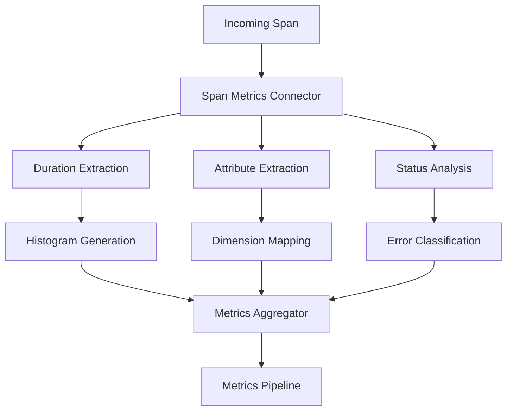

# How to Convert Spans to Metrics Using the Span Metrics Connector

Author: [nawazdhandala](https://www.github.com/nawazdhandala)

Tags: OpenTelemetry, Collector, Span Metrics, Traces, Metrics, RED Metrics, Observability

Description: Master the Span Metrics connector in OpenTelemetry Collector to automatically generate RED metrics and custom measurements from distributed traces for comprehensive service monitoring.

The Span Metrics connector is one of the most valuable components in the OpenTelemetry Collector, automatically generating metrics from trace spans. This connector eliminates the need for duplicate instrumentation, allowing you to derive RED (Rate, Error, Duration) metrics and custom measurements directly from your traces. The result is consistent metrics that perfectly align with your trace data, reducing instrumentation overhead and ensuring your metrics and traces tell the same story.

## Understanding the Span Metrics Connector

The Span Metrics connector processes each span in your traces and generates corresponding metric data points. For every span that passes through the connector, it extracts key information such as duration, status, and attributes, then aggregates this data into time-series metrics.

Unlike traditional metric instrumentation where you manually track counters and histograms in your application code, the Span Metrics connector derives these metrics automatically from the detailed trace data you're already collecting. This approach provides several advantages: reduced instrumentation effort, guaranteed consistency between traces and metrics, and the ability to add new metrics without code changes.

## Core Capabilities

The Span Metrics connector provides these fundamental capabilities:

**Duration Histograms**: Automatically creates latency histograms from span durations, allowing you to calculate percentiles and understand latency distribution.

**Request Counting**: Generates counters tracking the total number of requests (spans) processed.

**Error Tracking**: Identifies and counts spans with error status, enabling error rate calculations.

**Custom Dimensions**: Extracts span attributes as metric dimensions, allowing detailed slicing and filtering.

**Flexible Aggregation**: Configures aggregation windows, histogram buckets, and dimension sets to match your monitoring needs.

## Basic Span Metrics Configuration

Here's a foundational configuration to start generating metrics from spans:

```yaml
receivers:
  otlp:
    protocols:
      grpc:
        endpoint: 0.0.0.0:4317

processors:
  batch:
    timeout: 10s
    send_batch_size: 1024

connectors:
  spanmetrics:
    # Configure histogram buckets for duration metrics
    histogram:
      explicit:
        buckets: [10ms, 50ms, 100ms, 250ms, 500ms, 1s, 2.5s, 5s, 10s]

    # Define which span attributes become metric dimensions
    dimensions:
      - name: service.name
      - name: span.kind
      - name: http.method
      - name: http.status_code

exporters:
  otlp/traces:
    endpoint: jaeger:4317

  prometheusremotewrite:
    endpoint: http://prometheus:9090/api/v1/write

service:
  pipelines:
    # Traces pipeline feeds the connector
    traces:
      receivers: [otlp]
      processors: [batch]
      exporters: [spanmetrics, otlp/traces]

    # Metrics pipeline receives generated metrics
    metrics:
      receivers: [spanmetrics]
      processors: [batch]
      exporters: [prometheusremotewrite]
```

This configuration generates duration histograms and request counts for all spans, tagged with service name, span kind, HTTP method, and status code.

## Generated Metrics Explained

The Span Metrics connector generates these key metrics:

**Duration Histogram**: `calls_total` or `duration_bucket` (depending on configuration) tracks the distribution of span durations. This histogram allows you to calculate percentiles like p50, p95, and p99 latency.

**Call Count**: `calls` or `calls_total` counts the total number of spans processed, enabling request rate calculations.

**Error Count**: When configured, tracks spans with error status separately, allowing error rate calculations.

The exact metric names depend on your namespace and naming configuration, but the underlying data provides consistent request, error, and duration tracking.

## Configuration Flow Architecture

Understanding the data flow helps clarify the transformation:



Each span is analyzed, its properties extracted, and aggregated into metrics that flow into downstream pipelines.

## Configuring Dimensions

Dimensions (labels) are critical for making your metrics useful. The Span Metrics connector allows you to extract any span attribute as a metric dimension:

```yaml
connectors:
  spanmetrics/detailed:
    histogram:
      explicit:
        buckets: [10ms, 50ms, 100ms, 250ms, 500ms, 1s, 2.5s, 5s, 10s]

    dimensions:
      # Resource attributes
      - name: service.name
      - name: service.namespace
      - name: service.version
      - name: deployment.environment

      # Span attributes
      - name: span.kind
      - name: span.name
      - name: http.method
      - name: http.route
      - name: http.status_code
      - name: http.scheme

      # Database spans
      - name: db.system
      - name: db.operation
      - name: db.name

      # RPC spans
      - name: rpc.system
      - name: rpc.service
      - name: rpc.method

    # Optional: provide defaults for missing attributes
    dimensions_defaults:
      http.status_code: "unknown"
      db.system: "none"
```

Choose dimensions carefully. Too many high-cardinality dimensions (like user IDs or trace IDs) can create millions of unique metric series, overwhelming your storage backend.

## Histogram Bucket Configuration

Histogram buckets determine the resolution of your latency metrics. Configure them based on your service characteristics:

```yaml
connectors:
  # Fast APIs and microservices
  spanmetrics/fast-api:
    histogram:
      explicit:
        buckets: [1ms, 5ms, 10ms, 25ms, 50ms, 100ms, 250ms, 500ms, 1s]

  # Standard web services
  spanmetrics/web-services:
    histogram:
      explicit:
        buckets: [10ms, 50ms, 100ms, 250ms, 500ms, 1s, 2.5s, 5s, 10s]

  # Batch processing or slow external APIs
  spanmetrics/batch-processing:
    histogram:
      explicit:
        buckets: [100ms, 500ms, 1s, 5s, 10s, 30s, 60s, 120s, 300s, 600s]

  # Mixed workload with exponential buckets
  spanmetrics/exponential:
    histogram:
      exponential:
        max_size: 160
```

The explicit bucket configuration is most common, but exponential histograms provide dynamic bucket sizing that adapts to your data distribution.

## Filtering Spans for Metric Generation

You can selectively generate metrics from specific spans using processors:

```yaml
processors:
  # Only generate metrics for server spans
  filter/server-spans:
    traces:
      span:
        - 'span.kind == SPAN_KIND_SERVER'

  # Exclude health checks
  filter/no-health:
    traces:
      span:
        - 'attributes["http.route"] != "/health"'
        - 'attributes["http.route"] != "/readiness"'

  # Only production traffic
  filter/production:
    traces:
      span:
        - 'resource.attributes["deployment.environment"] == "production"'

  # Exclude fast database queries
  filter/slow-db:
    traces:
      span:
        - 'attributes["db.system"] != nil and duration > 100000000'  # 100ms in nanoseconds

connectors:
  spanmetrics:
    histogram:
      explicit:
        buckets: [10ms, 50ms, 100ms, 250ms, 500ms, 1s, 2.5s, 5s]
    dimensions:
      - name: service.name
      - name: http.method

service:
  pipelines:
    traces:
      receivers: [otlp]
      processors: [filter/server-spans, filter/no-health, batch]
      exporters: [spanmetrics, otlp/traces]

    metrics:
      receivers: [spanmetrics]
      exporters: [prometheusremotewrite]
```

Filtering reduces the volume of metrics generated and focuses on relevant spans, controlling cardinality and storage costs.

## Configuring Metrics Namespace

Control the naming of generated metrics with namespace configuration:

```yaml
connectors:
  spanmetrics:
    histogram:
      explicit:
        buckets: [10ms, 50ms, 100ms, 250ms, 500ms, 1s, 2.5s, 5s]

    dimensions:
      - name: service.name
      - name: http.method

    # Prefix all generated metrics
    namespace: traces.span.metrics

    # Configure specific metric names
    metrics_names:
      duration: request.duration
      calls: request.count
```

This generates metrics like `traces_span_metrics_request_duration_bucket` and `traces_span_metrics_request_count`, making it clear these metrics originated from span data.

## Aggregation Temporal Configuration

Control how spans are aggregated over time:

```yaml
connectors:
  spanmetrics/temporal:
    histogram:
      explicit:
        buckets: [10ms, 50ms, 100ms, 250ms, 500ms, 1s, 2.5s, 5s]

    dimensions:
      - name: service.name
      - name: http.method

    # Configure aggregation behavior
    aggregation_temporality: AGGREGATION_TEMPORALITY_CUMULATIVE

    # How long to wait before emitting metrics
    metrics_flush_interval: 60s

    # How long to keep metric state for inactive dimensions
    metrics_expiration: 5m
```

Cumulative temporality is standard for Prometheus, while delta temporality suits some other backends. The flush interval determines how often metrics are emitted, and expiration controls when metrics for inactive dimension combinations are removed.

## Generating Separate Error Metrics

Create dedicated error metrics for easier alerting:

```yaml
connectors:
  spanmetrics/with-errors:
    histogram:
      explicit:
        buckets: [10ms, 50ms, 100ms, 250ms, 500ms, 1s, 2.5s, 5s]

    dimensions:
      - name: service.name
      - name: http.method
      - name: http.status_code
      - name: status.code

    # Configure error metric generation
    enable_error_metrics: true

    # Define what constitutes an error
    error_conditions:
      # HTTP status codes >= 500 are errors
      - key: http.status_code
        operator: gte
        value: 500

      # OpenTelemetry error status
      - key: status.code
        value: ERROR

      # Explicitly marked errors
      - key: error
        value: true
```

This generates separate error count metrics, making it easy to calculate error rates and create alerts.

## Multi-Environment Configuration

Generate separate metrics for different environments or service tiers:

```yaml
processors:
  # Add environment tags
  resource/production:
    attributes:
      - key: deployment.environment
        value: "production"
        action: insert

  resource/staging:
    attributes:
      - key: deployment.environment
        value: "staging"
        action: insert

connectors:
  # Production metrics with detailed buckets
  spanmetrics/production:
    histogram:
      explicit:
        buckets: [5ms, 10ms, 25ms, 50ms, 100ms, 250ms, 500ms, 1s, 2.5s, 5s]
    dimensions:
      - name: service.name
      - name: deployment.environment
      - name: http.method
      - name: http.status_code
    namespace: prod.spans

  # Staging metrics with coarser buckets
  spanmetrics/staging:
    histogram:
      explicit:
        buckets: [100ms, 500ms, 1s, 5s, 10s]
    dimensions:
      - name: service.name
      - name: deployment.environment
      - name: http.method
    namespace: staging.spans

exporters:
  prometheusremotewrite/production:
    endpoint: http://prometheus-prod:9090/api/v1/write

  prometheusremotewrite/staging:
    endpoint: http://prometheus-staging:9090/api/v1/write

service:
  pipelines:
    traces/production:
      receivers: [otlp]
      processors: [resource/production, batch]
      exporters: [spanmetrics/production]

    traces/staging:
      receivers: [otlp]
      processors: [resource/staging, batch]
      exporters: [spanmetrics/staging]

    metrics/production:
      receivers: [spanmetrics/production]
      exporters: [prometheusremotewrite/production]

    metrics/staging:
      receivers: [spanmetrics/staging]
      exporters: [prometheusremotewrite/staging]
```

This separates production and staging metrics, allowing different retention policies, aggregation levels, and alerting thresholds.

## Extracting Custom Business Metrics

Beyond standard RED metrics, extract business-specific measurements from spans:

```yaml
connectors:
  spanmetrics/business:
    histogram:
      explicit:
        buckets: [10ms, 50ms, 100ms, 250ms, 500ms, 1s, 2.5s, 5s]

    dimensions:
      # Standard dimensions
      - name: service.name
      - name: http.method

      # Business dimensions from span attributes
      - name: customer.tier
      - name: product.category
      - name: payment.method
      - name: region
      - name: promotion.code

    # Extract numeric values from span attributes
    value_attributes:
      - name: transaction.amount
        unit: USD
      - name: items.count
        unit: items
      - name: discount.applied
        unit: USD

service:
  pipelines:
    traces:
      receivers: [otlp]
      exporters: [spanmetrics/business]

    metrics/business:
      receivers: [spanmetrics/business]
      exporters: [prometheusremotewrite]
```

This extracts business metrics like transaction amounts and item counts directly from trace spans, eliminating the need for separate metric instrumentation.

## Combining with Other Connectors

Use multiple connectors for comprehensive observability:

```yaml
receivers:
  otlp:
    protocols:
      grpc:
        endpoint: 0.0.0.0:4317

processors:
  batch:
    timeout: 10s

connectors:
  # Generate detailed span metrics
  spanmetrics:
    histogram:
      explicit:
        buckets: [10ms, 50ms, 100ms, 250ms, 500ms, 1s, 2.5s, 5s, 10s]
    dimensions:
      - name: service.name
      - name: http.method
      - name: http.route
      - name: http.status_code

  # Generate service dependency graph
  servicegraph:
    store:
      max_items: 10000
      ttl: 5s
    latency_histogram_buckets: [10ms, 50ms, 100ms, 250ms, 500ms, 1s, 2.5s, 5s]
    dimensions:
      - service.name

exporters:
  otlp/traces:
    endpoint: jaeger:4317

  prometheusremotewrite:
    endpoint: http://prometheus:9090/api/v1/write

service:
  pipelines:
    # Traces feed both connectors
    traces:
      receivers: [otlp]
      processors: [batch]
      exporters: [spanmetrics, servicegraph, otlp/traces]

    # Span metrics
    metrics/spans:
      receivers: [spanmetrics]
      exporters: [prometheusremotewrite]

    # Service graph metrics
    metrics/graph:
      receivers: [servicegraph]
      exporters: [prometheusremotewrite]
```

This combination provides both detailed per-endpoint metrics (from spanmetrics) and service-to-service communication metrics (from servicegraph).

## Real-World Example: Microservices Platform

Here's a comprehensive configuration for a production microservices platform:

```yaml
receivers:
  otlp:
    protocols:
      grpc:
        endpoint: 0.0.0.0:4317
      http:
        endpoint: 0.0.0.0:4318

processors:
  # Resource detection
  resourcedetection:
    detectors: [env, system, docker, kubernetes]
    timeout: 5s

  # Memory limiter
  memory_limiter:
    check_interval: 1s
    limit_mib: 1024

  # Batch processing
  batch:
    timeout: 10s
    send_batch_size: 1024

  # Filter out noise
  filter/meaningful:
    traces:
      span:
        - 'attributes["http.route"] != "/health"'
        - 'attributes["http.route"] != "/metrics"'
        - 'attributes["http.route"] != "/readiness"'
        - 'attributes["http.route"] != "/liveness"'

  # Normalize attributes
  transform/normalize:
    trace_statements:
      - context: span
        statements:
          # Normalize HTTP status codes to classes
          - set(attributes["http.status_class"], "2xx") where attributes["http.status_code"] >= 200 and attributes["http.status_code"] < 300
          - set(attributes["http.status_class"], "3xx") where attributes["http.status_code"] >= 300 and attributes["http.status_code"] < 400
          - set(attributes["http.status_class"], "4xx") where attributes["http.status_code"] >= 400 and attributes["http.status_code"] < 500
          - set(attributes["http.status_class"], "5xx") where attributes["http.status_code"] >= 500

connectors:
  # Detailed span metrics
  spanmetrics/detailed:
    histogram:
      explicit:
        buckets: [5ms, 10ms, 25ms, 50ms, 100ms, 250ms, 500ms, 1s, 2.5s, 5s, 10s, 30s]

    dimensions:
      # Service identification
      - name: service.name
      - name: service.namespace
      - name: service.version

      # Request characteristics
      - name: span.kind
      - name: http.method
      - name: http.route
      - name: http.status_class
      - name: http.scheme

      # Infrastructure
      - name: k8s.cluster.name
      - name: k8s.namespace.name
      - name: deployment.environment

      # Database operations
      - name: db.system
      - name: db.operation

    # Configure error tracking
    enable_error_metrics: true

    # Metric naming
    namespace: platform.spans
    metrics_names:
      duration: http.server.duration
      calls: http.server.request.count

    # Aggregation
    aggregation_temporality: AGGREGATION_TEMPORALITY_CUMULATIVE
    metrics_flush_interval: 30s
    metrics_expiration: 5m

  # Aggregated metrics for dashboards
  spanmetrics/aggregated:
    histogram:
      explicit:
        buckets: [100ms, 500ms, 1s, 5s, 10s]

    dimensions:
      - name: service.name
      - name: service.namespace
      - name: deployment.environment
      - name: http.status_class

    namespace: platform.aggregated
    metrics_flush_interval: 60s

exporters:
  # Export traces to Tempo
  otlp/tempo:
    endpoint: tempo:4317
    compression: gzip
    sending_queue:
      enabled: true
      num_consumers: 10
      queue_size: 5000

  # Detailed metrics to Prometheus
  prometheusremotewrite/detailed:
    endpoint: http://prometheus:9090/api/v1/write
    compression: snappy
    external_labels:
      cluster: production
      detail_level: high

  # Aggregated metrics to long-term storage
  prometheusremotewrite/aggregated:
    endpoint: http://prometheus-longterm:9090/api/v1/write
    compression: snappy
    external_labels:
      cluster: production
      detail_level: aggregate

service:
  telemetry:
    logs:
      level: info
    metrics:
      level: detailed
      address: 0.0.0.0:8888

  pipelines:
    # Main traces pipeline
    traces/platform:
      receivers: [otlp]
      processors:
        - memory_limiter
        - resourcedetection
        - filter/meaningful
        - transform/normalize
        - batch
      exporters: [spanmetrics/detailed, spanmetrics/aggregated, otlp/tempo]

    # Detailed metrics pipeline
    metrics/detailed:
      receivers: [spanmetrics/detailed]
      processors: [batch]
      exporters: [prometheusremotewrite/detailed]

    # Aggregated metrics pipeline
    metrics/aggregated:
      receivers: [spanmetrics/aggregated]
      processors: [batch]
      exporters: [prometheusremotewrite/aggregated]
```

This configuration creates comprehensive span-derived metrics with both detailed and aggregated views, suitable for real-time monitoring and long-term analysis.

## Querying Generated Metrics

Once metrics are exported to Prometheus, you can query them for analysis and alerting:

```promql
# Request rate per service
rate(platform_spans_http_server_request_count[5m])

# P95 latency by service and route
histogram_quantile(0.95,
  sum by (service_name, http_route, le) (
    rate(platform_spans_http_server_duration_bucket[5m])
  )
)

# Error rate percentage
(
  rate(platform_spans_http_server_request_count{http_status_class="5xx"}[5m])
  /
  rate(platform_spans_http_server_request_count[5m])
) * 100

# Services with highest latency
topk(5,
  histogram_quantile(0.99,
    sum by (service_name, le) (
      rate(platform_spans_http_server_duration_bucket[5m])
    )
  )
)

# Throughput by HTTP method
sum by (http_method) (rate(platform_spans_http_server_request_count[5m]))
```

These queries enable powerful dashboards and alerts based on your span-derived metrics.

## Performance Optimization

The Span Metrics connector maintains state for aggregation. Optimize performance with these strategies:

**Control Cardinality**: Limit dimensions to essential attributes. Avoid high-cardinality dimensions like user IDs, trace IDs, or request IDs.

```yaml
connectors:
  spanmetrics/optimized:
    histogram:
      explicit:
        buckets: [100ms, 500ms, 1s, 5s, 10s]  # Fewer buckets

    dimensions:
      # Keep dimensions limited
      - name: service.name
      - name: http.method
      - name: http.status_class  # Use class, not exact code
      # Avoid:
      # - name: http.url  # High cardinality
      # - name: user.id  # High cardinality
      # - name: trace.id  # High cardinality
```

**Use Sampling**: For high-volume services, sample traces before metric generation:

```yaml
processors:
  probabilistic_sampler:
    sampling_percentage: 10.0

service:
  pipelines:
    traces:
      receivers: [otlp]
      processors: [probabilistic_sampler, batch]
      exporters: [spanmetrics]
```

**Adjust Flush Intervals**: Longer flush intervals reduce metric update frequency and overhead:

```yaml
connectors:
  spanmetrics:
    metrics_flush_interval: 60s  # Update metrics every 60 seconds
```

## Monitoring Span Metrics Generation

Track the health of your Span Metrics connector:

```yaml
service:
  telemetry:
    logs:
      level: info
    metrics:
      level: detailed
      address: 0.0.0.0:8888
```

Monitor these internal metrics:

- `otelcol_connector_spanmetrics_spans_processed`: Number of spans processed
- `otelcol_connector_spanmetrics_metrics_generated`: Number of metric points generated
- `otelcol_connector_spanmetrics_active_series`: Current number of unique metric series

If `active_series` grows unbounded, you have a cardinality problem. Review your dimensions and add filtering.

## Troubleshooting Common Issues

**No Metrics Generated**: Verify spans contain the attributes you're extracting as dimensions. Missing attributes may prevent metric generation.

**High Memory Usage**: Reduce dimensions, increase flush interval, or apply sampling to reduce the number of unique metric series.

**Metrics Don't Match Traces**: Ensure you're not filtering traces differently than you filter for metric generation. Inconsistent filtering creates discrepancies.

**Missing Dimension Values**: Use `dimensions_defaults` to provide fallback values for optional attributes.

## Related Resources

For more information about connectors and metrics generation:

- [How to Use Connectors to Link Traces and Metrics Pipelines](https://oneuptime.com/blog/post/2026-02-06-connectors-link-traces-metrics-pipelines-opentelemetry/view)
- [How to Generate Service Graph Metrics from Traces in the Collector](https://oneuptime.com/blog/post/2026-02-06-generate-service-graph-metrics-traces-collector/view)
- [How to Configure the Signal to Metrics Connector in the OpenTelemetry Collector](https://oneuptime.com/blog/post/2026-02-06-signal-to-metrics-connector-opentelemetry-collector/view)

The Span Metrics connector eliminates duplicate instrumentation, ensures consistency between traces and metrics, and enables you to derive comprehensive monitoring metrics automatically from your distributed traces.
