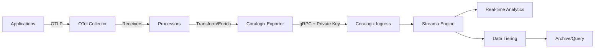

# How to Configure the Coralogix Exporter in the OpenTelemetry Collector

Author: [nawazdhandala](https://www.github.com/nawazdhandala)

Tags: OpenTelemetry, Collector, Exporters, Coralogix, Observability, Logs, Metrics, Traces

Description: Complete guide to configuring the Coralogix exporter in OpenTelemetry Collector for unified observability with logs, metrics, and traces in the Coralogix platform.

Coralogix is a modern observability platform that provides real-time insights into logs, metrics, and traces with advanced analytics powered by machine learning. The OpenTelemetry Collector's Coralogix exporter enables seamless integration with the Coralogix platform, allowing you to leverage its powerful features like automatic pattern detection, anomaly detection, and cost optimization through data tiering. This integration is particularly valuable for teams seeking a unified observability solution with intelligent automation.

## Understanding the Coralogix Platform

Coralogix differentiates itself from traditional observability platforms through its Streama technology, which analyzes data in real-time without requiring full indexing. This approach significantly reduces storage costs while maintaining query performance. The platform automatically learns patterns in your data, creates baselines, and alerts on anomalies without manual configuration.

The Coralogix exporter handles the conversion of OpenTelemetry data into Coralogix's expected format, managing authentication, endpoint routing based on region, and data enrichment. It supports all three telemetry signals and provides flexible configuration options for metadata, subsystems, and severity mapping.

## Architecture and Data Flow

Here's how telemetry flows from your applications to Coralogix through the OpenTelemetry Collector:



## Basic Configuration

Here's a minimal configuration to start sending data to Coralogix. This example covers logs, metrics, and traces.

```yaml
# Receivers for collecting telemetry data
receivers:
  otlp:
    protocols:
      grpc:
        endpoint: 0.0.0.0:4317
      http:
        endpoint: 0.0.0.0:4318

# Coralogix exporter configuration
exporters:
  coralogix:
    # Coralogix domain (region-specific)
    # Options: coralogix.com (EU), coralogix.us (US), coralogix.in (India),
    # coralogixsg.com (Singapore), coralogix.com (EU2)
    domain: "coralogix.com"

    # Private key for authentication (from Coralogix UI)
    private_key: "${CORALOGIX_PRIVATE_KEY}"

    # Application and subsystem names for organizing data
    application_name: "my-application"
    subsystem_name: "backend-service"

    # Timeout for API requests
    timeout: 30s

# Batch processor for efficiency
processors:
  batch:
    timeout: 10s
    send_batch_size: 1024

# Pipeline configuration
service:
  pipelines:
    # Logs pipeline
    logs:
      receivers: [otlp]
      processors: [batch]
      exporters: [coralogix]

    # Metrics pipeline
    metrics:
      receivers: [otlp]
      processors: [batch]
      exporters: [coralogix]

    # Traces pipeline
    traces:
      receivers: [otlp]
      processors: [batch]
      exporters: [coralogix]
```

This basic configuration establishes connectivity with Coralogix using a private key. You can obtain your private key from the Coralogix UI under Settings > Send Your Data > API Keys. The domain parameter must match your Coralogix account region.

## Production Configuration with Advanced Features

For production deployments, you'll need comprehensive error handling, metadata enrichment, and performance tuning.

```yaml
receivers:
  otlp:
    protocols:
      grpc:
        endpoint: 0.0.0.0:4317
        max_recv_msg_size_mib: 32
        keepalive:
          server_parameters:
            max_connection_idle: 11s
            max_connection_age: 12s
      http:
        endpoint: 0.0.0.0:4318

exporters:
  coralogix:
    # Coralogix domain for your region
    domain: "coralogix.com"

    # Private key from environment variable
    private_key: "${CORALOGIX_PRIVATE_KEY}"

    # Application and subsystem for data organization
    application_name: "production-app"
    subsystem_name: "api-gateway"

    # Timeout configuration
    timeout: 30s

    # Retry configuration for failed requests
    retry_on_failure:
      enabled: true
      initial_interval: 5s
      max_interval: 30s
      max_elapsed_time: 300s

    # Queue settings for handling backpressure
    sending_queue:
      enabled: true
      num_consumers: 10
      queue_size: 5000

    # TLS configuration (Coralogix uses secure connections by default)
    tls:
      insecure: false
      insecure_skip_verify: false

    # Custom endpoint (optional, for private links)
    # endpoint: "private-link-endpoint.coralogix.com:443"

processors:
  # Memory limiter to prevent OOM
  memory_limiter:
    check_interval: 1s
    limit_mib: 512
    spike_limit_mib: 128

  # Resource detection for cloud metadata
  resourcedetection:
    detectors: [env, system, docker, ec2, ecs, eks, gcp, azure]
    timeout: 5s
    override: false

  # Add custom attributes
  resource:
    attributes:
      - key: deployment.environment
        value: production
        action: upsert
      - key: service.version
        value: 1.0.0
        action: upsert
      - key: team
        value: platform
        action: upsert

  # Transform attributes for Coralogix
  attributes:
    actions:
      # Remove sensitive data
      - key: password
        action: delete
      - key: authorization
        action: delete
      - key: credit_card
        action: delete

  # Batch for performance
  batch:
    timeout: 10s
    send_batch_size: 2048
    send_batch_max_size: 4096

service:
  telemetry:
    logs:
      level: info
      encoding: json
    metrics:
      level: detailed
      address: 0.0.0.0:8888

  pipelines:
    logs:
      receivers: [otlp]
      processors: [memory_limiter, resourcedetection, resource, attributes, batch]
      exporters: [coralogix]

    metrics:
      receivers: [otlp]
      processors: [memory_limiter, resourcedetection, resource, batch]
      exporters: [coralogix]

    traces:
      receivers: [otlp]
      processors: [memory_limiter, resourcedetection, resource, attributes, batch]
      exporters: [coralogix]
```

This production configuration includes several critical features:

**Resource Detection**: Automatically enriches telemetry with cloud provider metadata, making it easier to correlate data with infrastructure.

**Security**: Stores sensitive credentials in environment variables and filters sensitive attributes from logs.

**Backpressure Handling**: Queues data when Coralogix is temporarily unavailable, preventing data loss.

**Metadata Enrichment**: Adds contextual information like environment, version, and team for better filtering and analysis.

## Multi-Environment Configuration

Organizations typically have multiple environments (development, staging, production). Here's how to configure separate Coralogix applications for each environment.

```yaml
exporters:
  # Production environment
  coralogix/production:
    domain: "coralogix.com"
    private_key: "${CORALOGIX_PRIVATE_KEY_PROD}"
    application_name: "myapp-production"
    subsystem_name: "api"
    timeout: 30s

  # Staging environment
  coralogix/staging:
    domain: "coralogix.com"
    private_key: "${CORALOGIX_PRIVATE_KEY_STAGING}"
    application_name: "myapp-staging"
    subsystem_name: "api"
    timeout: 30s

  # Development environment
  coralogix/development:
    domain: "coralogix.com"
    private_key: "${CORALOGIX_PRIVATE_KEY_DEV}"
    application_name: "myapp-development"
    subsystem_name: "api"
    timeout: 30s

processors:
  # Route data based on environment attribute
  routing:
    from_attribute: deployment.environment
    default_exporters: [coralogix/production]
    table:
      - value: production
        exporters: [coralogix/production]
      - value: staging
        exporters: [coralogix/staging]
      - value: development
        exporters: [coralogix/development]

  batch:
    timeout: 10s
    send_batch_size: 1024

service:
  pipelines:
    logs:
      receivers: [otlp]
      processors: [routing, batch]
      exporters: [coralogix/production, coralogix/staging, coralogix/development]
```

The routing processor dynamically selects the appropriate exporter based on the environment attribute, ensuring data is properly segregated in Coralogix.

## Dynamic Application and Subsystem Names

Instead of hardcoding application and subsystem names, you can derive them from resource attributes. This is useful for multi-tenant systems or dynamic environments.

```yaml
exporters:
  coralogix:
    domain: "coralogix.com"
    private_key: "${CORALOGIX_PRIVATE_KEY}"

    # Use resource attributes for application name
    # Falls back to "default-app" if attribute not found
    application_name_attributes:
      - "service.namespace"
      - "k8s.namespace.name"
    application_name: "default-app"

    # Use resource attributes for subsystem name
    # Falls back to "default-subsystem" if attribute not found
    subsystem_name_attributes:
      - "service.name"
      - "k8s.deployment.name"
    subsystem_name: "default-subsystem"

    timeout: 30s

processors:
  # Ensure service name is present
  resource:
    attributes:
      - key: service.namespace
        value: "backend"
        action: insert
      - key: service.name
        from_attribute: k8s.deployment.name
        action: upsert

  batch:
    timeout: 10s
    send_batch_size: 1024

service:
  pipelines:
    logs:
      receivers: [otlp]
      processors: [resource, batch]
      exporters: [coralogix]
```

This configuration automatically organizes data in Coralogix based on Kubernetes namespaces and deployments, making it easier to navigate large-scale environments.

## Logs Configuration with Severity Mapping

Coralogix uses severity levels to categorize logs. Here's how to map OpenTelemetry log levels to Coralogix severity.

```yaml
processors:
  # Map log severity to Coralogix levels
  transform:
    log_statements:
      - context: log
        statements:
          # Map trace level
          - set(severity_text, "Debug") where severity_number >= 1 and severity_number <= 4

          # Map debug level
          - set(severity_text, "Verbose") where severity_number >= 5 and severity_number <= 8

          # Map info level
          - set(severity_text, "Info") where severity_number >= 9 and severity_number <= 12

          # Map warn level
          - set(severity_text, "Warning") where severity_number >= 13 and severity_number <= 16

          # Map error level
          - set(severity_text, "Error") where severity_number >= 17 and severity_number <= 20

          # Map fatal level
          - set(severity_text, "Critical") where severity_number >= 21

  # Add log metadata
  attributes/logs:
    actions:
      - key: log.source
        value: opentelemetry
        action: insert
      - key: log.format
        value: json
        action: insert

  batch:
    timeout: 10s
    send_batch_size: 1024

exporters:
  coralogix:
    domain: "coralogix.com"
    private_key: "${CORALOGIX_PRIVATE_KEY}"
    application_name: "my-app"
    subsystem_name: "logs"

service:
  pipelines:
    logs:
      receivers: [otlp]
      processors: [transform, attributes/logs, batch]
      exporters: [coralogix]
```

Proper severity mapping ensures Coralogix's alerting and anomaly detection features work correctly with your log data.

## Metrics Configuration with Labels

Coralogix handles metrics with full support for labels and dimensions. Here's how to configure metrics export with proper labeling.

```yaml
processors:
  # Filter out high-cardinality metrics
  filter/metrics:
    metrics:
      exclude:
        match_type: regexp
        metric_names:
          - ".*_bucket"
          - ".*histogram.*"

  # Add metric metadata
  attributes/metrics:
    actions:
      - key: metric.source
        value: opentelemetry
        action: insert
      - key: metric.type
        value: application
        action: insert

  # Aggregate metrics to reduce cardinality
  metricstransform:
    transforms:
      - include: "http.server.duration"
        match_type: strict
        action: update
        operations:
          - action: aggregate_labels
            label_set: ["http.method", "http.status_code"]
            aggregation_type: sum

  batch:
    timeout: 60s
    send_batch_size: 8192

exporters:
  coralogix:
    domain: "coralogix.com"
    private_key: "${CORALOGIX_PRIVATE_KEY}"
    application_name: "my-app"
    subsystem_name: "metrics"
    timeout: 30s

service:
  pipelines:
    metrics:
      receivers: [otlp]
      processors: [filter/metrics, attributes/metrics, metricstransform, batch]
      exporters: [coralogix]
```

This configuration filters noisy metrics, adds metadata, and aggregates high-cardinality dimensions to optimize storage and query performance in Coralogix.

## Traces Configuration with Sampling

Traces can generate significant data volume. Implement sampling to control costs while maintaining visibility into errors and slow operations.

```yaml
processors:
  # Tail sampling for intelligent trace selection
  tail_sampling:
    decision_wait: 10s
    num_traces: 100
    expected_new_traces_per_sec: 10
    policies:
      # Always sample errors
      - name: error-traces
        type: status_code
        status_code:
          status_codes: [ERROR]

      # Sample slow traces (over 2 seconds)
      - name: slow-traces
        type: latency
        latency:
          threshold_ms: 2000

      # Sample traces with specific attributes
      - name: critical-endpoints
        type: string_attribute
        string_attribute:
          key: http.target
          values: ["/api/payment", "/api/checkout", "/api/login"]

      # Higher sampling for specific services
      - name: critical-services
        type: and
        and:
          and_sub_policy:
            - name: service-filter
              type: string_attribute
              string_attribute:
                key: service.name
                values: ["payment-service", "auth-service"]
            - name: sample-rate
              type: probabilistic
              probabilistic:
                sampling_percentage: 50.0

      # Default probabilistic sampling
      - name: default-sampling
        type: probabilistic
        probabilistic:
          sampling_percentage: 5.0

  # Add trace metadata
  attributes/traces:
    actions:
      - key: trace.source
        value: opentelemetry
        action: insert

  batch:
    timeout: 10s
    send_batch_size: 1024

exporters:
  coralogix:
    domain: "coralogix.com"
    private_key: "${CORALOGIX_PRIVATE_KEY}"
    application_name: "my-app"
    subsystem_name: "traces"

service:
  pipelines:
    traces:
      receivers: [otlp]
      processors: [tail_sampling, attributes/traces, batch]
      exporters: [coralogix]
```

This sampling strategy ensures you always capture important traces (errors, slow operations, critical endpoints) while reducing overall trace volume.

## Kubernetes Integration

Deploy the collector in Kubernetes to automatically collect and enrich telemetry with Kubernetes metadata.

```yaml
exporters:
  coralogix:
    domain: "coralogix.com"
    private_key: "${CORALOGIX_PRIVATE_KEY}"

    # Use namespace as application name
    application_name_attributes:
      - "k8s.namespace.name"
    application_name: "default"

    # Use deployment name as subsystem
    subsystem_name_attributes:
      - "k8s.deployment.name"
      - "k8s.statefulset.name"
      - "k8s.daemonset.name"
    subsystem_name: "unknown"

processors:
  # Add Kubernetes metadata
  k8sattributes:
    auth_type: serviceAccount
    passthrough: false
    extract:
      metadata:
        - k8s.namespace.name
        - k8s.deployment.name
        - k8s.statefulset.name
        - k8s.daemonset.name
        - k8s.pod.name
        - k8s.pod.uid
        - k8s.node.name
        - k8s.cluster.name
      labels:
        - tag_name: app
          key: app
          from: pod
        - tag_name: version
          key: version
          from: pod
        - tag_name: component
          key: component
          from: pod
      annotations:
        - tag_name: team
          key: team
          from: namespace

  # Add cluster-specific metadata
  resource:
    attributes:
      - key: k8s.cluster.name
        value: "production-cluster"
        action: upsert

  batch:
    timeout: 10s
    send_batch_size: 1024

service:
  pipelines:
    logs:
      receivers: [otlp]
      processors: [k8sattributes, resource, batch]
      exporters: [coralogix]

    traces:
      receivers: [otlp]
      processors: [k8sattributes, resource, batch]
      exporters: [coralogix]
```

This configuration automatically organizes data by Kubernetes namespace and deployment, making it easy to navigate your cluster's telemetry in Coralogix.

## High Availability Setup

For production deployments, configure persistent queues and multiple collector instances.

```yaml
exporters:
  coralogix:
    domain: "coralogix.com"
    private_key: "${CORALOGIX_PRIVATE_KEY}"
    application_name: "my-app"
    subsystem_name: "backend"

    retry_on_failure:
      enabled: true
      initial_interval: 5s
      max_interval: 30s
      max_elapsed_time: 300s

    # Enable persistent queue
    sending_queue:
      enabled: true
      num_consumers: 20
      queue_size: 10000
      persistent_storage: file_storage

# File storage extension for persistent queue
extensions:
  file_storage:
    directory: /var/lib/otel/storage
    timeout: 10s
    compaction:
      directory: /var/lib/otel/storage
      on_start: true
      on_rebound: true
      rebound_needed_threshold_mib: 5
      rebound_trigger_threshold_mib: 3

  # Health check extension
  health_check:
    endpoint: 0.0.0.0:13133

processors:
  batch:
    timeout: 10s
    send_batch_size: 2048

service:
  extensions: [file_storage, health_check]
  pipelines:
    logs:
      receivers: [otlp]
      processors: [batch]
      exporters: [coralogix]
```

The persistent queue ensures no data loss during collector restarts or network interruptions. Data is written to disk and replayed after recovery.

## Performance Optimization

Optimize the Coralogix exporter for high-throughput scenarios.

```yaml
exporters:
  coralogix:
    domain: "coralogix.com"
    private_key: "${CORALOGIX_PRIVATE_KEY}"
    application_name: "high-volume-app"
    subsystem_name: "api"

    # Aggressive timeout
    timeout: 15s

    # Large queue for burst traffic
    sending_queue:
      enabled: true
      num_consumers: 50
      queue_size: 50000

processors:
  # Large batches for better throughput
  batch:
    timeout: 5s
    send_batch_size: 4096
    send_batch_max_size: 8192

  # Aggressive memory limits
  memory_limiter:
    check_interval: 1s
    limit_mib: 2048
    spike_limit_mib: 512

service:
  pipelines:
    logs:
      receivers: [otlp]
      processors: [memory_limiter, batch]
      exporters: [coralogix]
```

These settings maximize throughput by using large batches and many consumers to handle high data volumes.

## Regional Endpoints

Coralogix operates in multiple regions. Here's how to configure for each region.

```yaml
exporters:
  # Europe (EU1)
  coralogix/eu1:
    domain: "coralogix.com"
    private_key: "${CORALOGIX_PRIVATE_KEY}"

  # Europe (EU2)
  coralogix/eu2:
    domain: "eu2.coralogix.com"
    private_key: "${CORALOGIX_PRIVATE_KEY}"

  # United States
  coralogix/us:
    domain: "coralogix.us"
    private_key: "${CORALOGIX_PRIVATE_KEY}"

  # India
  coralogix/india:
    domain: "coralogix.in"
    private_key: "${CORALOGIX_PRIVATE_KEY}"

  # Singapore
  coralogix/singapore:
    domain: "coralogixsg.com"
    private_key: "${CORALOGIX_PRIVATE_KEY}"
```

Choose the domain that matches your Coralogix account region. Using the correct region ensures optimal performance and data sovereignty compliance.

## Monitoring and Troubleshooting

Enable detailed telemetry to monitor the exporter's health.

```yaml
service:
  telemetry:
    logs:
      level: info
      encoding: json
      output_paths: [stdout, /var/log/otel-collector.log]

    metrics:
      level: detailed
      address: 0.0.0.0:8888
```

Key metrics to monitor:

- `otelcol_exporter_sent_log_records`: Logs successfully sent
- `otelcol_exporter_send_failed_log_records`: Failed log exports
- `otelcol_exporter_queue_size`: Current queue size
- `otelcol_exporter_queue_capacity`: Maximum queue capacity

Common troubleshooting steps:

**Authentication Errors**: Verify private key is correct and matches your Coralogix region.

**Connection Timeouts**: Check network connectivity to Coralogix endpoints. Verify firewall rules allow outbound gRPC traffic.

**Missing Data**: Ensure application and subsystem names are set correctly. Check processors aren't filtering data unintentionally.

**High Memory Usage**: Reduce batch sizes or enable memory limiter processor.

## Related Resources

For more information on OpenTelemetry exporters, check out these related posts:

- [How to Configure the Splunk HEC Exporter in the OpenTelemetry Collector](https://oneuptime.com/blog/post/2026-02-06-splunk-hec-exporter-opentelemetry-collector/view)
- [How to Configure the Honeycomb Marker Exporter in the OpenTelemetry Collector](https://oneuptime.com/blog/post/2026-02-06-honeycomb-marker-exporter-opentelemetry-collector/view)

The Coralogix exporter provides a powerful integration with the Coralogix platform, enabling you to leverage advanced analytics, machine learning, and cost optimization features. With proper configuration, it can handle production-scale workloads while providing comprehensive observability across logs, metrics, and traces.
