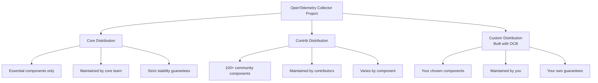
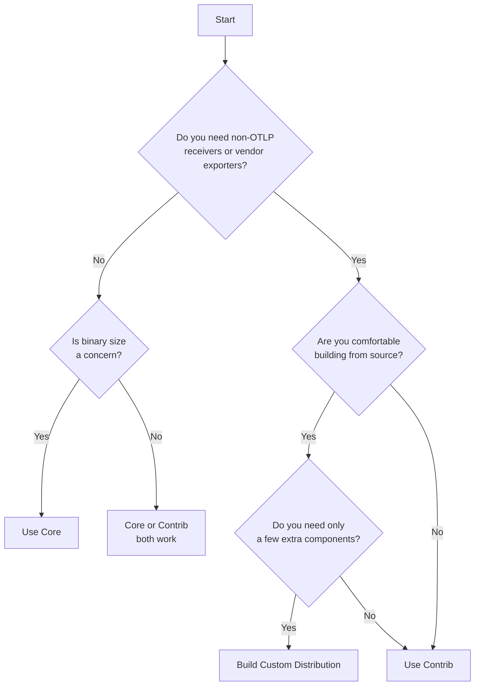

# How to Choose Between Core and Contrib OpenTelemetry Collector

Author: [nawazdhandala](https://www.github.com/nawazdhandala)

Tags: OpenTelemetry, Collector, Core, Contrib, Architecture

Description: Understand the differences between the OpenTelemetry Collector Core and Contrib distributions so you can pick the right one for your team.

---

When you first set up the OpenTelemetry Collector, you will face a choice: use the Core distribution, the Contrib distribution, or build your own. Each option has trade-offs around component availability, binary size, stability guarantees, and maintenance burden. This post breaks down the differences and helps you make the right call.

## The Two Official Distributions

The OpenTelemetry project maintains two official distributions of the collector:



## Core Distribution

The Core distribution includes only the fundamental components that the OpenTelemetry team directly maintains. It is intentionally minimal.

### What is Included in Core

```yaml
# Components available in the Core distribution

receivers:
  - otlp          # The standard OpenTelemetry protocol receiver

processors:
  - batch          # Groups telemetry before export
  - memory_limiter # Prevents out-of-memory crashes

exporters:
  - otlp           # Sends data over gRPC
  - otlphttp       # Sends data over HTTP
  - debug          # Prints telemetry to stdout

extensions:
  - zpages         # In-process debugging pages
  - ballast        # Memory ballast for GC tuning

connectors:
  - forward        # Passes data between pipelines
```

### When to Use Core

Core works best when:

- Your applications already emit OTLP data and your backend accepts OTLP
- You want the smallest possible binary and memory footprint
- You need strong stability guarantees with well-tested releases
- You are running in a constrained environment like edge devices or IoT gateways

Here is a typical Core configuration:

```yaml
# config-core.yaml
# Simple pipeline using only Core components

receivers:
  otlp:
    protocols:
      grpc:
        endpoint: "0.0.0.0:4317"
      http:
        endpoint: "0.0.0.0:4318"

processors:
  batch:
    timeout: 5s
    send_batch_size: 8192

  memory_limiter:
    check_interval: 1s
    limit_percentage: 80
    spike_limit_percentage: 70

exporters:
  otlp:
    endpoint: "backend.example.com:4317"
    tls:
      insecure: false

service:
  pipelines:
    traces:
      receivers: [otlp]
      processors: [memory_limiter, batch]
      exporters: [otlp]
    metrics:
      receivers: [otlp]
      processors: [memory_limiter, batch]
      exporters: [otlp]
    logs:
      receivers: [otlp]
      processors: [memory_limiter, batch]
      exporters: [otlp]
```

## Contrib Distribution

The Contrib distribution is the kitchen-sink option. It bundles everything from Core plus a large collection of community-maintained components.

### Popular Contrib Components

Here is a sampling of what Contrib adds:

```yaml
# A small selection of the 100+ components in Contrib

receivers:
  - prometheus       # Scrape Prometheus endpoints
  - filelog          # Tail and parse log files
  - hostmetrics      # Collect CPU, memory, disk stats
  - kafka            # Consume from Kafka topics
  - mysql            # Query MySQL metrics
  - postgresql       # Query PostgreSQL metrics
  - redis            # Collect Redis metrics
  - nginx            # Parse Nginx stats
  - docker_stats     # Container metrics from Docker
  - k8s_cluster      # Kubernetes cluster metrics
  - k8s_events       # Kubernetes event logs

processors:
  - attributes       # Modify attributes on spans/metrics
  - resource         # Modify resource attributes
  - filter           # Drop unwanted telemetry
  - transform        # OTTL-based transformations
  - tail_sampling    # Intelligent trace sampling
  - k8sattributes    # Enrich with Kubernetes metadata
  - redaction        # Remove sensitive data
  - groupbytrace     # Group spans by trace ID

exporters:
  - kafka            # Send to Kafka topics
  - prometheus       # Expose a Prometheus scrape endpoint
  - elasticsearch    # Send to Elasticsearch
  - loki             # Send logs to Grafana Loki
  - file             # Write telemetry to files
  - awsxray          # AWS X-Ray format
  - datadog          # Datadog backend
```

### When to Use Contrib

Contrib is the right choice when:

- You need to ingest data from non-OTLP sources like Prometheus, Kafka, or log files
- You want vendor-specific exporters for services like Datadog, AWS X-Ray, or Elasticsearch
- You need advanced processing like tail sampling or OTTL transforms
- You are prototyping and want quick access to many components without building a custom distribution

Here is a Contrib configuration that uses several non-Core components:

```yaml
# config-contrib.yaml
# Pipeline using Contrib components for a Kubernetes environment

receivers:
  otlp:
    protocols:
      grpc:
        endpoint: "0.0.0.0:4317"

  # Scrape Prometheus endpoints from pods
  prometheus:
    config:
      scrape_configs:
        - job_name: 'kubernetes-pods'
          kubernetes_sd_configs:
            - role: pod
          relabel_configs:
            - source_labels: [__meta_kubernetes_pod_annotation_prometheus_io_scrape]
              action: keep
              regex: true

  # Collect host-level metrics
  hostmetrics:
    collection_interval: 30s
    scrapers:
      cpu: {}
      memory: {}
      disk: {}

  # Tail application log files
  filelog:
    include:
      - /var/log/pods/*/*/*.log
    operators:
      - type: json_parser
        timestamp:
          parse_from: attributes.time
          layout: '%Y-%m-%dT%H:%M:%S.%fZ'

processors:
  batch:
    timeout: 5s

  memory_limiter:
    limit_percentage: 80
    check_interval: 1s

  # Add Kubernetes metadata to all telemetry
  k8sattributes:
    extract:
      metadata:
        - k8s.pod.name
        - k8s.namespace.name
        - k8s.deployment.name
        - k8s.node.name

  # Drop health check spans to reduce noise
  filter:
    traces:
      span:
        - 'attributes["http.route"] == "/healthz"'
        - 'attributes["http.route"] == "/readyz"'

exporters:
  otlp:
    endpoint: "backend.example.com:4317"

service:
  pipelines:
    traces:
      receivers: [otlp]
      processors: [memory_limiter, k8sattributes, filter, batch]
      exporters: [otlp]
    metrics:
      receivers: [otlp, prometheus, hostmetrics]
      processors: [memory_limiter, k8sattributes, batch]
      exporters: [otlp]
    logs:
      receivers: [otlp, filelog]
      processors: [memory_limiter, k8sattributes, batch]
      exporters: [otlp]
```

## Side-by-Side Comparison

| Aspect | Core | Contrib | Custom |
|---|---|---|---|
| Components | ~10 | 100+ | You choose |
| Binary size | ~80 MB | ~250 MB | Varies |
| Memory at idle | ~40 MB | ~120 MB | Varies |
| Startup time | Fast | Slower | Fastest possible |
| Stability | High | Varies by component | Up to you |
| Maintenance | OTel team | Community | Your team |
| Update frequency | Each release | Each release | When you decide |

## Decision Flowchart

Use this to figure out which distribution fits your situation:



## Component Stability Levels

Not all Contrib components have the same maturity. The OpenTelemetry project uses stability levels:

- **Stable**: Safe for production. Breaking changes follow a deprecation cycle.
- **Beta**: Mostly stable, but the configuration format or behavior might change between versions.
- **Alpha**: Experimental. Expect breaking changes and potential bugs.
- **Development**: Not ready for any real use. Purely for testing.

Check the stability level before depending on a component:

```bash
# Look up a component's stability in the contrib repository
# Each component's README lists its stability level
# Example: checking the tail_sampling processor
curl -s https://raw.githubusercontent.com/open-telemetry/opentelemetry-collector-contrib/main/processor/tailsamplingprocessor/README.md | head -5
```

## Migration Path: Core to Contrib to Custom

Most teams follow a natural progression:

1. **Start with Core** while your applications emit OTLP natively.
2. **Move to Contrib** when you need Prometheus scraping, Kubernetes enrichment, or vendor exporters.
3. **Build a Custom Distribution** when Contrib becomes too large or you need components from outside the official repos.

The configuration files stay the same when switching distributions. You only need to swap out the binary:

```bash
# Switching from Core to Contrib is just a binary swap
# Stop the current collector
systemctl stop otel-collector

# Replace the binary
cp otelcol-contrib /usr/local/bin/otelcol

# Start with the same config
systemctl start otel-collector
```

## Running Both Side by Side

During migration, you can run Core and Contrib collectors side by side using different ports:

```yaml
# config-core-gateway.yaml
# Core collector acts as a lightweight gateway
receivers:
  otlp:
    protocols:
      grpc:
        endpoint: "0.0.0.0:4317"

exporters:
  # Forward to the Contrib collector for enrichment
  otlp:
    endpoint: "localhost:4327"
    tls:
      insecure: true

service:
  pipelines:
    traces:
      receivers: [otlp]
      processors: []
      exporters: [otlp]
```

```yaml
# config-contrib-processor.yaml
# Contrib collector handles enrichment and routing
receivers:
  otlp:
    protocols:
      grpc:
        endpoint: "0.0.0.0:4327"

processors:
  k8sattributes:
    extract:
      metadata:
        - k8s.pod.name
        - k8s.namespace.name
  tail_sampling:
    decision_wait: 10s
    policies:
      - name: errors-policy
        type: status_code
        status_code: {status_codes: [ERROR]}
      - name: slow-traces
        type: latency
        latency: {threshold_ms: 1000}

exporters:
  otlp:
    endpoint: "backend.example.com:4317"

service:
  pipelines:
    traces:
      receivers: [otlp]
      processors: [k8sattributes, tail_sampling]
      exporters: [otlp]
```

## Wrapping Up

The choice between Core, Contrib, and Custom comes down to what your infrastructure needs. Core is lean and stable. Contrib gives you the full buffet. Custom lets you pick exactly what goes on your plate. Start simple, and scale up as your observability requirements grow. The good news is that the configuration format stays consistent across all three, so switching is painless.
