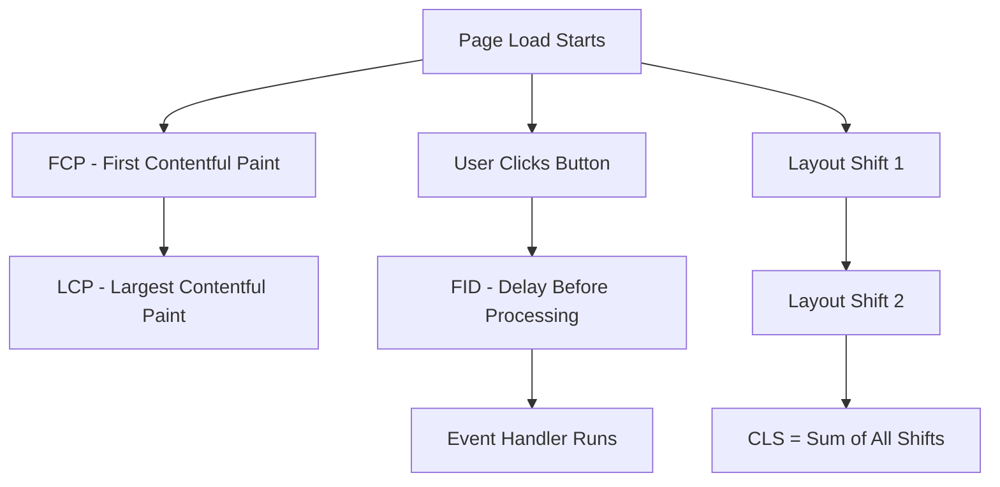

# How to Capture Core Web Vitals (LCP, FID, CLS) as OpenTelemetry Metrics

Author: [nawazdhandala](https://www.github.com/nawazdhandala)

Tags: OpenTelemetry, Core Web Vitals, LCP, FID, CLS, Web Performance, Metrics

Description: Learn how to capture Core Web Vitals like LCP, FID, and CLS as OpenTelemetry metrics for real user performance monitoring and alerting.

---

Core Web Vitals are Google's way of quantifying user experience on the web. Largest Contentful Paint (LCP) measures loading performance, First Input Delay (FID) measures interactivity, and Cumulative Layout Shift (CLS) measures visual stability. These three numbers tell you whether your site feels fast, responsive, and predictable to your users. By capturing them as OpenTelemetry metrics, you can correlate web performance with backend health, set up alerts on degradation, and track improvements over time using the same observability platform you already use for everything else.

## Understanding Core Web Vitals

Before writing any code, it helps to understand what each metric actually measures and what the target values are.

**Largest Contentful Paint (LCP)** tracks the time from when the page starts loading to when the largest image or text block is rendered in the viewport. Google considers an LCP of 2.5 seconds or less to be good, while anything above 4 seconds is poor.

**First Input Delay (FID)** measures the time between when a user first interacts with the page (clicking a button, tapping a link) and when the browser can actually begin processing that event. A good FID is 100 milliseconds or less. Note that FID is being replaced by Interaction to Next Paint (INP) in newer assessments, but FID is still widely tracked.

**Cumulative Layout Shift (CLS)** quantifies how much the page layout shifts unexpectedly during its lifecycle. Every time a visible element moves without user interaction, it contributes to the CLS score. A good CLS is 0.1 or less.



## Setting Up the Dependencies

You need the OpenTelemetry metrics SDK for the browser along with the `web-vitals` library from Google, which provides a reliable cross-browser API for capturing Core Web Vitals.

```bash
# Install OpenTelemetry metrics packages and the web-vitals library
npm install @opentelemetry/api \
  @opentelemetry/sdk-metrics \
  @opentelemetry/resources \
  @opentelemetry/semantic-conventions \
  @opentelemetry/exporter-metrics-otlp-http \
  web-vitals
```

The `web-vitals` library handles all the browser API complexity behind a clean callback interface. It uses the Performance Observer API under the hood and handles edge cases like back-forward cache restoration and visibility changes.

## Configuring the Meter Provider

Set up the OpenTelemetry meter provider to collect and export metrics from the browser.

```javascript
// src/metrics.js
import { MeterProvider, PeriodicExportingMetricReader } from '@opentelemetry/sdk-metrics';
import { OTLPMetricExporter } from '@opentelemetry/exporter-metrics-otlp-http';
import { Resource } from '@opentelemetry/resources';
import {
  ATTR_SERVICE_NAME,
  ATTR_SERVICE_VERSION,
} from '@opentelemetry/semantic-conventions';

// Define the resource for this browser application
const resource = new Resource({
  [ATTR_SERVICE_NAME]: 'my-web-app',
  [ATTR_SERVICE_VERSION]: '1.0.0',
  'deployment.environment': 'production',
});

// Configure the OTLP exporter for metrics
const metricExporter = new OTLPMetricExporter({
  url: 'https://otel-collector.example.com/v1/metrics',
});

// Create a periodic reader that flushes metrics on a schedule
const metricReader = new PeriodicExportingMetricReader({
  exporter: metricExporter,
  // Export metrics every 30 seconds
  exportIntervalMillis: 30000,
  // Timeout for each export attempt
  exportTimeoutMillis: 10000,
});

// Create and configure the meter provider
const meterProvider = new MeterProvider({
  resource: resource,
  readers: [metricReader],
});

// Get a meter instance for recording web vitals
export const meter = meterProvider.getMeter('web-vitals', '1.0.0');

export default meterProvider;
```

The `PeriodicExportingMetricReader` flushes accumulated metrics every 30 seconds. For Core Web Vitals, this interval is fine because the values are reported once per page load (or once per interaction for FID) and do not change rapidly.

## Creating Metric Instruments

Core Web Vitals are best represented as histograms because you want to understand the distribution of values across your user base, not just the average. Histograms let you compute percentiles like p75 and p95, which are more meaningful for performance metrics.

```javascript
// src/web-vitals-metrics.js
import { meter } from './metrics';

// LCP histogram with bucket boundaries aligned to Google's thresholds
// Good: <= 2500ms, Needs Improvement: <= 4000ms, Poor: > 4000ms
export const lcpHistogram = meter.createHistogram('web_vitals.lcp', {
  description: 'Largest Contentful Paint in milliseconds',
  unit: 'ms',
});

// FID histogram with bucket boundaries for interactivity
// Good: <= 100ms, Needs Improvement: <= 300ms, Poor: > 300ms
export const fidHistogram = meter.createHistogram('web_vitals.fid', {
  description: 'First Input Delay in milliseconds',
  unit: 'ms',
});

// CLS histogram - note this is a unitless score, not milliseconds
// Good: <= 0.1, Needs Improvement: <= 0.25, Poor: > 0.25
export const clsHistogram = meter.createHistogram('web_vitals.cls', {
  description: 'Cumulative Layout Shift score',
  unit: '1',
});

// Also track INP as FID's successor
// Good: <= 200ms, Needs Improvement: <= 500ms, Poor: > 500ms
export const inpHistogram = meter.createHistogram('web_vitals.inp', {
  description: 'Interaction to Next Paint in milliseconds',
  unit: 'ms',
});

// TTFB is useful context for understanding LCP
export const ttfbHistogram = meter.createHistogram('web_vitals.ttfb', {
  description: 'Time to First Byte in milliseconds',
  unit: 'ms',
});

// FCP rounds out the loading metrics
export const fcpHistogram = meter.createHistogram('web_vitals.fcp', {
  description: 'First Contentful Paint in milliseconds',
  unit: 'ms',
});
```

Each histogram records individual observations with attributes. The OpenTelemetry backend aggregates these into distributions that you can query by percentile, page URL, device type, or any other attribute you attach.

## Wiring Up the web-vitals Library

Now connect Google's `web-vitals` library to the OpenTelemetry metric instruments. Each vital is reported through a callback function that fires once when the metric is available.

```javascript
// src/report-web-vitals.js
import { onLCP, onFID, onCLS, onINP, onTTFB, onFCP } from 'web-vitals';
import {
  lcpHistogram,
  fidHistogram,
  clsHistogram,
  inpHistogram,
  ttfbHistogram,
  fcpHistogram,
} from './web-vitals-metrics';

// Helper to build common attributes for each metric
function getCommonAttributes() {
  return {
    // Page and navigation context
    'page.url': window.location.pathname,
    'page.host': window.location.hostname,

    // Connection info if available
    'network.effective_type': navigator.connection?.effectiveType || 'unknown',
    'network.downlink': navigator.connection?.downlink || 0,

    // Device context
    'device.type': getDeviceType(),
    'device.memory': navigator.deviceMemory || 0,
    'device.hardware_concurrency': navigator.hardwareConcurrency || 0,
  };
}

// Simple device type detection based on screen width
function getDeviceType() {
  const width = window.innerWidth;
  if (width < 768) return 'mobile';
  if (width < 1024) return 'tablet';
  return 'desktop';
}

// Report LCP to OpenTelemetry
onLCP((metric) => {
  const attributes = {
    ...getCommonAttributes(),
    // The element that triggered LCP
    'lcp.element': metric.entries[0]?.element?.tagName || 'unknown',
    // Rating based on Google's thresholds
    'lcp.rating': metric.rating,
    // Whether this was a navigation or restore
    'lcp.navigation_type': getNavigationType(),
  };

  // Record the LCP value in milliseconds
  lcpHistogram.record(metric.value, attributes);
});

// Report FID to OpenTelemetry
onFID((metric) => {
  const attributes = {
    ...getCommonAttributes(),
    // What type of event caused the first input
    'fid.event_type': metric.entries[0]?.name || 'unknown',
    'fid.rating': metric.rating,
  };

  fidHistogram.record(metric.value, attributes);
});

// Report CLS to OpenTelemetry
onCLS((metric) => {
  const attributes = {
    ...getCommonAttributes(),
    // Number of layout shift entries that contributed
    'cls.entry_count': metric.entries.length,
    'cls.rating': metric.rating,
  };

  // CLS is a score, not milliseconds
  clsHistogram.record(metric.value, attributes);
});

// Report INP to OpenTelemetry
onINP((metric) => {
  const attributes = {
    ...getCommonAttributes(),
    'inp.event_type': metric.entries[0]?.name || 'unknown',
    'inp.rating': metric.rating,
  };

  inpHistogram.record(metric.value, attributes);
});

// Report TTFB to OpenTelemetry
onTTFB((metric) => {
  const attributes = {
    ...getCommonAttributes(),
    'ttfb.rating': metric.rating,
  };

  ttfbHistogram.record(metric.value, attributes);
});

// Report FCP to OpenTelemetry
onFCP((metric) => {
  const attributes = {
    ...getCommonAttributes(),
    'fcp.rating': metric.rating,
  };

  fcpHistogram.record(metric.value, attributes);
});

// Determine the navigation type
function getNavigationType() {
  const entries = performance.getEntriesByType('navigation');
  if (entries.length > 0) {
    return entries[0].type;
  }
  return 'unknown';
}
```

The `web-vitals` library calls each callback with a `metric` object that includes the measured `value`, a `rating` (good, needs-improvement, or poor), and the raw `entries` from the Performance Observer. We extract useful details from the entries and pass everything as attributes on the histogram record.

## Initializing in Your Application

Import the reporting module early in your application lifecycle so the `web-vitals` callbacks are registered before the metrics fire.

```javascript
// src/index.js
// Initialize metrics collection first
import './metrics';
// Register web vitals reporting
import './report-web-vitals';

// Then import and start your application
import { startApp } from './app';
startApp();
```

Order matters here. The `onLCP` and `onFCP` callbacks need to be registered before the page finishes loading, or they will miss the events entirely. The `onCLS` callback is special because CLS accumulates over the page lifecycle and the final value is reported when the page becomes hidden.

## Ensuring Metrics Survive Page Unload

CLS is reported when the user leaves the page, which means the metric export needs to happen during page unload. Add a flush handler to make sure the data gets out.

```javascript
// src/metrics-lifecycle.js
import meterProvider from './metrics';

// Flush metrics when the page becomes hidden
// This is critical for CLS which is only finalized on page hide
document.addEventListener('visibilitychange', () => {
  if (document.visibilityState === 'hidden') {
    meterProvider.forceFlush().catch((err) => {
      // Log but do not throw during page unload
      console.warn('Failed to flush metrics:', err);
    });
  }
});
```

Without this flush handler, CLS values would frequently be lost because the periodic export interval (30 seconds) might not have fired before the user navigates away.

## Setting Up Alerts on Web Vitals

Once the data flows into your observability backend, create alerts that trigger when web vitals degrade. Here is a conceptual example of alert thresholds you might configure in OneUptime or a similar platform:

| Metric | Good Threshold | Warning Threshold | Critical Threshold |
|--------|---------------|-------------------|-------------------|
| LCP p75 | <= 2500ms | <= 4000ms | > 4000ms |
| FID p75 | <= 100ms | <= 300ms | > 300ms |
| CLS p75 | <= 0.1 | <= 0.25 | > 0.25 |
| INP p75 | <= 200ms | <= 500ms | > 500ms |

Using p75 (75th percentile) aligns with Google's methodology for Core Web Vitals assessment. This means 75% of your users must experience values at or below the threshold for the metric to be considered "good."

## Debugging Poor Scores with Attributes

The attributes we attached to each metric make debugging straightforward. If your LCP p75 suddenly spikes, you can break down the histogram by:

- `page.url` to find which pages are affected
- `device.type` to see if it is a mobile-specific issue
- `network.effective_type` to check if slow connections are the cause
- `lcp.element` to identify which DOM element is the bottleneck
- `lcp.navigation_type` to distinguish between fresh loads and back-forward cache restores

This dimensional analysis is one of the major advantages of using OpenTelemetry metrics over simple logging. Instead of guessing why scores changed, you can slice and filter the data to find the root cause.

## Correlating Web Vitals with Traces

If you are also running the OpenTelemetry tracing SDK in the browser (as described in the browser instrumentation guide), you can link web vitals metrics to specific traces. Add the current trace ID as a metric attribute when it is available.

```javascript
// Enhanced attribute builder that includes trace context
import { trace } from '@opentelemetry/api';

function getCommonAttributesWithTrace() {
  const attributes = getCommonAttributes();

  // Get current trace context if available
  const activeSpan = trace.getActiveSpan();
  if (activeSpan) {
    const spanContext = activeSpan.spanContext();
    attributes['trace.id'] = spanContext.traceId;
    attributes['span.id'] = spanContext.spanId;
  }

  return attributes;
}
```

This lets you jump from a slow LCP metric directly to the trace that shows what happened during that page load, including every network request and its timing.

## Summary

Capturing Core Web Vitals as OpenTelemetry metrics gives you continuous, real-user performance monitoring using your existing observability stack. The `web-vitals` library handles the measurement complexity, OpenTelemetry histograms capture the distribution of values across your user base, and dimensional attributes let you slice the data by page, device, and network conditions. Combined with alerting on p75 thresholds, you get early warning when deployments or infrastructure changes degrade the user experience.
