# How to Use OpenTelemetry to Correlate Deployments with Production Incidents Automatically

Author: [nawazdhandala](https://www.github.com/nawazdhandala)

Tags: OpenTelemetry, Deployments, Incident Correlation, Change Management

Description: Automatically link production incidents to recent deployments using OpenTelemetry resource attributes and deployment event tracking.

The most common cause of production incidents is a recent change. Studies consistently show that 60-80% of outages are triggered by deployments, config changes, or infrastructure modifications. When an incident occurs, the first question should always be "What changed?" OpenTelemetry can answer this automatically by recording deployment events as part of your telemetry pipeline and correlating them with error signals.

## Recording Deployments as OpenTelemetry Events

The OpenTelemetry resource semantic conventions include deployment-related attributes. By setting these on your service's resource, every trace, log, and metric automatically carries deployment context.

```python
# Set deployment attributes on the OTel resource
from opentelemetry.sdk.resources import Resource
from opentelemetry.semconv.resource import ResourceAttributes
from opentelemetry.sdk.trace import TracerProvider

resource = Resource.create({
    ResourceAttributes.SERVICE_NAME: "checkout-service",
    ResourceAttributes.SERVICE_VERSION: "2.4.1",
    ResourceAttributes.DEPLOYMENT_ENVIRONMENT: "production",
    # Custom attributes for deployment tracking
    "deployment.id": "deploy-20260206-143022",
    "deployment.git_sha": "a1b2c3d4",
    "deployment.triggered_by": "ci/github-actions",
    "deployment.timestamp": "2026-02-06T14:30:22Z",
})

provider = TracerProvider(resource=resource)
```

## Emitting Deployment Events from CI/CD

Your CI/CD pipeline should emit a deployment event to the OpenTelemetry Collector whenever a deployment completes. This creates a timestamped record that can be correlated with later incidents.

```python
# CI/CD post-deployment hook - emit deployment event via OTel
from opentelemetry import trace
from opentelemetry.sdk.trace import TracerProvider
from opentelemetry.sdk.trace.export import BatchSpanProcessor
from opentelemetry.exporter.otlp.proto.grpc.trace_exporter import OTLPSpanExporter

# Configure exporter pointed at the Collector
exporter = OTLPSpanExporter(endpoint="otel-collector:4317", insecure=True)
provider = TracerProvider()
provider.add_span_processor(BatchSpanProcessor(exporter))
trace.set_tracer_provider(provider)

tracer = trace.get_tracer("deployment.tracker")

def record_deployment(service, version, git_sha, deployer, environment):
    """Call this at the end of a successful deployment."""
    with tracer.start_as_current_span("deployment") as span:
        span.set_attribute("deployment.service", service)
        span.set_attribute("deployment.version", version)
        span.set_attribute("deployment.git_sha", git_sha)
        span.set_attribute("deployment.deployer", deployer)
        span.set_attribute("deployment.environment", environment)
        span.set_attribute("deployment.status", "completed")

        # Add an event with the rollback command for quick reference
        span.add_event("deployment.completed", attributes={
            "rollback_command": f"kubectl rollout undo deployment/{service}",
            "changelog_url": f"https://github.com/org/{service}/compare/{git_sha}~3...{git_sha}"
        })

# Called from CI/CD pipeline
record_deployment(
    service="checkout-service",
    version="2.4.1",
    git_sha="a1b2c3d4",
    deployer="ci-bot",
    environment="production"
)
```

## Collector Configuration for Deployment Correlation

Set up the OpenTelemetry Collector to store deployment events and annotate incoming telemetry with recent deployment information.

```yaml
# otel-collector-deployment-correlation.yaml
receivers:
  otlp:
    protocols:
      grpc:
        endpoint: 0.0.0.0:4317

processors:
  resource:
    attributes:
      - key: cluster
        value: production-us-east
        action: upsert

  # Use the transform processor to flag telemetry from recently deployed services
  transform:
    trace_statements:
      - context: span
        statements:
          # Mark spans with errors from recently deployed versions
          - set(attributes["deployment.recent"], "true")
            where resource.attributes["deployment.timestamp"] != nil

  batch:
    send_batch_size: 512
    timeout: 5s

exporters:
  otlp/backend:
    endpoint: "observability-backend:4317"

service:
  pipelines:
    traces:
      receivers: [otlp]
      processors: [resource, transform, batch]
      exporters: [otlp/backend]
    metrics:
      receivers: [otlp]
      processors: [resource, batch]
      exporters: [otlp/backend]
    logs:
      receivers: [otlp]
      processors: [resource, batch]
      exporters: [otlp/backend]
```

## The Correlation Engine

The correlation engine runs as a background service that watches for error signals and automatically checks whether a recent deployment might be the cause.

```python
# Deployment-incident correlation engine
from datetime import datetime, timedelta

class DeploymentCorrelator:
    # Deployments within this window are considered "recent"
    CORRELATION_WINDOW = timedelta(hours=2)

    def __init__(self, deployment_store, alert_receiver):
        self.deployment_store = deployment_store
        self.alert_receiver = alert_receiver

    def on_incident_detected(self, incident):
        """
        Called when an incident is detected.
        Checks for recent deployments to the affected service.
        """
        service = incident.service_name
        incident_time = incident.detected_at

        # Query deployments within the correlation window
        recent_deployments = self.deployment_store.query(
            service=service,
            time_range=(
                incident_time - self.CORRELATION_WINDOW,
                incident_time
            )
        )

        if not recent_deployments:
            # Check upstream services too - a dependency may have deployed
            upstream_services = get_service_dependencies(service)
            for upstream in upstream_services:
                deps = self.deployment_store.query(
                    service=upstream,
                    time_range=(
                        incident_time - self.CORRELATION_WINDOW,
                        incident_time
                    )
                )
                recent_deployments.extend(deps)

        if recent_deployments:
            self._annotate_incident(incident, recent_deployments)

    def _annotate_incident(self, incident, deployments):
        """Add deployment context to the incident record."""
        for deploy in deployments:
            incident.add_context({
                "type": "correlated_deployment",
                "service": deploy.service,
                "version": deploy.version,
                "git_sha": deploy.git_sha,
                "deployed_at": deploy.timestamp.isoformat(),
                "deployed_by": deploy.deployer,
                "time_before_incident": str(
                    incident.detected_at - deploy.timestamp
                ),
                "changelog_url": deploy.changelog_url,
                "rollback_command": deploy.rollback_command,
            })
```

## Visualizing the Correlation

```mermaid
gantt
    title Deployment to Incident Correlation
    dateFormat HH:mm
    axisFormat %H:%M

    section Deployments
    checkout-service v2.4.1    :deploy1, 14:30, 5min
    payment-service v3.1.0     :deploy2, 14:45, 5min

    section Incidents
    Error rate spike (checkout) :crit, incident1, 14:52, 30min
    Timeout errors (payment)    :crit, incident2, 15:01, 20min
```



## Error Rate Comparison Before and After Deploy

A powerful validation technique is comparing error rates from the pre-deployment window with the post-deployment window. This PromQL query computes the relative change.

```promql
# Error rate change after deployment
# Compare the 30-minute post-deploy window with the 30-minute pre-deploy window
(
  sum(rate(http_server_request_count_total{status_code=~"5..", service_name="checkout-service"}[30m]))
  /
  sum(rate(http_server_request_count_total{service_name="checkout-service"}[30m]))
)
/
(
  sum(rate(http_server_request_count_total{status_code=~"5..", service_name="checkout-service"}[30m] offset 1h))
  /
  sum(rate(http_server_request_count_total{service_name="checkout-service"}[30m] offset 1h))
)
```

A value greater than 2.0 means the error rate more than doubled after the deployment - a strong signal that the deploy caused the problem.

## Practical Benefits

Automated deployment-incident correlation provides three immediate benefits. First, it cuts the investigation phase of incidents from minutes to seconds by pointing responders directly at the most likely cause. Second, it creates an auditable record of which deployments caused which incidents, feeding into deployment frequency and change failure rate metrics. Third, it enables automatic rollback policies where deployments that correlate with error spikes are rolled back without human intervention. The foundation for all of this is having deployment data flow through the same OpenTelemetry pipeline as your application telemetry.
