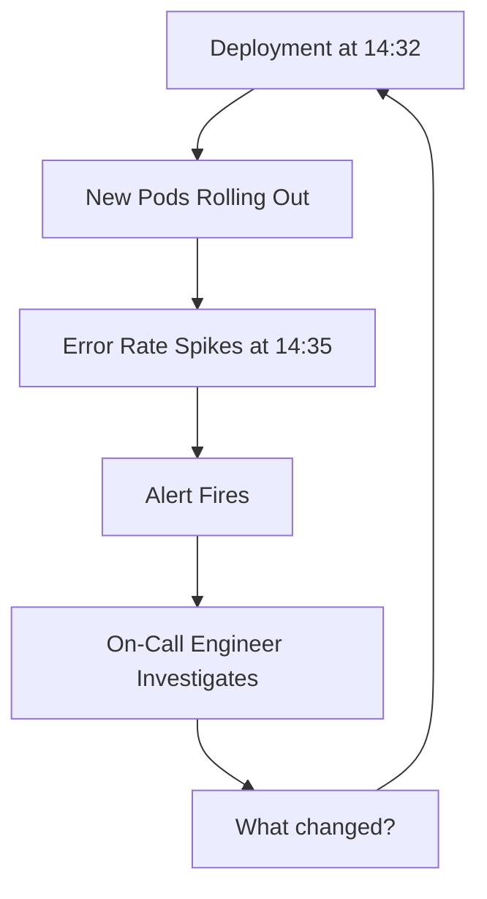
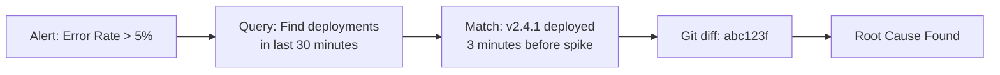

# How to Use OpenTelemetry to Correlate Deployments with Production Incidents

Author: [nawazdhandala](https://www.github.com/nawazdhandala)

Tags: OpenTelemetry, Deployments, Incident Response, Observability, Tracing, Metrics, CI/CD

Description: Learn how to use OpenTelemetry to correlate deployment events with production incidents for faster root cause analysis.

---

The most common cause of production incidents is a recent deployment. Yet in many organizations, the people investigating an outage have no easy way to see what was deployed and when. They end up checking Slack messages, deployment logs, and git history while the incident burns on. OpenTelemetry can bridge this gap by recording deployment events as part of your telemetry data, making it straightforward to correlate a spike in errors with the exact deployment that caused it.

This guide shows how to emit deployment markers, attach version metadata to your services, and build queries that connect incidents to their root cause.

---

## The Correlation Problem



The loop from alert to deployment should be instant. With proper instrumentation, it is. Without it, you are spending the first 15 minutes of every incident just figuring out whether a deploy happened recently.

---

## Step 1: Embed Version Metadata in Your Services

The foundation of deployment correlation is making sure every piece of telemetry includes the version of the code that produced it. OpenTelemetry resource attributes are the right place for this:

```python
# resource_config.py
# This module configures the OpenTelemetry resource with deployment metadata.
# The version, commit hash, and deploy timestamp are pulled from environment
# variables that your CI/CD pipeline sets during deployment.

import os
from opentelemetry.sdk.resources import Resource

def create_service_resource():
    """Build a resource with deployment-specific attributes."""
    return Resource.create({
        "service.name": os.getenv("SERVICE_NAME", "unknown"),
        "service.version": os.getenv("APP_VERSION", "unknown"),
        "service.namespace": os.getenv("SERVICE_NAMESPACE", "production"),

        # Deployment-specific attributes
        "deployment.id": os.getenv("DEPLOY_ID", "unknown"),
        "deployment.commit": os.getenv("GIT_COMMIT_SHA", "unknown"),
        "deployment.branch": os.getenv("GIT_BRANCH", "main"),
        "deployment.timestamp": os.getenv("DEPLOY_TIMESTAMP", "unknown"),
        "deployment.triggered_by": os.getenv("DEPLOY_USER", "unknown"),
    })
```

You set these environment variables in your deployment manifests. Here is a Kubernetes deployment that injects them:

```yaml
# deployment.yaml
# The deployment manifest injects version and commit metadata as environment
# variables. These values come from your CI/CD pipeline and get embedded
# into every trace and metric the service emits.

apiVersion: apps/v1
kind: Deployment
metadata:
  name: api-server
  annotations:
    deploy.timestamp: "2026-02-06T14:32:00Z"
    deploy.commit: "abc123f"
spec:
  template:
    spec:
      containers:
        - name: api-server
          image: myregistry/api-server:v2.4.1
          env:
            - name: APP_VERSION
              value: "v2.4.1"
            - name: GIT_COMMIT_SHA
              value: "abc123f"
            - name: GIT_BRANCH
              value: "main"
            - name: DEPLOY_ID
              value: "deploy-20260206-143200"
            - name: DEPLOY_TIMESTAMP
              value: "2026-02-06T14:32:00Z"
            - name: SERVICE_NAME
              value: "api-server"
```

Now every span and metric emitted by this service includes the version and deployment information. When you see an error trace, you immediately know which version of the code produced it.

---

## Step 2: Emit Deployment Events as Spans

Beyond tagging your service telemetry, you should also emit explicit deployment event spans from your CI/CD pipeline. These act as markers on your timeline:

```python
# deploy_tracer.py
# This script runs as part of your deployment pipeline. It creates a span
# that represents the entire deployment process, including metadata about
# what is being deployed and where. This span shows up on your trace
# timeline as a deployment marker.

import time
import os
from opentelemetry import trace
from opentelemetry.sdk.trace import TracerProvider
from opentelemetry.sdk.trace.export import BatchSpanProcessor
from opentelemetry.exporter.otlp.proto.grpc.trace_exporter import OTLPSpanExporter
from opentelemetry.sdk.resources import Resource

resource = Resource.create({
    "service.name": "deployment-pipeline",
    "deployment.environment": os.getenv("DEPLOY_ENV", "production"),
})

provider = TracerProvider(resource=resource)
provider.add_span_processor(
    BatchSpanProcessor(OTLPSpanExporter(
        endpoint=os.getenv("OTEL_ENDPOINT", "http://otel-collector:4317")
    ))
)
trace.set_tracer_provider(provider)
tracer = trace.get_tracer("deployment.tracker")

def record_deployment(service_name, version, commit_sha, deploy_env):
    """Record a deployment as a traced span with rich metadata."""
    with tracer.start_as_current_span("deployment") as span:
        span.set_attribute("deploy.service", service_name)
        span.set_attribute("deploy.version", version)
        span.set_attribute("deploy.commit", commit_sha)
        span.set_attribute("deploy.environment", deploy_env)
        span.set_attribute("deploy.start_time", time.time())

        # Run the actual deployment
        success = execute_deployment(service_name, version)

        span.set_attribute("deploy.success", success)
        span.set_attribute("deploy.end_time", time.time())

        if not success:
            span.set_status(trace.StatusCode.ERROR, "Deployment failed")

    provider.shutdown()
    return success

def execute_deployment(service_name, version):
    """Placeholder for your actual deployment logic."""
    # kubectl apply, helm upgrade, etc.
    return True
```

These deployment spans appear on the same timeline as your application traces. When you zoom into a period where errors spiked, the deployment marker is right there showing you exactly what changed.

---

## Step 3: Track Error Rates with Version Labels

The real power comes from breaking down error metrics by version. This lets you see whether a new version introduced regressions:

```python
# version_metrics.py
# This module creates metrics that are automatically tagged with the current
# service version. When you graph these metrics, you can see error rates
# broken down by version, making it obvious when a new deploy causes issues.

from opentelemetry import metrics, trace
from opentelemetry.sdk.metrics import MeterProvider
from opentelemetry.sdk.metrics.export import PeriodicExportingMetricReader
from opentelemetry.exporter.otlp.proto.grpc.metric_exporter import OTLPMetricExporter
import os

reader = PeriodicExportingMetricReader(
    OTLPMetricExporter(endpoint="http://otel-collector:4317"),
    export_interval_millis=15000,
)
provider = MeterProvider(metric_readers=[reader])
metrics.set_meter_provider(provider)

meter = metrics.get_meter("app.metrics")

# These counters track request outcomes with version information
request_counter = meter.create_counter(
    "http.requests.total",
    description="Total HTTP requests by version and status",
)

error_counter = meter.create_counter(
    "http.errors.total",
    description="Total HTTP errors by version and endpoint",
)

request_duration = meter.create_histogram(
    "http.request.duration",
    unit="ms",
    description="Request duration by version",
)

VERSION = os.getenv("APP_VERSION", "unknown")

def record_request(endpoint, status_code, duration_ms):
    """Record metrics for an HTTP request with version context."""
    attrs = {
        "service.version": VERSION,
        "http.route": endpoint,
        "http.status_code": status_code,
    }

    request_counter.add(1, attrs)
    request_duration.record(duration_ms, attrs)

    if status_code >= 500:
        error_counter.add(1, attrs)
```

With these metrics, you can build a dashboard that shows error rates grouped by version. A pattern like "errors went from 0.1% to 5% right when v2.4.1 rolled out" becomes immediately visible.

---

## Step 4: Automated Deployment Annotations

For a more automated approach, create a deployment webhook that sends annotations whenever a new version goes live:

```python
# deploy_webhook.py
# This webhook handler receives deployment notifications from your CI/CD
# system and converts them into OpenTelemetry log events. These events
# show up as annotations on your dashboards, providing visual markers
# for when deployments happened.

from opentelemetry import trace
from opentelemetry.sdk.trace import TracerProvider
from opentelemetry.sdk.trace.export import BatchSpanProcessor
from opentelemetry.exporter.otlp.proto.grpc.trace_exporter import OTLPSpanExporter
from opentelemetry.sdk.resources import Resource
from flask import Flask, request, jsonify

app = Flask(__name__)

resource = Resource.create({"service.name": "deploy-annotator"})
provider = TracerProvider(resource=resource)
provider.add_span_processor(
    BatchSpanProcessor(OTLPSpanExporter(endpoint="http://otel-collector:4317"))
)
trace.set_tracer_provider(provider)
tracer = trace.get_tracer("deploy.annotator")

@app.route("/deploy-event", methods=["POST"])
def handle_deploy_event():
    """Receive a deployment event and emit it as a trace annotation."""
    data = request.json

    with tracer.start_as_current_span("deploy-annotation") as span:
        span.set_attribute("deploy.service", data.get("service"))
        span.set_attribute("deploy.version", data.get("version"))
        span.set_attribute("deploy.commit", data.get("commit"))
        span.set_attribute("deploy.environment", data.get("environment"))
        span.set_attribute("deploy.user", data.get("triggered_by"))
        span.set_attribute("deploy.changelog", data.get("changelog", ""))

        # Add an event for each changed file if available
        for changed_file in data.get("changed_files", []):
            span.add_event("file_changed", {"file": changed_file})

    return jsonify({"status": "recorded"}), 200
```

Call this webhook from your CI/CD pipeline at the end of each deployment. You can integrate it into GitHub Actions, Jenkins, or any other system with a simple curl command:

```bash
# Call the deploy annotation webhook from your CI/CD pipeline
# This creates a trace event that marks the deployment on your timeline
curl -X POST http://deploy-annotator:5000/deploy-event \
  -H "Content-Type: application/json" \
  -d '{
    "service": "api-server",
    "version": "v2.4.1",
    "commit": "abc123f",
    "environment": "production",
    "triggered_by": "github-actions",
    "changelog": "Fixed rate limiter, updated auth flow"
  }'
```

---

## Step 5: Building the Incident Correlation Query

With deployment markers and versioned telemetry in place, you can build queries that answer the key incident question directly:



The workflow becomes: alert fires, query your traces for recent deployment spans, compare the deployment timestamp with the error spike, and you have your answer. What used to take 15 minutes of investigation now takes 30 seconds.

---

## Practical Tips

There are a few things to keep in mind as you build this out. First, always include the git commit SHA in your resource attributes. Version numbers are useful but commit hashes are unambiguous and let you jump straight to a diff. Second, emit deployment spans from your pipeline rather than from the application itself. The application does not know when it was deployed; the pipeline does. Third, keep your deployment annotations lightweight. You want the service name, version, commit, environment, and timestamp. Anything beyond that is noise during an incident.

Finally, consider setting up automated rollback triggers. If your error rate metric shows a significant increase for a new version within the first few minutes after deployment, that is a strong signal to roll back automatically. The versioned metrics you are collecting make this detection reliable.

---

## Summary

Correlating deployments with production incidents is one of the highest-value uses of OpenTelemetry. By embedding version metadata in your service resources, emitting deployment markers from your CI/CD pipeline, and tracking error rates by version, you create a direct link between "something broke" and "this is what changed." The result is faster incident resolution and a clear audit trail of what was deployed, when, and by whom.
