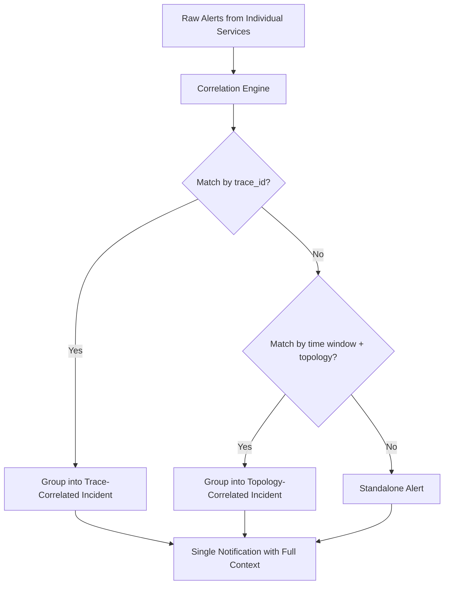

# How to Implement Correlation-Based Alerting That Links Related Alerts Across OpenTelemetry Services

Author: [nawazdhandala](https://www.github.com/nawazdhandala)

Tags: OpenTelemetry, Alerting, Correlation, Distributed Systems

Description: Learn how to build correlation-based alerting that groups and links related alerts across multiple OpenTelemetry-instrumented services to reduce noise and speed up incident response.

When a distributed system starts failing, you rarely get a single alert. You get dozens. The database latency spikes, upstream services start timing out, downstream consumers begin backing up, and suddenly your on-call engineer is staring at 40 alerts that all stem from one root cause. Correlation-based alerting solves this by linking related alerts together using the context that OpenTelemetry already provides.

## The Problem with Independent Alerts

Traditional alerting treats each metric, log, or trace threshold independently. Service A fires an error rate alert. Service B fires a latency alert. Service C fires a saturation alert. Each one pages someone, and the team spends the first 15 minutes of an incident just figuring out that these are all the same problem.

OpenTelemetry gives us the building blocks to fix this. Traces carry context across service boundaries through `trace_id` and `span_id`. Resource attributes like `service.name`, `service.namespace`, and `deployment.environment` let us group signals by logical service topology.

## Correlation Strategy

The approach works in three layers:



## Step 1: Enrich Alerts with OpenTelemetry Resource Attributes

First, make sure your OpenTelemetry Collector exports resource attributes alongside your metrics. This config adds service topology labels to every metric:

```yaml
# otel-collector-config.yaml
# This processor adds resource attributes to metrics so alerts carry service context
processors:
  resource:
    attributes:
      - key: service.namespace
        value: "payments-platform"
        action: upsert
      - key: service.tier
        value: "critical"
        action: upsert

  # Transform processor copies resource attributes into metric labels
  transform:
    metric_statements:
      - context: datapoint
        statements:
          - set(attributes["service.name"], resource.attributes["service.name"])
          - set(attributes["service.namespace"], resource.attributes["service.namespace"])
          - set(attributes["deployment.environment"], resource.attributes["deployment.environment"])

exporters:
  prometheus:
    endpoint: "0.0.0.0:8889"
    resource_to_telemetry_conversion:
      enabled: true

service:
  pipelines:
    metrics:
      receivers: [otlp]
      processors: [resource, transform]
      exporters: [prometheus]
```

## Step 2: Define Correlation Rules

Correlation rules determine which alerts belong together. Here is an example configuration for a correlation engine that groups alerts by shared attributes:

```yaml
# correlation-rules.yaml
# Rules that determine how alerts are grouped into incidents
rules:
  # Group alerts that share the same trace_id within a 5-minute window
  - name: trace-correlation
    priority: 1
    match:
      conditions:
        - field: trace_id
          operator: equals
          across: alerts
    window: 5m
    group_key: trace_id

  # Group alerts from services in the same namespace firing within 2 minutes
  - name: namespace-correlation
    priority: 2
    match:
      conditions:
        - field: labels.service_namespace
          operator: equals
          across: alerts
        - field: labels.deployment_environment
          operator: equals
          across: alerts
    window: 2m
    group_key: "{{ .labels.service_namespace }}-{{ .labels.deployment_environment }}"

  # Group alerts from services with known dependency relationships
  - name: dependency-correlation
    priority: 3
    match:
      conditions:
        - field: labels.service_name
          operator: in_dependency_graph
          source: topology_map
    window: 3m
    group_key: "dependency-{{ .topology_root }}"
```

## Step 3: Build the Topology Map from Traces

OpenTelemetry traces already encode service dependencies. You can extract these to build a live topology map that the correlation engine references. This query pulls parent-child service relationships from span data:

```sql
-- Extract service dependency pairs from OpenTelemetry trace data
-- Run this periodically to keep the topology map current
SELECT DISTINCT
    parent.resource_attributes['service.name'] AS upstream_service,
    child.resource_attributes['service.name'] AS downstream_service,
    COUNT(*) AS call_count
FROM spans AS child
JOIN spans AS parent
    ON child.parent_span_id = parent.span_id
    AND child.trace_id = parent.trace_id
WHERE child.start_time > NOW() - INTERVAL '1 hour'
GROUP BY upstream_service, downstream_service
HAVING call_count > 10;
```

## Step 4: Implement Correlation in Alertmanager

If you use Prometheus Alertmanager, you can get basic correlation through its grouping mechanism. The key is to group by the OpenTelemetry resource attributes:

```yaml
# alertmanager.yaml
# Group alerts by namespace and environment so related services cluster together
route:
  receiver: 'oncall-team'
  group_by: ['service_namespace', 'deployment_environment', 'alertname']
  group_wait: 30s
  group_interval: 2m
  repeat_interval: 4h

  routes:
    # Critical tier services get tighter correlation windows
    - match:
        service_tier: critical
      group_by: ['service_namespace', 'deployment_environment']
      group_wait: 15s
      group_interval: 1m
      receiver: 'oncall-team-critical'

    # Trace-correlated alerts when trace_id is present
    - match_re:
        trace_id: '.+'
      group_by: ['trace_id']
      group_wait: 60s
      group_interval: 3m
      receiver: 'oncall-team'

receivers:
  - name: 'oncall-team'
    webhook_configs:
      - url: 'http://correlation-engine:8080/alerts'
  - name: 'oncall-team-critical'
    webhook_configs:
      - url: 'http://correlation-engine:8080/alerts?priority=critical'
```

## Step 5: Attach Diagnostic Context to Correlated Alerts

Once alerts are grouped, enrich the notification with trace and log data. This Python snippet fetches related traces when an alert group fires:

```python
# fetch_correlated_context.py
# Pulls trace and log data for all services involved in a correlated alert group
import requests
from datetime import datetime, timedelta

def enrich_alert_group(alert_group):
    services = set(a["labels"]["service_name"] for a in alert_group["alerts"])
    start_time = min(a["starts_at"] for a in alert_group["alerts"])
    end_time = max(a["starts_at"] for a in alert_group["alerts"])

    # Query for error traces spanning the alert window
    traces = query_traces(
        services=list(services),
        start=start_time,
        end=end_time,
        status="ERROR"
    )

    # Build a summary showing which service triggered first
    timeline = sorted(alert_group["alerts"], key=lambda a: a["starts_at"])
    root_cause_candidate = timeline[0]["labels"]["service_name"]

    return {
        "correlated_alerts": len(alert_group["alerts"]),
        "services_affected": list(services),
        "likely_root_cause": root_cause_candidate,
        "error_traces": traces[:5],
        "timeline": [
            {"service": a["labels"]["service_name"], "time": a["starts_at"], "alert": a["labels"]["alertname"]}
            for a in timeline
        ]
    }
```

## What Good Correlation Looks Like

Instead of five separate pages, your on-call engineer gets one notification:

- **Incident**: Payments namespace degradation
- **Root cause candidate**: `payments-db` (first alert at 14:02:03)
- **Affected services**: `payments-api`, `payments-worker`, `checkout-service`, `order-service`
- **Related traces**: 3 error traces showing timeout propagation from `payments-db` through the call chain

This approach cuts mean-time-to-acknowledge by grouping noise into signal. The OpenTelemetry resource attributes and trace context that you already collect become the correlation keys that tie everything together. Start with namespace-level grouping through Alertmanager, then layer on trace-based and topology-based correlation as your system matures.
