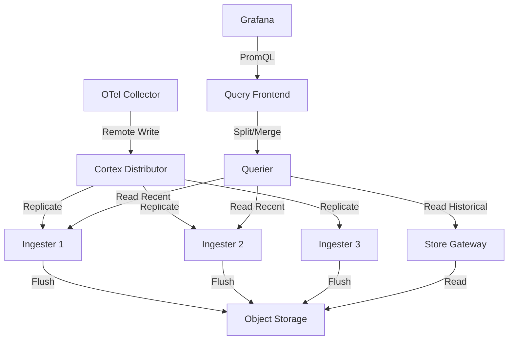

# How to Use Cortex as an OpenTelemetry Metrics Backend

Author: [nawazdhandala](https://www.github.com/nawazdhandala)

Tags: OpenTelemetry, Cortex, Metrics, Prometheus, Multi-Tenant, Scalable Backend

Description: Learn how to deploy and configure Cortex as a horizontally scalable multi-tenant metrics backend for OpenTelemetry with remote write integration.

---

When you are running OpenTelemetry at scale across multiple teams and services, you need a metrics backend that handles multi-tenancy, horizontal scaling, and long-term storage without requiring you to run a fleet of individual Prometheus servers. Cortex fills this role. It is a horizontally scalable, multi-tenant Prometheus-compatible metrics backend that accepts data via remote write and stores it in object storage.

This guide covers setting up Cortex as the metrics backend for your OpenTelemetry pipeline, from deployment through collector integration to querying and tenant management.

## What Cortex Brings to the Table

Cortex was originally built at Weaveworks and is now a CNCF incubating project. It takes the Prometheus data model and query language and makes them work at massive scale. The key features that matter for OpenTelemetry deployments are multi-tenancy with per-tenant limits, horizontal scaling of both write and read paths, long-term storage in S3, GCS, or Azure Blob, and a global view of metrics across all ingesters.

Unlike running multiple Prometheus instances, Cortex gives you a single endpoint that handles isolation between teams automatically. Each tenant gets their own view of the data, their own rate limits, and their own retention settings.

## Architecture Overview

Cortex uses a microservices architecture where each component handles a specific part of the pipeline. For OpenTelemetry integration, the write path and read path look like this.



The Distributor receives incoming samples, hashes them by series, and forwards them to the correct Ingesters via a hash ring. Ingesters hold recent data in memory and periodically flush it to object storage. The Querier reads from both Ingesters (for recent data) and the Store Gateway (for historical data).

## Deploying Cortex

For a production-grade setup, you will want to run Cortex in microservices mode. But for getting started and validating the integration, single-binary mode works well. Here is a Cortex configuration file that runs all components in a single process with S3 storage.

```yaml
# cortex-config.yaml
# Single-binary Cortex configuration for OpenTelemetry metrics storage
# Switch to microservices mode for production by running each target separately

target: all

# Server configuration for HTTP and gRPC endpoints
server:
  http_listen_port: 9009
  grpc_listen_port: 9095

# Distributor handles incoming write requests and routes to ingesters
distributor:
  # Use the ring-based routing for ingester selection
  ring:
    kvstore:
      store: memberlist
  # Accept samples up to 5 minutes in the past
  # OTel collectors may batch and delay slightly
  ha_tracker:
    enable_ha_tracker: false

# Ingester holds recent samples in memory before flushing to storage
ingester:
  ring:
    kvstore:
      store: memberlist
    replication_factor: 3
  # Flush chunks to storage every 15 minutes
  flush_period: 15m
  # Keep chunks in memory for at least 12 hours for fast recent queries
  retain_period: 12h

# Block storage configuration using S3
blocks_storage:
  backend: s3
  s3:
    bucket_name: "cortex-otel-metrics"
    endpoint: "s3.us-east-1.amazonaws.com"
    region: "us-east-1"
  # TSDB configuration for ingester block management
  tsdb:
    dir: /var/cortex/tsdb
    # Block ranges determine compaction behavior
    block_ranges_period: [2h]
    retention_period: 24h

# Store gateway reads historical blocks from object storage
store_gateway:
  sharding_ring:
    kvstore:
      store: memberlist

# Querier configuration for reading data
querier:
  # Query both ingesters and store gateway
  query_store_after: 12h
  query_ingesters_within: 13h

# Compactor merges blocks and handles retention in object storage
compactor:
  data_dir: /var/cortex/compactor
  sharding_ring:
    kvstore:
      store: memberlist

# Limits applied per tenant
limits:
  # Maximum active series per tenant
  max_global_series_per_user: 1500000
  # Maximum samples per second per tenant
  ingestion_rate: 100000
  ingestion_burst_size: 200000
  # Retention period for stored data
  compactor_blocks_retention_period: 90d

# Memberlist for component discovery without external dependencies
memberlist:
  join_members:
    - cortex-gossip-ring:7946
```

Start Cortex with this configuration.

```bash
# Launch Cortex in single-binary mode for initial setup and testing
# For production, run each target separately: distributor, ingester, querier, etc.
cortex \
  -config.file=/etc/cortex/cortex-config.yaml \
  -target=all
```

## Configuring the OpenTelemetry Collector

The collector sends metrics to Cortex using the Prometheus remote write protocol. The critical piece is the tenant header. Cortex uses the `X-Scope-OrgID` HTTP header to identify which tenant the data belongs to.

```yaml
# otel-collector-config.yaml
# OpenTelemetry Collector configured to export metrics to Cortex
receivers:
  otlp:
    protocols:
      grpc:
        endpoint: 0.0.0.0:4317
      http:
        endpoint: 0.0.0.0:4318

processors:
  # Batch metrics to improve write efficiency
  batch:
    timeout: 15s
    send_batch_size: 2000

  # Memory limiter prevents the collector from using too much memory
  memory_limiter:
    check_interval: 5s
    limit_mib: 512
    spike_limit_mib: 128

exporters:
  # Prometheus remote write to Cortex distributor
  prometheusremotewrite:
    endpoint: "http://cortex-distributor:9009/api/v1/push"
    # Tenant identification header required by Cortex
    headers:
      X-Scope-OrgID: "team-platform"
    # Convert OTel resource attributes to Prometheus labels
    resource_to_telemetry_conversion:
      enabled: true
    # Retry configuration for resilience
    retry_on_failure:
      enabled: true
      initial_interval: 5s
      max_interval: 60s
      max_elapsed_time: 300s
    # Send metadata for metric descriptions and types
    send_metadata: true

service:
  pipelines:
    metrics:
      receivers: [otlp]
      processors: [memory_limiter, batch]
      exporters: [prometheusremotewrite]
```

If you have multiple teams, you can run separate collector pipelines with different `X-Scope-OrgID` values, or use the routing connector to split metrics by team based on resource attributes.

## Multi-Tenant Configuration

One of the strongest reasons to use Cortex is per-tenant isolation. You can set different limits for each team.

```yaml
# cortex-runtime-config.yaml
# Runtime configuration for per-tenant overrides
# This file can be updated without restarting Cortex
overrides:
  # Platform team handles core infrastructure metrics
  team-platform:
    max_global_series_per_user: 3000000
    ingestion_rate: 200000
    compactor_blocks_retention_period: 180d

  # Application team has moderate usage
  team-application:
    max_global_series_per_user: 500000
    ingestion_rate: 50000
    compactor_blocks_retention_period: 90d

  # Development environments get smaller limits
  team-dev:
    max_global_series_per_user: 100000
    ingestion_rate: 10000
    compactor_blocks_retention_period: 14d
```

Load this runtime configuration by adding the flag to Cortex.

```bash
# Start Cortex with runtime configuration for per-tenant limits
# The runtime config is reloaded periodically without restart
cortex \
  -config.file=/etc/cortex/cortex-config.yaml \
  -runtime-config.file=/etc/cortex/cortex-runtime-config.yaml \
  -runtime-config.reload-period=1m
```

## Querying OpenTelemetry Metrics

Cortex exposes a Prometheus-compatible query API. You query it with standard PromQL, but you need to provide the tenant header.

```bash
# Query metrics for a specific tenant using curl
# The X-Scope-OrgID header identifies which tenant's data to query
curl -H "X-Scope-OrgID: team-platform" \
  "http://cortex-query-frontend:9009/prometheus/api/v1/query" \
  --data-urlencode 'query=rate(http_server_request_duration_seconds_count[5m])'
```

For Grafana, configure the data source with the tenant header.

```yaml
# grafana-cortex-datasource.yaml
# Grafana datasource for Cortex with tenant identification
apiVersion: 1
datasources:
  - name: Cortex - Platform Team
    type: prometheus
    access: proxy
    url: http://cortex-query-frontend:9009/prometheus
    isDefault: true
    jsonData:
      # Custom header for multi-tenant identification
      httpHeaderName1: "X-Scope-OrgID"
    secureJsonData:
      httpHeaderValue1: "team-platform"
```

## Recording Rules and Alerts

Cortex supports Prometheus-compatible recording rules and alerting rules, loaded per-tenant through the ruler component. This lets each team define their own alert thresholds.

```yaml
# platform-team-rules.yaml
# Recording rules for pre-aggregating common OpenTelemetry metric queries
# These run inside Cortex and results are stored as new series
groups:
  - name: otel_http_aggregations
    interval: 1m
    rules:
      # Pre-compute request rate per service for dashboard performance
      - record: service:http_requests:rate5m
        expr: sum by (service_name) (rate(http_server_request_duration_seconds_count[5m]))

      # Pre-compute p99 latency per service
      - record: service:http_latency_p99:5m
        expr: histogram_quantile(0.99, sum by (service_name, le) (rate(http_server_request_duration_seconds_bucket[5m])))

  - name: otel_http_alerts
    rules:
      # Alert when error rate exceeds 5% for any service
      - alert: HighErrorRate
        expr: |
          sum by (service_name) (rate(http_server_request_duration_seconds_count{http_status_code=~"5.."}[5m]))
          / sum by (service_name) (rate(http_server_request_duration_seconds_count[5m]))
          > 0.05
        for: 5m
        labels:
          severity: warning
```

## Wrapping Up

Cortex gives you a production-grade metrics backend for OpenTelemetry that scales horizontally and supports multi-tenancy out of the box. The Prometheus remote write integration means the OpenTelemetry Collector connects with minimal configuration, and the PromQL compatibility means your existing dashboards and alerts work without changes. Start with single-binary mode to validate the pipeline, then move to microservices mode as your scale requires dedicated resources for each component.
