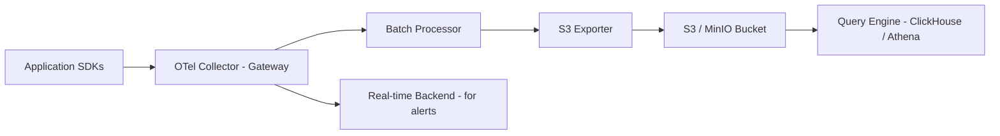

# How to Build a Cost-Effective Observability Pipeline with OpenTelemetry Collector and Object Storage

Author: [nawazdhandala](https://www.github.com/nawazdhandala)

Tags: OpenTelemetry, Observability, Object Storage, Cost Optimization

Description: Learn how to architect an observability pipeline using the OpenTelemetry Collector with S3-compatible object storage to reduce telemetry storage costs dramatically.

Observability backends are expensive. If you have ever looked at your monthly bill from a SaaS vendor and wondered where all that money went, the answer is usually storage. Traces, metrics, and logs pile up fast, and most vendors charge by volume. The good news is that you can build your own cost-effective pipeline using the OpenTelemetry Collector paired with object storage like Amazon S3, MinIO, or Google Cloud Storage.

This post walks through the architecture, configuration, and trade-offs of routing telemetry data through the OpenTelemetry Collector directly into object storage.

## Why Object Storage?

Object storage services like S3 cost roughly $0.023 per GB per month for standard tiers. Compare that to most observability SaaS platforms that charge $1.50 to $3.00 per GB ingested. For a team generating 500 GB of telemetry per day, the difference is staggering - potentially tens of thousands of dollars per month.

The trade-off is that raw object storage does not give you a query engine out of the box. You need to pair it with something like Apache Parquet files and a query layer (ClickHouse, DuckDB, or Athena) to make the data useful.

## Architecture Overview

Here is how the pipeline fits together:



The key idea is to use the Collector as a gateway that fans out telemetry to two destinations: object storage for long-term retention and a lightweight real-time backend for alerting.

## Setting Up the OpenTelemetry Collector

The Collector has a contributed `awss3exporter` that writes telemetry directly to S3-compatible storage. You will need the `otelcol-contrib` distribution since this exporter is not in the core build.

Here is a Collector configuration that receives OTLP data and writes it to S3 in batches:

```yaml
# otel-collector-config.yaml
# This config receives OTLP telemetry and exports to S3 in batched Parquet-friendly format

receivers:
  otlp:
    protocols:
      grpc:
        endpoint: 0.0.0.0:4317
      http:
        endpoint: 0.0.0.0:4318

processors:
  # Batch telemetry to reduce the number of S3 PUT requests
  # Each PUT request costs money, so larger batches save on API costs
  batch:
    send_batch_size: 10000
    send_batch_max_size: 15000
    timeout: 60s

  # Strip high-cardinality attributes that inflate storage size
  attributes:
    actions:
      - key: http.request.header.cookie
        action: delete
      - key: http.request.header.authorization
        action: delete

exporters:
  # Write telemetry to S3 as JSON files partitioned by date
  awss3:
    s3uploader:
      region: us-east-1
      s3_bucket: my-telemetry-bucket
      s3_prefix: otel-data
      # Partition by signal type and date for efficient querying
      s3_partition: "minute"
    marshaler: otlp_json

  # Keep a real-time exporter for alerting on critical signals
  otlp/realtime:
    endpoint: "alerting-backend:4317"
    tls:
      insecure: true

service:
  pipelines:
    traces:
      receivers: [otlp]
      processors: [attributes, batch]
      exporters: [awss3, otlp/realtime]
    metrics:
      receivers: [otlp]
      processors: [attributes, batch]
      exporters: [awss3, otlp/realtime]
    logs:
      receivers: [otlp]
      processors: [attributes, batch]
      exporters: [awss3, otlp/realtime]
```

## Running with Docker Compose

You can test this locally using MinIO as an S3-compatible store:

```yaml
# docker-compose.yaml
# Local development setup with MinIO standing in for S3

version: "3.8"
services:
  minio:
    image: minio/minio:latest
    command: server /data --console-address ":9001"
    ports:
      - "9000:9000"
      - "9001:9001"
    environment:
      MINIO_ROOT_USER: minioadmin
      MINIO_ROOT_PASSWORD: minioadmin

  otel-collector:
    image: otel/opentelemetry-collector-contrib:latest
    volumes:
      - ./otel-collector-config.yaml:/etc/otelcol-contrib/config.yaml
    ports:
      - "4317:4317"
      - "4318:4318"
    environment:
      # Point the S3 exporter at MinIO instead of real AWS
      AWS_ACCESS_KEY_ID: minioadmin
      AWS_SECRET_ACCESS_KEY: minioadmin
    depends_on:
      - minio
```

Before starting the Collector, create the bucket in MinIO:

```bash
# Create the telemetry bucket in MinIO using the mc CLI tool
mc alias set local http://localhost:9000 minioadmin minioadmin
mc mb local/my-telemetry-bucket
```

## Querying the Data

Once data lands in your bucket, you can query it with DuckDB directly against the JSON files:

```sql
-- Query traces stored in S3 using DuckDB's httpfs extension
-- This reads JSON files directly from the bucket without loading them into a database

INSTALL httpfs;
LOAD httpfs;

SET s3_region = 'us-east-1';
SET s3_endpoint = 'localhost:9000';
SET s3_use_ssl = false;
SET s3_url_style = 'path';

SELECT *
FROM read_json_auto('s3://my-telemetry-bucket/otel-data/**/*.json')
LIMIT 100;
```

## Cost Comparison

For a workload producing 500 GB of telemetry per day (roughly 15 TB per month):

| Approach | Monthly Cost (approx.) |
|---|---|
| SaaS Vendor (avg $2/GB ingested) | $30,000 |
| S3 Standard + Athena queries | $500 - $800 |
| MinIO self-hosted (compute only) | $200 - $400 |

The savings are significant, but you trade operational simplicity for cost efficiency. You will need to manage retention policies, query infrastructure, and schema evolution yourself.

## Retention and Lifecycle Policies

Set up S3 lifecycle rules to automatically tier or delete old data:

```json
{
  "Rules": [
    {
      "ID": "TierToGlacierAfter30Days",
      "Status": "Enabled",
      "Transitions": [
        {
          "Days": 30,
          "StorageClass": "GLACIER"
        }
      ],
      "Expiration": {
        "Days": 365
      }
    }
  ]
}
```

This moves data to Glacier after 30 days (reducing cost to about $0.004/GB/month) and deletes it after a year.

## When This Approach Makes Sense

This pipeline works well when your team generates high telemetry volume but only needs real-time access to a subset of signals. Route critical metrics and error traces to a real-time backend for alerting, and send everything else to object storage for forensic analysis.

If your monthly telemetry bill exceeds $5,000, it is worth spending a few days setting this up. The return on investment becomes obvious within the first billing cycle.
