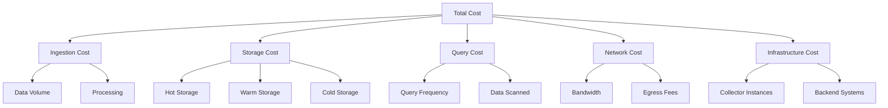

# How to Build a Cost-Effective Observability Platform with OpenTelemetry

Author: [nawazdhandala](https://www.github.com/nawazdhandala)

Tags: OpenTelemetry, Cost Optimization, Architecture, Observability, Platform Engineering

Description: Build a production-ready, cost-effective observability platform using OpenTelemetry by implementing smart sampling, compression, storage optimization, and architectural best practices.

The cost of observability can quickly spiral out of control. Many engineering teams find themselves paying more for their monitoring infrastructure than for the applications they're monitoring. With telemetry data growing exponentially as systems scale, organizations often face a choice between complete visibility and budget constraints.

OpenTelemetry offers a path to comprehensive, cost-effective observability. By leveraging its flexible architecture, open standards, and vendor-neutral approach, you can build a platform that provides deep insights without breaking the bank.

## The True Cost of Observability

Understanding where costs accumulate is the first step toward optimization. Observability expenses typically break down into these categories:



For a typical medium-sized application generating 10 TB of telemetry data monthly:
- Ingestion: $0.50-1.00 per GB = $5,000-10,000
- Storage: $0.03-0.10 per GB-month = $300-1,000
- Network: $0.08-0.12 per GB = $800-1,200
- Infrastructure: $500-2,000

Total monthly cost: $6,600-14,200

With OpenTelemetry and strategic optimization, you can reduce this by 70-90%.

## Architecture for Cost Efficiency

A cost-effective OpenTelemetry architecture separates concerns and optimizes each component independently:

```yaml
# Architecture overview configuration
# This represents the complete pipeline from SDK to storage

# Layer 1: SDK Configuration
# Configure SDKs to minimize data generation at the source

# Layer 2: Agent Collectors (running on each host)
receivers:
  otlp:
    protocols:
      grpc:
        endpoint: 0.0.0.0:4317

processors:
  # Filter out noisy, low-value telemetry
  filter:
    traces:
      span:
        # Drop health check traces
        - 'attributes["http.target"] == "/health"'
        - 'attributes["http.target"] == "/ready"'
        # Drop static asset requests
        - 'attributes["http.target"] matches ".*\\.(css|js|png|jpg)$"'

  # Reduce attribute cardinality
  transform:
    trace_statements:
      # Truncate long attributes
      - context: span
        statements:
          - truncate_all(attributes, 256)
          # Remove high-cardinality attributes
          - delete_key(attributes, "http.request.header.user_agent")
          - delete_key(attributes, "http.request.header.cookie")

  # Add resource detection
  resourcedetection:
    detectors: [env, system, docker]
    timeout: 5s

  batch:
    send_batch_size: 1024
    timeout: 10s

exporters:
  otlp:
    endpoint: gateway-collector:4317
    # Use compression to reduce network costs
    compression: gzip

service:
  pipelines:
    traces:
      receivers: [otlp]
      processors: [filter, transform, resourcedetection, batch]
      exporters: [otlp]
```

## Layer 3: Gateway Collectors (centralized)

The gateway layer is where you implement sophisticated cost optimization:

```yaml
# gateway-collector-config.yaml
receivers:
  otlp:
    protocols:
      grpc:
        endpoint: 0.0.0.0:4317
        # Handle large messages efficiently
        max_recv_msg_size_mib: 16
        max_concurrent_streams: 100

processors:
  memory_limiter:
    check_interval: 1s
    limit_mib: 2048
    spike_limit_mib: 512

  # Implement consistent probability sampling
  # Reduce trace volume by 90% while maintaining statistical validity
  probabilistic_sampler:
    sampling_percentage: 10.0
    hash_seed: 22

  # Tail sampling for important traces
  # Ensure critical traces are never dropped
  tail_sampling:
    decision_wait: 10s
    num_traces: 100000
    expected_new_traces_per_sec: 10000

    policies:
      # Always sample errors - most valuable for debugging
      - name: errors
        type: status_code
        status_code:
          status_codes: [ERROR]

      # Always sample slow requests - performance issues
      - name: slow-requests
        type: latency
        latency:
          threshold_ms: 5000

      # Sample 50% of moderately slow requests
      - name: moderate-latency
        type: latency
        latency:
          threshold_ms: 1000
        probabilistic:
          sampling_percentage: 50

      # Sample only 5% of fast, successful requests
      - name: normal-requests
        type: probabilistic
        probabilistic:
          sampling_percentage: 5

  # Aggregate metrics to reduce cardinality
  # Convert high-cardinality metrics to lower cardinality
  metricstransform:
    transforms:
      # Convert histogram to summary for lower storage cost
      - include: http.server.duration
        action: update
        operations:
          - action: aggregate_labels
            label_set: [http.method, http.status_code]
            aggregation_type: sum

  # Configure metric temporality for cost savings
  # Delta temporality reduces storage requirements
  deltatocumulative:
    max_stale: 5m

  # Batch aggressively for network efficiency
  batch:
    send_batch_size: 2048
    timeout: 30s
    send_batch_max_size: 4096

exporters:
  # Export to different backends based on data type and retention
  otlp/traces-short:
    endpoint: traces-hot-storage:4317
    compression: zstd  # Better compression than gzip
    sending_queue:
      enabled: true
      num_consumers: 20
      queue_size: 5000

  otlp/traces-long:
    endpoint: traces-cold-storage:4317
    compression: zstd

  otlp/metrics:
    endpoint: metrics-storage:4317
    compression: zstd

  # Use cost-effective object storage for logs
  file:
    path: /data/logs
    compression: zstd
    rotation:
      max_megabytes: 512
      max_days: 1

service:
  pipelines:
    traces/sampling:
      receivers: [otlp]
      processors:
        - memory_limiter
        - tail_sampling
        - batch
      exporters: [otlp/traces-short]

    traces/archive:
      receivers: [otlp]
      processors:
        - memory_limiter
        - probabilistic_sampler  # Further reduce for long-term storage
        - batch
      exporters: [otlp/traces-long]

    metrics:
      receivers: [otlp]
      processors:
        - memory_limiter
        - metricstransform
        - deltatocumulative
        - batch
      exporters: [otlp/metrics]

    logs:
      receivers: [otlp]
      processors:
        - memory_limiter
        - filter  # Drop debug logs in production
        - batch
      exporters: [file]
```

## Storage Tier Strategy

Implement a tiered storage approach to minimize costs:

```yaml
# Storage tier configuration using different retention policies
# Hot tier: Fast queries, expensive, short retention (7-30 days)
# Warm tier: Moderate speed, moderate cost, medium retention (30-90 days)
# Cold tier: Slow queries, cheap, long retention (90+ days)

# Example using multiple exporters for different tiers
exporters:
  # Hot tier - Recent traces for active debugging
  otlp/hot:
    endpoint: tempo-hot:4317
    compression: zstd
    timeout: 10s

  # Warm tier - Aggregated metrics
  prometheusremotewrite/warm:
    endpoint: http://prometheus:9090/api/v1/write
    compression: snappy

  # Cold tier - Archive to S3-compatible storage
  s3:
    region: us-west-2
    s3_bucket: telemetry-archive
    s3_prefix: traces/
    compression: zstd
    file_rotation:
      interval: 1h
```

## SDK Configuration for Cost Efficiency

Configure SDKs to generate less data at the source:

```go
package main

import (
    "context"
    "time"

    "go.opentelemetry.io/otel"
    "go.opentelemetry.io/otel/attribute"
    "go.opentelemetry.io/otel/exporters/otlp/otlptrace/otlptracegrpc"
    "go.opentelemetry.io/otel/sdk/resource"
    "go.opentelemetry.io/otel/sdk/trace"
    semconv "go.opentelemetry.io/otel/semconv/v1.17.0"
)

// Custom sampler that combines multiple strategies
type CostOptimizedSampler struct {
    baseSampler trace.Sampler
}

func (s *CostOptimizedSampler) ShouldSample(
    p trace.SamplingParameters,
) trace.SamplingResult {
    // Check for high-value attributes that should always be sampled
    for _, attr := range p.Attributes {
        // Always sample errors
        if attr.Key == "error" && attr.Value.AsBool() {
            return trace.SamplingResult{
                Decision:   trace.RecordAndSample,
                Tracestate: p.ParentContext.TraceState(),
            }
        }
        // Always sample high-priority requests
        if attr.Key == "priority" && attr.Value.AsString() == "high" {
            return trace.SamplingResult{
                Decision:   trace.RecordAndSample,
                Tracestate: p.ParentContext.TraceState(),
            }
        }
    }

    // Use base sampler for other traces
    return s.baseSampler.ShouldSample(p)
}

func (s *CostOptimizedSampler) Description() string {
    return "CostOptimizedSampler"
}

func initCostOptimizedTracer() (*trace.TracerProvider, error) {
    // Create resource with minimal attributes
    res, err := resource.New(
        context.Background(),
        resource.WithAttributes(
            // Only include essential resource attributes
            semconv.ServiceNameKey.String("my-service"),
            semconv.ServiceVersionKey.String("1.0.0"),
            semconv.DeploymentEnvironmentKey.String("production"),
        ),
    )
    if err != nil {
        return nil, err
    }

    // Configure exporter with compression
    exporter, err := otlptracegrpc.New(
        context.Background(),
        otlptracegrpc.WithEndpoint("collector:4317"),
        otlptracegrpc.WithInsecure(),
        otlptracegrpc.WithCompressor("gzip"),
    )
    if err != nil {
        return nil, err
    }

    // Create custom sampler combining probability and priority
    sampler := &CostOptimizedSampler{
        baseSampler: trace.ParentBased(
            trace.TraceIDRatioBased(0.1), // 10% sampling
        ),
    }

    // Configure tracer provider
    tp := trace.NewTracerProvider(
        trace.WithResource(res),
        trace.WithSampler(sampler),
        trace.WithBatcher(
            exporter,
            // Batch settings optimized for cost
            trace.WithMaxExportBatchSize(512),
            trace.WithMaxQueueSize(2048),
            trace.WithBatchTimeout(10*time.Second),
        ),
        // Limit span attributes to prevent unbounded growth
        trace.WithSpanLimits(trace.SpanLimits{
            AttributeCountLimit:        32,  // Max 32 attributes per span
            EventCountLimit:            32,  // Max 32 events per span
            LinkCountLimit:             32,  // Max 32 links per span
            AttributeValueLengthLimit:  256, // Truncate values at 256 chars
        }),
    )

    otel.SetTracerProvider(tp)
    return tp, nil
}
```

## Metrics Optimization

Metrics can be even more expensive than traces due to their continuous nature. Optimize with aggregation and cardinality reduction:

```yaml
processors:
  # Reduce metric cardinality by aggregating labels
  metricstransform:
    transforms:
      # Example: Reduce HTTP endpoint cardinality
      - include: http.server.request.duration
        match_type: strict
        action: update
        operations:
          # Group endpoints by pattern instead of exact path
          - action: update_label
            label: http.target
            new_label: http.route
            value_actions:
              # Convert /users/123 to /users/:id
              - value: '^/users/[0-9]+'
                new_value: /users/:id
              # Convert /orders/abc123 to /orders/:id
              - value: '^/orders/[a-zA-Z0-9]+'
                new_value: /orders/:id

  # Filter out unnecessary metrics
  filter/metrics:
    metrics:
      exclude:
        match_type: regexp
        metric_names:
          # Drop runtime metrics that aren't used
          - process\.runtime\..*\.gc\..*
          # Drop overly granular percentiles
          - .*\.p95
          - .*\.p99

  # Use delta temporality to reduce storage
  # Delta temporality only stores changes between intervals
  cumulativetodelta:
    metrics:
      - http.server.request.duration
      - http.server.response.size
```

## Calculating Your Savings

Track cost reduction with these calculations:

```python
# Cost calculation example

class ObservabilityCostCalculator:
    """Calculate observability costs with and without optimization."""

    def __init__(
        self,
        requests_per_second: int,
        avg_spans_per_trace: int,
        avg_span_size_bytes: int,
        ingestion_cost_per_gb: float,
        storage_cost_per_gb_month: float,
        retention_days: int,
    ):
        self.requests_per_second = requests_per_second
        self.avg_spans_per_trace = avg_spans_per_trace
        self.avg_span_size_bytes = avg_span_size_bytes
        self.ingestion_cost_per_gb = ingestion_cost_per_gb
        self.storage_cost_per_gb_month = storage_cost_per_gb_month
        self.retention_days = retention_days

    def calculate_baseline_cost(self) -> dict:
        """Calculate cost without optimization."""
        # Calculate daily volume
        spans_per_day = (
            self.requests_per_second
            * self.avg_spans_per_trace
            * 86400  # seconds per day
        )
        bytes_per_day = spans_per_day * self.avg_span_size_bytes
        gb_per_day = bytes_per_day / (1024**3)

        # Calculate monthly costs
        monthly_ingestion = gb_per_day * 30 * self.ingestion_cost_per_gb

        # Storage accumulates over retention period
        total_stored_gb = gb_per_day * self.retention_days
        monthly_storage = total_stored_gb * self.storage_cost_per_gb_month

        return {
            "monthly_volume_gb": gb_per_day * 30,
            "monthly_ingestion_cost": monthly_ingestion,
            "monthly_storage_cost": monthly_storage,
            "monthly_total_cost": monthly_ingestion + monthly_storage,
        }

    def calculate_optimized_cost(
        self,
        sampling_rate: float = 0.1,
        compression_ratio: float = 0.3,
        cardinality_reduction: float = 0.8,
    ) -> dict:
        """Calculate cost with OpenTelemetry optimizations."""
        baseline = self.calculate_baseline_cost()

        # Apply optimizations
        volume_reduction = sampling_rate * compression_ratio * cardinality_reduction

        optimized_volume = baseline["monthly_volume_gb"] * volume_reduction
        optimized_ingestion = baseline["monthly_ingestion_cost"] * volume_reduction
        optimized_storage = baseline["monthly_storage_cost"] * volume_reduction

        savings = baseline["monthly_total_cost"] - (
            optimized_ingestion + optimized_storage
        )

        return {
            "monthly_volume_gb": optimized_volume,
            "monthly_ingestion_cost": optimized_ingestion,
            "monthly_storage_cost": optimized_storage,
            "monthly_total_cost": optimized_ingestion + optimized_storage,
            "monthly_savings": savings,
            "savings_percentage": (
                savings / baseline["monthly_total_cost"] * 100
            ),
        }


# Example usage
calculator = ObservabilityCostCalculator(
    requests_per_second=1000,
    avg_spans_per_trace=15,
    avg_span_size_bytes=2048,
    ingestion_cost_per_gb=0.50,
    storage_cost_per_gb_month=0.05,
    retention_days=30,
)

baseline = calculator.calculate_baseline_cost()
optimized = calculator.calculate_optimized_cost()

print(f"Baseline monthly cost: ${baseline['monthly_total_cost']:,.2f}")
print(f"Optimized monthly cost: ${optimized['monthly_total_cost']:,.2f}")
print(f"Monthly savings: ${optimized['monthly_savings']:,.2f}")
print(f"Savings percentage: {optimized['savings_percentage']:.1f}%")
```

## Monitoring Cost Efficiency

Track these metrics to ensure your optimizations are working:

```yaml
# Collector configuration for cost monitoring
exporters:
  prometheus:
    endpoint: 0.0.0.0:8889
    namespace: otelcol
    send_timestamps: true
    metric_expiration: 5m

service:
  telemetry:
    metrics:
      level: detailed
      address: 0.0.0.0:8888

    # Enable internal metrics
    resource:
      service.name: otel-collector
      service.version: 0.92.0
```

Create dashboards tracking:
- Volume reduction: `rate(otelcol_processor_dropped_spans[5m])`
- Compression efficiency: `otelcol_exporter_sent_bytes / otelcol_receiver_accepted_bytes`
- Sampling rate: `otelcol_processor_probabilistic_sampler_count_traces_sampled`
- Cost per request: `monthly_cost / total_requests`

## Best Practices Summary

1. **Sample intelligently**: Use [consistent probability sampling](https://oneuptime.com/blog/post/consistent-probability-sampling-predictable-overhead/view) with tail sampling for important traces
2. **Compress aggressively**: Implement [compression](https://oneuptime.com/blog/post/reduce-network-bandwidth-opentelemetry-compression/view) at every layer
3. **Reduce cardinality**: Aggregate high-cardinality labels and limit attribute counts
4. **Tier storage**: Use hot/warm/cold storage based on access patterns
5. **Optimize protocols**: Choose [gRPC vs HTTP](https://oneuptime.com/blog/post/optimize-grpc-http-performance-otlp-export/view) based on your use case
6. **Configure temporality**: Use [delta temporality](https://oneuptime.com/blog/post/configure-metric-temporality-minimize-storage-costs/view) for metrics
7. **Filter early**: Drop low-value telemetry at the SDK or agent level
8. **Batch efficiently**: Use large batch sizes to reduce network overhead

## Open Source Backend Options

Reduce vendor costs by using open source backends:

- **Traces**: Jaeger, Tempo, Zipkin
- **Metrics**: Prometheus, VictoriaMetrics, Thanos
- **Logs**: Loki, OpenSearch, ClickHouse
- **All-in-one**: SigNoz, Uptrace

These can reduce backend costs by 70-90% compared to commercial SaaS solutions.

## Real-World Results

Organizations implementing these strategies typically see:

- **70-90%** reduction in telemetry data volume
- **60-80%** reduction in storage costs
- **50-70%** reduction in network bandwidth
- **40-60%** reduction in total observability spending

A mid-sized e-commerce platform (100 services, 5000 req/s) reduced monthly costs from $25,000 to $6,500 by implementing comprehensive OpenTelemetry optimization.

Building a cost-effective observability platform with OpenTelemetry is not just about reducing expenses. It's about making observability sustainable and accessible, enabling teams to maintain comprehensive visibility as they scale without budget constraints limiting their ability to understand and improve their systems.
