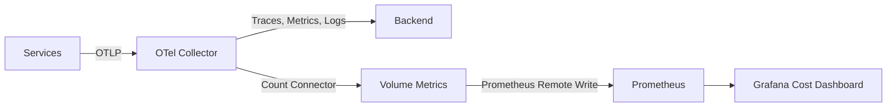

# How to Create a Cost Monitoring Dashboard That Tracks Telemetry Volume per Service in Grafana

Author: [nawazdhandala](https://www.github.com/nawazdhandala)

Tags: OpenTelemetry, Cost Monitoring, Grafana, Telemetry Volume

Description: Track telemetry data volume per service with a cost monitoring dashboard to identify expensive services and optimize spend.

Observability backends charge based on data volume - spans ingested, metric data points stored, log bytes processed. As your OpenTelemetry instrumentation grows, so does your observability bill. Without visibility into which services generate the most telemetry, you cannot make informed decisions about where to optimize. A cost monitoring dashboard that tracks telemetry volume per service gives you the data to control spending without sacrificing visibility.

## Where Telemetry Volume Data Comes From

The OpenTelemetry Collector already tracks how much data flows through it via its internal metrics. The key metrics for cost monitoring are:

- `otelcol_exporter_sent_spans` - Number of spans exported (trace volume)
- `otelcol_exporter_sent_metric_points` - Number of metric data points exported
- `otelcol_exporter_sent_log_records` - Number of log records exported

These are broken down by exporter, but not by service name by default. To get per-service volume tracking, you need the `count` connector or a custom approach using the `routing` processor combined with internal metrics.

## Counting Telemetry per Service

The most reliable way to track per-service telemetry volume is using the Count Connector. It counts the number of spans, data points, and log records passing through the pipeline, grouped by resource attributes.

```yaml
# otel-collector-config.yaml
connectors:
  count:
    traces:
      # Create a metric counting spans per service
      telemetry.spans.count:
        description: "Number of spans per service"
        conditions:
          - status.code != STATUS_CODE_UNSET
        attributes:
          - key: service.name
            default_value: unknown

    metrics:
      # Create a metric counting data points per service
      telemetry.datapoints.count:
        description: "Number of metric data points per service"
        attributes:
          - key: service.name
            default_value: unknown

    logs:
      # Create a metric counting log records per service
      telemetry.logs.count:
        description: "Number of log records per service"
        attributes:
          - key: service.name
            default_value: unknown

receivers:
  otlp:
    protocols:
      grpc:
        endpoint: "0.0.0.0:4317"

exporters:
  otlp/backend:
    endpoint: "backend:4317"
    tls:
      insecure: true
  prometheusremotewrite:
    endpoint: "http://prometheus:9090/api/v1/write"

service:
  pipelines:
    traces:
      receivers: [otlp]
      exporters: [otlp/backend, count]
    metrics/telemetry:
      receivers: [count]
      exporters: [prometheusremotewrite]
    metrics:
      receivers: [otlp]
      exporters: [otlp/backend]
    logs:
      receivers: [otlp]
      exporters: [otlp/backend, count]
```

## Data Flow



## Dashboard Queries

**Total Spans Per Day by Service** - The primary cost driver for tracing:

```promql
# Spans per day per service
sum by (service_name) (
  increase(telemetry_spans_count_total[24h])
)
```

**Total Data Points Per Day** - Metric volume per service:

```promql
# Metric data points per day per service
sum by (service_name) (
  increase(telemetry_datapoints_count_total[24h])
)
```

**Total Log Records Per Day** - Log volume per service:

```promql
# Log records per day per service
sum by (service_name) (
  increase(telemetry_logs_count_total[24h])
)
```

**Estimated Cost Per Service** - If you know your per-unit pricing, calculate estimated cost. For example, if your backend charges $2.50 per million spans:

```promql
# Estimated daily trace cost per service (at $2.50 per million spans)
sum by (service_name) (
  increase(telemetry_spans_count_total[24h])
) / 1e6 * 2.5
```

**Volume Growth Rate** - Detect services with rapidly increasing telemetry output:

```promql
# Week-over-week span volume growth per service
sum by (service_name) (increase(telemetry_spans_count_total[1d]))
/
sum by (service_name) (increase(telemetry_spans_count_total[1d] offset 7d))
```

A value above 1.5 means a service's trace volume grew by 50% or more compared to last week.

**Top 5 Most Expensive Services** - Quick identification of cost drivers:

```promql
# Top 5 services by total telemetry volume (spans + datapoints + logs)
topk(5,
  sum by (service_name) (increase(telemetry_spans_count_total[24h]))
  +
  sum by (service_name) (increase(telemetry_datapoints_count_total[24h]))
  +
  sum by (service_name) (increase(telemetry_logs_count_total[24h]))
)
```

## Adding Cost Context

To make the dashboard actionable, add context about what is driving volume.

**Span Volume by Operation** - Which operations generate the most spans for a selected service:

```promql
# Top operations by span count for a selected service
topk(10,
  sum by (span_name) (
    increase(telemetry_spans_count_total{service_name="$service"}[24h])
  )
)
```

This helps you find instrumentation that generates disproportionate span volume, like a health check endpoint that runs every second.

## Cost Optimization Actions

Once you identify expensive services, the collector gives you tools to reduce volume without removing instrumentation:

```yaml
# Add a tail sampling processor to reduce trace volume
processors:
  tail_sampling:
    decision_wait: 10s
    policies:
      # Keep all error traces
      - name: errors
        type: status_code
        status_code: {status_codes: [ERROR]}
      # Sample 10% of successful traces
      - name: success-sampling
        type: probabilistic
        probabilistic: {sampling_percentage: 10}
      # Keep all traces slower than 1 second
      - name: slow-traces
        type: latency
        latency: {threshold_ms: 1000}
```

## Dashboard Layout

1. **Cost Summary** - Total estimated daily cost, total volume by signal type (traces, metrics, logs)
2. **Service Breakdown** - Bar chart of cost per service, table with volume and estimated cost columns
3. **Trends** - Volume growth over time per service, week-over-week comparisons
4. **Drill-Down** - For a selected service, show volume by operation/metric name/log source
5. **Optimization Tracking** - Before and after volumes for services where sampling was applied

Tracking telemetry cost per service creates accountability. When teams can see that their service generates 40% of the tracing bill, they are motivated to optimize instrumentation, adjust sampling rates, and remove redundant spans. The dashboard pays for itself by surfacing the optimization opportunities that would otherwise go unnoticed.
