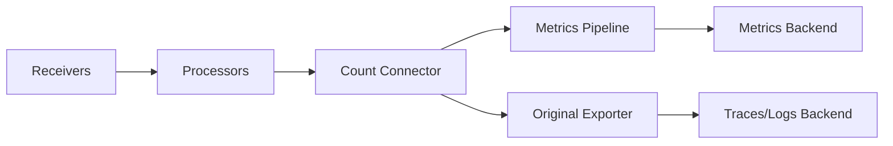

# How to Configure the Count Connector in the OpenTelemetry Collector

Author: [nawazdhandala](https://www.github.com/nawazdhandala)

Tags: OpenTelemetry, Collector, Connectors, Count Connector, Metrics, Observability

Description: Learn how to configure the Count Connector in OpenTelemetry Collector to generate metrics from spans and logs, enabling powerful aggregation and monitoring capabilities.

The Count Connector in the OpenTelemetry Collector provides a powerful way to generate metrics by counting telemetry data like spans and logs. This connector transforms incoming telemetry signals into aggregated metrics, allowing you to track the volume and distribution of your observability data without manual instrumentation.

## Understanding the Count Connector

The Count Connector sits between pipelines in the OpenTelemetry Collector, acting as both an exporter and a receiver. It consumes telemetry data from one pipeline (traces or logs) and produces metrics in another pipeline. This capability is essential for deriving high-level insights from detailed telemetry data.

The primary use case for the Count Connector is to count occurrences of specific telemetry events based on attributes. For example, you can count HTTP requests by status code, track error rates across services, or monitor log volume by severity level.

## Architecture Overview

Here's how the Count Connector fits into the OpenTelemetry Collector pipeline:



The connector creates a fork in your pipeline, allowing you to send original data to its intended destination while simultaneously generating count metrics.

## Basic Configuration

The Count Connector configuration consists of defining what to count and how to label the resulting metrics. Here's a basic configuration:

```yaml
# Define the count connector in the connectors section
connectors:
  count:
    # Generate metrics from spans
    spans:
      # Metric name for the counter
      my.span.count:
        # Description of what this metric represents
        description: "Total count of spans received"
        # Conditions to match spans (optional)
        conditions: []
        # Attributes to use as metric dimensions
        attributes:
          - key: service.name
          - key: http.status_code

receivers:
  otlp:
    protocols:
      grpc:
        endpoint: 0.0.0.0:4317

processors:
  batch:
    timeout: 10s

exporters:
  otlp/traces:
    endpoint: traces-backend:4317
  otlp/metrics:
    endpoint: metrics-backend:4317

service:
  pipelines:
    # Traces pipeline that feeds into the count connector
    traces:
      receivers: [otlp]
      processors: [batch]
      exporters: [count, otlp/traces]

    # Metrics pipeline that receives counts from the connector
    metrics:
      receivers: [count]
      processors: [batch]
      exporters: [otlp/metrics]
```

This configuration counts all incoming spans and creates metrics labeled by service name and HTTP status code.

## Advanced Filtering with Conditions

The Count Connector supports filtering telemetry data using the OpenTelemetry Transformation Language (OTTL). This allows you to count only specific types of events:

```yaml
connectors:
  count:
    spans:
      # Count only HTTP server spans
      http.server.span.count:
        description: "Count of HTTP server spans"
        # Only count spans that match these conditions
        conditions:
          - 'attributes["span.kind"] == "server"'
          - 'attributes["http.method"] != nil'
        attributes:
          - key: http.method
          - key: http.status_code
          - key: service.name

      # Count only error spans
      error.span.count:
        description: "Count of spans with errors"
        conditions:
          - 'status.code == STATUS_CODE_ERROR'
        attributes:
          - key: service.name
          - key: error.type
          - key: span.kind

      # Count database operations
      db.operation.count:
        description: "Count of database operations"
        conditions:
          - 'attributes["db.system"] != nil'
        attributes:
          - key: db.system
          - key: db.operation
          - key: service.name
```

The conditions use OTTL syntax, which provides access to span attributes, status codes, and other telemetry properties.

## Counting Log Events

The Count Connector works equally well with logs, enabling you to track log volume and patterns:

```yaml
connectors:
  count:
    logs:
      # Count logs by severity level
      log.severity.count:
        description: "Count of log records by severity"
        attributes:
          - key: severity_text
          - key: service.name
          - key: deployment.environment

      # Count error logs specifically
      log.error.count:
        description: "Count of error-level logs"
        conditions:
          - 'severity_number >= SEVERITY_NUMBER_ERROR'
        attributes:
          - key: service.name
          - key: log.source
          - key: error.type

      # Count logs containing specific patterns
      log.pattern.count:
        description: "Count of logs matching specific patterns"
        conditions:
          - 'IsMatch(body, ".*timeout.*") == true'
        attributes:
          - key: service.name
          - key: host.name

receivers:
  otlp:
    protocols:
      grpc:
        endpoint: 0.0.0.0:4317

processors:
  batch:
    timeout: 10s

exporters:
  otlp/logs:
    endpoint: logs-backend:4317
  otlp/metrics:
    endpoint: metrics-backend:4317

service:
  pipelines:
    logs:
      receivers: [otlp]
      processors: [batch]
      exporters: [count, otlp/logs]

    metrics:
      receivers: [count]
      processors: [batch]
      exporters: [otlp/metrics]
```

## Attribute Transformation

You can transform attributes before they become metric labels, which is useful for reducing cardinality or normalizing values:

```yaml
connectors:
  count:
    spans:
      http.request.count:
        description: "HTTP request count with normalized status codes"
        attributes:
          - key: service.name
          # Create a new attribute that groups status codes
          - key: http.status_class
            default_value: "unknown"
        conditions:
          - 'attributes["http.status_code"] != nil'

processors:
  # Transform attributes before counting
  transform:
    trace_statements:
      - context: span
        statements:
          # Create status class attribute (2xx, 3xx, 4xx, 5xx)
          - set(attributes["http.status_class"], Concat([Substring(attributes["http.status_code"], 0, 1), "xx"]))

service:
  pipelines:
    traces:
      receivers: [otlp]
      processors: [transform, batch]
      exporters: [count, otlp/traces]

    metrics:
      receivers: [count]
      processors: [batch]
      exporters: [otlp/metrics]
```

## Combining Multiple Count Connectors

For complex monitoring scenarios, you can deploy multiple Count Connector instances with different configurations:

```yaml
connectors:
  # Count connector for business metrics
  count/business:
    spans:
      business.transaction.count:
        description: "Count of business transactions"
        conditions:
          - 'attributes["transaction.type"] != nil'
        attributes:
          - key: transaction.type
          - key: customer.tier
          - key: service.name

  # Count connector for infrastructure metrics
  count/infrastructure:
    spans:
      infra.request.count:
        description: "Infrastructure request count"
        conditions:
          - 'attributes["span.kind"] == "server"'
        attributes:
          - key: host.name
          - key: container.id
          - key: k8s.pod.name

service:
  pipelines:
    traces:
      receivers: [otlp]
      processors: [batch]
      exporters: [count/business, count/infrastructure, otlp/traces]

    metrics/business:
      receivers: [count/business]
      processors: [batch]
      exporters: [otlp/metrics]

    metrics/infrastructure:
      receivers: [count/infrastructure]
      processors: [batch]
      exporters: [otlp/metrics]
```

## Performance Considerations

The Count Connector processes every telemetry item that passes through it, which can impact collector performance. Here are optimization strategies:

1. **Limit Cardinality**: Keep the number of unique attribute combinations low to prevent excessive memory usage.

2. **Use Selective Conditions**: Filter data early with specific conditions rather than counting everything.

3. **Batch Processing**: Configure appropriate batch sizes in processors to balance latency and throughput.

4. **Resource Management**: Allocate sufficient memory to the collector, especially when counting high-volume telemetry.

```yaml
# Resource limits for the collector
processors:
  # Limit memory usage by batching
  batch:
    timeout: 10s
    send_batch_size: 1024
    send_batch_max_size: 2048

  # Sample high-volume telemetry if needed
  probabilistic_sampler:
    sampling_percentage: 10.0

service:
  pipelines:
    traces:
      receivers: [otlp]
      # Apply sampling before counting to reduce volume
      processors: [probabilistic_sampler, batch]
      exporters: [count, otlp/traces]

    metrics:
      receivers: [count]
      processors: [batch]
      exporters: [otlp/metrics]
```

## Monitoring Count Connector Health

The OpenTelemetry Collector exposes internal metrics about connector performance:

```yaml
# Enable collector self-monitoring
service:
  telemetry:
    metrics:
      level: detailed
      address: 0.0.0.0:8888

  pipelines:
    traces:
      receivers: [otlp]
      processors: [batch]
      exporters: [count, otlp/traces]

    metrics:
      receivers: [count]
      processors: [batch]
      exporters: [otlp/metrics]
```

Monitor these metrics:
- `otelcol_connector_accepted_spans`: Spans accepted by the connector
- `otelcol_connector_refused_spans`: Spans refused due to errors
- `otelcol_connector_sent_metric_points`: Metric points generated

## Real-World Use Case

Here's a production-ready configuration for monitoring a microservices application:

```yaml
connectors:
  count:
    spans:
      # Track API endpoint usage
      api.endpoint.requests:
        description: "API endpoint request count"
        conditions:
          - 'attributes["http.route"] != nil'
        attributes:
          - key: http.method
          - key: http.route
          - key: http.status_code
          - key: service.name

      # Monitor error rates
      service.errors:
        description: "Service error count"
        conditions:
          - 'status.code == STATUS_CODE_ERROR'
        attributes:
          - key: service.name
          - key: error.type
          - key: deployment.environment

    logs:
      # Track application logs
      app.log.volume:
        description: "Application log volume"
        attributes:
          - key: service.name
          - key: severity_text
          - key: deployment.environment

receivers:
  otlp:
    protocols:
      grpc:
        endpoint: 0.0.0.0:4317
      http:
        endpoint: 0.0.0.0:4318

processors:
  batch:
    timeout: 10s

  resource:
    attributes:
      - key: deployment.environment
        value: production
        action: upsert

exporters:
  otlp/traces:
    endpoint: ${TRACES_BACKEND}
  otlp/logs:
    endpoint: ${LOGS_BACKEND}
  otlp/metrics:
    endpoint: ${METRICS_BACKEND}

service:
  pipelines:
    traces:
      receivers: [otlp]
      processors: [resource, batch]
      exporters: [count, otlp/traces]

    logs:
      receivers: [otlp]
      processors: [resource, batch]
      exporters: [count, otlp/logs]

    metrics:
      receivers: [count]
      processors: [batch]
      exporters: [otlp/metrics]
```

## Integration with Other Connectors

The Count Connector works well alongside other OpenTelemetry connectors. For comprehensive observability, combine it with the Span Metrics Connector for RED metrics at https://oneuptime.com/blog/post/span-metrics-connector-red-metrics/view and the Service Graph Connector at https://oneuptime.com/blog/post/service-graph-connector-opentelemetry-collector/view.

## Conclusion

The Count Connector transforms the OpenTelemetry Collector into a powerful aggregation engine, enabling you to derive metrics from detailed telemetry data. By counting spans and logs based on attributes and conditions, you gain valuable insights into system behavior without additional instrumentation overhead.

Start with simple counting configurations and gradually add conditions and attribute groupings as your monitoring needs evolve. The flexibility of OTTL conditions allows you to create precisely the metrics your team needs for effective observability.
