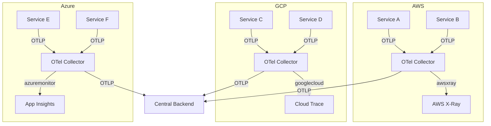
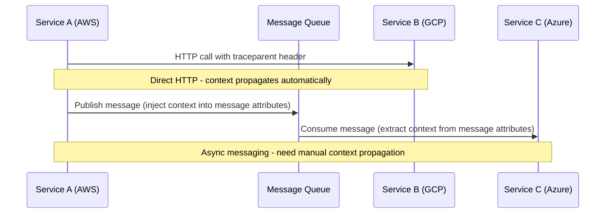
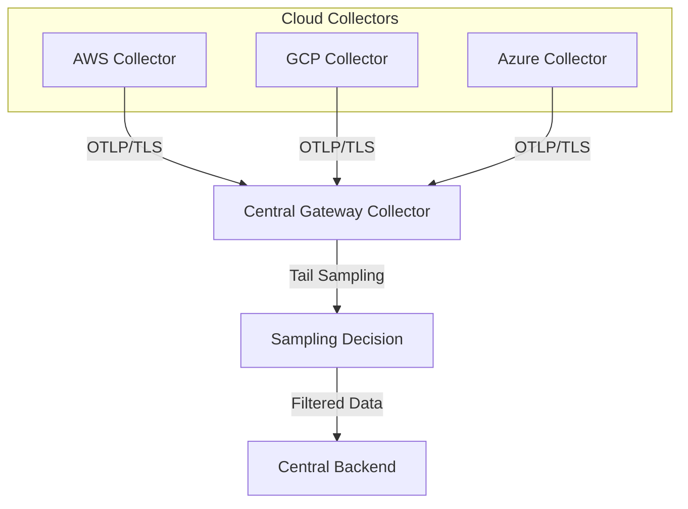

# How to Set Up Cross-Cloud OpenTelemetry Pipelines (AWS + GCP + Azure)

Author: [nawazdhandala](https://www.github.com/nawazdhandala)

Tags: OpenTelemetry, AWS, GCP, Azure, Multi-Cloud, Distributed Tracing, Observability, Collector, Cross-Cloud

Description: A complete guide to building unified OpenTelemetry pipelines across AWS, GCP, and Azure, with collector architecture, configuration, and real-world deployment patterns.

---

Most organizations today run workloads across multiple clouds. Maybe your main application sits on AWS, your machine learning pipeline runs on GCP, and you acquired a company whose services live on Azure. Whatever the reason, multi-cloud is a reality. And when a single user request touches services in three different clouds, you need unified observability to make sense of it all.

OpenTelemetry was built for exactly this scenario. It gives you a single instrumentation standard that works everywhere, and the OpenTelemetry Collector can aggregate and route telemetry from any cloud to any backend. This guide shows you how to set up cross-cloud OpenTelemetry pipelines that give you a unified view of distributed traces, metrics, and logs across AWS, GCP, and Azure.

## The Architecture

The core idea is simple: every cloud environment runs its own OpenTelemetry Collector (or fleet of Collectors), and all Collectors export to a central observability backend. The backend gives you a single pane of glass across all clouds. Optionally, you can also keep sending data to cloud-native backends (X-Ray, Cloud Trace, Application Insights) for teams that prefer those tools.



The central backend can be any OTLP-compatible platform: Jaeger, Grafana Tempo, OneUptime, or any commercial observability tool. The important thing is that all three clouds export to the same place using the same protocol.

## Step 1: Standardize Your Instrumentation

Before worrying about Collectors and pipelines, make sure all your services across all clouds use OpenTelemetry SDKs with consistent configuration. The three things that must be consistent are:

1. **Service naming**: Use a clear, unique `service.name` for every service
2. **Context propagation**: Use W3C Trace Context everywhere (this is the default in OpenTelemetry)
3. **Resource attributes**: Include cloud-specific metadata so you can filter and group by cloud provider

Here is a standard initialization pattern that works in any cloud. The cloud-specific resource attributes get filled in by resource detectors.

```javascript
// tracing.js - Universal OpenTelemetry setup for any cloud
const { NodeSDK } = require('@opentelemetry/sdk-node');
const { OTLPTraceExporter } = require('@opentelemetry/exporter-trace-otlp-grpc');
const { getNodeAutoInstrumentations } = require('@opentelemetry/auto-instrumentations-node');
const { Resource } = require('@opentelemetry/resources');

// Cloud-specific resource detectors - import what you need
const { AwsEcsDetector, AwsEc2Detector } = require('@opentelemetry/resource-detector-aws');
const { GcpDetector } = require('@opentelemetry/resource-detector-gcp');
// Azure detector is available via @azure/monitor-opentelemetry

const sdk = new NodeSDK({
  resource: new Resource({
    // These attributes are mandatory for cross-cloud correlation
    'service.name': process.env.OTEL_SERVICE_NAME || 'my-service',
    'service.version': process.env.SERVICE_VERSION || '1.0.0',
    'deployment.environment': process.env.DEPLOY_ENV || 'production',
  }),

  // Send to the local Collector running in each cloud
  traceExporter: new OTLPTraceExporter({
    url: process.env.OTEL_EXPORTER_OTLP_ENDPOINT || 'http://localhost:4317',
  }),

  instrumentations: [getNodeAutoInstrumentations()],

  // Resource detectors will auto-populate cloud.provider, cloud.region, etc.
  resourceDetectors: [
    new AwsEcsDetector(),
    new AwsEc2Detector(),
    new GcpDetector(),
  ],
});

sdk.start();
```

The resource detectors are safe to include even if you are not running on that cloud. They simply return empty results when the cloud metadata endpoint is not available.

## Step 2: Deploy Collectors in Each Cloud

Each cloud environment needs its own OpenTelemetry Collector deployment. The Collector receives OTLP data from local services, enriches it with cloud-specific metadata, and forwards it to the central backend. It can also optionally send data to the cloud-native tracing service.

### AWS Collector Configuration

Deploy the Collector on ECS or EKS. Use the `resourcedetection` processor to automatically tag spans with AWS metadata.

```yaml
# aws-collector-config.yaml
receivers:
  otlp:
    protocols:
      grpc:
        # Receive OTLP from services running in AWS
        endpoint: 0.0.0.0:4317
      http:
        endpoint: 0.0.0.0:4318

processors:
  resourcedetection:
    detectors: [env, ec2, ecs, eks]
    # Add AWS-specific resource attributes automatically
    # Populates: cloud.provider, cloud.region, cloud.account.id,
    # host.id, container.id, k8s.cluster.name, etc.
    timeout: 5s
    override: false

  batch:
    send_batch_size: 1024
    timeout: 5s

  # Add a custom attribute to identify the cloud origin
  resource:
    attributes:
      - key: deployment.cloud
        value: aws
        action: upsert

exporters:
  # Send to the central observability backend
  otlp/central:
    endpoint: https://central-collector.example.com:4317
    headers:
      authorization: "Bearer ${CENTRAL_API_KEY}"
    # Enable TLS for cross-cloud communication
    tls:
      insecure: false

  # Optionally keep sending to AWS X-Ray
  awsxray:
    region: us-east-1

service:
  pipelines:
    traces:
      receivers: [otlp]
      processors: [resourcedetection, resource, batch]
      exporters: [otlp/central, awsxray]
    metrics:
      receivers: [otlp]
      processors: [resourcedetection, resource, batch]
      exporters: [otlp/central]
```

### GCP Collector Configuration

Deploy on Cloud Run, GKE, or Compute Engine. The GCP resource detector pulls metadata from the GCE metadata server.

```yaml
# gcp-collector-config.yaml
receivers:
  otlp:
    protocols:
      grpc:
        # Receive OTLP from services running in GCP
        endpoint: 0.0.0.0:4317
      http:
        endpoint: 0.0.0.0:4318

processors:
  resourcedetection:
    detectors: [env, gcp]
    # Add GCP-specific resource attributes automatically
    # Populates: cloud.provider, cloud.region, cloud.availability_zone,
    # host.id, k8s.cluster.name, k8s.namespace.name, etc.
    timeout: 5s
    override: false

  batch:
    send_batch_size: 1024
    timeout: 5s

  resource:
    attributes:
      - key: deployment.cloud
        value: gcp
        action: upsert

exporters:
  # Send to the central observability backend
  otlp/central:
    endpoint: https://central-collector.example.com:4317
    headers:
      authorization: "Bearer ${CENTRAL_API_KEY}"
    tls:
      insecure: false

  # Optionally keep sending to Google Cloud Trace
  googlecloud:
    project: my-gcp-project

service:
  pipelines:
    traces:
      receivers: [otlp]
      processors: [resourcedetection, resource, batch]
      exporters: [otlp/central, googlecloud]
    metrics:
      receivers: [otlp]
      processors: [resourcedetection, resource, batch]
      exporters: [otlp/central]
```

### Azure Collector Configuration

Deploy on AKS, Azure Container Apps, or a VM. The Azure resource detector reads from the Azure Instance Metadata Service.

```yaml
# azure-collector-config.yaml
receivers:
  otlp:
    protocols:
      grpc:
        # Receive OTLP from services running in Azure
        endpoint: 0.0.0.0:4317
      http:
        endpoint: 0.0.0.0:4318

processors:
  resourcedetection:
    detectors: [env, azure]
    # Add Azure-specific resource attributes automatically
    # Populates: cloud.provider, cloud.region, host.id,
    # azure.vm.name, azure.resourcegroup.name, etc.
    timeout: 5s
    override: false

  batch:
    send_batch_size: 1024
    timeout: 5s

  resource:
    attributes:
      - key: deployment.cloud
        value: azure
        action: upsert

exporters:
  # Send to the central observability backend
  otlp/central:
    endpoint: https://central-collector.example.com:4317
    headers:
      authorization: "Bearer ${CENTRAL_API_KEY}"
    tls:
      insecure: false

  # Optionally keep sending to Azure Monitor
  azuremonitor:
    connection_string: ${APPLICATIONINSIGHTS_CONNECTION_STRING}

service:
  pipelines:
    traces:
      receivers: [otlp]
      processors: [resourcedetection, resource, batch]
      exporters: [otlp/central, azuremonitor]
    metrics:
      receivers: [otlp]
      processors: [resourcedetection, resource, batch]
      exporters: [otlp/central]
```

## Step 3: Ensure Context Propagation Across Cloud Boundaries

This is the most important part. For cross-cloud distributed tracing to work, the trace context must propagate correctly when services in one cloud call services in another cloud. OpenTelemetry uses W3C Trace Context by default, which sends `traceparent` and `tracestate` HTTP headers with every request.

As long as all services use OpenTelemetry instrumentation, this happens automatically. But there are a few scenarios where context propagation can break.



For synchronous HTTP calls between clouds, the auto-instrumentation handles everything. The calling service injects the trace context into request headers, and the receiving service extracts it.

For asynchronous messaging (SQS, Pub/Sub, Service Bus), you need to make sure the trace context is propagated through message attributes. Most OpenTelemetry instrumentation libraries for messaging systems handle this, but it is worth verifying.

Here is how to manually propagate context through a message queue if the auto-instrumentation does not cover your case.

```python
# Producer: Inject trace context into message attributes
from opentelemetry import context, trace
from opentelemetry.propagate import inject

tracer = trace.get_tracer("my-app")

with tracer.start_as_current_span("publish-message") as span:
    # Create a carrier dict to hold the trace context headers
    carrier = {}
    # Inject the current context into the carrier
    inject(carrier)

    # Send the message with trace context as attributes
    sqs_client.send_message(
        QueueUrl="https://sqs.us-east-1.amazonaws.com/123456789/my-queue",
        MessageBody="order-data",
        MessageAttributes={
            # W3C traceparent header as a message attribute
            "traceparent": {
                "DataType": "String",
                "StringValue": carrier.get("traceparent", ""),
            },
            # W3C tracestate header as a message attribute
            "tracestate": {
                "DataType": "String",
                "StringValue": carrier.get("tracestate", ""),
            },
        },
    )
```

```python
# Consumer: Extract trace context from message attributes
from opentelemetry.propagate import extract

def handle_message(message):
    # Build the carrier from message attributes
    carrier = {
        "traceparent": message["MessageAttributes"].get("traceparent", {}).get("StringValue", ""),
        "tracestate": message["MessageAttributes"].get("tracestate", {}).get("StringValue", ""),
    }

    # Extract the context and use it as the parent for new spans
    ctx = extract(carrier)

    with tracer.start_as_current_span("process-message", context=ctx) as span:
        span.set_attribute("message.queue", "my-queue")
        # Process the message - this span will be linked to the producer trace
        process_order(message["Body"])
```

## Step 4: Configure the Central Collector (Optional Gateway)

If you want an additional layer of processing before data hits your backend, you can run a central gateway Collector. This Collector receives data from all cloud-local Collectors and applies cross-cutting concerns like sampling, PII redaction, or tenant routing.

```yaml
# central-collector-config.yaml
receivers:
  otlp:
    protocols:
      grpc:
        # Receive OTLP from all cloud Collectors
        endpoint: 0.0.0.0:4317
        # Enable TLS for secure cross-cloud communication
        tls:
          cert_file: /certs/server.crt
          key_file: /certs/server.key

processors:
  batch:
    send_batch_size: 2048
    timeout: 10s

  # Tail-based sampling - keep interesting traces, sample routine ones
  tail_sampling:
    decision_wait: 30s
    policies:
      # Always keep traces with errors
      - name: error-traces
        type: status_code
        status_code:
          status_codes: [ERROR]
      # Always keep slow traces (over 5 seconds)
      - name: slow-traces
        type: latency
        latency:
          threshold_ms: 5000
      # Sample 10% of normal traces
      - name: normal-sampling
        type: probabilistic
        probabilistic:
          sampling_percentage: 10

  # Redact sensitive attributes before sending to the backend
  attributes:
    actions:
      - key: http.request.header.authorization
        action: delete
      - key: db.statement
        action: hash

exporters:
  # Send to your central observability platform
  otlp/backend:
    endpoint: https://ingest.your-observability-platform.com:4317
    headers:
      authorization: "Bearer ${BACKEND_API_KEY}"

service:
  pipelines:
    traces:
      receivers: [otlp]
      processors: [tail_sampling, attributes, batch]
      exporters: [otlp/backend]
    metrics:
      receivers: [otlp]
      processors: [batch]
      exporters: [otlp/backend]
```



## Step 5: Handle Network Connectivity

Cross-cloud communication introduces network considerations you do not face in a single-cloud setup.

**Latency**: Collectors in each cloud are sending data across the internet (or through a dedicated interconnect) to the central backend. Use the batch processor aggressively to reduce the number of network round trips. A batch size of 1024-2048 spans with a 5-10 second timeout works well for most setups.

**Reliability**: Network links between clouds can be flaky. The Collector's retry mechanism handles transient failures, but you should also consider using the `file_storage` extension as a buffer. If the central backend is unreachable, the Collector writes data to local disk and replays it when connectivity returns.

```yaml
# Add file storage for resilience against network issues
extensions:
  file_storage:
    directory: /var/otel/buffer
    timeout: 10s
    compaction:
      directory: /var/otel/buffer/compaction
      on_rebound: true

exporters:
  otlp/central:
    endpoint: https://central-collector.example.com:4317
    retry_on_failure:
      enabled: true
      initial_interval: 5s
      max_interval: 60s
      max_elapsed_time: 300s
    sending_queue:
      enabled: true
      num_consumers: 10
      queue_size: 5000
      # Persist the queue to disk so data survives Collector restarts
      storage: file_storage
```

**Security**: Always use TLS for cross-cloud communication. Each Collector should authenticate to the central backend using API keys or mutual TLS. Never send telemetry data over unencrypted connections across the public internet.

## Step 6: Build Cross-Cloud Dashboards

Once data from all three clouds lands in your central backend, build dashboards that leverage the cloud-specific resource attributes. The `cloud.provider`, `cloud.region`, and `deployment.cloud` attributes let you slice and dice your data by cloud.

Useful dashboard panels to create:

- **Cross-cloud trace map**: Visualize how requests flow between AWS, GCP, and Azure services
- **Latency by cloud**: Compare P50/P95/P99 latency for the same service type running in different clouds
- **Error rate by cloud**: Spot cloud-specific issues quickly
- **Cross-cloud dependency graph**: See which services in one cloud depend on services in another

## Summary

Setting up cross-cloud OpenTelemetry pipelines boils down to three things: consistent instrumentation using OpenTelemetry SDKs, cloud-local Collectors that enrich and forward data, and a central backend that gives you a unified view. The Collector's pluggable architecture makes it straightforward to export to cloud-native tools and your central platform simultaneously. The hardest part is usually not the configuration but the organizational work of getting all teams across all clouds to adopt the same instrumentation standard. Start with the teams that own cross-cloud services, prove the value of unified traces, and expand from there.
