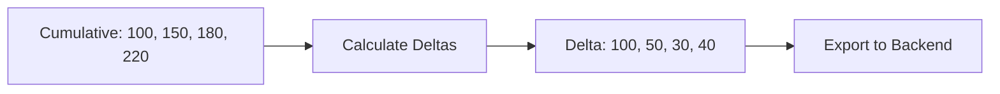

# How to Configure the Cumulative to Delta Processor in the OpenTelemetry Collector

Author: [nawazdhandala](https://www.github.com/nawazdhandala)

Tags: OpenTelemetry, Collector, Processors, Metrics, Cumulative, Delta, Data Transformation

Description: Learn how to configure the cumulative to delta processor in OpenTelemetry Collector to convert cumulative metrics into delta metrics for backends that require rate-based data.

The cumulative to delta processor converts cumulative metrics (monotonic counters and sums) into delta metrics by calculating the difference between consecutive data points. This is essential when your metrics source exports cumulative values but your observability backend expects delta values, or when you need to calculate rates and changes over time intervals.

## Why Cumulative to Delta Conversion Matters

Different monitoring systems prefer different metric types. Prometheus uses cumulative counters (values only increase), while systems like Datadog and some time-series databases prefer delta metrics (values represent changes since the last report). The cumulative to delta processor bridges this gap, allowing you to use cumulative metrics from your applications while exporting deltas to your backend.

For more context on metrics types, see our guide on [what are metrics in OpenTelemetry](https://oneuptime.com/blog/post/2025-08-26-what-are-metrics-in-opentelemetry/view).

## Understanding Cumulative vs Delta Metrics

### Cumulative Metrics

A cumulative counter tracks the total count since the process started:

```
Time    Value (cumulative)
10:00   100
10:01   150  (50 new requests since start)
10:02   180  (80 new requests since start)
10:03   220  (120 new requests since start)
```

### Delta Metrics

A delta counter tracks the change since the last measurement:

```
Time    Value (delta)
10:00   100  (initial value)
10:01   50   (150 - 100)
10:02   30   (180 - 150)
10:03   40   (220 - 180)
```



## How the Processor Works

The processor maintains state for each unique metric time series (metric name + label combination). When a new data point arrives, it calculates the delta from the previous value and emits a delta metric. The first data point is emitted as-is since there's no previous value to compare against.

## Basic Configuration

Here's a minimal configuration that converts cumulative sums to deltas:

```yaml
# Basic cumulative to delta processor configuration
# Converts all cumulative sums to delta sums
receivers:
  otlp:
    protocols:
      grpc:
        endpoint: 0.0.0.0:4317

processors:
  # Cumulative to delta processor
  # Tracks metric state and calculates deltas
  cumulativetodelta:
    # List of metrics to convert
    # Can use exact names or wildcards
    metrics:
      - http.server.request.count
      - http.client.request.count
      - db.client.operation.count

exporters:
  otlp:
    endpoint: https://oneuptime.com/otlp
    headers:
      x-oneuptime-token: YOUR_ONEUPTIME_TOKEN

service:
  pipelines:
    metrics:
      receivers: [otlp]
      processors: [cumulativetodelta]
      exporters: [otlp]
```

## Metric Selection

### Exact Metric Names

Convert specific metrics by name:

```yaml
processors:
  cumulativetodelta:
    metrics:
      # List exact metric names to convert
      - http.server.request.count
      - http.server.response.count
      - db.client.operation.count
      - cache.hit.count
      - cache.miss.count
      - message.queue.published.count
      - message.queue.consumed.count
```

### Wildcard Patterns

Use wildcards to match multiple metrics:

```yaml
processors:
  cumulativetodelta:
    metrics:
      # Convert all HTTP metrics
      - http.*

      # Convert all database metrics
      - db.*

      # Convert all counter metrics
      - *.count

      # Convert everything (use with caution)
      - "*"
```

Note: The processor only converts cumulative sum metrics. Gauges and other metric types are passed through unchanged.

## Handling Metric Resets

When a process restarts, cumulative counters reset to zero. The processor detects resets when the new value is less than the previous value:

```yaml
processors:
  cumulativetodelta:
    metrics:
      - http.server.request.count

    # How to handle counter resets
    # When current value < previous value
    # Default behavior: emit delta as current value
```

Example of reset handling:

```
Time    Cumulative    Delta Output
10:00   100          100 (first value)
10:01   150          50  (150 - 100)
10:02   180          30  (180 - 150)
10:03   50           50  (reset detected, use current value)
10:04   90           40  (90 - 50)
```

## Initial Value Handling

The first data point for each time series has no previous value to compare:

```yaml
processors:
  cumulativetodelta:
    metrics:
      - http.server.request.count

    # First data point is emitted as-is
    # Subsequent points are calculated as deltas
```

Behavior:

```
Time    Input (Cumulative)    Output (Delta)
10:00   100                   100 (initial value passed through)
10:01   150                   50  (calculated: 150 - 100)
10:02   180                   30  (calculated: 180 - 150)
```

## Multi-Instance Scenarios

When multiple instances of the same application export metrics, each instance has its own cumulative counter:

```yaml
processors:
  cumulativetodelta:
    metrics:
      - http.server.request.count

    # Processor tracks each unique time series separately
    # Time series = metric name + all labels
    # Each instance should have unique identifying labels
```

Example with multiple instances:

```
Instance A (service=api,instance=1):
Time    Cumulative    Delta
10:00   100          100
10:01   150          50
10:02   180          30

Instance B (service=api,instance=2):
Time    Cumulative    Delta
10:00   75           75
10:01   120          45
10:02   155          35
```

The processor maintains separate state for each `(metric, label set)` combination.

## State Management

The processor stores state in memory:

```yaml
processors:
  cumulativetodelta:
    metrics:
      - http.server.request.count

    # State is maintained in memory
    # Lost on collector restart
    # One state entry per unique time series
```

Memory considerations:

```
Memory per time series ≈ 100 bytes
1000 time series ≈ 100 KB
10,000 time series ≈ 1 MB
100,000 time series ≈ 10 MB
```

## Converting Specific Metric Types

### Counter Conversion

Convert monotonic counters to deltas:

```yaml
processors:
  cumulativetodelta:
    metrics:
      # HTTP request counters
      - http.server.request.count
      - http.client.request.count

      # Error counters
      - http.server.error.count
      - db.client.error.count

      # Business metrics
      - orders.created.count
      - orders.completed.count
      - payments.processed.count
```

### Sum Conversion

Convert cumulative sums to deltas:

```yaml
processors:
  cumulativetodelta:
    metrics:
      # Byte counters
      - http.server.request.body.size
      - http.server.response.body.size

      # Duration sums (for calculating average)
      - http.server.request.duration
      - db.client.operation.duration

      # Business value sums
      - orders.total.amount
      - revenue.total
```

## Production Configuration

Here's a comprehensive production setup:

```yaml
receivers:
  otlp:
    protocols:
      grpc:
        endpoint: 0.0.0.0:4317
      http:
        endpoint: 0.0.0.0:4318

  # Prometheus scraper exports cumulative metrics
  prometheus:
    config:
      scrape_configs:
        - job_name: 'applications'
          scrape_interval: 15s
          static_configs:
            - targets:
              - 'app-1:8080'
              - 'app-2:8080'
              - 'app-3:8080'

processors:
  # Batch before conversion for efficiency
  batch:
    timeout: 10s
    send_batch_size: 1024
    send_batch_max_size: 2048

  # Add resource attributes before conversion
  # Ensures proper time series identification
  resource:
    attributes:
      - key: service.name
        value: ${SERVICE_NAME}
        action: insert
      - key: deployment.environment
        value: ${ENVIRONMENT}
        action: insert

  # Convert cumulative metrics to delta
  cumulativetodelta:
    metrics:
      # HTTP metrics
      - http.server.*
      - http.client.*

      # Database metrics
      - db.client.*

      # Cache metrics
      - cache.*

      # Custom application metrics
      - app.requests.*
      - app.errors.*
      - app.latency.*

      # Business metrics
      - orders.*
      - payments.*
      - users.*

  # Transform metrics after conversion
  metricstransform:
    transforms:
      # Add delta indicator to metric names
      - include: .*
        match_type: regexp
        action: update
        operations:
          - action: add_label
            new_label: aggregation_temporality
            new_value: delta

exporters:
  # Export to backend that prefers delta metrics
  otlp:
    endpoint: ${OTEL_EXPORTER_OTLP_ENDPOINT:https://oneuptime.com/otlp}
    headers:
      x-oneuptime-token: ${OTEL_EXPORTER_OTLP_TOKEN}

    timeout: 30s
    retry_on_failure:
      enabled: true
      initial_interval: 5s
      max_interval: 30s
      max_elapsed_time: 300s

    compression: gzip

  # Optional: Also export to Prometheus (keeps cumulative)
  prometheus:
    endpoint: 0.0.0.0:8889
    namespace: app

service:
  pipelines:
    # Pipeline with delta conversion
    metrics/delta:
      receivers: [otlp, prometheus]
      processors: [batch, resource, cumulativetodelta, metricstransform]
      exporters: [otlp]

    # Separate pipeline without conversion (for Prometheus)
    metrics/cumulative:
      receivers: [otlp]
      processors: [batch, resource]
      exporters: [prometheus]

  # Monitor processor performance
  telemetry:
    metrics:
      level: detailed
      readers:
        - periodic:
            exporter:
              otlp:
                protocol: http/protobuf
                endpoint: ${OTEL_EXPORTER_OTLP_ENDPOINT}
                headers:
                  x-oneuptime-token: ${OTEL_EXPORTER_OTLP_TOKEN}
```

## Dual Export Strategy

Export both cumulative and delta metrics to different backends:

```yaml
receivers:
  otlp:
    protocols:
      grpc:
        endpoint: 0.0.0.0:4317

processors:
  batch:
    timeout: 10s
    send_batch_size: 1024

  cumulativetodelta:
    metrics:
      - "*"

exporters:
  # Backend that prefers delta metrics (Datadog, etc.)
  otlp/delta:
    endpoint: https://delta-backend.example.com/otlp
    headers:
      api-key: ${DELTA_BACKEND_KEY}

  # Backend that prefers cumulative metrics (Prometheus, etc.)
  otlp/cumulative:
    endpoint: https://cumulative-backend.example.com/otlp
    headers:
      api-key: ${CUMULATIVE_BACKEND_KEY}

service:
  pipelines:
    # Delta pipeline
    metrics/delta:
      receivers: [otlp]
      processors: [batch, cumulativetodelta]
      exporters: [otlp/delta]

    # Cumulative pipeline (no conversion)
    metrics/cumulative:
      receivers: [otlp]
      processors: [batch]
      exporters: [otlp/cumulative]
```

## Selective Conversion

Convert only specific metrics while leaving others unchanged:

```yaml
processors:
  cumulativetodelta:
    metrics:
      # Only convert counters, not sums
      - http.server.request.count
      - http.server.error.count

      # Don't convert duration sums
      # (keep as cumulative for rate calculation)

exporters:
  otlp:
    endpoint: https://oneuptime.com/otlp
    headers:
      x-oneuptime-token: YOUR_ONEUPTIME_TOKEN

service:
  pipelines:
    metrics:
      receivers: [otlp]
      processors: [cumulativetodelta]
      exporters: [otlp]
```

## High Cardinality Handling

When dealing with high-cardinality metrics, manage memory usage:

```yaml
processors:
  # Reduce cardinality before conversion
  metricstransform:
    transforms:
      - include: http.server.request.count
        action: update
        operations:
          # Remove high-cardinality labels
          - action: delete_label_value
            label: client_ip
          - action: delete_label_value
            label: user_id

          # Aggregate by important dimensions only
          - action: aggregate_labels
            label_set: [method, route, status]
            aggregation_type: sum

  # Convert after cardinality reduction
  cumulativetodelta:
    metrics:
      - http.server.request.count

exporters:
  otlp:
    endpoint: https://oneuptime.com/otlp
    headers:
      x-oneuptime-token: YOUR_ONEUPTIME_TOKEN

service:
  pipelines:
    metrics:
      receivers: [otlp]
      processors: [metricstransform, cumulativetodelta]
      exporters: [otlp]
```

## Handling Application Restarts

The processor detects counter resets automatically:

```yaml
processors:
  cumulativetodelta:
    metrics:
      - http.server.request.count

    # Reset detection is automatic
    # When new value < previous value, assumes reset
    # Emits the new value as delta (correct behavior)
```

Example scenario:

```
App starts at 10:00:
10:00   100 -> Output: 100
10:01   150 -> Output: 50

App restarts at 10:02 (counter resets to 0):
10:02   30  -> Output: 30 (reset detected)
10:03   80  -> Output: 50 (normal delta)
```

## Combining with Other Processors

### With Resource Detection

Ensure unique time series identification:

```yaml
processors:
  # Add resource attributes first
  resourcedetection:
    detectors: [env, system, docker]
    timeout: 5s

  # Then convert
  cumulativetodelta:
    metrics:
      - http.server.request.count

service:
  pipelines:
    metrics:
      receivers: [otlp]
      processors: [resourcedetection, cumulativetodelta]
      exporters: [otlp]
```

### With Metrics Transform

Transform before or after conversion:

```yaml
processors:
  # Transform before conversion (affects input)
  metricstransform/before:
    transforms:
      - include: http_requests_total
        action: update
        new_name: http.server.request.count

  # Convert cumulative to delta
  cumulativetodelta:
    metrics:
      - http.server.request.count

  # Transform after conversion (affects output)
  metricstransform/after:
    transforms:
      - include: http.server.request.count
        action: update
        operations:
          - action: add_label
            new_label: aggregation
            new_value: delta

service:
  pipelines:
    metrics:
      receivers: [otlp]
      processors:
        - metricstransform/before
        - cumulativetodelta
        - metricstransform/after
      exporters: [otlp]
```

## Troubleshooting

### Unexpected Delta Values

**Issue**: Delta values are too large or negative.

**Solutions**:
- Check for counter resets (app restarts)
- Verify time series have unique labels (avoid duplicate series)
- Ensure labels are stable (changing labels creates new series)
- Check collector logs for reset detection messages
- Monitor for clock skew between application and collector

### High Memory Usage

**Issue**: Processor consuming excessive memory.

**Solutions**:
- Reduce metric cardinality before conversion
- Remove unused labels from metrics
- Use aggregation to combine time series
- Monitor the number of unique time series
- Consider horizontal scaling

### Missing Deltas

**Issue**: Some metrics not being converted.

**Solutions**:
- Verify metric names match the configured list
- Check that metrics are actually cumulative (not gauges)
- Ensure metrics have consistent labels
- Look for typos in metric names
- Check processor logs for errors

### First Data Point Issues

**Issue**: First data point has wrong value.

**Solutions**:
- This is expected behavior (first point passed through)
- Applications should start counters at 0
- Alternatively, discard first data point using filter processor
- Document this behavior for dashboard builders

## Performance Considerations

The cumulative to delta processor has minimal overhead:

- **CPU**: O(1) per data point (simple subtraction)
- **Memory**: O(n) where n = number of unique time series
- **Latency**: Negligible (< 1ms per metric)

Optimize by:
- Reducing metric cardinality before conversion
- Using exact metric names instead of wildcards when possible
- Batching metrics before processing
- Monitoring memory usage with high cardinality

## State Persistence

The processor does not persist state across restarts:

```yaml
# When collector restarts:
# - All state is lost
# - First data point after restart is emitted as-is
# - Delta calculation resumes normally
```

This means:
- After collector restart, first data point might be incorrect
- For critical metrics, consider redundant collectors
- Monitor collector uptime
- Plan collector restarts during low-traffic periods

## Summary

| Feature | Behavior |
|---------|----------|
| **Conversion** | Cumulative → Delta |
| **State** | In-memory, per time series |
| **First value** | Passed through as-is |
| **Reset detection** | Automatic (when value decreases) |
| **Memory usage** | ~100 bytes per unique time series |
| **Supported types** | Cumulative sums only |
| **Wildcards** | Supported for metric selection |

The cumulative to delta processor converts monotonic counters and cumulative sums into delta metrics by tracking state and calculating differences between consecutive data points. This is essential for backends that prefer delta metrics and enables proper rate calculations and aggregations across distributed systems.

For more on metrics handling, see our guides on [metrics transform processor](https://oneuptime.com/blog/post/metrics-transform-processor-opentelemetry-collector/view) and [what are metrics in OpenTelemetry](https://oneuptime.com/blog/post/2025-08-26-what-are-metrics-in-opentelemetry/view).
