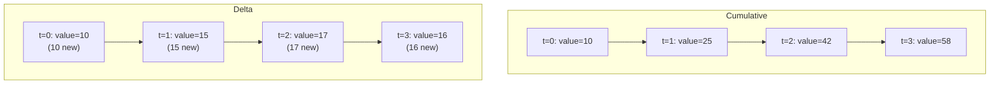
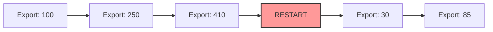

# How to Understand Cumulative vs Delta Metric Temporality in OpenTelemetry

Author: [nawazdhandala](https://www.github.com/nawazdhandala)

Tags: OpenTelemetry, Metrics, Temporality, Cumulative, Delta, Prometheus, OTLP, Observability

Description: Learn the difference between cumulative and delta metric temporality in OpenTelemetry, when to use each, and how to configure exporters for your backend.

---

One of the most confusing aspects of OpenTelemetry metrics is temporality. You set up a counter, increment it a few times, and then find that your backend shows either a steadily increasing line or a series of spikes depending on a configuration option you may not even know exists. Understanding the difference between cumulative and delta temporality is essential for getting correct metric data into your observability backend.

## What Temporality Means

Temporality describes how metric data points relate to time. When your application reports a metric value, the temporality determines whether that value represents the total since the process started or just the change since the last report.

**Cumulative temporality** means each data point contains the running total from a fixed start time. If your counter has been incremented 100 times since the process started, the next export sends the value 100. After 10 more increments, it sends 110. The value only goes up (for counters) and resets to zero when the process restarts.

**Delta temporality** means each data point contains only the change since the previous export. If 10 increments happened in the last export interval, the value sent is 10. In the next interval, if 15 increments happen, the value sent is 15. Each data point is independent of the others.



Both representations encode the same information. You can derive delta values from cumulative by subtracting consecutive data points. You can derive cumulative values from delta by summing all deltas from the start. The difference is in what gets sent over the wire and what your backend expects.

## How Temporality Affects Different Metric Types

Not all metric instruments behave the same way with temporality. Here is how each instrument type interacts with the two temporalities.

**Counter**: Tracks a monotonically increasing value, like total requests served.

```python
from opentelemetry import metrics

meter = metrics.get_meter("my-service")

# Create a counter instrument
request_counter = meter.create_counter(
    name="http.server.request.count",
    description="Total number of HTTP requests received",
    unit="requests",
)

# Increment the counter on each request
def handle_request(method, path, status_code):
    request_counter.add(1, {
        "http.method": method,
        "http.route": path,
        "http.status_code": status_code,
    })
```

With cumulative temporality, each export reports the total count since the meter was created. With delta temporality, each export reports only the requests that arrived since the last export.

**UpDownCounter**: Tracks a value that can increase or decrease, like active connections.

```python
# UpDownCounter can go up and down
active_connections = meter.create_up_down_counter(
    name="http.server.active_connections",
    description="Number of active HTTP connections",
    unit="connections",
)

def on_connection_open():
    active_connections.add(1)

def on_connection_close():
    active_connections.add(-1)
```

With cumulative temporality, the reported value is the net sum of all additions since the start. With delta temporality, it reports the net change since the last export. For UpDownCounters, delta can report negative values if more connections closed than opened in the interval.

**Histogram**: Records the distribution of measurements, like request latency.

```python
# Histogram records distributions
request_duration = meter.create_histogram(
    name="http.server.request.duration",
    description="Duration of HTTP requests",
    unit="ms",
)

def handle_request(request):
    start = time.time()
    response = process(request)
    duration_ms = (time.time() - start) * 1000

    # Record the measurement
    request_duration.record(duration_ms, {
        "http.method": request.method,
        "http.route": request.path,
    })
```

With cumulative temporality, each export contains the histogram buckets with counts accumulated since the start. With delta temporality, bucket counts reflect only the measurements recorded since the last export.

## Configuring Temporality in Python

The temporality is configured on the metric exporter, not on individual instruments. This is because temporality is a property of how data is exported, not how it is collected internally.

```python
from opentelemetry.sdk.metrics import MeterProvider
from opentelemetry.sdk.metrics.export import (
    PeriodicExportingMetricReader,
    AggregationTemporality,
)
from opentelemetry.exporter.otlp.proto.grpc.metric_exporter import OTLPMetricExporter

# Configure OTLP exporter with delta temporality
# This is what most OTLP-native backends prefer
delta_exporter = OTLPMetricExporter(
    endpoint="http://localhost:4317",
    # Set preferred temporality per instrument type
    preferred_temporality={
        # Counters report deltas (change since last export)
        metrics.Counter: AggregationTemporality.DELTA,
        # UpDownCounters report cumulative (net total)
        metrics.UpDownCounter: AggregationTemporality.CUMULATIVE,
        # Histograms report deltas (distribution since last export)
        metrics.Histogram: AggregationTemporality.DELTA,
    },
)

# Wrap in a periodic reader that exports every 60 seconds
reader = PeriodicExportingMetricReader(
    delta_exporter,
    export_interval_millis=60000,
)

# Create the meter provider with this reader
provider = MeterProvider(metric_readers=[reader])
metrics.set_meter_provider(provider)
```

Notice that you can set different temporalities for different instrument types. This is useful because some instruments work better with one temporality over the other.

For a Prometheus-compatible setup, use cumulative temporality:

```python
from opentelemetry.exporter.prometheus import PrometheusMetricReader

# Prometheus always expects cumulative temporality
# The PrometheusMetricReader handles this automatically
prometheus_reader = PrometheusMetricReader()

provider = MeterProvider(metric_readers=[prometheus_reader])
metrics.set_meter_provider(provider)
```

Prometheus is a pull-based system that expects to scrape cumulative counters and compute rates itself. It has no concept of delta temporality in its data model.

## Configuring Temporality in the OpenTelemetry Collector

If you are using the OpenTelemetry Collector as an intermediary, you can transform temporality between what your application sends and what your backend expects:

```yaml
# Collector configuration for temporality transformation
receivers:
  otlp:
    protocols:
      grpc:
        endpoint: 0.0.0.0:4317

processors:
  # The cumulativetodelta processor converts cumulative metrics to delta
  cumulativetodelta:
    # Include specific metrics or convert all
    include:
      match_type: regexp
      metrics:
        - "http.server.*"
        - "db.client.*"

exporters:
  # Backend that expects delta temporality
  otlp/delta_backend:
    endpoint: delta-backend.example.com:4317

  # Backend that expects cumulative temporality
  prometheusremotewrite:
    endpoint: http://prometheus:9090/api/v1/write

service:
  pipelines:
    # Pipeline for delta backend
    metrics/delta:
      receivers: [otlp]
      processors: [cumulativetodelta]
      exporters: [otlp/delta_backend]

    # Pipeline for Prometheus (needs cumulative, which is the default)
    metrics/prometheus:
      receivers: [otlp]
      processors: []
      exporters: [prometheusremotewrite]
```

The `cumulativetodelta` processor is particularly useful when your applications export cumulative metrics but your backend prefers delta. The reverse transformation (delta to cumulative) is more complex because the collector needs to maintain state to reconstruct the running total.

## When to Use Cumulative Temporality

Cumulative temporality works best in these scenarios:

**Prometheus and Prometheus-compatible backends.** Prometheus was designed around cumulative counters. It scrapes the current total and computes rates using the `rate()` and `increase()` functions. Sending delta values to Prometheus breaks this model.

**Environments with unreliable delivery.** If a data point gets dropped in transit, cumulative temporality self-corrects on the next successful delivery. The backend sees the updated total and can compute the correct rate. With delta, a dropped data point means that chunk of data is permanently lost.

**Long-running processes with infrequent restarts.** Cumulative values increase monotonically until a process restart. Backends detect these resets and handle them automatically. If your services run for days or weeks between restarts, cumulative works well.

```python
# Cumulative example: each export shows the running total
# Export 1: counter_value = 100   (100 new since start)
# Export 2: counter_value = 250   (150 new since export 1)
# Export 3: counter_value = 410   (160 new since export 2)
# Process restart
# Export 4: counter_value = 30    (backend detects reset)
```

## When to Use Delta Temporality

Delta temporality works best in these scenarios:

**Stateless or serverless environments.** Functions-as-a-service and short-lived containers cannot maintain cumulative state across invocations. Each invocation starts fresh, so cumulative values always start from zero, making them useless. Delta temporality lets each invocation report just its own contribution.

```python
# In a serverless function, delta makes sense
# Invocation 1: requests=5, duration_sum=120ms
# Invocation 2: requests=3, duration_sum=85ms
# Invocation 3: requests=8, duration_sum=340ms
# Each is independent; no need to maintain running totals
```

**OTLP-native backends.** Many modern observability backends (including OneUptime) that accept OTLP natively can handle both temporalities but prefer delta because it is more efficient. Delta data points are smaller and do not require the backend to compute differences.

**High-cardinality metric streams.** With cumulative temporality, the SDK must maintain the running total for every unique combination of attribute values. If you have a counter with 10,000 unique attribute combinations, that is 10,000 running totals in memory. Delta temporality lets the SDK flush and forget, reducing memory usage.

**Multi-instance aggregation.** When you have 50 instances of a service and want to aggregate their metrics, delta temporality is simpler. You just sum the deltas. With cumulative, you need to track each instance's cumulative value separately and handle resets.

## The Reset Problem with Cumulative Metrics

The biggest operational headache with cumulative temporality is handling resets. When a process restarts, cumulative counters drop back to zero. Your backend needs to detect this and handle it correctly.



Most backends handle this by comparing consecutive data points. If the current value is less than the previous one, they infer a reset and treat the new value as a delta from zero. But this heuristic fails in some edge cases:

If a process restarts and quickly reaches a value higher than the last exported value before the reset, the backend might not detect the reset at all. This leads to undercounting. For example, if the last value before restart was 100 and the first value after restart is 150, the backend might think 50 new events happened when actually 150 happened.

Delta temporality avoids this entire class of problems because each data point is self-contained.

## Configuring Temporality in Java

For Java applications, temporality configuration follows the same pattern:

```java
import io.opentelemetry.sdk.metrics.SdkMeterProvider;
import io.opentelemetry.sdk.metrics.export.PeriodicMetricReader;
import io.opentelemetry.exporter.otlp.metrics.OtlpGrpcMetricExporter;
import io.opentelemetry.sdk.metrics.export.AggregationTemporalitySelector;

// Create an OTLP exporter with delta temporality preference
OtlpGrpcMetricExporter exporter = OtlpGrpcMetricExporter.builder()
    .setEndpoint("http://localhost:4317")
    // Use delta temporality for all instrument types
    .setAggregationTemporalitySelector(
        AggregationTemporalitySelector.deltaPreferred()
    )
    .build();

// Create a periodic metric reader
PeriodicMetricReader reader = PeriodicMetricReader.builder(exporter)
    .setInterval(Duration.ofSeconds(60))
    .build();

// Build the meter provider
SdkMeterProvider meterProvider = SdkMeterProvider.builder()
    .registerMetricReader(reader)
    .build();
```

The `AggregationTemporalitySelector` provides factory methods for common configurations: `deltaPreferred()` for backends that prefer delta, `cumulativePreferred()` for Prometheus-style backends, and custom selectors for mixed requirements.

## Practical Decision Framework

Here is a straightforward way to decide which temporality to use:

| Factor | Use Cumulative | Use Delta |
|--------|---------------|-----------|
| Backend | Prometheus, Thanos, Cortex | OTLP-native backends, OneUptime |
| Environment | Long-running services | Serverless, short-lived containers |
| Delivery | Unreliable network | Reliable network |
| Cardinality | Low to moderate | High cardinality metrics |
| Memory | Sufficient memory for state | Memory-constrained |

If you are unsure, start with whatever your backend prefers. Most modern OTLP backends document their preferred temporality. If you are using the OpenTelemetry Collector as an intermediary, you can always transform temporality in the collector pipeline.

## Debugging Temporality Issues

Common symptoms of temporality misconfiguration:

**Metrics show as always zero or near-zero.** Your application sends cumulative data but the backend interprets it as delta. It sees the small difference between consecutive cumulative values as the actual value.

**Metrics show impossibly large values.** Your application sends delta data but the backend interprets it as cumulative. It sees each delta as a running total.

**Metrics have gaps after deployments.** Cumulative counters reset on restart and the backend does not handle the reset correctly.

To debug, enable debug logging on the exporter to see what values are actually being sent:

```python
import logging

# Enable debug logging for the metrics SDK
logging.basicConfig(level=logging.DEBUG)
logging.getLogger("opentelemetry.sdk.metrics").setLevel(logging.DEBUG)
```

Or use the collector's debug exporter to inspect data in transit:

```yaml
exporters:
  debug:
    # Print every metric data point to the collector logs
    verbosity: detailed

service:
  pipelines:
    metrics:
      receivers: [otlp]
      processors: []
      exporters: [debug, otlp]
```

This shows the raw metric data points including their temporality, start time, and current time, making it straightforward to identify mismatches.

## Conclusion

Cumulative and delta temporality represent two valid ways to report metric data over time. Cumulative is resilient to data loss and works naturally with Prometheus-style systems. Delta is more efficient, works well in stateless environments, and avoids the reset problem entirely. The right choice depends on your backend, your deployment model, and your cardinality requirements. When in doubt, check what your backend expects and configure the exporter accordingly, or use the OpenTelemetry Collector to bridge the gap between what your application produces and what your backend consumes.
