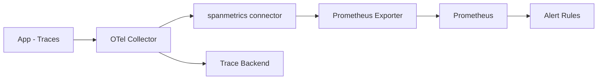

# How to Build Custom Alert Rules from OpenTelemetry Span Metrics (Error Rate, Latency P99)

Author: [nawazdhandala](https://www.github.com/nawazdhandala)

Tags: OpenTelemetry, Span Metrics, Alerting, Latency Monitoring

Description: Generate Prometheus-compatible metrics from OpenTelemetry spans using the spanmetrics connector and build alert rules for error rate and P99 latency.

Traces are great for debugging individual requests, but they are not directly queryable for aggregate alerting. You cannot easily ask "what is the P99 latency of service X over the last 5 minutes?" from raw span data. That is where span metrics come in.

The OpenTelemetry Collector's `spanmetrics` connector automatically generates RED metrics (Rate, Error, Duration) from incoming spans. These metrics can be exported to Prometheus, where you can write standard alert rules for error rate, latency percentiles, and throughput.

## How the Spanmetrics Connector Works

The spanmetrics connector sits between a traces pipeline and a metrics pipeline. It reads incoming spans and produces histogram and counter metrics that summarize span behavior.



For each span, the connector generates:

- `duration_milliseconds` - a histogram of span durations
- `calls_total` - a counter of span calls, with a `status.code` label for error tracking

These metrics are broken down by `service.name`, `span.name`, `span.kind`, and `status.code`.

## Configuring the Spanmetrics Connector

Here is a Collector configuration that receives traces, generates span metrics, and exports both to their respective backends:

```yaml
# otel-collector-config.yaml
# Generate RED metrics from traces using the spanmetrics connector

receivers:
  otlp:
    protocols:
      grpc:
        endpoint: 0.0.0.0:4317

connectors:
  # The spanmetrics connector reads spans and produces metrics
  spanmetrics:
    # Include these resource attributes as metric dimensions
    # so you can filter and group by service, environment, etc.
    dimensions:
      - name: http.method
      - name: http.status_code
      - name: http.route
      - name: rpc.method
      - name: rpc.service

    # Configure histogram buckets for latency measurement
    # These buckets determine the granularity of percentile calculations
    histogram:
      explicit:
        buckets: [5ms, 10ms, 25ms, 50ms, 100ms, 250ms, 500ms, 1s, 2.5s, 5s, 10s]

    # Use milliseconds for histogram buckets
    dimensions_cache_size: 10000

    # Aggregate metrics over this period before emitting
    aggregation_temporality: "AGGREGATION_TEMPORALITY_CUMULATIVE"

exporters:
  # Export span metrics to Prometheus
  prometheus:
    endpoint: 0.0.0.0:8889
    resource_to_telemetry_conversion:
      enabled: true

  # Export traces to your trace backend
  otlp/traces:
    endpoint: "trace-backend:4317"
    tls:
      insecure: true

service:
  pipelines:
    # Traces pipeline: receives spans, sends to trace backend and spanmetrics
    traces:
      receivers: [otlp]
      exporters: [spanmetrics, otlp/traces]

    # Metrics pipeline: receives generated span metrics, exports to Prometheus
    metrics/spanmetrics:
      receivers: [spanmetrics]
      exporters: [prometheus]
```

## Understanding the Generated Metrics

Once the connector is running, it produces Prometheus metrics with the following naming pattern. Here is what you will see when you query the Prometheus endpoint:

```promql
# Total number of spans (calls) grouped by service name, span name, and status code
# status_code="STATUS_CODE_OK" for successful spans
# status_code="STATUS_CODE_ERROR" for failed spans
calls_total{service_name="payment-api", span_name="POST /charge", status_code="STATUS_CODE_OK"}

# Histogram of span durations in milliseconds
# Use histogram_quantile() to calculate percentiles
duration_milliseconds_bucket{service_name="payment-api", span_name="POST /charge", le="100"}
duration_milliseconds_bucket{service_name="payment-api", span_name="POST /charge", le="250"}
duration_milliseconds_bucket{service_name="payment-api", span_name="POST /charge", le="500"}
```

## Alert Rule: Error Rate per Service

This alert fires when the error rate for any service exceeds 5% over a 5-minute window:

```yaml
# prometheus-alerts.yaml
# Error rate alert based on spanmetrics connector output

groups:
  - name: span-metric-alerts
    rules:
      - alert: SpanErrorRateHigh
        # Calculate error rate as: error spans / total spans
        expr: |
          (
            sum by (service_name) (
              rate(calls_total{status_code="STATUS_CODE_ERROR"}[5m])
            )
            /
            sum by (service_name) (
              rate(calls_total[5m])
            )
          ) > 0.05
        for: 5m
        labels:
          severity: critical
        annotations:
          summary: "High error rate on {{ $labels.service_name }}"
          description: "Error rate is {{ $value | humanizePercentage }} over the last 5 minutes"
          traces_url: "https://tracing.example.com/search?service={{ $labels.service_name }}&tags=error%3Dtrue"
```

## Alert Rule: P99 Latency per Service

This alert fires when the P99 latency for any service exceeds 2 seconds:

```yaml
      # P99 latency alert
      - alert: SpanLatencyP99High
        # Use histogram_quantile to calculate the 99th percentile
        expr: |
          histogram_quantile(0.99,
            sum by (service_name, le) (
              rate(duration_milliseconds_bucket[5m])
            )
          ) > 2000
        for: 10m
        labels:
          severity: warning
        annotations:
          summary: "P99 latency above 2s on {{ $labels.service_name }}"
          description: "P99 latency is {{ $value | humanizeDuration }} for service {{ $labels.service_name }}"
```

## Alert Rule: P99 Latency per Endpoint

For more granular alerting, break down latency by span name (which maps to the HTTP route or RPC method):

```yaml
      # Per-endpoint P99 latency alert
      - alert: EndpointLatencyP99High
        expr: |
          histogram_quantile(0.99,
            sum by (service_name, span_name, le) (
              rate(duration_milliseconds_bucket[5m])
            )
          ) > 3000
        for: 10m
        labels:
          severity: warning
        annotations:
          summary: "P99 latency above 3s on {{ $labels.service_name }} {{ $labels.span_name }}"
          description: "Endpoint {{ $labels.span_name }} has P99 latency of {{ $value }}ms"
```

## Alert Rule: Throughput Drop

Detect when a service's request rate drops significantly, which could indicate a deployment issue or upstream failure:

```yaml
      # Throughput drop alert - fires when traffic drops by 50% compared to 1 hour ago
      - alert: ThroughputDrop
        expr: |
          (
            sum by (service_name) (rate(calls_total[5m]))
            /
            sum by (service_name) (rate(calls_total[5m] offset 1h))
          ) < 0.5
        for: 10m
        labels:
          severity: warning
        annotations:
          summary: "Throughput dropped >50% on {{ $labels.service_name }}"
          description: "Current rate is {{ $value | humanizePercentage }} of the rate 1 hour ago"
```

## Alert Rule: Error Rate per HTTP Status Code

Break down error alerting by HTTP status code to distinguish between client errors (4xx) and server errors (5xx):

```yaml
      # Server error rate (5xx only) using the http.status_code dimension
      - alert: ServerErrorRateHigh
        expr: |
          (
            sum by (service_name) (
              rate(calls_total{http_status_code=~"5.."}[5m])
            )
            /
            sum by (service_name) (
              rate(calls_total[5m])
            )
          ) > 0.02
        for: 5m
        labels:
          severity: critical
        annotations:
          summary: "5xx error rate above 2% on {{ $labels.service_name }}"
          description: "Server error rate is {{ $value | humanizePercentage }}"
```

## Fine-Tuning Histogram Buckets

The accuracy of your percentile alerts depends on choosing the right histogram buckets. If your buckets are too coarse, the calculated P99 will be inaccurate.

Guidelines for bucket selection:

- **API services**: `[5ms, 10ms, 25ms, 50ms, 100ms, 250ms, 500ms, 1s, 2.5s, 5s, 10s]`
- **Background jobs**: `[100ms, 500ms, 1s, 5s, 10s, 30s, 60s, 120s, 300s]`
- **Database queries**: `[1ms, 5ms, 10ms, 25ms, 50ms, 100ms, 250ms, 500ms, 1s]`

More buckets give better accuracy but increase the number of time series stored in Prometheus. For a service with 50 unique span names and 11 buckets, you generate 550 time series per service just for the histogram. Multiply by the number of services and dimension combinations to estimate your total series count.

## Combining with Exemplars

The spanmetrics connector can also attach trace exemplars to the generated metrics. This connects an alert back to a specific trace that triggered it:

```yaml
connectors:
  spanmetrics:
    # Enable exemplars so you can click through from a metric alert
    # to an actual trace in your tracing backend
    exemplars:
      enabled: true
    dimensions:
      - name: http.method
      - name: http.route
    histogram:
      explicit:
        buckets: [5ms, 10ms, 25ms, 50ms, 100ms, 250ms, 500ms, 1s, 2.5s, 5s, 10s]
```

When viewing these metrics in Grafana, you can click on an exemplar dot to jump directly to the corresponding trace. This closes the loop between "something is wrong" (alert) and "here is exactly what happened" (trace), making the spanmetrics connector one of the most valuable components in an OpenTelemetry-based observability stack.
