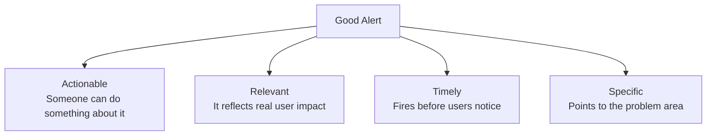
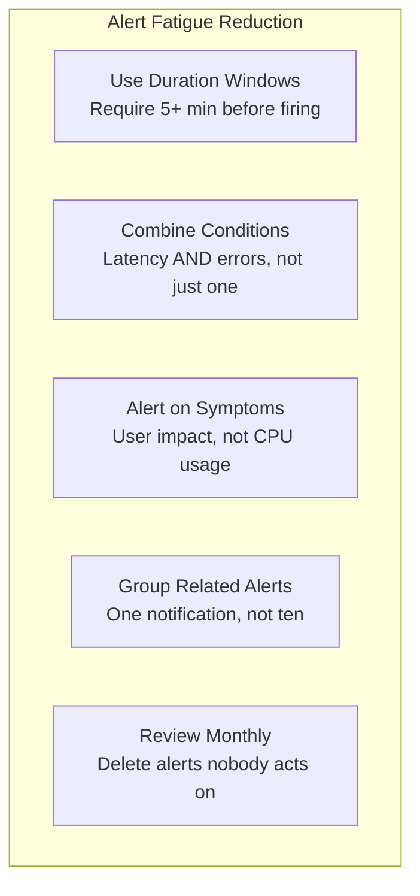

# How to Build Custom Alerting Rules from OpenTelemetry Metrics

Author: [nawazdhandala](https://www.github.com/nawazdhandala)

Tags: OpenTelemetry, Alerting, Metrics, Custom Rules, Observability, Monitoring, Incident Response

Description: Learn how to build effective custom alerting rules from OpenTelemetry metrics, covering alert design principles, multi-condition rules, and strategies to reduce alert fatigue.

---

Alerting is where observability meets action. You can have the most comprehensive metrics collection in the world, but if your alerts are poorly designed, your on-call engineers will either drown in noise or miss real problems. Good alerting rules are specific, actionable, and based on metrics that actually reflect user impact.

OpenTelemetry gives you rich, structured metrics with dimensional attributes that you can use to build precise alerting rules. Instead of a generic "CPU is high" alert, you can alert on "P95 latency for the checkout endpoint exceeded 500ms for 5 minutes and error rate is above 1%." That is an alert worth waking someone up for.

This guide covers how to design alerting rules from OpenTelemetry metrics, how to implement multi-condition alerts, and how to avoid the most common alerting mistakes.

---

## Alerting Design Principles



Before writing a single alerting rule, internalize these principles. Every alert should clearly answer: "What is broken, how bad is it, and what should I do about it?"

---

## Collecting Alertable Metrics

Start by instrumenting the metrics that drive your most important alerting rules. These should focus on user-facing indicators, not internal system metrics.

```python
# alertable_metrics.py
from opentelemetry import metrics
from opentelemetry.sdk.metrics import MeterProvider
from opentelemetry.sdk.metrics.export import PeriodicExportingMetricReader
from opentelemetry.exporter.otlp.proto.http.metric_exporter import OTLPMetricExporter
from opentelemetry.sdk.resources import Resource, SERVICE_NAME
import time

resource = Resource.create({SERVICE_NAME: "api-gateway"})
reader = PeriodicExportingMetricReader(
    OTLPMetricExporter(endpoint="https://otel.oneuptime.com/v1/metrics"),
    export_interval_millis=10000,
)
provider = MeterProvider(resource=resource, metric_readers=[reader])
metrics.set_meter_provider(provider)
meter = metrics.get_meter("alerting")

# Request latency histogram with endpoint-level granularity
request_duration = meter.create_histogram(
    name="http.server.request.duration",
    description="Server request duration for alerting",
    unit="ms",
)

# Error counter with detailed classification
error_counter = meter.create_counter(
    name="http.server.errors",
    description="Server errors by type and endpoint",
    unit="errors",
)

# Request counter for rate calculations
request_counter = meter.create_counter(
    name="http.server.requests",
    description="Total server requests",
    unit="requests",
)

# Saturation metrics for resource-based alerts
queue_depth = meter.create_observable_gauge(
    name="app.queue.depth",
    description="Current queue depth",
    unit="items",
    callbacks=[lambda options: [
        metrics.Observation(get_queue_depth(), {"queue": "default"})
    ]],
)

def track_request(endpoint: str, method: str, status_code: int, duration_ms: float):
    """Record metrics for a completed request."""
    attributes = {
        "http.route": endpoint,
        "http.method": method,
        "http.status_code": str(status_code),
    }

    request_duration.record(duration_ms, attributes)
    request_counter.add(1, attributes)

    if status_code >= 500:
        error_counter.add(1, {
            **attributes,
            "error.category": classify_error(status_code),
        })
```

The key is including enough dimensional attributes to write specific rules. Alerting on all 5xx errors across all endpoints is noisy. Alerting on 5xx errors specifically on the `/checkout` endpoint is much more useful.

---

## Defining Alert Rules

Alert rules evaluate conditions against your metrics and fire when those conditions are met. Here is a Python framework for defining and evaluating custom alert rules.

```python
# alert_rules.py
from dataclasses import dataclass, field
from datetime import datetime, timedelta
from enum import Enum
from typing import Callable, Optional

class AlertSeverity(Enum):
    INFO = "info"
    WARNING = "warning"
    CRITICAL = "critical"
    PAGE = "page"  # Wake someone up

@dataclass
class AlertRule:
    """Defines a single alerting rule."""
    name: str
    description: str
    severity: AlertSeverity
    metric: str
    condition: Callable  # Function that evaluates the metric value
    duration: timedelta  # How long condition must be true before firing
    labels: dict = field(default_factory=dict)
    runbook_url: str = ""
    team: str = ""

    def evaluate(self, current_value: float, condition_start: Optional[datetime]) -> dict:
        """
        Evaluate the rule against the current metric value.
        Returns the evaluation result with firing status.
        """
        condition_met = self.condition(current_value)

        if not condition_met:
            return {"firing": False, "condition_start": None}

        now = datetime.utcnow()

        if condition_start is None:
            # Condition just started being true
            return {"firing": False, "condition_start": now}

        # Check if condition has been true long enough
        elapsed = now - condition_start
        if elapsed >= self.duration:
            return {
                "firing": True,
                "condition_start": condition_start,
                "alert": {
                    "name": self.name,
                    "description": self.description,
                    "severity": self.severity.value,
                    "current_value": current_value,
                    "duration_seconds": elapsed.total_seconds(),
                    "runbook_url": self.runbook_url,
                    "team": self.team,
                },
            }

        return {"firing": False, "condition_start": condition_start}
```

The `duration` parameter is critical. It prevents flapping alerts caused by momentary spikes. If latency spikes for one data point and immediately recovers, that is not worth alerting on. Requiring the condition to be true for 5 minutes filters out transient blips.

---

## Multi-Condition Alert Rules

The most useful alerts combine multiple conditions. "Latency is high AND error rate is elevated" is much more meaningful than either condition alone.

```python
# multi_condition_alerts.py
from dataclasses import dataclass
from typing import List

@dataclass
class MultiConditionRule:
    """
    An alert rule that requires multiple conditions to be true simultaneously.
    Reduces false positives by combining correlated signals.
    """
    name: str
    description: str
    severity: AlertSeverity
    conditions: List[dict]  # Each dict has 'metric', 'operator', 'threshold'
    require_all: bool = True  # True = AND, False = OR
    duration: timedelta = timedelta(minutes=5)
    runbook_url: str = ""

    def evaluate(self, metric_values: dict) -> bool:
        """
        Evaluate all conditions against current metric values.
        Returns True if the alert should fire.
        """
        results = []
        for condition in self.conditions:
            metric = condition["metric"]
            operator = condition["operator"]
            threshold = condition["threshold"]

            value = metric_values.get(metric)
            if value is None:
                results.append(False)
                continue

            if operator == ">":
                results.append(value > threshold)
            elif operator == "<":
                results.append(value < threshold)
            elif operator == ">=":
                results.append(value >= threshold)
            elif operator == "<=":
                results.append(value <= threshold)

        if self.require_all:
            return all(results)
        return any(results)


# Example: Define a high-impact checkout alert
checkout_degraded = MultiConditionRule(
    name="checkout_degraded",
    description="Checkout endpoint showing elevated latency AND errors",
    severity=AlertSeverity.PAGE,
    conditions=[
        {
            "metric": "http.server.request.duration.p95{http.route='/checkout'}",
            "operator": ">",
            "threshold": 500,  # P95 latency above 500ms
        },
        {
            "metric": "http.server.errors.rate{http.route='/checkout'}",
            "operator": ">",
            "threshold": 0.01,  # Error rate above 1%
        },
    ],
    require_all=True,  # Both conditions must be true
    duration=timedelta(minutes=5),
    runbook_url="https://wiki.example.com/runbooks/checkout-degraded",
)
```

This multi-condition approach dramatically reduces false positives. A latency spike during a traffic surge is expected and not alertable. A latency spike combined with elevated errors is a real problem.

---

## Alert Routing and Escalation

Different alerts should go to different places based on severity and ownership.

```python
# alert_router.py
from dataclasses import dataclass
from typing import List

@dataclass
class AlertRoute:
    """Defines where an alert should be sent."""
    severity: AlertSeverity
    team: str
    channels: List[str]  # e.g., ["slack:#payments-alerts", "pagerduty:payments"]

class AlertRouter:
    """Routes fired alerts to the appropriate channels."""

    def __init__(self):
        self.routes = [
            AlertRoute(
                severity=AlertSeverity.PAGE,
                team="platform",
                channels=["pagerduty:platform-oncall", "slack:#platform-incidents"],
            ),
            AlertRoute(
                severity=AlertSeverity.CRITICAL,
                team="platform",
                channels=["slack:#platform-alerts", "email:platform-team@example.com"],
            ),
            AlertRoute(
                severity=AlertSeverity.WARNING,
                team="platform",
                channels=["slack:#platform-alerts"],
            ),
            AlertRoute(
                severity=AlertSeverity.INFO,
                team="platform",
                channels=["slack:#platform-info"],
            ),
        ]

    def route(self, alert: dict):
        """Route an alert to the appropriate channels."""
        severity = AlertSeverity(alert["severity"])
        team = alert.get("team", "platform")

        for route in self.routes:
            if route.severity == severity and route.team == team:
                for channel in route.channels:
                    self._send_to_channel(channel, alert)
                return

    def _send_to_channel(self, channel: str, alert: dict):
        """Send an alert to a specific channel."""
        channel_type, target = channel.split(":", 1)
        if channel_type == "slack":
            send_slack_alert(target, alert)
        elif channel_type == "pagerduty":
            send_pagerduty_alert(target, alert)
        elif channel_type == "email":
            send_email_alert(target, alert)
```

---

## Reducing Alert Fatigue

Alert fatigue is the biggest enemy of effective alerting. Here are concrete strategies backed by OpenTelemetry metrics.



Track your alert quality metrics: how many alerts fire per week, how many are acknowledged, and how many lead to actual incident response. If more than 30% of your alerts are being dismissed without action, your rules need tuning. This meta-monitoring of your alerting quality is just as important as the alerts themselves.

---

## Summary

Custom alerting rules built from OpenTelemetry metrics give you precise, actionable alerts that reflect real user impact. Start with the RED metrics (Rate, Errors, Duration) for your most critical endpoints, combine them into multi-condition rules to reduce noise, and route them to the right teams. Review your alerts regularly and delete any that are not driving action. Remember, the goal is not to have more alerts. The goal is to have better alerts that catch real problems early and tell the on-call engineer exactly what is wrong.
