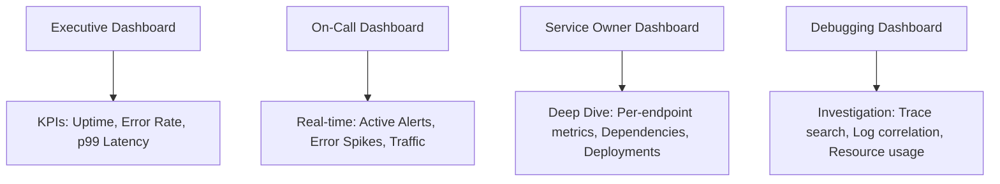
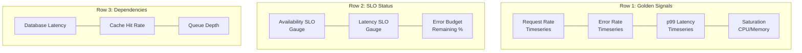

# How to Build Custom Dashboards from OpenTelemetry Data

Author: [nawazdhandala](https://www.github.com/nawazdhandala)

Tags: OpenTelemetry, Dashboards, Metrics, Visualization, Monitoring, Observability

Description: Learn how to design and build effective custom dashboards from OpenTelemetry metrics, traces, and logs to give your team actionable observability views.

---

> Dashboards are the interface between your telemetry data and your team's ability to act on it. A well-designed dashboard built from OpenTelemetry data turns raw signals into situational awareness, letting operators spot problems before users do.

Most teams start with default dashboards provided by their observability backend. These are fine for getting started, but they rarely match your specific architecture, your SLOs, or the questions your team asks during incidents. Custom dashboards fill this gap.

This guide covers how to structure OpenTelemetry data for dashboard consumption, design dashboard layouts that actually help during incidents, and implement them with practical examples.

---

## Designing Dashboards That Work

Before writing any queries, think about who will use the dashboard and when. Different audiences need different views.



The most common mistake is building one dashboard that tries to serve all four audiences. You end up with 40 panels that nobody can parse during a 2am incident. Instead, build focused dashboards with a clear purpose.

---

## Instrumenting for Dashboard-Friendly Metrics

The metrics you emit from your application determine what you can display on dashboards. Here is a comprehensive instrumentation setup in Python that covers the most common dashboard panels:

```python
# instrumentation.py
# Emit OpenTelemetry metrics optimized for dashboard consumption

from opentelemetry import metrics
from opentelemetry.sdk.metrics import MeterProvider
from opentelemetry.exporter.otlp.proto.grpc.metric_exporter import OTLPMetricExporter
from opentelemetry.sdk.metrics.export import PeriodicExportingMetricReader
from opentelemetry.sdk.resources import Resource

# Configure the meter provider with a 15-second export interval
# This determines the minimum resolution of your dashboard graphs
resource = Resource.create({
    "service.name": "checkout-service",
    "deployment.environment": "production",
})

exporter = OTLPMetricExporter(endpoint="http://otel-collector:4317", insecure=True)
reader = PeriodicExportingMetricReader(exporter, export_interval_millis=15000)
provider = MeterProvider(resource=resource, metric_readers=[reader])
metrics.set_meter_provider(provider)

meter = metrics.get_meter("checkout-service")

# Request rate and duration - the foundation of any service dashboard
# Use a histogram so you can derive p50, p95, p99 latencies in queries
request_duration = meter.create_histogram(
    name="http.server.request.duration",
    description="Time to process each HTTP request",
    unit="ms",
)

# Active requests gauge - shows current concurrency
# Useful for spotting connection pool exhaustion
active_requests = meter.create_up_down_counter(
    name="http.server.active_requests",
    description="Number of requests currently being processed",
    unit="1",
)

# Business metrics - these go on executive dashboards
# Track domain-specific events alongside technical metrics
orders_completed = meter.create_counter(
    name="business.orders.completed",
    description="Number of orders successfully placed",
    unit="1",
)

order_value = meter.create_histogram(
    name="business.orders.value",
    description="Monetary value of completed orders",
    unit="USD",
)

# Infrastructure metrics - queue depths, pool sizes, cache hit rates
# These appear on the service owner's deep-dive dashboard
queue_depth = meter.create_observable_gauge(
    name="queue.depth",
    description="Number of items waiting in the processing queue",
    callbacks=[lambda options: get_queue_depth()],
    unit="1",
)

cache_hit_ratio = meter.create_observable_gauge(
    name="cache.hit_ratio",
    description="Ratio of cache hits to total lookups",
    callbacks=[lambda options: compute_cache_ratio()],
    unit="1",
)
```

The key principle is to emit metrics at multiple levels of abstraction. Technical metrics (request duration, error rate) serve the on-call engineer. Business metrics (orders completed, revenue) serve leadership. Infrastructure metrics (queue depth, cache ratio) serve the service owner.

---

## Processing Metrics in the Collector for Dashboards

The OpenTelemetry Collector can transform and enrich metrics before they reach your dashboard backend. This is useful for pre-computing derived metrics that would be expensive to calculate at query time.

```yaml
# otel-collector-config.yaml
receivers:
  otlp:
    protocols:
      grpc:
        endpoint: 0.0.0.0:4317

processors:
  # Add metadata that dashboards can use for filtering
  resource:
    attributes:
      - key: team
        value: "checkout"
        action: upsert
      - key: tier
        value: "critical"
        action: upsert

  # Transform metrics to create dashboard-friendly aggregations
  # This processor computes per-minute rates from counters
  metricstransform:
    transforms:
      # Rename metrics to match your dashboard naming convention
      - include: http.server.request.duration
        action: update
        new_name: request_duration_ms

      # Create a new metric that computes error percentage
      # This saves dashboard query complexity
      - include: http.server.request.errors
        action: insert
        new_name: error_rate_percent
        operations:
          - action: aggregate_labels
            label_set: [http.method, http.route]

  # Batch metrics to reduce cardinality pressure on your backend
  batch:
    timeout: 15s
    send_batch_size: 1000

exporters:
  otlp:
    endpoint: https://oneuptime.com/otlp
    headers:
      Authorization: "Bearer your-api-key"

service:
  pipelines:
    metrics:
      receivers: [otlp]
      processors: [resource, metricstransform, batch]
      exporters: [otlp]
```

---

## Building the On-Call Dashboard

The on-call dashboard is the most critical one. It needs to answer "is something broken right now?" within 5 seconds of looking at it. Here is the layout:



The queries behind these panels use the metrics we instrumented above. Here are PromQL examples for each panel:

```yaml
# on-call-dashboard-panels.yaml
# Panel definitions with PromQL queries for each golden signal

panels:
  - title: "Request Rate"
    type: timeseries
    # Rate of requests per second, broken down by status code
    query: |
      sum(rate(request_duration_ms_count{
        service_name="checkout-service"
      }[5m])) by (http_status_code)

  - title: "Error Rate (%)"
    type: timeseries
    # Percentage of 5xx responses over total responses
    query: |
      100 * sum(rate(request_duration_ms_count{
        service_name="checkout-service",
        http_status_code=~"5.."
      }[5m]))
      /
      sum(rate(request_duration_ms_count{
        service_name="checkout-service"
      }[5m]))

  - title: "p99 Latency (ms)"
    type: timeseries
    # 99th percentile request duration
    query: |
      histogram_quantile(0.99,
        sum(rate(request_duration_ms_bucket{
          service_name="checkout-service"
        }[5m])) by (le)
      )

  - title: "Active Requests"
    type: gauge
    # Current number of in-flight requests
    query: |
      sum(http_server_active_requests{
        service_name="checkout-service"
      })
```

---

## Building the Service Owner Dashboard

Service owners need deeper visibility into their service's behavior over time. This dashboard adds deployment markers, per-endpoint breakdowns, and dependency health.

```python
# dashboard_builder.py
# Programmatically define dashboard panels using your backend's API
# This makes dashboards version-controlled and reproducible

def create_service_dashboard(service_name, endpoints):
    """Generate a service owner dashboard configuration"""

    panels = []

    # Overview row: aggregate metrics for the entire service
    panels.append({
        "title": f"{service_name} - Request Volume",
        "type": "timeseries",
        "query": f'sum(rate(request_duration_ms_count{{service_name="{service_name}"}}[5m]))',
        "row": 0,
    })

    # Per-endpoint breakdown: show each API route separately
    # This helps identify which endpoints are degrading
    for endpoint in endpoints:
        panels.append({
            "title": f"Latency: {endpoint}",
            "type": "timeseries",
            "query": (
                f'histogram_quantile(0.95, '
                f'sum(rate(request_duration_ms_bucket{{'
                f'service_name="{service_name}", '
                f'http_route="{endpoint}"'
                f'}}[5m])) by (le))'
            ),
            "row": 1,
        })

    # Dependency health: latency to each downstream service
    panels.append({
        "title": "Database Query Duration (p95)",
        "type": "timeseries",
        "query": (
            f'histogram_quantile(0.95, '
            f'sum(rate(db_client_duration_bucket{{'
            f'service_name="{service_name}"'
            f'}}[5m])) by (le, db_operation))'
        ),
        "row": 2,
    })

    # Deployment markers: vertical lines showing when new versions deployed
    # These help correlate performance changes with code releases
    panels.append({
        "title": "Deployments",
        "type": "annotations",
        "query": f'deployment_timestamp{{service_name="{service_name}"}}',
        "row": 0,  # Overlay on the request volume panel
    })

    return {
        "title": f"{service_name} - Service Dashboard",
        "panels": panels,
        "refresh_interval": "30s",
        "time_range": "6h",
    }

# Generate dashboard for the checkout service
dashboard = create_service_dashboard(
    service_name="checkout-service",
    endpoints=["/api/checkout", "/api/cart", "/api/payment"],
)
```

---

## Dashboard Anti-Patterns to Avoid

Through experience, certain dashboard patterns consistently fail to help teams:

1. **Too many panels**: If you need to scroll to see all panels, the dashboard has too many. Split it into focused views.

2. **Absolute values without context**: A gauge showing "1,247 requests per second" means nothing without historical context. Always show time series, not just current values.

3. **Missing units**: Always include units in panel titles and axis labels. "Latency: 45" is meaningless. "Latency: 45ms" is actionable.

4. **Alert thresholds not visible**: If you have an alert at p99 > 500ms, draw a horizontal line at 500ms on the latency panel. This gives operators immediate context for how close they are to the threshold.

5. **No drill-down path**: Every dashboard panel should link to a more detailed view. The on-call dashboard should link to the service dashboard, which should link to trace search.

Good dashboards are not art projects. They are tools that help people make decisions quickly under pressure. Build them from the questions your team actually asks during incidents, instrument your services to answer those questions, and iterate based on real usage.
