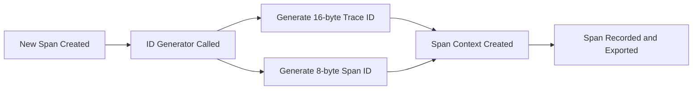
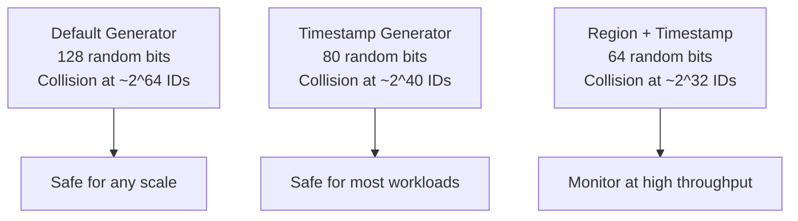

# How to Implement Custom ID Generators for Trace and Span IDs

Author: [nawazdhandala](https://www.github.com/nawazdhandala)

Tags: OpenTelemetry, Tracing, Custom ID Generator, Trace ID, Span ID, SDK, Distributed Tracing

Description: Learn how to implement custom ID generators for trace and span IDs in OpenTelemetry to integrate with existing tracing systems or meet compliance requirements.

---

OpenTelemetry generates trace IDs and span IDs using random number generators by default. A trace ID is a 16-byte (128-bit) value and a span ID is an 8-byte (64-bit) value, both represented as lowercase hexadecimal strings. The default random generation works perfectly for most use cases, but sometimes you need control over how these IDs are produced. Maybe you need to embed a timestamp for sortability, maintain compatibility with a legacy tracing system, or include a region identifier for routing. This post walks through implementing custom ID generators in Python, Java, and Node.js.

## How Default ID Generation Works

Before writing a custom generator, it helps to understand what the default one does. The SDK uses a cryptographically secure random number generator to produce IDs. Each trace ID is 16 random bytes and each span ID is 8 random bytes. The specification requires that IDs must not be all zeros, as that value is reserved to indicate an invalid or missing ID.



The ID generator is called every time a new span is created (for span IDs) and every time a new root span starts a trace (for trace IDs). Child spans inherit their parent's trace ID, so the trace ID generator is only called for root spans.

## Custom ID Generator in Python

The Python SDK defines an `IdGenerator` protocol with two methods: `generate_trace_id()` and `generate_span_id()`. To create a custom generator, implement a class with these methods.

Here is a generator that embeds a Unix timestamp in the first 6 bytes of the trace ID, making traces naturally sortable by creation time:

```python
import time
import os
import struct
from opentelemetry import trace
from opentelemetry.sdk.trace import TracerProvider
from opentelemetry.sdk.trace.id_generator import IdGenerator
from opentelemetry.sdk.trace.export import (
    BatchSpanProcessor,
    ConsoleSpanExporter,
)


class TimestampIdGenerator(IdGenerator):
    """Generates trace IDs with embedded timestamps for natural ordering.

    Trace ID layout (16 bytes / 128 bits):
    - Bytes 0-5:  Millisecond timestamp (48 bits, good until year 10889)
    - Bytes 6-15: Random bytes (80 bits of entropy)

    Span ID layout (8 bytes / 64 bits):
    - All random bytes
    """

    def generate_trace_id(self) -> int:
        # Get current time in milliseconds
        timestamp_ms = int(time.time() * 1000)

        # Pack timestamp into 6 bytes (48 bits)
        # This gives us millisecond precision until the year 10889
        ts_bytes = struct.pack(">Q", timestamp_ms)[2:]  # Take last 6 bytes

        # Generate 10 random bytes for uniqueness
        random_bytes = os.urandom(10)

        # Combine into a 16-byte trace ID
        trace_id_bytes = ts_bytes + random_bytes

        # Convert to integer (OpenTelemetry uses int internally)
        trace_id = int.from_bytes(trace_id_bytes, byteorder="big")

        # Ensure the ID is not zero (spec requirement)
        return trace_id if trace_id != 0 else self.generate_trace_id()

    def generate_span_id(self) -> int:
        # Span IDs are 8 random bytes, no need for timestamps
        span_id = int.from_bytes(os.urandom(8), byteorder="big")

        # Ensure the ID is not zero
        return span_id if span_id != 0 else self.generate_span_id()
```

With 80 bits of randomness in the non-timestamp portion, the probability of collision is extremely low even at high throughput. The timestamp prefix means that when you sort trace IDs lexicographically, they sort chronologically.

To use this generator, pass it to the `TracerProvider`:

```python
# Create the provider with the custom ID generator
provider = TracerProvider(id_generator=TimestampIdGenerator())

# Add an exporter
provider.add_span_processor(BatchSpanProcessor(ConsoleSpanExporter()))
trace.set_tracer_provider(provider)

tracer = trace.get_tracer("my.service")

# Create a span; its trace ID will contain the current timestamp
with tracer.start_as_current_span("my-operation") as span:
    ctx = span.get_span_context()
    trace_id_hex = format(ctx.trace_id, "032x")
    print(f"Trace ID: {trace_id_hex}")
    # Output: Trace ID: 0192a3b4c5d6e7f8a9b0c1d2e3f4a5b6
    # First 12 hex chars encode the timestamp
```

You can extract the timestamp back from the trace ID for debugging or indexing:

```python
def extract_timestamp(trace_id_hex: str) -> float:
    """Extract the creation timestamp from a trace ID."""
    # First 12 hex characters are the 6-byte timestamp
    ts_hex = trace_id_hex[:12]
    timestamp_ms = int(ts_hex, 16)
    return timestamp_ms / 1000.0

# Example usage
trace_id = "0192a3b4c5d6e7f8a9b0c1d2e3f4a5b6"
created_at = extract_timestamp(trace_id)
print(f"Trace created at: {time.ctime(created_at)}")
```

## Custom ID Generator in Java

The Java SDK uses the `IdGenerator` interface with `generateTraceId()` and `generateSpanId()` methods. Both return `String` values in lowercase hexadecimal format.

Here is a generator that includes a region prefix in the trace ID, useful for multi-region deployments where you want to identify which region initiated a trace:

```java
import io.opentelemetry.sdk.trace.IdGenerator;
import java.security.SecureRandom;
import java.util.concurrent.ThreadLocalRandom;

public class RegionAwareIdGenerator implements IdGenerator {

    // Region identifier encoded as 2 bytes
    // This lets you identify the originating region from the trace ID
    private final byte[] regionBytes;
    private final SecureRandom random = new SecureRandom();

    public RegionAwareIdGenerator(String regionCode) {
        // Convert region code to 2-byte identifier
        // "us-east-1" -> hash to 2 bytes
        int hash = regionCode.hashCode();
        this.regionBytes = new byte[] {
            (byte) ((hash >> 8) & 0xFF),
            (byte) (hash & 0xFF)
        };
    }

    @Override
    public String generateTraceId() {
        // Trace ID layout (16 bytes):
        // Bytes 0-1:  Region identifier (2 bytes)
        // Bytes 2-15: Random bytes (14 bytes / 112 bits of entropy)
        byte[] traceIdBytes = new byte[16];

        // Set region prefix
        traceIdBytes[0] = regionBytes[0];
        traceIdBytes[1] = regionBytes[1];

        // Fill remaining bytes with random data
        byte[] randomPart = new byte[14];
        random.nextBytes(randomPart);
        System.arraycopy(randomPart, 0, traceIdBytes, 2, 14);

        // Convert to hex string
        return bytesToHex(traceIdBytes);
    }

    @Override
    public String generateSpanId() {
        // Span IDs are fully random, 8 bytes
        byte[] spanIdBytes = new byte[8];
        random.nextBytes(spanIdBytes);

        // Ensure non-zero
        String hex = bytesToHex(spanIdBytes);
        if (hex.equals("0000000000000000")) {
            return generateSpanId();
        }
        return hex;
    }

    private static String bytesToHex(byte[] bytes) {
        StringBuilder sb = new StringBuilder(bytes.length * 2);
        for (byte b : bytes) {
            sb.append(String.format("%02x", b));
        }
        return sb.toString();
    }
}
```

Register the generator with your `TracerProvider`:

```java
import io.opentelemetry.sdk.OpenTelemetrySdk;
import io.opentelemetry.sdk.trace.SdkTracerProvider;
import io.opentelemetry.sdk.trace.export.SimpleSpanProcessor;
import io.opentelemetry.exporter.logging.LoggingSpanExporter;

public class TracingSetup {
    public static void main(String[] args) {
        // Read region from environment or config
        String region = System.getenv("AWS_REGION");
        if (region == null) {
            region = "us-east-1";
        }

        // Create provider with region-aware ID generator
        SdkTracerProvider tracerProvider = SdkTracerProvider.builder()
            .setIdGenerator(new RegionAwareIdGenerator(region))
            .addSpanProcessor(SimpleSpanProcessor.create(
                LoggingSpanExporter.create()))
            .build();

        OpenTelemetrySdk sdk = OpenTelemetrySdk.builder()
            .setTracerProvider(tracerProvider)
            .build();

        // Trace IDs will now contain the region prefix
        var tracer = sdk.getTracer("my.service");
    }
}
```

With this generator, you can look at any trace ID and immediately tell which region created it. This is particularly useful when debugging cross-region request flows.

## Custom ID Generator in Node.js

The Node.js SDK expects an `IdGenerator` object with `generateTraceId()` and `generateSpanId()` methods, both returning hex strings:

```javascript
const { NodeTracerProvider } = require('@opentelemetry/sdk-trace-node');
const { SimpleSpanProcessor, ConsoleSpanExporter } = require('@opentelemetry/sdk-trace-base');
const crypto = require('crypto');

/**
 * Custom ID generator that embeds a monotonic counter
 * in span IDs for ordering within a trace.
 *
 * Trace IDs: fully random (16 bytes)
 * Span IDs: 4-byte counter + 4-byte random
 */
class CounterIdGenerator {
    constructor() {
        // Atomic counter for span ordering
        // Wraps around at 2^32 (about 4 billion spans)
        this._counter = 0;
    }

    generateTraceId() {
        // Standard random trace ID generation
        const bytes = crypto.randomBytes(16);
        return bytes.toString('hex');
    }

    generateSpanId() {
        // Increment counter (with wrap-around)
        this._counter = (this._counter + 1) & 0xFFFFFFFF;

        // Pack counter into first 4 bytes
        const counterBuf = Buffer.alloc(4);
        counterBuf.writeUInt32BE(this._counter);

        // Random last 4 bytes for uniqueness across instances
        const randomBuf = crypto.randomBytes(4);

        // Combine counter and random parts
        const spanId = Buffer.concat([counterBuf, randomBuf]).toString('hex');

        // Ensure non-zero
        if (spanId === '0000000000000000') {
            return this.generateSpanId();
        }
        return spanId;
    }
}

// Use the custom generator
const provider = new NodeTracerProvider({
    idGenerator: new CounterIdGenerator(),
});

provider.addSpanProcessor(new SimpleSpanProcessor(new ConsoleSpanExporter()));
provider.register();

const tracer = provider.getTracer('my.service');
```

The counter-based span IDs let you determine the order in which spans were created within a single process. This can be helpful for debugging concurrent operations where span timestamps alone might not tell the full story.

## Compatibility with W3C Trace Context

When implementing custom ID generators, you must maintain compatibility with the W3C Trace Context specification. The specification requires:

- Trace IDs are exactly 16 bytes (32 hex characters)
- Span IDs are exactly 8 bytes (16 hex characters)
- Neither can be all zeros
- IDs must be lowercase hexadecimal

Your custom generator must produce IDs that meet these requirements, or context propagation will break. Here is a validation helper you can use during development:

```python
def validate_trace_id(trace_id_hex: str) -> bool:
    """Validate that a trace ID meets W3C requirements."""
    # Must be exactly 32 hex characters
    if len(trace_id_hex) != 32:
        return False

    # Must be valid lowercase hex
    try:
        int(trace_id_hex, 16)
    except ValueError:
        return False

    if trace_id_hex != trace_id_hex.lower():
        return False

    # Must not be all zeros
    if trace_id_hex == "0" * 32:
        return False

    return True


def validate_span_id(span_id_hex: str) -> bool:
    """Validate that a span ID meets W3C requirements."""
    if len(span_id_hex) != 16:
        return False

    try:
        int(span_id_hex, 16)
    except ValueError:
        return False

    if span_id_hex != span_id_hex.lower():
        return False

    if span_id_hex == "0" * 16:
        return False

    return True
```

Run these validators in your unit tests to catch formatting issues early. A malformed trace ID will cause propagation failures that are difficult to debug in production.

## Collision Resistance

The default random ID generator has excellent collision resistance because it uses all available bits for randomness. When you embed structured data like timestamps or region codes, you reduce the random portion and increase collision probability.

Here is a rough comparison:



For most real-world applications, even 64 bits of randomness is sufficient. You would need to generate about 4 billion trace IDs with the same timestamp and region prefix to have a 50% chance of collision. But if you are running at extreme scale (millions of traces per second), stick with more random bits or use the default generator entirely.

## Integrating with Legacy Systems

A common reason for custom ID generators is backward compatibility with existing tracing systems. If you are migrating from Zipkin, which uses 64-bit trace IDs, you might want to generate IDs that work with both systems during the migration:

```python
import os
import struct
from opentelemetry.sdk.trace.id_generator import IdGenerator


class ZipkinCompatibleIdGenerator(IdGenerator):
    """Generates trace IDs compatible with Zipkin's 64-bit format.

    The trace ID has zeros in the upper 8 bytes and random data
    in the lower 8 bytes. This means the 128-bit trace ID, when
    truncated to 64 bits by Zipkin, still uniquely identifies the trace.
    """

    def generate_trace_id(self) -> int:
        # Upper 8 bytes are zero, lower 8 bytes are random
        # Zipkin reads the lower 64 bits as its trace ID
        lower_64 = int.from_bytes(os.urandom(8), byteorder="big")

        # Ensure non-zero
        if lower_64 == 0:
            return self.generate_trace_id()

        return lower_64

    def generate_span_id(self) -> int:
        span_id = int.from_bytes(os.urandom(8), byteorder="big")
        return span_id if span_id != 0 else self.generate_span_id()
```

This generator produces trace IDs where the upper 64 bits are zero. Zipkin reads the lower 64 bits, while OpenTelemetry uses the full 128-bit value. Both systems can correlate the same trace.

## Testing Your Custom Generator

Always write thorough tests for custom ID generators. Here is a test suite that covers the essential properties:

```python
import pytest
from my_module import TimestampIdGenerator


class TestTimestampIdGenerator:
    def setup_method(self):
        self.generator = TimestampIdGenerator()

    def test_trace_id_is_valid_length(self):
        # Trace ID must be a positive 128-bit integer
        trace_id = self.generator.generate_trace_id()
        hex_str = format(trace_id, "032x")
        assert len(hex_str) == 32

    def test_span_id_is_valid_length(self):
        span_id = self.generator.generate_span_id()
        hex_str = format(span_id, "016x")
        assert len(hex_str) == 16

    def test_trace_id_is_not_zero(self):
        for _ in range(1000):
            assert self.generator.generate_trace_id() != 0

    def test_span_id_is_not_zero(self):
        for _ in range(1000):
            assert self.generator.generate_span_id() != 0

    def test_trace_ids_are_unique(self):
        ids = set()
        for _ in range(10000):
            ids.add(self.generator.generate_trace_id())
        # All 10000 IDs should be unique
        assert len(ids) == 10000

    def test_trace_ids_are_ordered_by_time(self):
        id1 = self.generator.generate_trace_id()
        id2 = self.generator.generate_trace_id()
        # Since timestamps increase, the first 48 bits
        # of id2 should be >= id1
        hex1 = format(id1, "032x")[:12]
        hex2 = format(id2, "032x")[:12]
        assert hex2 >= hex1
```

These tests verify format correctness, non-zero guarantees, uniqueness, and the ordering property of the timestamp-based generator.

## Conclusion

Custom ID generators give you control over trace and span identity, enabling timestamp-based ordering, region tagging, legacy system compatibility, and other specialized requirements. The implementation is straightforward across all major OpenTelemetry SDKs: implement the `IdGenerator` interface and pass it to your `TracerProvider`. Keep W3C Trace Context requirements in mind, maintain sufficient randomness for collision resistance, and test thoroughly. For most applications the default random generator is the right choice, but when you need structured IDs, the customization point is clean and well-supported.
