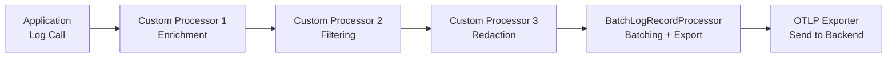

# How to Implement Custom Log Processors in OpenTelemetry

Author: [nawazdhandala](https://www.github.com/nawazdhandala)

Tags: OpenTelemetry, Logging, Log Processors, Observability, Python, SDK, Custom Instrumentation

Description: Learn how to build custom log processors in OpenTelemetry to enrich, filter, redact, and route log records before they reach your observability backend.

---

OpenTelemetry's logging SDK processes log records through a pipeline before exporting them. The default pipeline handles batching and export, but the real power comes from inserting your own processors into this pipeline. Custom log processors let you enrich logs with contextual data, filter out noise, redact sensitive information, and route logs to different destinations based on their content.

If you have worked with OpenTelemetry span processors, the log processor model will feel familiar. The concepts are similar, but log processors have their own interface and lifecycle.

## The Log Processor Interface

A log processor in OpenTelemetry implements a simple interface with four methods:

```python
from opentelemetry.sdk._logs import LogRecordProcessor, LogData

class MyLogProcessor(LogRecordProcessor):

    def emit(self, log_data: LogData) -> None:
        """Called when a log record is emitted.

        This is where you inspect, modify, or filter the log record.
        The log_data parameter contains the log record and its
        associated instrumentation scope.
        """
        pass

    def shutdown(self) -> None:
        """Called when the logger provider is shut down.

        Clean up any resources allocated by the processor.
        """
        pass

    def force_flush(self, timeout_millis: int = 30000) -> bool:
        """Force any buffered log records to be exported.

        Returns True if the flush completed successfully within
        the timeout period.
        """
        return True
```

The `emit` method is the core of the processor. It receives every log record before it reaches the exporter. What you do in this method determines the behavior of your processor.

## Setting Up the Logging Pipeline

Before building custom processors, let's set up a basic logging pipeline:

```python
from opentelemetry.sdk._logs import LoggerProvider
from opentelemetry.sdk._logs.export import BatchLogRecordProcessor
from opentelemetry.exporter.otlp.proto.grpc._log_exporter import OTLPLogExporter
from opentelemetry._logs import set_logger_provider
import logging

# Create the OTLP log exporter
exporter = OTLPLogExporter(endpoint="http://localhost:4317")

# Create the logger provider with a batch processor
provider = LoggerProvider()

# Add the batch export processor
provider.add_log_record_processor(
    BatchLogRecordProcessor(exporter)
)

# Set as the global logger provider
set_logger_provider(provider)
```

Custom processors get inserted before the batch export processor. The log record flows through each processor in the order they were added.



## Building an Enrichment Processor

The most common custom processor adds contextual information to log records. For example, you might want every log to include the deployment environment, service version, or the current user's tenant ID.

```python
import os
from opentelemetry.sdk._logs import LogRecordProcessor, LogData

class EnvironmentEnrichmentProcessor(LogRecordProcessor):
    """Adds deployment environment metadata to every log record.

    This processor reads environment variables at startup and
    attaches them as attributes to each log record. This is
    useful when your deployment pipeline sets environment variables
    that should appear in every log.
    """

    def __init__(self):
        # Read environment context once at initialization
        self.environment = os.getenv("DEPLOYMENT_ENV", "unknown")
        self.service_version = os.getenv("SERVICE_VERSION", "unknown")
        self.region = os.getenv("AWS_REGION", os.getenv("CLOUD_REGION", "unknown"))
        self.commit_sha = os.getenv("GIT_COMMIT_SHA", "unknown")

    def emit(self, log_data: LogData) -> None:
        # Access the log record from log_data
        record = log_data.log_record

        # Add environment attributes to the log record
        if record.attributes is None:
            record.attributes = {}

        record.attributes["deployment.environment"] = self.environment
        record.attributes["service.version"] = self.service_version
        record.attributes["cloud.region"] = self.region
        record.attributes["vcs.commit.sha"] = self.commit_sha

    def shutdown(self) -> None:
        pass

    def force_flush(self, timeout_millis: int = 30000) -> bool:
        return True
```

Register it in the pipeline before the batch processor:

```python
provider = LoggerProvider()

# Add enrichment processor first
provider.add_log_record_processor(
    EnvironmentEnrichmentProcessor()
)

# Then add the batch export processor
provider.add_log_record_processor(
    BatchLogRecordProcessor(OTLPLogExporter(endpoint="http://localhost:4317"))
)
```

Now every log record automatically carries deployment metadata without any changes to your application logging code.

## Building a Filtering Processor

Not every log record needs to be exported. Debug logs in production, health check noise, and repetitive status messages can overwhelm your backend and drive up costs. A filtering processor drops unwanted records before they reach the exporter.

```python
from opentelemetry.sdk._logs import LogRecordProcessor, LogData
from opentelemetry.semconv.trace import SpanAttributes
import re

class FilteringLogProcessor(LogRecordProcessor):
    """Filters out log records based on configurable rules.

    Supports filtering by severity level, body pattern matching,
    and attribute values. Records that match any drop rule are
    silently discarded.
    """

    def __init__(self, min_severity=None, drop_patterns=None,
                 drop_attributes=None):
        # Minimum severity number (logs below this are dropped)
        # Severity numbers: TRACE=1, DEBUG=5, INFO=9, WARN=13, ERROR=17
        self.min_severity = min_severity

        # Regex patterns; if the log body matches, drop it
        self.drop_patterns = [
            re.compile(p) for p in (drop_patterns or [])
        ]

        # Attribute key-value pairs that trigger dropping
        self.drop_attributes = drop_attributes or {}

        self._dropped_count = 0

    def emit(self, log_data: LogData) -> None:
        record = log_data.log_record

        # Check severity level
        if self.min_severity and record.severity_number:
            if record.severity_number.value < self.min_severity:
                self._dropped_count += 1
                return  # Drop the record by not forwarding it

        # Check body patterns
        body_str = str(record.body) if record.body else ""
        for pattern in self.drop_patterns:
            if pattern.search(body_str):
                self._dropped_count += 1
                return  # Drop matching records

        # Check attribute values
        if record.attributes:
            for key, value in self.drop_attributes.items():
                if record.attributes.get(key) == value:
                    self._dropped_count += 1
                    return  # Drop records with matching attributes

    def shutdown(self) -> None:
        if self._dropped_count > 0:
            print(f"FilteringLogProcessor dropped {self._dropped_count} records")

    def force_flush(self, timeout_millis: int = 30000) -> bool:
        return True
```

The key insight here is that the filtering processor does not forward the log record to the next processor. When a record matches a drop rule, the `emit` method simply returns without doing anything. The record never reaches the batch processor or exporter.

Configure the filter for your environment:

```python
provider = LoggerProvider()

# Add filtering processor
provider.add_log_record_processor(
    FilteringLogProcessor(
        # Drop DEBUG and TRACE level logs
        min_severity=9,  # INFO level
        # Drop health check logs
        drop_patterns=[
            r"GET /health",
            r"GET /ready",
            r"GET /metrics",
        ],
        # Drop logs from internal monitoring
        drop_attributes={
            "source": "health_checker",
        },
    )
)

# Then export the remaining logs
provider.add_log_record_processor(
    BatchLogRecordProcessor(OTLPLogExporter(endpoint="http://localhost:4317"))
)
```

## Building a Redaction Processor

Logs often accidentally contain sensitive information like email addresses, credit card numbers, API keys, or social security numbers. A redaction processor scrubs this data before it leaves your infrastructure.

```python
import re
from opentelemetry.sdk._logs import LogRecordProcessor, LogData

class RedactionLogProcessor(LogRecordProcessor):
    """Redacts sensitive data from log record bodies and attributes.

    Uses regex patterns to identify and replace sensitive values
    with redacted placeholders. Runs before the export processor
    to ensure sensitive data never leaves the application.
    """

    # Patterns for common sensitive data types
    DEFAULT_PATTERNS = {
        "email": (
            re.compile(r'[a-zA-Z0-9._%+-]+@[a-zA-Z0-9.-]+\.[a-zA-Z]{2,}'),
            "[REDACTED_EMAIL]"
        ),
        "credit_card": (
            re.compile(r'\b\d{4}[\s-]?\d{4}[\s-]?\d{4}[\s-]?\d{4}\b'),
            "[REDACTED_CC]"
        ),
        "ssn": (
            re.compile(r'\b\d{3}-\d{2}-\d{4}\b'),
            "[REDACTED_SSN]"
        ),
        "api_key": (
            re.compile(r'(?:api[_-]?key|apikey|token)["\s:=]+["\']?([a-zA-Z0-9_\-]{20,})', re.IGNORECASE),
            "[REDACTED_API_KEY]"
        ),
        "bearer_token": (
            re.compile(r'Bearer\s+[a-zA-Z0-9_\-\.]+', re.IGNORECASE),
            "[REDACTED_BEARER]"
        ),
    }

    def __init__(self, additional_patterns=None, redact_attribute_keys=None):
        self.patterns = dict(self.DEFAULT_PATTERNS)

        # Add any custom patterns
        if additional_patterns:
            self.patterns.update(additional_patterns)

        # Attribute keys whose values should be fully redacted
        self.redact_attribute_keys = set(redact_attribute_keys or [])

    def _redact_string(self, text):
        """Apply all redaction patterns to a string."""
        if not isinstance(text, str):
            return text

        for name, (pattern, replacement) in self.patterns.items():
            text = pattern.sub(replacement, text)

        return text

    def emit(self, log_data: LogData) -> None:
        record = log_data.log_record

        # Redact the log body
        if record.body:
            record.body = self._redact_string(str(record.body))

        # Redact attribute values
        if record.attributes:
            redacted_attrs = {}
            for key, value in record.attributes.items():
                if key in self.redact_attribute_keys:
                    # Fully redact specified attribute keys
                    redacted_attrs[key] = "[REDACTED]"
                elif isinstance(value, str):
                    # Apply pattern matching to string values
                    redacted_attrs[key] = self._redact_string(value)
                else:
                    redacted_attrs[key] = value

            record.attributes = redacted_attrs

    def shutdown(self) -> None:
        pass

    def force_flush(self, timeout_millis: int = 30000) -> bool:
        return True
```

Use it in your pipeline:

```python
provider = LoggerProvider()

# Redaction processor should run before export
provider.add_log_record_processor(
    RedactionLogProcessor(
        # Redact these attribute keys entirely
        redact_attribute_keys=["user.email", "user.phone", "auth.token"],
    )
)

provider.add_log_record_processor(
    BatchLogRecordProcessor(OTLPLogExporter(endpoint="http://localhost:4317"))
)
```

Now a log like `"User john@example.com failed login with token Bearer eyJhbG..."` becomes `"User [REDACTED_EMAIL] failed login with token [REDACTED_BEARER]"` before it reaches your backend.

## Building a Routing Processor

Sometimes you need to send different logs to different destinations. Error logs might go to a high-priority pipeline while debug logs go to cold storage. A routing processor directs log records to different exporters based on rules.

```python
from opentelemetry.sdk._logs import LogRecordProcessor, LogData
from opentelemetry.sdk._logs.export import BatchLogRecordProcessor

class RoutingLogProcessor(LogRecordProcessor):
    """Routes log records to different exporters based on severity and attributes.

    Each route consists of a condition function and a target processor.
    Log records are sent to the first matching route. If no route matches,
    the record goes to the default processor.
    """

    def __init__(self, routes, default_processor):
        # Routes: list of (condition_fn, processor) tuples
        self.routes = routes
        self.default_processor = default_processor

    def emit(self, log_data: LogData) -> None:
        record = log_data.log_record

        # Check each route's condition
        for condition_fn, processor in self.routes:
            if condition_fn(record):
                processor.emit(log_data)
                return

        # No route matched; use the default
        self.default_processor.emit(log_data)

    def shutdown(self) -> None:
        for _, processor in self.routes:
            processor.shutdown()
        self.default_processor.shutdown()

    def force_flush(self, timeout_millis: int = 30000) -> bool:
        success = True
        for _, processor in self.routes:
            if not processor.force_flush(timeout_millis):
                success = False
        if not self.default_processor.force_flush(timeout_millis):
            success = False
        return success
```

Configure routing based on severity:

```python
from opentelemetry.exporter.otlp.proto.grpc._log_exporter import OTLPLogExporter

# Create exporters for different destinations
error_exporter = OTLPLogExporter(endpoint="http://error-backend:4317")
standard_exporter = OTLPLogExporter(endpoint="http://standard-backend:4317")

# Define routing conditions
def is_error_log(record):
    """Route ERROR and FATAL logs to the error backend."""
    if record.severity_number:
        return record.severity_number.value >= 17  # ERROR level
    return False

def is_security_log(record):
    """Route security-related logs to the error backend too."""
    if record.attributes:
        return record.attributes.get("log.category") == "security"
    return False

# Build the routing processor
router = RoutingLogProcessor(
    routes=[
        (is_error_log, BatchLogRecordProcessor(error_exporter)),
        (is_security_log, BatchLogRecordProcessor(error_exporter)),
    ],
    default_processor=BatchLogRecordProcessor(standard_exporter),
)

provider = LoggerProvider()
provider.add_log_record_processor(router)
```

## Chaining Multiple Processors

In a real production setup, you typically chain several processors together. The order matters because each processor sees the output of the previous one.

```python
from opentelemetry.sdk._logs import LoggerProvider
from opentelemetry.sdk._logs.export import BatchLogRecordProcessor
from opentelemetry.exporter.otlp.proto.grpc._log_exporter import OTLPLogExporter

provider = LoggerProvider()

# 1. Enrichment: add environment metadata
provider.add_log_record_processor(
    EnvironmentEnrichmentProcessor()
)

# 2. Filtering: drop noise before spending CPU on redaction
provider.add_log_record_processor(
    FilteringLogProcessor(
        min_severity=9,
        drop_patterns=[r"GET /health", r"GET /ready"],
    )
)

# 3. Redaction: scrub sensitive data from remaining logs
provider.add_log_record_processor(
    RedactionLogProcessor(
        redact_attribute_keys=["user.email", "auth.token"],
    )
)

# 4. Export: batch and send to backend
provider.add_log_record_processor(
    BatchLogRecordProcessor(
        OTLPLogExporter(endpoint="http://localhost:4317"),
        max_queue_size=2048,
        max_export_batch_size=512,
        schedule_delay_millis=5000,
    )
)
```

The pipeline flows like this: enrichment adds metadata, filtering drops noise (which also reduces load on downstream processors), redaction scrubs the remaining records, and finally the batch processor buffers and exports.

## Performance Considerations

Custom log processors run in the hot path of your application. Every log statement passes through every processor synchronously (in the default simple configuration). Keep these guidelines in mind:

Avoid blocking operations in `emit`. Do not make network calls, read files, or acquire locks that might be contended. If you need to look up enrichment data, load it at initialization time and refresh it periodically in a background thread.

```python
import threading
import time

class CachedEnrichmentProcessor(LogRecordProcessor):
    """Enrichment processor that refreshes context from a config service.

    The enrichment data is loaded at startup and refreshed every 5 minutes
    in a background thread, avoiding any blocking in the emit path.
    """

    def __init__(self, config_url):
        self.config_url = config_url
        self.enrichment_data = self._load_config()
        self._running = True

        # Refresh config periodically without blocking emit
        self._refresh_thread = threading.Thread(
            target=self._refresh_loop, daemon=True
        )
        self._refresh_thread.start()

    def _load_config(self):
        # Load enrichment data from config service
        # This runs in the background thread, not in emit
        try:
            import requests
            response = requests.get(self.config_url, timeout=5)
            return response.json()
        except Exception:
            return {}

    def _refresh_loop(self):
        while self._running:
            time.sleep(300)  # Refresh every 5 minutes
            self.enrichment_data = self._load_config()

    def emit(self, log_data: LogData) -> None:
        record = log_data.log_record
        if record.attributes is None:
            record.attributes = {}

        # Fast dictionary lookup, no blocking
        for key, value in self.enrichment_data.items():
            record.attributes[key] = value

    def shutdown(self) -> None:
        self._running = False
```

Keep filtering processors early in the chain. If 80% of your logs are debug level and you filter them out, the redaction and enrichment processors only need to process 20% of the volume.

## Testing Custom Processors

Test your processors with the `SimpleLogRecordProcessor` and an in-memory exporter:

```python
from opentelemetry.sdk._logs import LoggerProvider
from opentelemetry.sdk._logs.export import (
    SimpleLogRecordProcessor,
    InMemoryLogExporter,
)

def test_redaction_processor():
    # Set up in-memory export for testing
    memory_exporter = InMemoryLogExporter()

    provider = LoggerProvider()

    # Add the processor under test
    provider.add_log_record_processor(RedactionLogProcessor())

    # Add in-memory exporter to capture results
    provider.add_log_record_processor(
        SimpleLogRecordProcessor(memory_exporter)
    )

    # Emit a log record with sensitive data
    logger = provider.get_logger("test")
    logger.emit(
        LogRecord(
            body="User john@example.com logged in",
            severity_number=SeverityNumber.INFO,
        )
    )

    # Verify redaction worked
    exported = memory_exporter.get_finished_logs()
    assert len(exported) == 1
    assert "[REDACTED_EMAIL]" in exported[0].log_record.body
    assert "john@example.com" not in exported[0].log_record.body
```

Testing with in-memory exporters gives you fast, deterministic tests without requiring a running backend.

## Conclusion

Custom log processors give you fine-grained control over your OpenTelemetry logging pipeline. Enrichment processors add valuable context automatically, filtering processors reduce noise and cost, redaction processors protect sensitive data, and routing processors direct logs to appropriate backends. By chaining these processors in the right order and keeping the emit path fast, you build a logging pipeline that delivers clean, enriched, and safe log data to your observability backend. Start with the specific problem you need to solve, whether that is missing context, too much noise, or data privacy requirements, and build a targeted processor for it.
