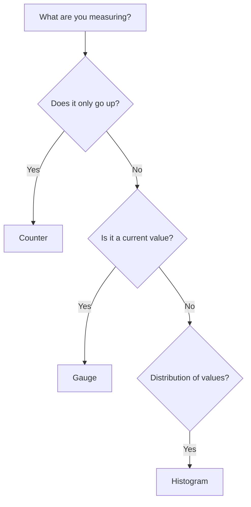

# How to Build Custom Metrics with Histograms, Counters, and Gauges

Author: [nawazdhandala](https://www.github.com/nawazdhandala)

Tags: OpenTelemetry, Metrics, Histograms, Counters, Gauges, Observability, Python, Monitoring

Description: A practical guide to building custom application metrics using OpenTelemetry histograms, counters, and gauges with real-world examples in Python.

---

Runtime metrics like CPU and memory usage only tell you part of the story. They can tell you that a server is under load, but they cannot tell you why. Custom application metrics fill this gap. They let you measure what matters to your business and your application logic, not just the infrastructure underneath.

OpenTelemetry provides three core metric instruments for this: counters, gauges, and histograms. Each one is designed for a different kind of measurement. This guide explains when to use each one and walks through practical examples in Python.

---

## The Three Instrument Types

Before writing any code, it helps to understand what each instrument type is meant for and how it behaves.



**Counters** are for values that only increase. Think of total requests served, bytes sent, or errors encountered. You never subtract from a counter. It goes up monotonically, and your monitoring backend calculates rates from the difference between consecutive readings.

**Gauges** represent a current value at a point in time. The value can go up or down. Examples include current queue depth, active connections, temperature, or available disk space.

**Histograms** record the distribution of values. Rather than just tracking an average or a sum, a histogram captures how values are spread across predefined buckets. This is ideal for latencies, request sizes, or any measurement where you care about percentiles.

---

## Setting Up the Metrics SDK

Start by installing the required packages and configuring the metrics pipeline:

```bash
# Install the OpenTelemetry metrics SDK and OTLP exporter
pip install opentelemetry-api \
            opentelemetry-sdk \
            opentelemetry-exporter-otlp-proto-grpc
```

```python
from opentelemetry import metrics
from opentelemetry.sdk.metrics import MeterProvider
from opentelemetry.sdk.metrics.export import PeriodicExportingMetricReader
from opentelemetry.exporter.otlp.proto.grpc.metric_exporter import (
    OTLPMetricExporter,
)
from opentelemetry.sdk.resources import Resource

# Create a resource that identifies this service
resource = Resource.create({
    "service.name": "order-service",
    "service.version": "1.4.2",
    "deployment.environment": "production",
})

# Configure the OTLP exporter to send metrics to your backend
exporter = OTLPMetricExporter(endpoint="https://oneuptime.com/otlp")

# The PeriodicExportingMetricReader collects and exports metrics
# at a regular interval (default is 60 seconds)
reader = PeriodicExportingMetricReader(
    exporter,
    export_interval_millis=30000,  # Export every 30 seconds
)

provider = MeterProvider(resource=resource, metric_readers=[reader])
metrics.set_meter_provider(provider)

# A meter is the entry point for creating instruments
meter = metrics.get_meter("order-service", "1.4.2")
```

The `MeterProvider` is analogous to the `TracerProvider` in the tracing API. It holds the configuration for how metrics are collected and exported. The `PeriodicExportingMetricReader` handles the collection cycle, calling your exporter at the configured interval.

---

## Working with Counters

Counters are the simplest instrument type. Use them to count things that happen.

```python
# Create a counter for tracking total orders processed
# The unit parameter helps backends display the right label
orders_counter = meter.create_counter(
    name="orders.processed.total",
    description="Total number of orders processed",
    unit="orders",
)

# Create a counter for tracking revenue
revenue_counter = meter.create_counter(
    name="orders.revenue.total",
    description="Total revenue from processed orders",
    unit="USD",
)

def process_order(order):
    """Process an order and record metrics."""
    # Business logic here...
    validate_order(order)
    charge_payment(order)
    fulfill_order(order)

    # Record the order count with attributes for segmentation
    # Attributes let you break down the metric by dimensions
    orders_counter.add(1, {
        "order.type": order.type,        # "standard", "express"
        "payment.method": order.payment,  # "credit_card", "paypal"
        "region": order.region,           # "us-east", "eu-west"
    })

    # Record the revenue amount
    revenue_counter.add(order.total_amount, {
        "currency": "USD",
        "order.type": order.type,
    })
```

The `add` method always takes a non-negative value. Calling `add(1)` is the most common pattern for counting events, but you can add any positive number. For revenue tracking, you add the dollar amount directly.

Attributes are key for making counters useful. Without attributes, `orders.processed.total` is just a single number. With attributes, you can break it down by region, payment method, order type, or any other dimension. Your backend will let you filter and group by these attributes when building dashboards.

---

## Working with Gauges

Gauges capture a snapshot value that can increase or decrease. Use the `create_observable_gauge` when the value is read from an external source, or `create_gauge` for direct setting.

```python
import psutil

# Observable gauge: the callback function is called at each collection cycle
# This is ideal for values you read from the system rather than record inline
def get_queue_depth(options):
    """Callback that returns the current queue depth.
    Called by the SDK at each metric collection interval."""
    # In a real app, this would query your message broker
    depth = get_pending_messages_count()
    yield metrics.Observation(
        value=depth,
        attributes={"queue.name": "order-processing"},
    )

queue_gauge = meter.create_observable_gauge(
    name="queue.depth",
    description="Current number of messages in the processing queue",
    unit="messages",
    callbacks=[get_queue_depth],
)


# System metrics using observable gauges
def get_memory_usage(options):
    """Reports current memory usage as a percentage."""
    memory = psutil.virtual_memory()
    yield metrics.Observation(
        value=memory.percent,
        attributes={"host.name": "worker-01"},
    )

memory_gauge = meter.create_observable_gauge(
    name="system.memory.usage",
    description="Current memory usage percentage",
    unit="%",
    callbacks=[get_memory_usage],
)
```

The callback-based approach is natural for gauges because the SDK only needs the value at collection time. What matters is the value when the metric reader collects.

For values that you set directly in application code, use the synchronous gauge:

```python
# Synchronous gauge: set explicitly in your code
active_connections = meter.create_gauge(
    name="connections.active",
    description="Number of currently active connections",
    unit="connections",
)

def on_connection_open(connection):
    """Called when a new connection is established."""
    current = get_active_connection_count()
    active_connections.set(current, {
        "protocol": connection.protocol,
    })
```

---

## Working with Histograms

Histograms are the most powerful instrument type. They record the distribution of values, letting you compute percentiles like p50, p95, and p99. This is essential for latency measurements where averages hide the worst-case experience.

```python
import time

# Create a histogram for tracking request latency
request_latency = meter.create_histogram(
    name="http.request.duration",
    description="Duration of HTTP request processing",
    unit="ms",
)

# Create a histogram for tracking response payload sizes
response_size = meter.create_histogram(
    name="http.response.size",
    description="Size of HTTP response payloads",
    unit="bytes",
)

def handle_request(request):
    """Handle an HTTP request and record latency and size metrics."""
    start_time = time.monotonic()

    # Process the request
    response = generate_response(request)

    # Calculate duration in milliseconds
    duration_ms = (time.monotonic() - start_time) * 1000

    # Record the latency with route and method attributes
    request_latency.record(duration_ms, {
        "http.method": request.method,
        "http.route": request.route,
        "http.status_code": response.status_code,
    })

    # Record the response size
    response_size.record(len(response.body), {
        "http.route": request.route,
        "content.type": response.content_type,
    })

    return response
```

Under the hood, the histogram sorts each recorded value into buckets. The default bucket boundaries in OpenTelemetry are: 0, 5, 10, 25, 50, 75, 100, 250, 500, 750, 1000, 2500, 5000, 7500, 10000. You can customize these for your use case.

### Custom Bucket Boundaries

The default boundaries work well for general-purpose latency, but if your requests consistently finish in 1 to 20 milliseconds, most values will fall into the first few buckets and you will lose resolution. Customize the boundaries to match your actual distribution:

```python
from opentelemetry.sdk.metrics import MeterProvider
from opentelemetry.sdk.metrics.view import View

# Define a view with custom histogram bucket boundaries
# These are tuned for a fast API where most responses are under 50ms
fast_api_view = View(
    instrument_name="http.request.duration",
    aggregation=metrics.ExplicitBucketHistogramAggregation(
        boundaries=[1, 2, 5, 10, 20, 50, 100, 200, 500, 1000]
    ),
)

# Pass the view when creating the MeterProvider
provider = MeterProvider(
    resource=resource,
    metric_readers=[reader],
    views=[fast_api_view],
)
```

Views let you customize how metrics are aggregated without changing instrumentation code. You can adjust bucket boundaries, rename metrics, or drop attributes.

---

## Real-World Example: E-Commerce Metrics

Here is a more complete example that combines all three instrument types for an e-commerce order service:

```python
# Create all the instruments for the order service
order_counter = meter.create_counter(
    "orders.created", unit="orders",
    description="Total orders created",
)

order_errors = meter.create_counter(
    "orders.errors", unit="errors",
    description="Total order processing errors",
)

order_latency = meter.create_histogram(
    "orders.processing.duration", unit="ms",
    description="Time to process an order end to end",
)

cart_size = meter.create_histogram(
    "orders.cart.size", unit="items",
    description="Number of items in each order",
)

def create_order(cart, user):
    """Create an order and record business metrics."""
    start = time.monotonic()
    try:
        order = build_order(cart, user)
        charge_result = process_payment(order)
        save_order(order)

        # Record success metrics
        order_counter.add(1, {
            "status": "success",
            "payment.method": order.payment_method,
        })
        cart_size.record(len(cart.items), {
            "user.tier": user.tier,
        })

    except PaymentError as e:
        order_errors.add(1, {"error.type": "payment_failed"})
        raise
    except InventoryError as e:
        order_errors.add(1, {"error.type": "out_of_stock"})
        raise
    finally:
        # Always record latency, even for failures
        duration = (time.monotonic() - start) * 1000
        order_latency.record(duration, {
            "status": "success" if "order" in dir() else "error",
        })
```

This gives you dashboards that answer real business questions: How many orders are we processing per minute? What is the p99 processing time? Which payment method has the highest error rate?

---

## Conclusion

Counters, gauges, and histograms cover the vast majority of metric use cases. Counters track cumulative totals, gauges capture point-in-time snapshots, and histograms record distributions for percentile analysis. When combined with meaningful attributes, these instruments turn raw numbers into actionable insights. Send them to a backend like [OneUptime](https://oneuptime.com) and you get dashboards that connect application behavior to business outcomes.
