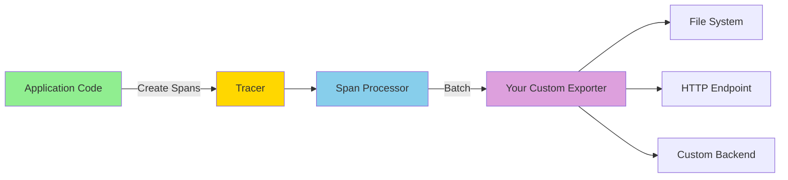

# How to Build a Custom OpenTelemetry Span Exporter in Rust

Author: [nawazdhandala](https://www.github.com/nawazdhandala)

Tags: OpenTelemetry, Rust, Custom Exporter, Spans, SDK

Description: Learn how to build custom OpenTelemetry span exporters in Rust for specialized backends, custom formats, or local development workflows.

While OpenTelemetry provides standard exporters for popular backends like Jaeger, Zipkin, and OTLP collectors, sometimes you need something custom. Maybe you're writing to a proprietary system, debugging locally, or need a specialized format. Building a custom span exporter gives you complete control over where and how your telemetry data flows.

## Understanding the Exporter Interface

An OpenTelemetry span exporter implements the `SpanExporter` trait, which defines two key methods: `export` for sending batches of spans, and `shutdown` for cleanup. The SDK calls `export` periodically with batches of completed spans.

The trait is async-aware, returning futures that complete when export finishes. This design lets you write non-blocking exporters that work well with Tokio or other async runtimes.

## Core Dependencies

Your `Cargo.toml` needs these dependencies:

```toml
[dependencies]
opentelemetry = { version = "0.22", features = ["trace"] }
opentelemetry_sdk = { version = "0.22", features = ["rt-tokio", "trace"] }
async-trait = "0.1"
tokio = { version = "1.35", features = ["full"] }
serde = { version = "1.0", features = ["derive"] }
serde_json = "1.0"
```

The `async-trait` macro simplifies implementing async trait methods.

## Building a Simple File Exporter

Start with a basic exporter that writes spans to a JSON file:

```rust
use async_trait::async_trait;
use opentelemetry::trace::SpanContext;
use opentelemetry_sdk::export::trace::{ExportResult, SpanData, SpanExporter};
use serde::Serialize;
use std::fs::OpenOptions;
use std::io::Write;
use std::sync::Mutex;

pub struct FileExporter {
    file: Mutex<std::fs::File>,
}

impl FileExporter {
    pub fn new(path: &str) -> Result<Self, std::io::Error> {
        let file = OpenOptions::new()
            .create(true)
            .append(true)
            .open(path)?;

        Ok(Self {
            file: Mutex::new(file),
        })
    }
}

#[derive(Serialize)]
struct ExportedSpan {
    trace_id: String,
    span_id: String,
    parent_span_id: Option<String>,
    name: String,
    start_time: u64,
    end_time: u64,
    duration_ns: u64,
    attributes: Vec<(String, String)>,
    events: Vec<ExportedEvent>,
    status: String,
}

#[derive(Serialize)]
struct ExportedEvent {
    name: String,
    timestamp: u64,
    attributes: Vec<(String, String)>,
}

#[async_trait]
impl SpanExporter for FileExporter {
    async fn export(&mut self, batch: Vec<SpanData>) -> ExportResult {
        let mut file = self.file.lock().unwrap();

        for span in batch {
            let exported = convert_span_to_export_format(&span);

            match serde_json::to_string(&exported) {
                Ok(json) => {
                    if let Err(e) = writeln!(file, "{}", json) {
                        eprintln!("Failed to write span: {}", e);
                        return Err(opentelemetry::trace::TraceError::Other(Box::new(e)));
                    }
                }
                Err(e) => {
                    eprintln!("Failed to serialize span: {}", e);
                    return Err(opentelemetry::trace::TraceError::Other(Box::new(e)));
                }
            }
        }

        // Flush to ensure data is written
        if let Err(e) = file.flush() {
            eprintln!("Failed to flush file: {}", e);
            return Err(opentelemetry::trace::TraceError::Other(Box::new(e)));
        }

        Ok(())
    }

    fn shutdown(&mut self) {
        let mut file = self.file.lock().unwrap();
        let _ = file.flush();
    }
}

fn convert_span_to_export_format(span: &SpanData) -> ExportedSpan {
    let start_time = span.start_time.duration_since(std::time::SystemTime::UNIX_EPOCH)
        .unwrap()
        .as_nanos() as u64;

    let end_time = span.end_time.duration_since(std::time::SystemTime::UNIX_EPOCH)
        .unwrap()
        .as_nanos() as u64;

    ExportedSpan {
        trace_id: format!("{:x}", span.span_context.trace_id()),
        span_id: format!("{:x}", span.span_context.span_id()),
        parent_span_id: if span.parent_span_id.is_valid() {
            Some(format!("{:x}", span.parent_span_id))
        } else {
            None
        },
        name: span.name.to_string(),
        start_time,
        end_time,
        duration_ns: end_time - start_time,
        attributes: span.attributes.iter()
            .map(|kv| (kv.key.to_string(), kv.value.to_string()))
            .collect(),
        events: span.events.iter()
            .map(|event| ExportedEvent {
                name: event.name.to_string(),
                timestamp: event.timestamp.duration_since(std::time::SystemTime::UNIX_EPOCH)
                    .unwrap()
                    .as_nanos() as u64,
                attributes: event.attributes.iter()
                    .map(|kv| (kv.key.to_string(), kv.value.to_string()))
                    .collect(),
            })
            .collect(),
        status: format!("{:?}", span.status),
    }
}
```

This exporter writes each span as a JSON line, making it easy to parse with standard tools.

## Using Your Custom Exporter

Wire up the custom exporter with the OpenTelemetry SDK:

```rust
use opentelemetry::global;
use opentelemetry_sdk::trace::{self, RandomIdGenerator, Sampler, TracerProvider};
use opentelemetry_sdk::{runtime, Resource};
use opentelemetry::KeyValue;

fn init_with_custom_exporter() -> Result<(), Box<dyn std::error::Error>> {
    // Create your custom exporter
    let exporter = FileExporter::new("traces.jsonl")?;

    // Build a batch span processor with your exporter
    let batch_processor = opentelemetry_sdk::trace::BatchSpanProcessor::builder(
        exporter,
        runtime::Tokio
    )
    .with_batch_config(
        opentelemetry_sdk::trace::BatchConfig::default()
            .with_max_queue_size(2048)
            .with_scheduled_delay(std::time::Duration::from_secs(5))
    )
    .build();

    // Create a tracer provider with your processor
    let provider = TracerProvider::builder()
        .with_span_processor(batch_processor)
        .with_config(
            trace::config()
                .with_sampler(Sampler::AlwaysOn)
                .with_id_generator(RandomIdGenerator::default())
                .with_resource(Resource::new(vec![
                    KeyValue::new("service.name", "my-service"),
                ]))
        )
        .build();

    global::set_tracer_provider(provider);

    Ok(())
}

#[tokio::main]
async fn main() -> Result<(), Box<dyn std::error::Error>> {
    init_with_custom_exporter()?;

    let tracer = global::tracer("example");

    // Create some spans
    let span = tracer
        .span_builder("example_operation")
        .start(&tracer);

    let cx = opentelemetry::Context::current().with_span(span);
    let _guard = cx.attach();

    // Do work
    tokio::time::sleep(std::time::Duration::from_millis(100)).await;

    cx.span().end();

    // Shutdown to flush spans
    global::shutdown_tracer_provider();

    Ok(())
}
```

Your spans now flow to your custom file-based exporter instead of a standard backend.

## Building an HTTP Exporter

Create an exporter that sends spans to a custom HTTP endpoint:

```rust
use reqwest::Client;
use serde::Serialize;

pub struct HttpExporter {
    client: Client,
    endpoint: String,
}

impl HttpExporter {
    pub fn new(endpoint: String) -> Self {
        Self {
            client: Client::new(),
            endpoint,
        }
    }
}

#[derive(Serialize)]
struct SpanBatch {
    spans: Vec<ExportedSpan>,
    resource: ResourceInfo,
}

#[derive(Serialize)]
struct ResourceInfo {
    service_name: String,
    attributes: std::collections::HashMap<String, String>,
}

#[async_trait]
impl SpanExporter for HttpExporter {
    async fn export(&mut self, batch: Vec<SpanData>) -> ExportResult {
        let spans: Vec<ExportedSpan> = batch.iter()
            .map(convert_span_to_export_format)
            .collect();

        let payload = SpanBatch {
            spans,
            resource: ResourceInfo {
                service_name: "my-service".to_string(),
                attributes: std::collections::HashMap::new(),
            },
        };

        match self.client
            .post(&self.endpoint)
            .json(&payload)
            .timeout(std::time::Duration::from_secs(10))
            .send()
            .await
        {
            Ok(response) => {
                if response.status().is_success() {
                    Ok(())
                } else {
                    eprintln!("Export failed with status: {}", response.status());
                    Err(opentelemetry::trace::TraceError::Other(
                        format!("HTTP {}", response.status()).into()
                    ))
                }
            }
            Err(e) => {
                eprintln!("Export request failed: {}", e);
                Err(opentelemetry::trace::TraceError::Other(Box::new(e)))
            }
        }
    }

    fn shutdown(&mut self) {
        // No cleanup needed for HTTP client
    }
}
```

This exporter batches spans and sends them via HTTP POST, useful for custom backends that don't support OTLP.

## Adding Retry Logic

Make your exporter resilient to transient failures:

```rust
use std::time::Duration;
use tokio::time::sleep;

pub struct RetryingExporter<E> {
    inner: E,
    max_retries: usize,
    retry_delay: Duration,
}

impl<E> RetryingExporter<E> {
    pub fn new(inner: E, max_retries: usize, retry_delay: Duration) -> Self {
        Self {
            inner,
            max_retries,
            retry_delay,
        }
    }
}

#[async_trait]
impl<E: SpanExporter + Send> SpanExporter for RetryingExporter<E> {
    async fn export(&mut self, batch: Vec<SpanData>) -> ExportResult {
        let mut attempt = 0;

        loop {
            match self.inner.export(batch.clone()).await {
                Ok(()) => return Ok(()),
                Err(e) if attempt < self.max_retries => {
                    attempt += 1;
                    eprintln!(
                        "Export failed (attempt {}/{}): {:?}",
                        attempt, self.max_retries, e
                    );
                    sleep(self.retry_delay * attempt as u32).await;
                }
                Err(e) => {
                    eprintln!("Export failed after {} retries", self.max_retries);
                    return Err(e);
                }
            }
        }
    }

    fn shutdown(&mut self) {
        self.inner.shutdown();
    }
}

// Usage
fn init_with_retries() -> Result<(), Box<dyn std::error::Error>> {
    let base_exporter = HttpExporter::new("http://localhost:8080/traces".to_string());
    let retrying_exporter = RetryingExporter::new(
        base_exporter,
        3,  // max retries
        Duration::from_secs(1),  // initial retry delay
    );

    let processor = opentelemetry_sdk::trace::BatchSpanProcessor::builder(
        retrying_exporter,
        runtime::Tokio
    ).build();

    let provider = TracerProvider::builder()
        .with_span_processor(processor)
        .build();

    global::set_tracer_provider(provider);

    Ok(())
}
```

Retry logic ensures temporary network issues don't result in lost spans.

## Building a Multi-Destination Exporter

Send spans to multiple backends simultaneously:

```rust
pub struct MultiExporter {
    exporters: Vec<Box<dyn SpanExporter + Send>>,
}

impl MultiExporter {
    pub fn new() -> Self {
        Self {
            exporters: Vec::new(),
        }
    }

    pub fn add_exporter<E: SpanExporter + Send + 'static>(mut self, exporter: E) -> Self {
        self.exporters.push(Box::new(exporter));
        self
    }
}

#[async_trait]
impl SpanExporter for MultiExporter {
    async fn export(&mut self, batch: Vec<SpanData>) -> ExportResult {
        let mut errors = Vec::new();

        for (idx, exporter) in self.exporters.iter_mut().enumerate() {
            if let Err(e) = exporter.export(batch.clone()).await {
                eprintln!("Exporter {} failed: {:?}", idx, e);
                errors.push(e);
            }
        }

        // Succeed if at least one exporter succeeded
        if errors.len() == self.exporters.len() {
            Err(opentelemetry::trace::TraceError::Other(
                "All exporters failed".into()
            ))
        } else {
            Ok(())
        }
    }

    fn shutdown(&mut self) {
        for exporter in &mut self.exporters {
            exporter.shutdown();
        }
    }
}

// Usage
fn init_multi_exporter() -> Result<(), Box<dyn std::error::Error>> {
    let file_exporter = FileExporter::new("traces.jsonl")?;
    let http_exporter = HttpExporter::new("http://localhost:8080/traces".to_string());

    let multi_exporter = MultiExporter::new()
        .add_exporter(file_exporter)
        .add_exporter(http_exporter);

    let processor = opentelemetry_sdk::trace::BatchSpanProcessor::builder(
        multi_exporter,
        runtime::Tokio
    ).build();

    let provider = TracerProvider::builder()
        .with_span_processor(processor)
        .build();

    global::set_tracer_provider(provider);

    Ok(())
}
```

This pattern is useful for gradually migrating between backends or sending production telemetry to multiple destinations.

## Building a Filtering Exporter

Create an exporter that filters spans based on custom criteria:

```rust
pub struct FilteringExporter<E, F> {
    inner: E,
    filter: F,
}

impl<E, F> FilteringExporter<E, F>
where
    F: Fn(&SpanData) -> bool,
{
    pub fn new(inner: E, filter: F) -> Self {
        Self { inner, filter }
    }
}

#[async_trait]
impl<E, F> SpanExporter for FilteringExporter<E, F>
where
    E: SpanExporter + Send,
    F: Fn(&SpanData) -> bool + Send + Sync,
{
    async fn export(&mut self, batch: Vec<SpanData>) -> ExportResult {
        let filtered: Vec<SpanData> = batch
            .into_iter()
            .filter(|span| (self.filter)(span))
            .collect();

        if filtered.is_empty() {
            return Ok(());
        }

        self.inner.export(filtered).await
    }

    fn shutdown(&mut self) {
        self.inner.shutdown();
    }
}

// Usage examples
fn init_with_filtering() -> Result<(), Box<dyn std::error::Error>> {
    let base_exporter = FileExporter::new("traces.jsonl")?;

    // Only export spans with errors
    let error_only_exporter = FilteringExporter::new(
        base_exporter,
        |span| matches!(span.status, opentelemetry::trace::Status::Error { .. })
    );

    // Or filter by name pattern
    let base_exporter2 = HttpExporter::new("http://localhost:8080/traces".to_string());
    let filtered_exporter = FilteringExporter::new(
        base_exporter2,
        |span| span.name.starts_with("http.")
    );

    let processor = opentelemetry_sdk::trace::BatchSpanProcessor::builder(
        error_only_exporter,
        runtime::Tokio
    ).build();

    let provider = TracerProvider::builder()
        .with_span_processor(processor)
        .build();

    global::set_tracer_provider(provider);

    Ok(())
}
```

Filtering reduces data volume by only exporting relevant spans, which is especially useful for high-volume applications.

## Building a Console Debug Exporter

Create a pretty-printing exporter for local development:

```rust
use colored::*;

pub struct ConsoleExporter {
    verbose: bool,
}

impl ConsoleExporter {
    pub fn new(verbose: bool) -> Self {
        Self { verbose }
    }

    fn print_span(&self, span: &SpanData) {
        let duration_ms = span.end_time
            .duration_since(span.start_time)
            .unwrap()
            .as_millis();

        println!("{}", "=".repeat(80).bright_blue());
        println!(
            "{} {} ({}ms)",
            "Span:".bright_green().bold(),
            span.name.bright_white().bold(),
            duration_ms
        );
        println!(
            "  {} {:x}",
            "Trace ID:".bright_yellow(),
            span.span_context.trace_id()
        );
        println!(
            "  {} {:x}",
            "Span ID:".bright_yellow(),
            span.span_context.span_id()
        );

        if span.parent_span_id.is_valid() {
            println!(
                "  {} {:x}",
                "Parent ID:".bright_yellow(),
                span.parent_span_id
            );
        }

        if self.verbose && !span.attributes.is_empty() {
            println!("{}", "  Attributes:".bright_cyan());
            for attr in &span.attributes {
                println!("    {} = {}", attr.key, attr.value);
            }
        }

        if !span.events.is_empty() {
            println!("{}", "  Events:".bright_magenta());
            for event in &span.events {
                println!("    - {}", event.name);
            }
        }

        match &span.status {
            opentelemetry::trace::Status::Error { description } => {
                println!("  {} {}", "Status:".bright_red().bold(), description);
            }
            _ => {}
        }
    }
}

#[async_trait]
impl SpanExporter for ConsoleExporter {
    async fn export(&mut self, batch: Vec<SpanData>) -> ExportResult {
        for span in batch {
            self.print_span(&span);
        }
        Ok(())
    }

    fn shutdown(&mut self) {
        println!("{}", "Console exporter shutting down".bright_blue());
    }
}
```

This exporter is perfect for debugging during development, showing spans in real-time with color-coded output.

## Adding Metrics to Your Exporter

Track exporter performance with internal metrics:

```rust
use std::sync::atomic::{AtomicU64, Ordering};
use std::sync::Arc;

pub struct MeteredExporter<E> {
    inner: E,
    export_count: Arc<AtomicU64>,
    failure_count: Arc<AtomicU64>,
    span_count: Arc<AtomicU64>,
}

impl<E> MeteredExporter<E> {
    pub fn new(inner: E) -> Self {
        Self {
            inner,
            export_count: Arc::new(AtomicU64::new(0)),
            failure_count: Arc::new(AtomicU64::new(0)),
            span_count: Arc::new(AtomicU64::new(0)),
        }
    }

    pub fn get_stats(&self) -> ExporterStats {
        ExporterStats {
            export_count: self.export_count.load(Ordering::Relaxed),
            failure_count: self.failure_count.load(Ordering::Relaxed),
            span_count: self.span_count.load(Ordering::Relaxed),
        }
    }
}

pub struct ExporterStats {
    pub export_count: u64,
    pub failure_count: u64,
    pub span_count: u64,
}

#[async_trait]
impl<E: SpanExporter + Send> SpanExporter for MeteredExporter<E> {
    async fn export(&mut self, batch: Vec<SpanData>) -> ExportResult {
        self.export_count.fetch_add(1, Ordering::Relaxed);
        self.span_count.fetch_add(batch.len() as u64, Ordering::Relaxed);

        match self.inner.export(batch).await {
            Ok(()) => Ok(()),
            Err(e) => {
                self.failure_count.fetch_add(1, Ordering::Relaxed);
                Err(e)
            }
        }
    }

    fn shutdown(&mut self) {
        let stats = self.get_stats();
        println!(
            "Exporter stats: {} exports, {} spans, {} failures",
            stats.export_count, stats.span_count, stats.failure_count
        );
        self.inner.shutdown();
    }
}
```

These metrics help you understand exporter behavior and diagnose issues in production.

## Testing Your Custom Exporter

Write tests to verify your exporter's behavior:

```rust
#[cfg(test)]
mod tests {
    use super::*;
    use opentelemetry::trace::{TraceId, SpanId, SpanContext, TraceFlags};
    use opentelemetry_sdk::export::trace::SpanData;

    fn create_test_span(name: &str) -> SpanData {
        SpanData {
            span_context: SpanContext::new(
                TraceId::from_u128(1),
                SpanId::from_u64(1),
                TraceFlags::default(),
                false,
                Default::default(),
            ),
            parent_span_id: SpanId::INVALID,
            span_kind: opentelemetry::trace::SpanKind::Internal,
            name: name.into(),
            start_time: std::time::SystemTime::now(),
            end_time: std::time::SystemTime::now(),
            attributes: vec![],
            events: vec![],
            links: vec![],
            status: opentelemetry::trace::Status::Unset,
            instrumentation_lib: Default::default(),
        }
    }

    #[tokio::test]
    async fn test_file_exporter() {
        let temp_file = "/tmp/test_spans.jsonl";
        let mut exporter = FileExporter::new(temp_file).unwrap();

        let span = create_test_span("test_span");
        let result = exporter.export(vec![span]).await;

        assert!(result.is_ok());

        exporter.shutdown();

        // Verify file contents
        let content = std::fs::read_to_string(temp_file).unwrap();
        assert!(content.contains("test_span"));

        std::fs::remove_file(temp_file).ok();
    }

    #[tokio::test]
    async fn test_filtering_exporter() {
        let base = FileExporter::new("/tmp/filtered_spans.jsonl").unwrap();
        let mut exporter = FilteringExporter::new(
            base,
            |span| span.name.starts_with("http.")
        );

        let spans = vec![
            create_test_span("http.request"),
            create_test_span("database.query"),
            create_test_span("http.response"),
        ];

        let result = exporter.export(spans).await;
        assert!(result.is_ok());

        exporter.shutdown();

        std::fs::remove_file("/tmp/filtered_spans.jsonl").ok();
    }
}
```

Comprehensive tests ensure your exporter handles edge cases correctly.

## Architecture Overview

Here's how custom exporters fit into the OpenTelemetry pipeline:



Your exporter sits at the end of the pipeline, receiving completed spans and sending them wherever you need.

Custom exporters unlock powerful use cases: writing spans to local files for debugging, sending to proprietary systems, applying complex filtering logic, or implementing custom retry and buffering strategies. The flexible exporter interface makes all of this straightforward to implement while maintaining compatibility with the rest of the OpenTelemetry ecosystem.
