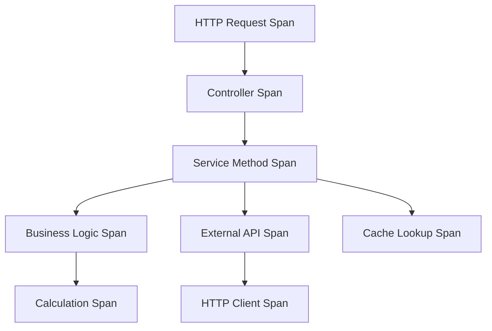

# How to Create Custom OpenTelemetry Spans in NestJS Controllers and Services

Author: [nawazdhandala](https://www.github.com/nawazdhandala)

Tags: OpenTelemetry, NestJS, Custom Spans, Controllers, Services, TypeScript

Description: Master creating custom OpenTelemetry spans in NestJS applications to trace business logic, add context to operations, and build detailed observability for controllers and services.

Auto-instrumentation covers HTTP requests and database queries, but your business logic needs custom tracing. Custom spans let you track specific operations, measure performance of critical code paths, and add context that matters to your application. This guide shows you how to create custom spans in NestJS controllers and services effectively.

## Why Custom Spans Matter

Auto-instrumentation gives you the infrastructure layer, but custom spans provide business context. You want to know how long user authentication takes, track recommendation engine performance, or measure the time spent in complex calculations. Custom spans make these insights possible.

Here's how custom spans fit into your trace hierarchy:



## Setting Up the Tracer

First, install the OpenTelemetry API package:

```bash
npm install @opentelemetry/api
```

Create a tracer provider service that you can inject anywhere:

```typescript
// src/tracing/tracer.service.ts

import { Injectable } from '@nestjs/common';
import { trace, Tracer, Span, SpanStatusCode, Context, context } from '@opentelemetry/api';

@Injectable()
export class TracerService {
  private tracer: Tracer;

  constructor() {
    // Get a tracer instance for your application
    this.tracer = trace.getTracer('nestjs-app', '1.0.0');
  }

  getTracer(): Tracer {
    return this.tracer;
  }

  // Helper method to start a span with common setup
  startSpan(name: string, attributes?: Record<string, any>): Span {
    const span = this.tracer.startSpan(name);

    if (attributes) {
      Object.entries(attributes).forEach(([key, value]) => {
        span.setAttribute(key, value);
      });
    }

    return span;
  }

  // Helper to run code in a span context
  async withSpan<T>(
    spanName: string,
    fn: (span: Span) => Promise<T>,
    attributes?: Record<string, any>,
  ): Promise<T> {
    const span = this.startSpan(spanName, attributes);

    return context.with(trace.setSpan(context.active(), span), async () => {
      try {
        const result = await fn(span);
        span.setStatus({ code: SpanStatusCode.OK });
        return result;
      } catch (error) {
        span.setStatus({
          code: SpanStatusCode.ERROR,
          message: error.message,
        });
        span.recordException(error);
        throw error;
      } finally {
        span.end();
      }
    });
  }
}
```

Register the service globally:

```typescript
// src/tracing/tracing.module.ts

import { Module, Global } from '@nestjs/common';
import { TracerService } from './tracer.service';

@Global()
@Module({
  providers: [TracerService],
  exports: [TracerService],
})
export class TracingModule {}
```

Add it to your app module:

```typescript
// src/app.module.ts

import { Module } from '@nestjs/common';
import { TracingModule } from './tracing/tracing.module';

@Module({
  imports: [TracingModule],
})
export class AppModule {}
```

## Creating Spans in Controllers

Controllers handle HTTP requests and coordinate service calls. Add spans to track controller logic:

```typescript
// src/users/users.controller.ts

import { Controller, Get, Post, Body, Param, UseGuards } from '@nestjs/common';
import { UsersService } from './users.service';
import { TracerService } from '../tracing/tracer.service';
import { CreateUserDto } from './dto/create-user.dto';
import { AuthGuard } from '../auth/auth.guard';

@Controller('users')
export class UsersController {
  constructor(
    private readonly usersService: UsersService,
    private readonly tracerService: TracerService,
  ) {}

  @Get()
  async findAll() {
    // Create a custom span for the controller method
    return this.tracerService.withSpan(
      'UsersController.findAll',
      async (span) => {
        // Add metadata about the operation
        span.setAttribute('controller.method', 'findAll');
        span.setAttribute('controller.name', 'UsersController');

        // Execute the service call (will be a child span if service has spans)
        const users = await this.usersService.findAll();

        // Add result metadata to span
        span.setAttribute('result.count', users.length);
        span.addEvent('Users fetched successfully', {
          count: users.length,
        });

        return users;
      },
    );
  }

  @Get(':id')
  async findOne(@Param('id') id: string) {
    return this.tracerService.withSpan(
      'UsersController.findOne',
      async (span) => {
        // Add input parameters as attributes
        span.setAttribute('user.id', id);
        span.setAttribute('controller.method', 'findOne');

        const user = await this.usersService.findOne(parseInt(id));

        if (!user) {
          span.addEvent('User not found', { userId: id });
          span.setAttribute('result.found', false);
        } else {
          span.setAttribute('result.found', true);
        }

        return user;
      },
    );
  }

  @Post()
  @UseGuards(AuthGuard)
  async create(@Body() createUserDto: CreateUserDto) {
    return this.tracerService.withSpan(
      'UsersController.create',
      async (span) => {
        // Add input data attributes (be careful with PII)
        span.setAttribute('user.email', createUserDto.email);
        span.setAttribute('controller.method', 'create');
        span.setAttribute('controller.authenticated', true);

        // Track different phases of user creation
        span.addEvent('Starting user validation');

        const user = await this.usersService.create(createUserDto);

        span.addEvent('User created', {
          userId: user.id,
          timestamp: new Date().toISOString(),
        });

        span.setAttribute('result.user_id', user.id);

        return user;
      },
    );
  }
}
```

## Creating Spans in Services

Services contain business logic and coordinate data access. Add granular spans for complex operations:

```typescript
// src/users/users.service.ts

import { Injectable, NotFoundException } from '@nestjs/common';
import { InjectRepository } from '@nestjs/typeorm';
import { Repository } from 'typeorm';
import { User } from './user.entity';
import { TracerService } from '../tracing/tracer.service';
import { CreateUserDto } from './dto/create-user.dto';
import { SpanStatusCode } from '@opentelemetry/api';

@Injectable()
export class UsersService {
  constructor(
    @InjectRepository(User)
    private usersRepository: Repository<User>,
    private readonly tracerService: TracerService,
  ) {}

  async findAll(): Promise<User[]> {
    return this.tracerService.withSpan(
      'UsersService.findAll',
      async (span) => {
        span.setAttribute('service.method', 'findAll');
        span.setAttribute('service.name', 'UsersService');

        const users = await this.usersRepository.find();

        span.setAttribute('db.result.count', users.length);

        return users;
      },
    );
  }

  async findOne(id: number): Promise<User> {
    return this.tracerService.withSpan(
      'UsersService.findOne',
      async (span) => {
        span.setAttribute('service.method', 'findOne');
        span.setAttribute('user.id', id);

        const user = await this.usersRepository.findOne({ where: { id } });

        if (!user) {
          span.setStatus({
            code: SpanStatusCode.ERROR,
            message: 'User not found',
          });
          span.addEvent('User lookup failed', { userId: id });
          throw new NotFoundException(`User with ID ${id} not found`);
        }

        return user;
      },
    );
  }

  async create(createUserDto: CreateUserDto): Promise<User> {
    return this.tracerService.withSpan(
      'UsersService.create',
      async (span) => {
        span.setAttribute('service.method', 'create');
        span.setAttribute('user.email', createUserDto.email);

        // Check if user exists (separate span for this check)
        const existingUser = await this.checkUserExists(createUserDto.email);

        if (existingUser) {
          span.setStatus({
            code: SpanStatusCode.ERROR,
            message: 'User already exists',
          });
          throw new Error('User with this email already exists');
        }

        span.addEvent('Creating new user record');

        const user = this.usersRepository.create(createUserDto);
        const savedUser = await this.usersRepository.save(user);

        span.setAttribute('result.user_id', savedUser.id);
        span.addEvent('User saved to database', {
          userId: savedUser.id,
        });

        return savedUser;
      },
    );
  }

  // Private helper method with its own span
  private async checkUserExists(email: string): Promise<boolean> {
    return this.tracerService.withSpan(
      'UsersService.checkUserExists',
      async (span) => {
        span.setAttribute('service.method', 'checkUserExists');
        span.setAttribute('user.email', email);

        const count = await this.usersRepository.count({ where: { email } });

        span.setAttribute('result.exists', count > 0);

        return count > 0;
      },
    );
  }
}
```

## Adding Spans for Complex Business Logic

For computationally intensive or multi-step operations, add detailed spans:

```typescript
// src/recommendations/recommendations.service.ts

import { Injectable } from '@nestjs/common';
import { TracerService } from '../tracing/tracer.service';
import { SpanStatusCode, context, trace } from '@opentelemetry/api';

@Injectable()
export class RecommendationsService {
  constructor(private readonly tracerService: TracerService) {}

  async generateRecommendations(userId: number, limit: number = 10) {
    return this.tracerService.withSpan(
      'RecommendationsService.generate',
      async (span) => {
        span.setAttribute('user.id', userId);
        span.setAttribute('recommendations.limit', limit);

        // Step 1: Fetch user preferences
        const preferences = await this.fetchUserPreferences(userId);
        span.addEvent('User preferences loaded', {
          preferenceCount: preferences.length,
        });

        // Step 2: Calculate similarity scores
        const scores = await this.calculateSimilarityScores(userId, preferences);
        span.addEvent('Similarity scores calculated', {
          candidateCount: scores.length,
        });

        // Step 3: Rank and filter results
        const recommendations = await this.rankAndFilter(scores, limit);
        span.addEvent('Recommendations ranked', {
          finalCount: recommendations.length,
        });

        span.setAttribute('result.count', recommendations.length);

        return recommendations;
      },
    );
  }

  private async fetchUserPreferences(userId: number) {
    return this.tracerService.withSpan(
      'RecommendationsService.fetchUserPreferences',
      async (span) => {
        span.setAttribute('user.id', userId);

        // Simulate fetching preferences
        const preferences = await this.queryPreferences(userId);

        span.setAttribute('preferences.count', preferences.length);

        return preferences;
      },
    );
  }

  private async calculateSimilarityScores(userId: number, preferences: any[]) {
    return this.tracerService.withSpan(
      'RecommendationsService.calculateSimilarityScores',
      async (span) => {
        span.setAttribute('user.id', userId);
        span.setAttribute('preferences.count', preferences.length);

        // Create nested spans for each calculation phase
        const tracer = this.tracerService.getTracer();

        // Phase 1: Load candidate items
        const candidates = await context.with(
          trace.setSpan(context.active(), span),
          async () => {
            const candidateSpan = tracer.startSpan('loadCandidates');
            try {
              const items = await this.loadCandidateItems();
              candidateSpan.setAttribute('candidate.count', items.length);
              return items;
            } finally {
              candidateSpan.end();
            }
          },
        );

        // Phase 2: Calculate scores
        const scores = await context.with(
          trace.setSpan(context.active(), span),
          async () => {
            const scoreSpan = tracer.startSpan('computeScores');
            try {
              const computed = candidates.map((item) => ({
                item,
                score: this.computeSimilarity(preferences, item),
              }));
              scoreSpan.setAttribute('scores.computed', computed.length);
              return computed;
            } finally {
              scoreSpan.end();
            }
          },
        );

        return scores;
      },
    );
  }

  private async rankAndFilter(scores: any[], limit: number) {
    return this.tracerService.withSpan(
      'RecommendationsService.rankAndFilter',
      async (span) => {
        span.setAttribute('input.count', scores.length);
        span.setAttribute('limit', limit);

        // Sort and take top N
        const ranked = scores
          .sort((a, b) => b.score - a.score)
          .slice(0, limit);

        span.setAttribute('output.count', ranked.length);

        return ranked;
      },
    );
  }

  // Simulation methods
  private async queryPreferences(userId: number) {
    return [{ category: 'tech', weight: 0.8 }];
  }

  private async loadCandidateItems() {
    return [{ id: 1, category: 'tech' }, { id: 2, category: 'sports' }];
  }

  private computeSimilarity(preferences: any[], item: any): number {
    return Math.random();
  }
}
```

## Creating a Span Decorator

Make span creation cleaner with a custom decorator:

```typescript
// src/tracing/span.decorator.ts

import { context, trace, SpanStatusCode } from '@opentelemetry/api';

export function Traced(spanName?: string) {
  return function (
    target: any,
    propertyKey: string,
    descriptor: PropertyDescriptor,
  ) {
    const originalMethod = descriptor.value;
    const name = spanName || `${target.constructor.name}.${propertyKey}`;

    descriptor.value = async function (...args: any[]) {
      const tracer = trace.getTracer('nestjs-app');
      const span = tracer.startSpan(name);

      return context.with(trace.setSpan(context.active(), span), async () => {
        try {
          // Add method metadata
          span.setAttribute('method.name', propertyKey);
          span.setAttribute('class.name', target.constructor.name);

          const result = await originalMethod.apply(this, args);

          span.setStatus({ code: SpanStatusCode.OK });
          return result;
        } catch (error) {
          span.setStatus({
            code: SpanStatusCode.ERROR,
            message: error.message,
          });
          span.recordException(error);
          throw error;
        } finally {
          span.end();
        }
      });
    };

    return descriptor;
  };
}
```

Use the decorator in your services:

```typescript
// src/users/users.service.ts (with decorator)

import { Injectable } from '@nestjs/common';
import { Traced } from '../tracing/span.decorator';

@Injectable()
export class UsersService {
  @Traced('UsersService.findAll')
  async findAll(): Promise<User[]> {
    return this.usersRepository.find();
  }

  @Traced('UsersService.findOne')
  async findOne(id: number): Promise<User> {
    const user = await this.usersRepository.findOne({ where: { id } });
    if (!user) {
      throw new NotFoundException(`User with ID ${id} not found`);
    }
    return user;
  }

  @Traced() // Uses default naming: UsersService.create
  async create(createUserDto: CreateUserDto): Promise<User> {
    const user = this.usersRepository.create(createUserDto);
    return this.usersRepository.save(user);
  }
}
```

## Adding Context to Spans

Enrich spans with meaningful attributes and events:

```typescript
// src/orders/orders.service.ts

import { Injectable } from '@nestjs/common';
import { TracerService } from '../tracing/tracer.service';

@Injectable()
export class OrdersService {
  constructor(private readonly tracerService: TracerService) {}

  async processOrder(orderId: number) {
    return this.tracerService.withSpan(
      'OrdersService.processOrder',
      async (span) => {
        // Add business context
        span.setAttribute('order.id', orderId);
        span.setAttribute('service.operation', 'process_order');

        // Load order details
        span.addEvent('Loading order details');
        const order = await this.loadOrder(orderId);

        span.setAttribute('order.total', order.total);
        span.setAttribute('order.item_count', order.items.length);
        span.setAttribute('order.customer_id', order.customerId);

        // Validate inventory
        span.addEvent('Validating inventory');
        const inventoryValid = await this.validateInventory(order);
        span.setAttribute('order.inventory_valid', inventoryValid);

        if (!inventoryValid) {
          span.addEvent('Inventory validation failed');
          throw new Error('Insufficient inventory');
        }

        // Process payment
        span.addEvent('Processing payment', {
          amount: order.total,
          currency: 'USD',
        });
        await this.processPayment(order);

        // Ship order
        span.addEvent('Shipping order');
        const trackingNumber = await this.shipOrder(order);
        span.setAttribute('order.tracking_number', trackingNumber);

        span.addEvent('Order processed successfully', {
          orderId,
          trackingNumber,
          processingTime: Date.now(),
        });

        return { orderId, trackingNumber };
      },
    );
  }

  // Additional methods with their own spans
  private async loadOrder(orderId: number) {
    return { id: orderId, total: 99.99, items: [], customerId: 123 };
  }

  private async validateInventory(order: any): Promise<boolean> {
    return true;
  }

  private async processPayment(order: any): Promise<void> {
    // Payment processing logic
  }

  private async shipOrder(order: any): Promise<string> {
    return 'TRACK123456';
  }
}
```

## Error Handling in Custom Spans

Properly record exceptions and error states:

```typescript
// src/payment/payment.service.ts

import { Injectable } from '@nestjs/common';
import { TracerService } from '../tracing/tracer.service';
import { SpanStatusCode } from '@opentelemetry/api';

@Injectable()
export class PaymentService {
  constructor(private readonly tracerService: TracerService) {}

  async processPayment(amount: number, customerId: number) {
    return this.tracerService.withSpan(
      'PaymentService.processPayment',
      async (span) => {
        span.setAttribute('payment.amount', amount);
        span.setAttribute('customer.id', customerId);

        try {
          // Validate payment details
          span.addEvent('Validating payment details');
          await this.validatePayment(amount, customerId);

          // Charge customer
          span.addEvent('Charging customer');
          const result = await this.chargeCustomer(amount, customerId);

          span.setAttribute('payment.transaction_id', result.transactionId);
          span.setAttribute('payment.status', 'success');

          return result;
        } catch (error) {
          // Record the error in the span
          span.recordException(error);
          span.setStatus({
            code: SpanStatusCode.ERROR,
            message: error.message,
          });

          // Add error details as attributes
          span.setAttribute('error.type', error.constructor.name);
          span.setAttribute('error.message', error.message);
          span.setAttribute('payment.status', 'failed');

          // Log error event
          span.addEvent('Payment processing failed', {
            errorType: error.constructor.name,
            errorMessage: error.message,
          });

          throw error;
        }
      },
    );
  }

  private async validatePayment(amount: number, customerId: number) {
    if (amount <= 0) {
      throw new Error('Invalid payment amount');
    }
  }

  private async chargeCustomer(amount: number, customerId: number) {
    return { transactionId: 'TXN123', amount, customerId };
  }
}
```

## Best Practices for Custom Spans

**Span Naming**: Use consistent naming patterns like `ClassName.methodName` or `service.operation_name`. This makes traces easier to filter and analyze.

**Attribute Selection**: Add attributes that help you debug issues and understand system behavior. Include IDs, counts, status flags, and decision points.

**Event Timing**: Use events to mark significant milestones within a span. This creates a timeline of what happened during the operation.

**Error Recording**: Always record exceptions with `span.recordException()` and set error status. This makes errors visible in your tracing UI.

**Span Granularity**: Create spans for operations that take meaningful time or represent important business logic. Don't span every function call.

Custom spans transform raw traces into rich observability data. By adding spans to your NestJS controllers and services, you gain visibility into application behavior that auto-instrumentation alone cannot provide. The key is finding the right balance between detail and overhead, focusing on operations that matter most to your system's health and performance.
