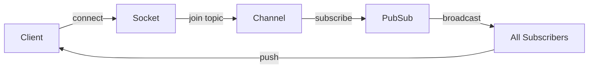
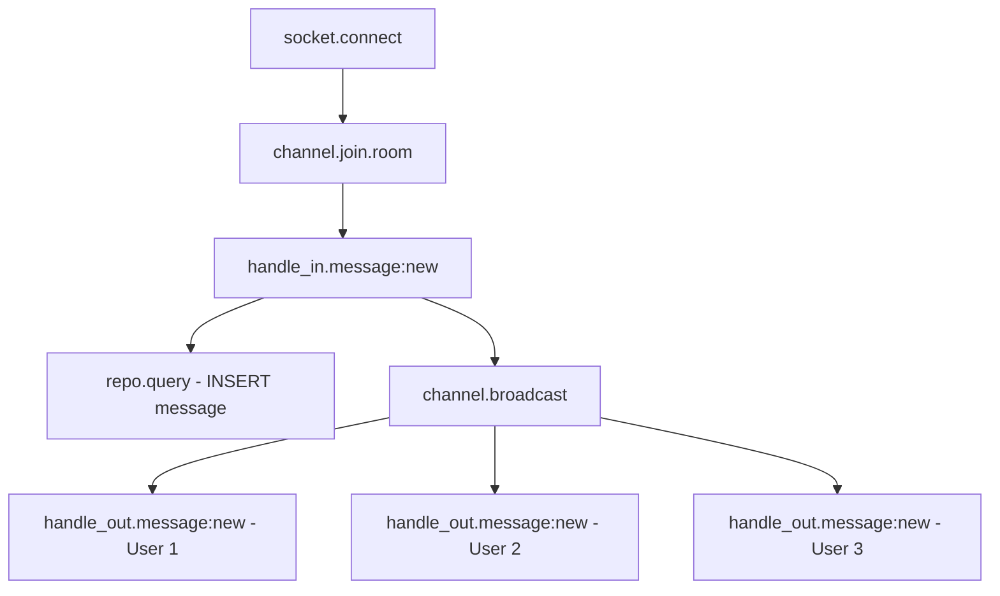

# How to Add Custom OpenTelemetry Spans to Phoenix Channel Events

Author: [nawazdhandala](https://www.github.com/nawazdhandala)

Tags: OpenTelemetry, Elixir, Phoenix, Channels, WebSockets, Custom Spans

Description: Learn to instrument Phoenix Channels with custom OpenTelemetry spans for tracing WebSocket connections, message handling, and real-time event flows in distributed systems.

Phoenix Channels power real-time features in Elixir applications, handling WebSocket connections, pub/sub messaging, and bidirectional communication. Unlike traditional HTTP requests, Channel events are long-lived and asynchronous, making them challenging to monitor. OpenTelemetry's custom instrumentation capabilities provide the visibility needed to trace message flows, identify performance bottlenecks, and debug distributed real-time systems.

This guide covers instrumenting Phoenix Channels with custom spans, propagating trace context across processes, and building observability into your real-time features.

## Understanding Channel Architecture

Before instrumenting Channels, understand the key components:

**Socket**: Represents the client connection, maintaining state and authentication.

**Channel**: Handles topic subscriptions and message routing. Clients join topics and send/receive messages.

**PubSub**: Distributes messages across processes and nodes in a cluster.

**Transport**: The underlying protocol (WebSocket, long-polling) managing the connection.

Here's the typical flow:



Each of these stages needs instrumentation for complete observability.

## Manual Span Creation Basics

Phoenix doesn't provide automatic Channel instrumentation, so you'll create spans manually using the OpenTelemetry API:

```elixir
defmodule MyAppWeb.RoomChannel do
  use Phoenix.Channel
  require OpenTelemetry.Tracer

  def join("room:" <> room_id, _params, socket) do
    # Create a span for the join operation
    OpenTelemetry.Tracer.with_span "channel.join" do
      # Set span attributes for context
      OpenTelemetry.Tracer.set_attributes(%{
        "channel.topic" => "room:#{room_id}",
        "channel.name" => "RoomChannel",
        "user.id" => socket.assigns.user_id
      })

      # Your join logic
      if authorized?(socket, room_id) do
        {:ok, socket}
      else
        {:error, %{reason: "unauthorized"}}
      end
    end
  end
end
```

The `with_span/2` macro creates a span, executes your code, and automatically ends the span with appropriate status (ok or error) based on the result.

## Instrumenting Channel Lifecycle Events

Channels have several lifecycle events that should be traced:

```elixir
defmodule MyAppWeb.RoomChannel do
  use Phoenix.Channel
  require OpenTelemetry.Tracer
  alias OpenTelemetry.Tracer

  @impl true
  def join("room:" <> room_id, payload, socket) do
    Tracer.with_span "channel.join.room" do
      Tracer.set_attributes(%{
        "channel.topic" => "room:#{room_id}",
        "channel.params" => inspect(payload),
        "user.id" => socket.assigns.user_id,
        "socket.transport" => socket.transport
      })

      case MyApp.Rooms.join_room(room_id, socket.assigns.user_id) do
        {:ok, room} ->
          # Record successful join as span event
          Tracer.add_event("room.joined", %{
            "room.member_count" => room.member_count
          })

          socket = assign(socket, :room, room)
          {:ok, %{status: "joined"}, socket}

        {:error, reason} ->
          # Record error as span event and set span status
          Tracer.set_status(:error, inspect(reason))
          Tracer.add_event("room.join_failed", %{
            "error.reason" => inspect(reason)
          })

          {:error, %{reason: reason}}
      end
    end
  end

  @impl true
  def terminate(reason, socket) do
    Tracer.with_span "channel.terminate" do
      Tracer.set_attributes(%{
        "channel.topic" => socket.topic,
        "termination.reason" => inspect(reason),
        "user.id" => socket.assigns.user_id
      })

      # Cleanup logic
      MyApp.Rooms.leave_room(socket.assigns.room.id, socket.assigns.user_id)

      :ok
    end
  end
end
```

This instrumentation captures the complete channel lifecycle with timing and contextual information.

## Tracing Message Handlers

Message handlers are where most Channel logic lives. Instrument each handler:

```elixir
defmodule MyAppWeb.RoomChannel do
  use Phoenix.Channel
  require OpenTelemetry.Tracer

  @impl true
  def handle_in("message:new", %{"body" => body}, socket) do
    OpenTelemetry.Tracer.with_span "channel.handle_in.message:new" do
      # Add message context to span
      OpenTelemetry.Tracer.set_attributes(%{
        "channel.event" => "message:new",
        "message.length" => String.length(body),
        "user.id" => socket.assigns.user_id,
        "room.id" => socket.assigns.room.id
      })

      # Process the message
      case MyApp.Chat.create_message(socket.assigns.room.id, %{
        user_id: socket.assigns.user_id,
        body: body
      }) do
        {:ok, message} ->
          # Broadcast to other room members
          # This will be traced in the broadcast function
          broadcast_from!(socket, "message:new", %{
            id: message.id,
            user: message.user.name,
            body: message.body,
            inserted_at: message.inserted_at
          })

          # Record successful processing
          OpenTelemetry.Tracer.add_event("message.created", %{
            "message.id" => message.id
          })

          {:reply, {:ok, %{id: message.id}}, socket}

        {:error, changeset} ->
          # Record validation failure
          errors = format_errors(changeset)
          OpenTelemetry.Tracer.set_status(:error, "validation_failed")
          OpenTelemetry.Tracer.add_event("message.validation_failed", %{
            "validation.errors" => inspect(errors)
          })

          {:reply, {:error, %{errors: errors}}, socket}
      end
    end
  end

  @impl true
  def handle_in("typing:start", _payload, socket) do
    OpenTelemetry.Tracer.with_span "channel.handle_in.typing:start" do
      OpenTelemetry.Tracer.set_attributes(%{
        "channel.event" => "typing:start",
        "user.id" => socket.assigns.user_id
      })

      # Broadcast typing indicator (ephemeral, low-priority)
      broadcast_from!(socket, "typing:start", %{
        user_id: socket.assigns.user_id
      })

      {:noreply, socket}
    end
  end

  defp format_errors(changeset) do
    Ecto.Changeset.traverse_errors(changeset, fn {msg, _opts} -> msg end)
  end
end
```

Each handler gets its own span with relevant attributes, making it easy to filter and analyze specific message types.

## Tracing Broadcasts and PubSub

Broadcasts propagate messages across processes and nodes. Trace context must be explicitly propagated:

```elixir
defmodule MyAppWeb.Traced.Channel do
  defmacro __using__(_opts) do
    quote do
      use Phoenix.Channel
      require OpenTelemetry.Tracer

      # Override broadcast functions to add tracing
      def traced_broadcast(topic, event, payload) do
        OpenTelemetry.Tracer.with_span "channel.broadcast" do
          # Add broadcast metadata to span
          OpenTelemetry.Tracer.set_attributes(%{
            "broadcast.topic" => topic,
            "broadcast.event" => event,
            "broadcast.payload_size" => byte_size(:erlang.term_to_binary(payload))
          })

          # Inject trace context into payload for cross-process propagation
          payload_with_context = inject_trace_context(payload)

          result = Phoenix.Channel.broadcast(topic, event, payload_with_context)

          case result do
            :ok ->
              OpenTelemetry.Tracer.add_event("broadcast.sent")
            {:error, reason} ->
              OpenTelemetry.Tracer.set_status(:error, inspect(reason))
          end

          result
        end
      end

      # Inject current trace context into payload
      defp inject_trace_context(payload) do
        # Get current span context
        ctx = OpenTelemetry.Tracer.current_span_ctx()

        # Serialize context for transmission
        trace_id = :otel_span.trace_id(ctx)
        span_id = :otel_span.span_id(ctx)

        # Add to payload metadata
        Map.merge(payload, %{
          __trace_context__: %{
            trace_id: trace_id,
            span_id: span_id
          }
        })
      end

      # Extract and link to parent trace context from payload
      defp extract_trace_context(payload) do
        case Map.get(payload, :__trace_context__) do
          %{trace_id: trace_id, span_id: span_id} ->
            # Create link to parent span
            OpenTelemetry.Tracer.set_attribute("parent.span_id", span_id)
            OpenTelemetry.Tracer.set_attribute("parent.trace_id", trace_id)

            # Remove context from payload before processing
            Map.delete(payload, :__trace_context__)

          _ ->
            payload
        end
      end
    end
  end
end
```

Use this module in your channels:

```elixir
defmodule MyAppWeb.RoomChannel do
  use MyAppWeb.Traced.Channel

  def handle_in("message:new", payload, socket) do
    OpenTelemetry.Tracer.with_span "handle_in.message:new" do
      # Process message...

      # Use traced broadcast instead of regular broadcast
      traced_broadcast(socket.topic, "message:new", %{
        body: payload["body"]
      })

      {:noreply, socket}
    end
  end
end
```

This ensures trace continuity across process boundaries, connecting the sender's span with receiver spans.

## Handling Asynchronous Work

Channels often trigger background processing. Propagate trace context to background tasks:

```elixir
defmodule MyAppWeb.DocumentChannel do
  use MyAppWeb.Traced.Channel

  def handle_in("document:process", %{"document_id" => doc_id}, socket) do
    OpenTelemetry.Tracer.with_span "handle_in.document:process" do
      OpenTelemetry.Tracer.set_attributes(%{
        "document.id" => doc_id,
        "user.id" => socket.assigns.user_id
      })

      # Capture current trace context
      parent_ctx = OpenTelemetry.Tracer.current_span_ctx()

      # Start async task with trace context
      Task.Supervisor.async_nolink(MyApp.TaskSupervisor, fn ->
        # Attach parent context to this process
        OpenTelemetry.Ctx.attach(parent_ctx)

        # Create child span for background processing
        OpenTelemetry.Tracer.with_span "document.process" do
          OpenTelemetry.Tracer.set_attributes(%{
            "document.id" => doc_id,
            "processing.async" => true
          })

          # Perform expensive processing
          result = MyApp.Documents.process(doc_id)

          # Notify channel when complete
          send_process_result(socket, result)

          result
        end
      end)

      {:reply, {:ok, %{status: "processing"}}, socket}
    end
  end

  defp send_process_result(socket, result) do
    # This runs in the task process, create a new span
    OpenTelemetry.Tracer.with_span "document.notify_complete" do
      Phoenix.Channel.push(socket, "document:processed", %{
        status: "complete",
        result: result
      })
    end
  end
end
```

The background task's spans appear as children of the original handle_in span, showing the complete operation flow.

## Monitoring Connection Health

Track connection quality and issues with custom instrumentation:

```elixir
defmodule MyAppWeb.UserSocket do
  use Phoenix.Socket
  require OpenTelemetry.Tracer

  channel "room:*", MyAppWeb.RoomChannel

  @impl true
  def connect(params, socket, connect_info) do
    OpenTelemetry.Tracer.with_span "socket.connect" do
      OpenTelemetry.Tracer.set_attributes(%{
        "socket.transport" => connect_info.transport,
        "socket.user_agent" => get_user_agent(connect_info),
        "socket.remote_ip" => format_ip(connect_info.peer_data.address)
      })

      case authenticate(params) do
        {:ok, user_id} ->
          OpenTelemetry.Tracer.add_event("socket.authenticated", %{
            "user.id" => user_id
          })

          socket = assign(socket, :user_id, user_id)
          {:ok, socket}

        :error ->
          OpenTelemetry.Tracer.set_status(:error, "authentication_failed")
          :error
      end
    end
  end

  @impl true
  def id(socket) do
    "user_socket:#{socket.assigns.user_id}"
  end

  defp authenticate(%{"token" => token}) do
    MyApp.Auth.verify_token(token)
  end
  defp authenticate(_), do: :error

  defp get_user_agent(connect_info) do
    case connect_info[:x_headers] do
      headers when is_list(headers) ->
        Enum.find_value(headers, fn
          {"user-agent", ua} -> ua
          _ -> nil
        end)
      _ -> "unknown"
    end
  end

  defp format_ip({a, b, c, d}), do: "#{a}.#{b}.#{c}.#{d}"
  defp format_ip(_), do: "unknown"
end
```

This captures connection attempts, authentication success/failure, and client metadata.

## Creating Span Links for Multi-Cast

When broadcasting to multiple topics, create span links to show the fan-out:

```elixir
def handle_in("announcement:create", payload, socket) do
  OpenTelemetry.Tracer.with_span "handle_in.announcement:create" do
    announcement = MyApp.Announcements.create(payload)

    # Get rooms this announcement should go to
    rooms = MyApp.Announcements.target_rooms(announcement)

    # Broadcast to each room with linked spans
    Enum.each(rooms, fn room_id ->
      # Create a child span for each broadcast
      OpenTelemetry.Tracer.with_span "announcement.broadcast" do
        OpenTelemetry.Tracer.set_attributes(%{
          "announcement.id" => announcement.id,
          "target.room" => room_id
        })

        traced_broadcast("room:#{room_id}", "announcement:new", %{
          id: announcement.id,
          title: announcement.title,
          body: announcement.body
        })
      end
    end)

    OpenTelemetry.Tracer.add_event("announcement.broadcasted", %{
      "broadcast.room_count" => length(rooms)
    })

    {:reply, {:ok, %{id: announcement.id}}, socket}
  end
end
```

The trace shows the original span with multiple child broadcast spans, visualizing the fan-out pattern.

## Performance Monitoring

Add custom metrics alongside spans to track Channel performance:

```elixir
defmodule MyAppWeb.ChannelMetrics do
  def setup do
    # Attach Telemetry handlers for Channel events
    :telemetry.attach_many(
      "channel-metrics",
      [
        [:phoenix, :channel_joined],
        [:phoenix, :channel_handled_in]
      ],
      &handle_event/4,
      nil
    )
  end

  def handle_event([:phoenix, :channel_joined], measurements, metadata, _config) do
    # Create a span for join timing
    OpenTelemetry.Tracer.with_span "telemetry.channel_joined" do
      OpenTelemetry.Tracer.set_attributes(%{
        "channel.topic" => metadata.socket.topic,
        "channel.duration_us" => measurements.duration
      })
    end

    # Also emit metrics
    :telemetry.execute(
      [:my_app, :channel, :join],
      %{count: 1, duration: measurements.duration},
      %{topic: metadata.socket.topic}
    )
  end

  def handle_event([:phoenix, :channel_handled_in], measurements, metadata, _config) do
    OpenTelemetry.Tracer.with_span "telemetry.channel_handled_in" do
      OpenTelemetry.Tracer.set_attributes(%{
        "channel.event" => metadata.event,
        "channel.duration_us" => measurements.duration
      })
    end

    :telemetry.execute(
      [:my_app, :channel, :message],
      %{count: 1, duration: measurements.duration},
      %{event: metadata.event}
    )
  end
end

# In application.ex
MyAppWeb.ChannelMetrics.setup()
```

This creates spans from Phoenix's built-in Telemetry events, providing automatic instrumentation for all channels.

## Visualization and Analysis

With complete instrumentation, traces show the full lifecycle of Channel operations:



Use trace data to:

**Identify Slow Handlers**: Filter spans by duration to find handlers taking longer than expected.

**Monitor Broadcast Fan-Out**: Track how many recipients receive each broadcast and time taken to deliver.

**Detect Message Loss**: Compare sent vs. received message counts using span events.

**Analyze Connection Patterns**: Understand connection churn, join/leave rates, and authentication failures.

## Conclusion

Custom OpenTelemetry instrumentation transforms Phoenix Channels from a black box into a fully observable system. Manual span creation gives you complete control over what gets traced, allowing you to capture the context and metrics most relevant to your application.

Combined with automatic HTTP and database instrumentation, Channel tracing provides end-to-end visibility across your entire Phoenix application, from initial request through real-time updates. The next post covers instrumenting Phoenix LiveView user interactions for frontend observability.
