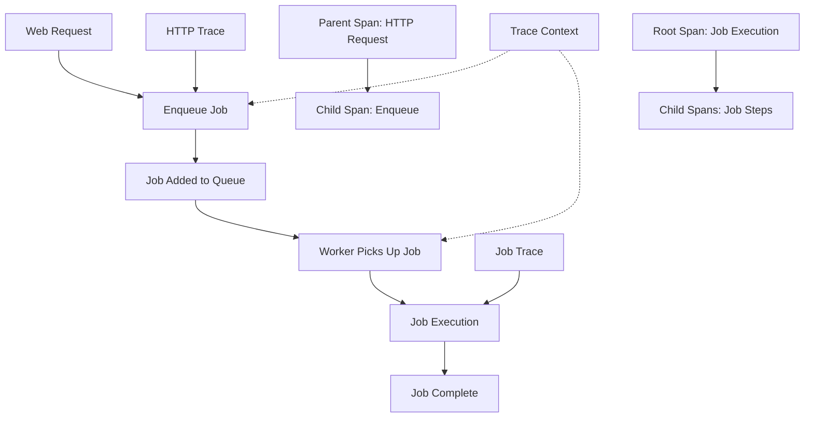

# How to Add Custom OpenTelemetry Spans to Sidekiq Background Jobs in Rails

Author: [nawazdhandala](https://www.github.com/nawazdhandala)

Tags: OpenTelemetry, Ruby, Rails, Sidekiq, Background Jobs, Custom Spans

Description: Comprehensive guide to instrumenting Sidekiq background jobs with OpenTelemetry custom spans for detailed performance monitoring and distributed tracing across async operations.

Background jobs are invisible to traditional monitoring tools because they run asynchronously, often after the HTTP request completes. OpenTelemetry provides the visibility needed to trace background job performance, connect async work back to the originating request, and identify bottlenecks in your job processing pipeline.

## Understanding Sidekiq Job Tracing

Sidekiq processes jobs in background worker processes, separate from web request threads. OpenTelemetry creates a span for each job execution, capturing job class, arguments, queue name, and execution time:



The key challenge is connecting the job trace back to the originating HTTP request. OpenTelemetry propagates trace context through job arguments, maintaining the distributed trace across async boundaries.

## Installing Sidekiq Instrumentation

Add the OpenTelemetry Sidekiq instrumentation gem to your Gemfile:

```ruby
# Gemfile
gem 'opentelemetry-sdk'
gem 'opentelemetry-exporter-otlp'
gem 'opentelemetry-instrumentation-sidekiq'
```

Install the dependencies:

```bash
bundle install
```

The `opentelemetry-instrumentation-sidekiq` gem automatically instruments both job enqueuing and execution, creating spans for the complete job lifecycle.

## Basic Sidekiq Configuration

Configure Sidekiq instrumentation in your Rails initializer:

```ruby
# config/initializers/opentelemetry.rb

require 'opentelemetry/sdk'
require 'opentelemetry/exporter/otlp'
require 'opentelemetry/instrumentation/sidekiq'

OpenTelemetry::SDK.configure do |c|
  c.service_name = 'rails-app'

  # Enable Sidekiq instrumentation
  c.use 'OpenTelemetry::Instrumentation::Sidekiq'
end
```

This configuration automatically creates spans when jobs are enqueued and when they execute, capturing queue name, job class, and timing information.

## Understanding Job Span Attributes

Sidekiq instrumentation adds these attributes to job spans:

```ruby
# Example span attributes for a Sidekiq job:
{
  'messaging.system' => 'sidekiq',
  'messaging.destination' => 'default',  # Queue name
  'messaging.destination_kind' => 'queue',
  'messaging.sidekiq.job_class' => 'UserNotificationJob',
  'messaging.message_id' => 'abc123',

  # Job execution details
  'sidekiq.job.retry' => true,
  'sidekiq.job.queue' => 'default',
  'sidekiq.job.jid' => 'abc123',

  # Worker information
  'sidekiq.worker.name' => 'UserNotificationJob'
}
```

These attributes enable filtering by queue, analyzing retry patterns, and identifying slow job classes in your observability platform.

## Adding Custom Spans to Background Jobs

Instrument specific operations within your jobs using custom spans:

```ruby
# app/jobs/user_notification_job.rb
class UserNotificationJob < ApplicationJob
  queue_as :default

  def perform(user_id, notification_type)
    tracer = OpenTelemetry.tracer_provider.tracer('app')

    # Add job-specific attributes to the auto-generated span
    span = OpenTelemetry::Trace.current_span
    span.set_attribute('user.id', user_id)
    span.set_attribute('notification.type', notification_type)

    # Fetch user data with custom span
    user = tracer.in_span('job.fetch_user', attributes: {
      'user.id' => user_id
    }) do |fetch_span|
      user = User.find(user_id)
      fetch_span.set_attribute('user.email', user.email)
      fetch_span.set_attribute('user.locale', user.locale)
      user
    end

    # Build notification with custom span
    notification = tracer.in_span('job.build_notification', attributes: {
      'notification.type' => notification_type
    }) do |build_span|
      notification = build_notification(user, notification_type)
      build_span.set_attribute('notification.subject', notification.subject)
      build_span.set_attribute('notification.channels', notification.channels.join(','))
      notification
    end

    # Send via each channel with separate spans
    notification.channels.each do |channel|
      tracer.in_span("job.send_#{channel}", attributes: {
        'notification.channel' => channel
      }) do |send_span|
        case channel
        when 'email'
          send_email(user, notification)
        when 'sms'
          send_sms(user, notification)
        when 'push'
          send_push(user, notification)
        end

        send_span.set_attribute('notification.sent', true)
      end
    end
  end

  private

  def build_notification(user, type)
    NotificationBuilder.new(user, type).build
  end

  def send_email(user, notification)
    UserMailer.notification(user, notification).deliver_now
  end

  def send_sms(user, notification)
    SmsService.send(user.phone, notification.body)
  end

  def send_push(user, notification)
    PushService.send(user.device_tokens, notification.payload)
  end
end
```

The trace shows a clear breakdown: time spent fetching user data, building the notification, and sending through each channel. This granularity reveals if email sending is slow or if SMS delivery is failing.

## Propagating Trace Context Across Jobs

Connect child jobs to parent jobs by propagating trace context:

```ruby
# app/jobs/report_generator_job.rb
class ReportGeneratorJob < ApplicationJob
  queue_as :reports

  def perform(organization_id, date_range)
    tracer = OpenTelemetry.tracer_provider.tracer('app')

    tracer.in_span('report.generate', attributes: {
      'organization.id' => organization_id,
      'report.date_range' => date_range.to_s
    }) do |span|
      organization = Organization.find(organization_id)
      span.set_attribute('organization.name', organization.name)

      # Fetch data
      data = tracer.in_span('report.fetch_data') do
        fetch_report_data(organization, date_range)
      end

      span.set_attribute('report.data_rows', data.size)

      # Process each section in parallel jobs
      # Trace context is automatically propagated to child jobs
      sections = ['sales', 'inventory', 'customers']

      sections.each do |section|
        # The parent trace context is automatically included in job args
        ReportSectionJob.perform_async(organization_id, section, data)
      end

      # Wait for all sections and combine
      tracer.in_span('report.combine_sections') do
        wait_for_sections_and_combine(organization_id, sections)
      end
    end
  end

  private

  def fetch_report_data(organization, date_range)
    organization.transactions.where(created_at: date_range)
  end

  def wait_for_sections_and_combine(organization_id, sections)
    # Poll Redis or database for section completion
    # This is simplified; production code needs better coordination
    sleep(5)
    CombineReportSectionsJob.perform_async(organization_id, sections)
  end
end

# app/jobs/report_section_job.rb
class ReportSectionJob < ApplicationJob
  queue_as :reports

  def perform(organization_id, section, data)
    tracer = OpenTelemetry.tracer_provider.tracer('app')

    # This job's span is automatically linked to the parent job's trace
    tracer.in_span("report.process_section.#{section}", attributes: {
      'organization.id' => organization_id,
      'report.section' => section
    }) do |span|
      result = process_section(section, data)
      span.set_attribute('section.items', result.size)

      # Store result for parent job to combine
      store_section_result(organization_id, section, result)
    end
  end

  private

  def process_section(section, data)
    # Section-specific processing logic
    case section
    when 'sales'
      data.group_by(&:product_id).transform_values { |txns| txns.sum(&:amount) }
    when 'inventory'
      calculate_inventory_metrics(data)
    when 'customers'
      aggregate_customer_data(data)
    end
  end

  def store_section_result(organization_id, section, result)
    Redis.current.setex(
      "report:#{organization_id}:#{section}",
      3600,
      result.to_json
    )
  end
end
```

The distributed trace connects all jobs: the parent report generation job and each section processing job appear in the same trace, showing the complete picture of report generation across multiple workers.

## Tracking Job Retries and Failures

Monitor job failures and retries with detailed error context:

```ruby
# app/jobs/payment_processor_job.rb
class PaymentProcessorJob < ApplicationJob
  queue_as :payments

  # Sidekiq retry configuration
  sidekiq_options retry: 5

  def perform(order_id, payment_method_id)
    tracer = OpenTelemetry.tracer_provider.tracer('app')

    tracer.in_span('payment.process', attributes: {
      'order.id' => order_id,
      'payment_method.id' => payment_method_id
    }) do |span|
      order = Order.find(order_id)
      payment_method = PaymentMethod.find(payment_method_id)

      span.set_attribute('order.amount', order.total)
      span.set_attribute('payment_method.type', payment_method.type)

      # Add retry information if this is a retry
      if sidekiq_context['retry_count']
        span.set_attribute('job.retry_count', sidekiq_context['retry_count'])
        span.add_event('job.retry', attributes: {
          'retry_count' => sidekiq_context['retry_count'],
          'error_class' => sidekiq_context['error_class']
        })
      end

      begin
        # Attempt payment
        result = tracer.in_span('payment.charge', attributes: {
          'amount' => order.total,
          'currency' => order.currency
        }) do
          PaymentGateway.charge(payment_method, order.total)
        end

        span.set_attribute('payment.success', true)
        span.set_attribute('payment.transaction_id', result.transaction_id)

        # Update order
        tracer.in_span('order.update') do
          order.update!(status: 'paid', transaction_id: result.transaction_id)
        end

      rescue PaymentGateway::TemporaryError => e
        # Temporary error - job will retry
        span.record_exception(e)
        span.status = OpenTelemetry::Trace::Status.error(e.message)
        span.set_attribute('payment.error.temporary', true)
        span.set_attribute('payment.error.retry', true)

        raise e  # Let Sidekiq handle retry

      rescue PaymentGateway::PermanentError => e
        # Permanent error - don't retry
        span.record_exception(e)
        span.status = OpenTelemetry::Trace::Status.error(e.message)
        span.set_attribute('payment.error.permanent', true)
        span.set_attribute('payment.error.retry', false)

        # Mark order as failed and notify customer
        order.update!(status: 'payment_failed')
        CustomerNotificationJob.perform_async(order.id, 'payment_failed')

        # Don't raise - we've handled it

      rescue StandardError => e
        # Unexpected error - record and retry
        span.record_exception(e)
        span.status = OpenTelemetry::Trace::Status.error(e.message)
        span.set_attribute('payment.error.unexpected', true)

        raise e
      end
    end
  end

  private

  def sidekiq_context
    Thread.current[:sidekiq_context] || {}
  end
end
```

Each retry creates a new span with the retry count, showing the progression of attempts and eventual success or failure.

## Measuring Queue Wait Time

Track how long jobs wait in the queue before execution:

```ruby
# app/jobs/concerns/queue_time_tracking.rb
module QueueTimeTracking
  extend ActiveSupport::Concern

  included do
    before_perform :record_queue_wait_time
  end

  private

  def record_queue_wait_time
    span = OpenTelemetry::Trace.current_span
    return unless span.recording?

    # Sidekiq stores enqueued_at timestamp
    if arguments.first.is_a?(Hash) && arguments.first['enqueued_at']
      enqueued_at = Time.at(arguments.first['enqueued_at'])
      wait_time = Time.current - enqueued_at

      span.set_attribute('job.queue_wait_time_ms', (wait_time * 1000).to_i)

      # Add event if wait time is excessive
      if wait_time > 60 # 1 minute
        span.add_event('long_queue_wait', attributes: {
          'wait_time_seconds' => wait_time.to_i
        })
      end
    end
  end
end

# app/jobs/application_job.rb
class ApplicationJob < ActiveJob::Base
  include QueueTimeTracking

  # Store enqueue time in job arguments
  before_enqueue do |job|
    job.arguments.unshift({ 'enqueued_at' => Time.current.to_f })
  end
end
```

Queue wait time appears as a span attribute, revealing if worker capacity is insufficient or if specific queues have backlogs.

## Tracing Scheduled Jobs

Track scheduled jobs from creation through execution:

```ruby
# app/jobs/scheduled_report_job.rb
class ScheduledReportJob < ApplicationJob
  queue_as :reports

  def perform(schedule_id)
    tracer = OpenTelemetry.tracer_provider.tracer('app')

    tracer.in_span('scheduled_report.execute', attributes: {
      'schedule.id' => schedule_id
    }) do |span|
      schedule = ReportSchedule.find(schedule_id)

      span.set_attribute('schedule.frequency', schedule.frequency)
      span.set_attribute('schedule.next_run', schedule.next_run_at.iso8601)
      span.set_attribute('organization.id', schedule.organization_id)

      # Check if this is running on time
      expected_time = schedule.scheduled_for
      actual_time = Time.current
      drift = (actual_time - expected_time).abs

      span.set_attribute('schedule.drift_seconds', drift.to_i)

      if drift > 300 # 5 minutes
        span.add_event('schedule.drift', attributes: {
          'drift_minutes' => (drift / 60).to_i,
          'expected_time' => expected_time.iso8601,
          'actual_time' => actual_time.iso8601
        })
      end

      # Generate and send report
      tracer.in_span('report.generate') do
        report = generate_report(schedule)
        send_report(schedule, report)
      end

      # Update next run time
      tracer.in_span('schedule.update_next_run') do
        schedule.calculate_next_run!
      end

      span.set_attribute('schedule.completed', true)
    end
  end

  private

  def generate_report(schedule)
    ReportGenerator.new(schedule.organization, schedule.config).generate
  end

  def send_report(schedule, report)
    schedule.recipients.each do |recipient|
      ReportDeliveryJob.perform_async(recipient.id, report.id)
    end
  end
end
```

The trace shows execution timing relative to the schedule, revealing clock drift or capacity issues that delay scheduled job execution.

## Batch Job Processing

Track batch operations that process multiple items:

```ruby
# app/jobs/user_sync_job.rb
class UserSyncJob < ApplicationJob
  queue_as :sync

  def perform(user_ids)
    tracer = OpenTelemetry.tracer_provider.tracer('app')

    tracer.in_span('batch.user_sync', attributes: {
      'batch.size' => user_ids.size
    }) do |span|
      successful = 0
      failed = 0

      user_ids.each do |user_id|
        tracer.in_span('user.sync', attributes: {
          'user.id' => user_id
        }) do |user_span|
          begin
            sync_user(user_id)
            successful += 1
            user_span.set_attribute('sync.success', true)
          rescue StandardError => e
            failed += 1
            user_span.record_exception(e)
            user_span.status = OpenTelemetry::Trace::Status.error(e.message)
            user_span.set_attribute('sync.success', false)
          end
        end
      end

      span.set_attribute('batch.successful', successful)
      span.set_attribute('batch.failed', failed)
      span.set_attribute('batch.success_rate', successful.to_f / user_ids.size)

      # Add event if success rate is low
      success_rate = successful.to_f / user_ids.size
      if success_rate < 0.9
        span.add_event('low_success_rate', attributes: {
          'success_rate' => success_rate,
          'failed_count' => failed
        })
      end
    end
  end

  private

  def sync_user(user_id)
    user = User.find(user_id)
    ExternalApiService.sync_user(user)
  end
end
```

The trace shows individual user sync operations under the batch span, revealing which users failed and the overall success rate.

## Testing Job Instrumentation

Verify custom spans appear correctly in tests:

```ruby
# spec/jobs/user_notification_job_spec.rb
require 'rails_helper'

RSpec.describe UserNotificationJob, type: :job do
  let(:exporter) { OpenTelemetry::SDK::Trace::Export::InMemorySpanExporter.new }
  let(:span_processor) { OpenTelemetry::SDK::Trace::Export::SimpleSpanProcessor.new(exporter) }

  before do
    OpenTelemetry.tracer_provider.add_span_processor(span_processor)
  end

  after do
    exporter.reset
  end

  it 'creates custom spans for job operations' do
    user = User.create!(name: 'Test', email: 'test@example.com')

    UserNotificationJob.new.perform(user.id, 'welcome')

    spans = exporter.finished_spans

    # Verify main job span exists
    job_span = spans.find { |s| s.name == 'UserNotificationJob' }
    expect(job_span).not_to be_nil

    # Verify custom spans exist
    fetch_span = spans.find { |s| s.name == 'job.fetch_user' }
    expect(fetch_span).not_to be_nil
    expect(fetch_span.attributes['user.id']).to eq(user.id)

    build_span = spans.find { |s| s.name == 'job.build_notification' }
    expect(build_span).not_to be_nil
  end

  it 'captures errors in job spans' do
    allow(User).to receive(:find).and_raise(StandardError.new('User not found'))

    expect {
      UserNotificationJob.new.perform(999, 'welcome')
    }.to raise_error(StandardError)

    spans = exporter.finished_spans
    error_span = spans.find { |s| s.status.code == OpenTelemetry::Trace::Status::ERROR }

    expect(error_span).not_to be_nil
    expect(error_span.events.first.name).to eq('exception')
  end
end
```

These tests confirm that custom spans are created with the expected attributes and that errors are properly captured.

Custom spans in Sidekiq jobs provide detailed visibility into background job performance. With automatic instrumentation for job lifecycle events and custom spans for specific operations, you can track queue wait times, measure processing steps, monitor retry patterns, and maintain distributed traces across async boundaries. This visibility is essential for debugging production issues, optimizing job performance, and ensuring background processing meets your SLAs.

