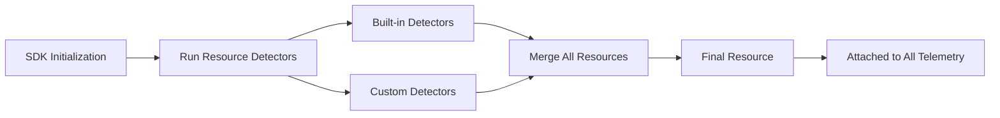

# How to Implement Custom Resource Detectors for OpenTelemetry

Author: [nawazdhandala](https://www.github.com/nawazdhandala)

Tags: OpenTelemetry, Resource Detectors, SDK, Custom Instrumentation, Observability, Telemetry

Description: Learn how to build custom resource detectors in OpenTelemetry to automatically enrich all telemetry signals with environment-specific metadata.

---

Resources in OpenTelemetry represent the entity producing telemetry data. Every span, metric, and log record carries resource attributes that describe where the data came from. While the SDK ships with built-in detectors for common environments like AWS, GCP, and Kubernetes, real-world deployments often need custom detectors that pull metadata from internal systems, configuration files, or proprietary infrastructure.

This guide walks through building custom resource detectors from scratch, covering the detector interface, async detection patterns, merging strategies, and practical examples you can adapt to your own infrastructure.

## What Resource Detectors Do

A resource detector is a component that runs at SDK initialization time and returns a set of key-value attributes describing the runtime environment. The SDK merges attributes from all configured detectors into a single Resource object that gets attached to every telemetry signal.

Built-in detectors handle standard environments. For example, the AWS EC2 detector queries the instance metadata service to populate `cloud.provider`, `cloud.region`, and `host.id`. But if you run services on custom infrastructure or need to tag telemetry with deployment metadata from an internal API, you need a custom detector.



## The Resource Detector Interface

In both Python and Go, the detector interface is straightforward. You implement a single method that returns a Resource.

Here is a minimal Python detector:

```python
# A basic custom resource detector that reads from environment variables
from opentelemetry.sdk.resources import Resource, ResourceDetector
import os


class DeploymentDetector(ResourceDetector):
    """Detects deployment-specific resource attributes from environment."""

    def detect(self) -> Resource:
        # Read deployment metadata from environment variables
        # These might be set by your CI/CD pipeline during deployment
        attributes = {}

        deploy_env = os.environ.get("DEPLOY_ENVIRONMENT")
        if deploy_env:
            attributes["deployment.environment"] = deploy_env

        deploy_version = os.environ.get("DEPLOY_VERSION")
        if deploy_version:
            attributes["deployment.version"] = deploy_version

        deploy_region = os.environ.get("DEPLOY_REGION")
        if deploy_region:
            attributes["deployment.region"] = deploy_region

        return Resource(attributes)
```

This detector reads environment variables that your CI/CD pipeline might set during deployment. The `detect` method returns a Resource with whatever attributes it finds. Missing environment variables simply result in missing attributes, which is fine since detectors should be resilient to partial information.

## Building an API-Based Detector

Many organizations maintain internal metadata services that know about running instances, their owners, cost centers, and team assignments. A custom detector can query these services at startup.

```python
# Resource detector that queries an internal metadata API
import requests
import logging
from opentelemetry.sdk.resources import Resource, ResourceDetector

logger = logging.getLogger(__name__)


class InternalMetadataDetector(ResourceDetector):
    """Pulls resource attributes from an internal metadata service."""

    def __init__(self, metadata_url: str = "http://metadata.internal:8080"):
        super().__init__()
        # Store the URL for the internal metadata service
        self.metadata_url = metadata_url
        # Set a short timeout so SDK initialization doesn't hang
        self.timeout_seconds = 2

    def detect(self) -> Resource:
        try:
            # Query the metadata service for instance information
            response = requests.get(
                f"{self.metadata_url}/v1/instance",
                timeout=self.timeout_seconds,
                headers={"Accept": "application/json"}
            )
            response.raise_for_status()
            data = response.json()

            # Map API response fields to OpenTelemetry semantic conventions
            attributes = {
                "service.name": data.get("service_name", "unknown"),
                "service.namespace": data.get("team_namespace", ""),
                "service.version": data.get("deployed_version", ""),
                "host.name": data.get("hostname", ""),
                "deployment.environment": data.get("environment", ""),
                # Custom attributes for internal tracking
                "internal.cost_center": data.get("cost_center", ""),
                "internal.team": data.get("owning_team", ""),
                "internal.oncall_rotation": data.get("oncall_rotation", ""),
            }

            # Filter out empty values to keep the resource clean
            attributes = {k: v for k, v in attributes.items() if v}

            return Resource(attributes)

        except requests.RequestException as e:
            # Log the error but don't crash SDK initialization
            logger.warning(
                "Failed to detect metadata from %s: %s",
                self.metadata_url, e
            )
            # Return an empty resource on failure
            return Resource({})
```

The timeout is critical here. Resource detection runs during SDK initialization, which blocks your application from starting. If the metadata service is down or slow, you do not want to delay startup by more than a couple of seconds. The detector catches all request exceptions and falls back to an empty resource, ensuring the application starts regardless of metadata service availability.

## Go Implementation

The Go SDK uses a similar pattern but takes advantage of Go's context and error handling:

```go
// Package detector implements a custom resource detector for internal metadata.
package detector

import (
	"context"
	"encoding/json"
	"fmt"
	"net/http"
	"time"

	"go.opentelemetry.io/otel/sdk/resource"
	semconv "go.opentelemetry.io/otel/semconv/v1.24.0"
	"go.opentelemetry.io/otel/attribute"
)

// InternalDetector queries an internal API for resource attributes.
type InternalDetector struct {
	// MetadataURL is the endpoint for the internal metadata service
	MetadataURL string
	// Client allows injecting a custom HTTP client for testing
	Client *http.Client
}

// Detect implements the resource.Detector interface.
// It returns resource attributes from the internal metadata service.
func (d *InternalDetector) Detect(ctx context.Context) (*resource.Resource, error) {
	if d.Client == nil {
		// Use a client with a short timeout to avoid blocking startup
		d.Client = &http.Client{Timeout: 2 * time.Second}
	}

	req, err := http.NewRequestWithContext(ctx, http.MethodGet, d.MetadataURL+"/v1/instance", nil)
	if err != nil {
		return resource.Empty(), fmt.Errorf("creating metadata request: %w", err)
	}

	resp, err := d.Client.Do(req)
	if err != nil {
		// Return empty resource instead of error to avoid blocking initialization
		return resource.Empty(), nil
	}
	defer resp.Body.Close()

	var meta struct {
		ServiceName string `json:"service_name"`
		Environment string `json:"environment"`
		Version     string `json:"deployed_version"`
		Team        string `json:"owning_team"`
	}

	if err := json.NewDecoder(resp.Body).Decode(&meta); err != nil {
		return resource.Empty(), nil
	}

	// Build resource using semantic conventions where applicable
	return resource.NewWithAttributes(
		semconv.SchemaURL,
		semconv.ServiceName(meta.ServiceName),
		semconv.DeploymentEnvironment(meta.Environment),
		semconv.ServiceVersion(meta.Version),
		attribute.String("internal.team", meta.Team),
	), nil
}
```

The Go detector uses context propagation so that cancellation and timeouts from the parent context are respected. If the caller cancels initialization, the HTTP request gets cancelled too.

## Registering Custom Detectors

Once you have built your detector, you need to wire it into the SDK's TracerProvider, MeterProvider, or LoggerProvider configuration.

```python
# Registering custom detectors with the OpenTelemetry SDK
from opentelemetry.sdk.trace import TracerProvider
from opentelemetry.sdk.resources import Resource, OTELResourceDetector
from opentelemetry.sdk.trace.export import BatchSpanProcessor, ConsoleSpanExporter

# Create detectors
deployment_detector = DeploymentDetector()
metadata_detector = InternalMetadataDetector(
    metadata_url="http://metadata.internal:8080"
)

# Detect resources from all detectors
# The SDK merges these in order, with later detectors taking precedence
detected_resource = Resource.create(
    attributes={"service.name": "my-service"},  # Base attributes
).merge(
    deployment_detector.detect()
).merge(
    metadata_detector.detect()
)

# Use the merged resource for the TracerProvider
provider = TracerProvider(resource=detected_resource)
provider.add_span_processor(
    BatchSpanProcessor(ConsoleSpanExporter())
)
```

The merge order matters. When two detectors provide the same attribute key, the later merge wins. In this example, if the metadata service returns a `service.name`, it overrides the hardcoded base attribute. Plan your merge order so that more specific or authoritative sources come last.

## Handling Async Detection

Some environments require async detection patterns, especially when querying cloud metadata services that may have variable latency. Here is a pattern using Python's threading for parallel detection:

```python
# Parallel resource detection for faster SDK initialization
import concurrent.futures
from opentelemetry.sdk.resources import Resource, ResourceDetector
from typing import List


def detect_resources_parallel(
    detectors: List[ResourceDetector],
    timeout: float = 5.0
) -> Resource:
    """Run multiple detectors in parallel and merge results."""
    base = Resource.create()

    # Run all detectors concurrently with a shared timeout
    with concurrent.futures.ThreadPoolExecutor(max_workers=len(detectors)) as pool:
        futures = {
            pool.submit(detector.detect): detector
            for detector in detectors
        }

        for future in concurrent.futures.as_completed(futures, timeout=timeout):
            detector = futures[future]
            try:
                detected = future.result()
                # Merge each detected resource into the base
                base = base.merge(detected)
            except Exception as e:
                logger.warning(
                    "Detector %s failed: %s",
                    detector.__class__.__name__, e
                )

    return base
```

Running detectors in parallel can significantly reduce startup time when you have multiple detectors that each make network calls. Instead of serial detection where total time equals the sum of all detector latencies, parallel detection only takes as long as the slowest detector.

## Testing Custom Detectors

Detectors are straightforward to test since they implement a simple interface:

```python
# Testing a custom resource detector
import unittest
from unittest.mock import patch, MagicMock


class TestInternalMetadataDetector(unittest.TestCase):

    @patch("requests.get")
    def test_successful_detection(self, mock_get):
        """Verify detector extracts correct attributes from API response."""
        # Set up mock response matching the metadata API format
        mock_response = MagicMock()
        mock_response.json.return_value = {
            "service_name": "payment-service",
            "environment": "production",
            "owning_team": "payments",
        }
        mock_response.raise_for_status = MagicMock()
        mock_get.return_value = mock_response

        detector = InternalMetadataDetector()
        resource = detector.detect()

        # Verify the resource contains expected attributes
        attrs = dict(resource.attributes)
        assert attrs["service.name"] == "payment-service"
        assert attrs["deployment.environment"] == "production"
        assert attrs["internal.team"] == "payments"

    @patch("requests.get", side_effect=ConnectionError("no route"))
    def test_detection_failure_returns_empty(self, mock_get):
        """Verify detector returns empty resource when API is unreachable."""
        detector = InternalMetadataDetector()
        resource = detector.detect()

        # Should return empty resource, not raise an exception
        assert len(resource.attributes) == 0
```

Testing the failure path is just as important as the success path. Your detector will run during SDK initialization in production, and you want to be absolutely certain that a detector failure does not prevent your application from starting.

## Best Practices

When building custom resource detectors, keep these guidelines in mind. First, always set aggressive timeouts on network calls. SDK initialization blocks your application, and a 30-second timeout on a metadata API call means 30 seconds of downtime on every restart.

Second, follow OpenTelemetry semantic conventions for attribute names wherever possible. Use `service.name`, `deployment.environment`, and `host.name` instead of inventing your own keys. This ensures compatibility with observability backends that rely on well-known attribute names for indexing and visualization.

Third, keep detectors focused. Each detector should be responsible for one source of metadata. A Kubernetes detector reads pod labels. A deployment detector reads CI/CD metadata. Splitting responsibilities makes detectors easier to test and reuse across services.

Fourth, handle partial data gracefully. If a metadata API returns some fields but not others, include what you have rather than failing entirely. Some context is always better than no context.

Custom resource detectors are a powerful way to ensure that every piece of telemetry your services emit carries the context needed for effective observability. Build them once, register them in your shared SDK configuration, and every team benefits from richer, more queryable telemetry data.
