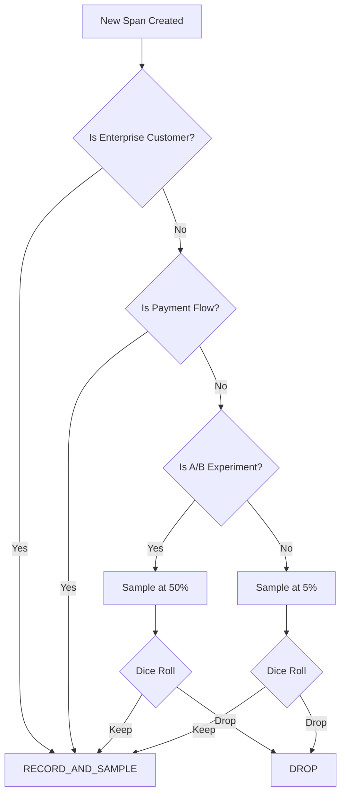

# How to Implement Custom Samplers Based on Business Rules

Author: [nawazdhandala](https://www.github.com/nawazdhandala)

Tags: OpenTelemetry, Custom Sampler, Business Rules, Sampling, Tracing, Observability, Python, Node.js, Java

Description: Learn how to build custom OpenTelemetry samplers that make sampling decisions based on business context like user tier, transaction type, and feature flags.

---

Built-in samplers treat all traces equally. A health check endpoint gets the same sampling probability as a checkout flow. A free-tier user generates the same trace volume as an enterprise customer paying six figures a year. Custom samplers let you inject business logic into the sampling decision, ensuring that you always have visibility into the traces that matter most to your business.

This post walks through building custom samplers in Python, Node.js, and Java. Each example implements real business rules that you can adapt for your own system.

---

## When You Need Custom Samplers

Standard probability sampling works well for uniform traffic. But most production systems are not uniform. Consider these scenarios:

- You want 100% sampling for enterprise customers and 5% for free-tier users
- Checkout and payment flows should always be traced, but browsing pages can be sampled at a low rate
- During an A/B test rollout, you want full tracing on the experiment group
- Internal API calls between your own services should be sampled differently from external API calls
- Certain routes are under active investigation and need temporary 100% sampling

None of these can be expressed with a single probability ratio. You need a custom sampler.



---

## The Sampler Interface

Before building, it helps to understand what the SDK gives you to work with. When a span is about to be created, the SDK calls your sampler's `should_sample` method with:

- **Parent context** including the parent span's trace ID and sampling decision
- **Trace ID** of the new trace (or the existing one if this is a child span)
- **Span name** like `GET /api/users` or `db.query`
- **Span kind** such as SERVER, CLIENT, INTERNAL, PRODUCER, or CONSUMER
- **Initial attributes** that were passed when the span was created
- **Links** to other spans (used in batch processing scenarios)

Your sampler returns a `SamplingResult` containing:

- **Decision**: DROP, RECORD_ONLY, or RECORD_AND_SAMPLE
- **Attributes**: Additional attributes to attach to the span
- **Trace state**: Optional modifications to the W3C trace state

---

## Python: User Tier and Transaction Type Sampler

```python
# business_sampler.py
from opentelemetry.sdk.trace.sampling import (
    Sampler,
    SamplingResult,
    Decision,
)
from opentelemetry.context import Context
from opentelemetry.trace import get_current_span, SpanKind
import logging

logger = logging.getLogger(__name__)


class BusinessRuleSampler(Sampler):
    """Samples traces based on user tier and transaction type.

    Sampling rates:
    - Enterprise customers: 100%
    - Payment/checkout flows: 100%
    - Premium customers: 50%
    - Free-tier customers: 5%
    - Health checks and readiness probes: 0%
    """

    # Endpoints that should never be traced.
    # These generate noise without value.
    IGNORED_ENDPOINTS = {
        "/health",
        "/healthz",
        "/ready",
        "/readiness",
        "/metrics",
        "/favicon.ico",
    }

    # Operations that always get full sampling regardless
    # of user tier. These are business-critical flows where
    # missing a trace could mean missing a revenue issue.
    CRITICAL_OPERATIONS = {
        "checkout",
        "payment",
        "refund",
        "subscription.create",
        "subscription.cancel",
        "account.delete",
    }

    # Sampling rates by user tier. The key is the value
    # of the user.tier span attribute.
    TIER_RATES = {
        "enterprise": 1.0,
        "premium": 0.5,
        "pro": 0.25,
        "free": 0.05,
    }

    # Default rate for requests where the user tier is unknown
    DEFAULT_RATE = 0.1

    def should_sample(
        self,
        parent_context: Context,
        trace_id: int,
        name: str,
        kind: SpanKind = None,
        attributes=None,
        links=None,
    ) -> SamplingResult:
        attrs = attributes or {}

        # Rule 1: Drop health checks and probes entirely.
        # These endpoints are called every few seconds by
        # load balancers and orchestrators. Tracing them
        # wastes storage and clutters the UI.
        http_target = attrs.get("http.target", "")
        http_route = attrs.get("http.route", "")
        endpoint = http_route or http_target

        if endpoint in self.IGNORED_ENDPOINTS:
            return SamplingResult(Decision.DROP, {})

        # Rule 2: Check if the parent already made a decision.
        # If this is a child span with a sampled parent, we
        # must follow the parent to keep traces complete.
        parent_span = get_current_span(parent_context)
        if parent_span and parent_span.get_span_context().is_valid:
            parent_sampled = parent_span.get_span_context().trace_flags.sampled
            if parent_sampled:
                return SamplingResult(
                    Decision.RECORD_AND_SAMPLE,
                    {"sampling.rule": "parent_sampled"},
                )
            else:
                return SamplingResult(Decision.DROP, {})

        # Rule 3: Always sample critical business operations.
        operation = attrs.get("operation.name", "")
        if operation in self.CRITICAL_OPERATIONS:
            return SamplingResult(
                Decision.RECORD_AND_SAMPLE,
                {"sampling.rule": "critical_operation"},
            )

        # Rule 4: Sample based on user tier.
        user_tier = attrs.get("user.tier", "")
        rate = self.TIER_RATES.get(user_tier, self.DEFAULT_RATE)

        if self._should_sample_by_rate(trace_id, rate):
            return SamplingResult(
                Decision.RECORD_AND_SAMPLE,
                {"sampling.rule": f"tier_{user_tier or 'default'}"},
            )

        return SamplingResult(Decision.DROP, {})

    def _should_sample_by_rate(self, trace_id: int, rate: float) -> bool:
        """Deterministic sampling based on trace ID.
        Uses the same algorithm as TraceIdRatioBased so that
        the decision is consistent across services."""
        if rate >= 1.0:
            return True
        if rate <= 0.0:
            return False

        bound = int(rate * (2**64 - 1))
        trace_id_lower = trace_id & 0xFFFFFFFFFFFFFFFF
        return trace_id_lower < bound

    def get_description(self) -> str:
        return "BusinessRuleSampler"
```

To use this sampler, pass it to the `TracerProvider` the same way you would pass any built-in sampler.

```python
# tracing_setup.py
from opentelemetry import trace
from opentelemetry.sdk.trace import TracerProvider
from opentelemetry.sdk.trace.export import BatchSpanProcessor
from opentelemetry.exporter.otlp.proto.grpc.trace_exporter import OTLPSpanExporter
from opentelemetry.sdk.resources import Resource
from business_sampler import BusinessRuleSampler

resource = Resource.create({
    "service.name": "api-gateway",
    "deployment.environment": "production",
})

# The custom sampler replaces the default AlwaysOn sampler.
# All the business rules are now applied at span creation time.
provider = TracerProvider(
    resource=resource,
    sampler=BusinessRuleSampler(),
)

exporter = OTLPSpanExporter(endpoint="http://localhost:4317")
provider.add_span_processor(BatchSpanProcessor(exporter))
trace.set_tracer_provider(provider)
```

One important detail: your custom sampler only sees attributes that are passed at span creation time. If the `user.tier` attribute is added later via `span.set_attribute()`, the sampler will not see it. You need to ensure that business-critical attributes are available when the span is created.

```python
# Correct: pass attributes at span creation
tracer = trace.get_tracer(__name__)
with tracer.start_as_current_span(
    "process_order",
    attributes={
        "user.tier": current_user.tier,
        "operation.name": "checkout",
        "user.id": current_user.id,
    },
) as span:
    # ... process order
    pass
```

---

## Node.js: Feature Flag Aware Sampler

```javascript
// feature-flag-sampler.js
const { SamplingDecision } = require('@opentelemetry/api');
const { SpanKind } = require('@opentelemetry/api');

class FeatureFlagSampler {
  /**
   * A sampler that adjusts sampling rates based on feature flags.
   * This is useful during A/B tests, canary deployments, or
   * when debugging a specific feature in production.
   *
   * @param {Object} options
   * @param {Function} options.flagProvider - Returns current flag state
   * @param {number} options.defaultRate - Default sampling rate (0.0-1.0)
   */
  constructor(options = {}) {
    this.flagProvider = options.flagProvider || (() => ({}));
    this.defaultRate = options.defaultRate || 0.1;
  }

  shouldSample(context, traceId, spanName, spanKind, attributes, links) {
    const flags = this.flagProvider();
    const attrs = attributes || {};

    // Rule 1: If the trace-debug flag is on, sample everything.
    // This is an emergency switch for incident response.
    if (flags['trace-debug-mode'] === true) {
      return {
        decision: SamplingDecision.RECORD_AND_SAMPLE,
        attributes: { 'sampling.rule': 'debug_mode' },
      };
    }

    // Rule 2: If a feature is being rolled out, sample all
    // traffic that hits the new code path.
    const featureGroup = attrs['feature.experiment_group'];
    if (featureGroup && flags[`trace-experiment-${featureGroup}`]) {
      return {
        decision: SamplingDecision.RECORD_AND_SAMPLE,
        attributes: { 'sampling.rule': `experiment_${featureGroup}` },
      };
    }

    // Rule 3: Sample specific routes at custom rates.
    // The flag provider returns a map of route patterns to rates.
    const routeOverrides = flags['trace-route-overrides'] || {};
    const httpRoute = attrs['http.route'] || '';
    if (routeOverrides[httpRoute] !== undefined) {
      const rate = routeOverrides[httpRoute];
      if (this._shouldSampleByRate(traceId, rate)) {
        return {
          decision: SamplingDecision.RECORD_AND_SAMPLE,
          attributes: { 'sampling.rule': 'route_override' },
        };
      }
      return { decision: SamplingDecision.NOT_RECORD };
    }

    // Rule 4: Default probabilistic sampling
    if (this._shouldSampleByRate(traceId, this.defaultRate)) {
      return {
        decision: SamplingDecision.RECORD_AND_SAMPLE,
        attributes: { 'sampling.rule': 'default' },
      };
    }

    return { decision: SamplingDecision.NOT_RECORD };
  }

  _shouldSampleByRate(traceId, rate) {
    if (rate >= 1.0) return true;
    if (rate <= 0.0) return false;

    // Extract lower 8 bytes of trace ID for deterministic hashing.
    // Trace IDs are hex strings in JavaScript.
    const lowerHex = traceId.slice(-16);
    const lower = BigInt('0x' + lowerHex);
    const bound = BigInt(Math.floor(rate * Number(BigInt(2) ** BigInt(64))));
    return lower < bound;
  }

  toString() {
    return 'FeatureFlagSampler';
  }
}

module.exports = { FeatureFlagSampler };
```

Using it with a feature flag service:

```javascript
// tracing.js
const { NodeSDK } = require('@opentelemetry/sdk-node');
const { OTLPTraceExporter } = require('@opentelemetry/exporter-trace-otlp-http');
const { Resource } = require('@opentelemetry/resources');
const { FeatureFlagSampler } = require('./feature-flag-sampler');

// This could be LaunchDarkly, Unleash, ConfigCat, or even
// a simple JSON file that gets reloaded periodically.
function getFlags() {
  return {
    'trace-debug-mode': false,
    'trace-experiment-new-search': true,
    'trace-route-overrides': {
      '/api/v2/checkout': 1.0,
      '/api/v1/search': 0.5,
    },
  };
}

const sdk = new NodeSDK({
  resource: new Resource({
    'service.name': 'web-api',
  }),
  traceExporter: new OTLPTraceExporter({
    url: 'http://localhost:4318/v1/traces',
  }),
  sampler: new FeatureFlagSampler({
    flagProvider: getFlags,
    defaultRate: 0.1,
  }),
});

sdk.start();
```

The `flagProvider` function is called on every sampling decision, so it should be fast. Cache the flag values locally and refresh them periodically rather than making a network call on every request.

---

## Java: Multi-Dimensional Business Sampler

```java
// BusinessRuleSampler.java
import io.opentelemetry.api.common.Attributes;
import io.opentelemetry.api.trace.SpanKind;
import io.opentelemetry.context.Context;
import io.opentelemetry.sdk.trace.data.LinkData;
import io.opentelemetry.sdk.trace.samplers.Sampler;
import io.opentelemetry.sdk.trace.samplers.SamplingDecision;
import io.opentelemetry.sdk.trace.samplers.SamplingResult;

import java.util.List;
import java.util.Map;
import java.util.Set;

public class BusinessRuleSampler implements Sampler {

    // Services where every trace matters. These are typically
    // low-volume, high-value services.
    private static final Set<String> CRITICAL_SERVICES = Set.of(
        "payment-service",
        "auth-service",
        "billing-service"
    );

    // HTTP methods that are read-only and can be sampled aggressively.
    // Mutations (POST, PUT, DELETE) are sampled at higher rates.
    private static final Set<String> READ_METHODS = Set.of("GET", "HEAD", "OPTIONS");

    // Rates by customer segment
    private static final Map<String, Double> SEGMENT_RATES = Map.of(
        "enterprise", 1.0,
        "business", 0.5,
        "starter", 0.1,
        "free", 0.02
    );

    private static final double DEFAULT_RATE = 0.05;
    private static final double MUTATION_RATE_MULTIPLIER = 3.0;

    @Override
    public SamplingResult shouldSample(
            Context parentContext,
            String traceId,
            String name,
            SpanKind spanKind,
            Attributes attributes,
            List<LinkData> parentLinks) {

        // Rule 1: Always sample spans from critical services.
        // The service name comes from the resource, but the sampler
        // can also check span attributes for a forwarded service name.
        String targetService = attributes.get(
            io.opentelemetry.api.common.AttributeKey.stringKey("rpc.service")
        );
        if (targetService != null && CRITICAL_SERVICES.contains(targetService)) {
            return SamplingResult.create(SamplingDecision.RECORD_AND_SAMPLE);
        }

        // Rule 2: Determine the base rate from customer segment.
        String segment = attributes.get(
            io.opentelemetry.api.common.AttributeKey.stringKey("customer.segment")
        );
        double rate = SEGMENT_RATES.getOrDefault(segment, DEFAULT_RATE);

        // Rule 3: Increase rate for write operations.
        // Mutations are more likely to cause issues and are
        // worth sampling at a higher rate.
        String httpMethod = attributes.get(
            io.opentelemetry.api.common.AttributeKey.stringKey("http.method")
        );
        if (httpMethod != null && !READ_METHODS.contains(httpMethod.toUpperCase())) {
            rate = Math.min(1.0, rate * MUTATION_RATE_MULTIPLIER);
        }

        // Make a deterministic decision based on the trace ID
        if (shouldSampleByRate(traceId, rate)) {
            return SamplingResult.create(SamplingDecision.RECORD_AND_SAMPLE);
        }

        return SamplingResult.create(SamplingDecision.DROP);
    }

    private boolean shouldSampleByRate(String traceId, double rate) {
        if (rate >= 1.0) return true;
        if (rate <= 0.0) return false;

        // Parse the lower 16 hex characters of the trace ID
        String lowerHex = traceId.substring(traceId.length() - 16);
        long lower = Long.parseUnsignedLong(lowerHex, 16);
        long bound = (long) (rate * Long.MAX_VALUE);
        return Long.compareUnsigned(lower, bound) < 0;
    }

    @Override
    public String getDescription() {
        return "BusinessRuleSampler";
    }
}
```

The Java sampler multiplies the sampling rate for write operations. This is a useful pattern because mutations (POST, PUT, DELETE) are more likely to cause data inconsistencies, trigger bugs, or have business impact. A read request that fails is usually retriable, but a failed payment mutation could mean lost revenue.

---

## Testing Your Custom Sampler

Custom samplers should be unit tested like any other code. Here is a Python test example.

```python
# test_business_sampler.py
import pytest
from business_sampler import BusinessRuleSampler
from opentelemetry.sdk.trace.sampling import Decision


def test_drops_health_checks():
    sampler = BusinessRuleSampler()
    result = sampler.should_sample(
        parent_context=None,
        trace_id=12345,
        name="GET /health",
        attributes={"http.target": "/health"},
    )
    assert result.decision == Decision.DROP


def test_samples_enterprise_customers():
    sampler = BusinessRuleSampler()
    result = sampler.should_sample(
        parent_context=None,
        trace_id=12345,
        name="GET /api/dashboard",
        attributes={"user.tier": "enterprise"},
    )
    assert result.decision == Decision.RECORD_AND_SAMPLE


def test_samples_critical_operations():
    sampler = BusinessRuleSampler()
    result = sampler.should_sample(
        parent_context=None,
        trace_id=12345,
        name="process_payment",
        attributes={"operation.name": "payment"},
    )
    assert result.decision == Decision.RECORD_AND_SAMPLE


def test_respects_free_tier_rate():
    """Free tier at 5% should sample roughly 5% of traces."""
    sampler = BusinessRuleSampler()
    sampled = 0
    total = 10000

    for i in range(total):
        result = sampler.should_sample(
            parent_context=None,
            trace_id=i,
            name="GET /api/data",
            attributes={"user.tier": "free"},
        )
        if result.decision == Decision.RECORD_AND_SAMPLE:
            sampled += 1

    # Allow 2% tolerance
    rate = sampled / total
    assert 0.03 < rate < 0.07, f"Expected ~5% but got {rate:.2%}"
```

Testing the statistical properties of your sampler is important. A bug in the deterministic hashing logic could mean you are sampling 0% or 100% instead of the intended rate.

---

## Conclusion

Custom samplers bridge the gap between generic probability sampling and the specific needs of your business. They let you encode knowledge about what matters, like which customers, operations, and services deserve full visibility, directly into your tracing pipeline.

Start simple. A sampler that distinguishes between two or three tiers of importance is usually enough. You can always add more rules later as you learn what your team actually needs when debugging production issues. The most effective custom samplers are the ones that grew organically from real incident investigations where someone said, "I wish we had that trace."
