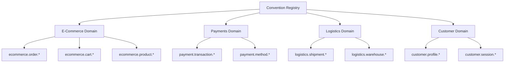

# How to Implement Custom Semantic Conventions for Your Domain

Author: [nawazdhandala](https://www.github.com/nawazdhandala)

Tags: OpenTelemetry, Semantic Conventions, Custom Attributes, Observability, Telemetry, Domain Modeling

Description: Learn how to design and implement custom OpenTelemetry semantic conventions tailored to your specific business domain with practical code examples.

---

OpenTelemetry ships with a broad set of semantic conventions covering HTTP, databases, messaging, and more. But every organization has domain-specific concepts that fall outside these standards. An e-commerce platform needs attributes for cart operations, payment flows, and inventory checks. A healthcare system needs attributes for patient encounters, claims processing, and clinical workflows. Custom semantic conventions let you extend OpenTelemetry's attribute model to capture these realities in a structured, consistent way.

This guide walks through the full process of designing, implementing, and governing custom semantic conventions for your domain.

## Why Custom Conventions Matter

Without agreed-upon attribute names and value types, telemetry data becomes inconsistent across teams. One service might use `order.id` while another uses `orderId` or `order_identifier`. Dashboards break, alert rules become fragile, and correlating traces across services turns into guesswork.

Custom semantic conventions solve this by establishing a shared vocabulary. They define what attributes exist, what types they use, what values are valid, and when they should be present. This consistency is the foundation for reliable observability at scale.

## Designing Your Convention Schema

Before writing any code, you need a clear schema. Start by identifying the domain entities and operations that matter most to your observability goals.

```yaml
# custom-semconv.yaml
# Domain: E-Commerce Platform
# Namespace: ecommerce

groups:
  - id: ecommerce.order
    prefix: ecommerce.order
    type: attribute_group
    brief: "Attributes describing an e-commerce order"
    attributes:
      - id: id
        type: string
        brief: "Unique identifier for the order"
        requirement_level: required
        examples: ["ORD-2026-0001", "ORD-2026-0002"]

      - id: status
        type:
          allow_custom_values: false
          members:
            - id: pending
              value: "pending"
            - id: confirmed
              value: "confirmed"
            - id: shipped
              value: "shipped"
            - id: delivered
              value: "delivered"
            - id: cancelled
              value: "cancelled"
        brief: "Current status of the order"
        requirement_level: required

      - id: total_amount
        type: double
        brief: "Total order amount in the base currency"
        requirement_level: recommended

      - id: item_count
        type: int
        brief: "Number of distinct items in the order"
        requirement_level: recommended
```

A few principles to follow when designing your schema. Use a clear namespace prefix like `ecommerce.order` to avoid collisions with standard conventions. Keep attribute names lowercase with dots as separators, matching the OpenTelemetry style. Define requirement levels so instrumentation authors know what is mandatory versus optional. Use enumerations for fields with a fixed set of valid values.

## Implementing Constants in Your Codebase

Once the schema is defined, translate it into constants that your application code can reference. Hardcoded string literals scattered across services are exactly what conventions are meant to prevent.

```python
# semconv/ecommerce.py
# Centralized attribute constants for the e-commerce domain.
# All services import from this module to ensure consistency.

class EcommerceOrderAttributes:
    """Semantic convention constants for e-commerce order attributes."""

    # Unique identifier for the order (required)
    ORDER_ID = "ecommerce.order.id"

    # Current status of the order (required)
    ORDER_STATUS = "ecommerce.order.status"

    # Total order amount in base currency (recommended)
    ORDER_TOTAL_AMOUNT = "ecommerce.order.total_amount"

    # Number of distinct items in the order (recommended)
    ORDER_ITEM_COUNT = "ecommerce.order.item_count"


class OrderStatus:
    """Valid values for the ecommerce.order.status attribute."""

    PENDING = "pending"
    CONFIRMED = "confirmed"
    SHIPPED = "shipped"
    DELIVERED = "delivered"
    CANCELLED = "cancelled"
```

Packaging these as a shared library or internal module means every team uses the same attribute names. When a convention changes, you update one place and all consumers pick it up.

## Instrumenting Application Code

With constants in place, you can instrument your services cleanly. Here is how a typical order processing span looks using the custom conventions.

```python
# order_service.py
# Demonstrates applying custom semantic conventions to spans.

from opentelemetry import trace
from semconv.ecommerce import EcommerceOrderAttributes, OrderStatus

tracer = trace.get_tracer("order-service", "1.0.0")

def process_order(order_data: dict) -> str:
    """Process an incoming order and return the order ID."""

    # Create a span with custom domain attributes
    with tracer.start_as_current_span("process_order") as span:
        order_id = generate_order_id()

        # Set required attributes per our convention
        span.set_attribute(
            EcommerceOrderAttributes.ORDER_ID,
            order_id
        )
        span.set_attribute(
            EcommerceOrderAttributes.ORDER_STATUS,
            OrderStatus.PENDING
        )

        # Set recommended attributes when available
        span.set_attribute(
            EcommerceOrderAttributes.ORDER_TOTAL_AMOUNT,
            order_data.get("total", 0.0)
        )
        span.set_attribute(
            EcommerceOrderAttributes.ORDER_ITEM_COUNT,
            len(order_data.get("items", []))
        )

        # Business logic here
        validate_inventory(order_data["items"])
        reserve_payment(order_data["payment"])

        # Update status as the order progresses
        span.set_attribute(
            EcommerceOrderAttributes.ORDER_STATUS,
            OrderStatus.CONFIRMED
        )

        return order_id
```

Notice how the code reads naturally. Anyone reviewing it can immediately understand what telemetry is being recorded and what the attribute values mean. This is the payoff of well-designed conventions.

## Building a Convention Registry

As your organization grows, you will have conventions across multiple domains. A registry helps teams discover existing conventions before inventing new ones.



The registry does not need to be fancy. A Git repository with YAML schema files, a review process for new conventions, and generated documentation works well for most organizations. The key is making it easy to search and browse so teams find existing conventions rather than creating duplicates.

## Metrics and Logs with Custom Conventions

Semantic conventions are not just for traces. Apply the same attributes to metrics and logs for correlated observability across all three signals.

```python
# metrics_example.py
# Using custom conventions with OpenTelemetry metrics.

from opentelemetry import metrics
from semconv.ecommerce import EcommerceOrderAttributes, OrderStatus

meter = metrics.get_meter("order-service", "1.0.0")

# Counter for orders processed, broken down by status
order_counter = meter.create_counter(
    name="ecommerce.orders.processed",
    description="Number of orders processed",
    unit="1"
)

# Histogram for order values
order_value_histogram = meter.create_histogram(
    name="ecommerce.orders.value",
    description="Distribution of order values",
    unit="USD"
)

def record_order_metrics(order_id: str, status: str, total: float):
    """Record metrics using consistent domain attributes."""

    # Use the same attribute constants across traces and metrics
    attributes = {
        EcommerceOrderAttributes.ORDER_ID: order_id,
        EcommerceOrderAttributes.ORDER_STATUS: status,
    }

    order_counter.add(1, attributes)
    order_value_histogram.record(total, attributes)
```

When traces, metrics, and logs all use `ecommerce.order.id` as the attribute name, correlating signals becomes straightforward. You can jump from a spike in the `ecommerce.orders.value` histogram to the specific traces that caused it, all because the attribute names match.

## Versioning and Evolution

Conventions will change over time. New attributes get added, old ones get deprecated, and value sets expand. Plan for this from the start.

```yaml
# Version history tracked in the schema file
groups:
  - id: ecommerce.order
    prefix: ecommerce.order
    type: attribute_group
    brief: "Attributes describing an e-commerce order"
    # stability: experimental | stable
    stability: stable
    # deprecated: Use ecommerce.order.v2 instead (if applicable)
    attributes:
      - id: currency
        type: string
        brief: "ISO 4217 currency code for the order"
        requirement_level: recommended
        # Added in v1.2.0 of our conventions
        note: "Added to support multi-currency orders"
        examples: ["USD", "EUR", "GBP"]
```

Follow a few rules for safe evolution. Never remove a stable attribute without a deprecation period. Add new attributes as `recommended` first, then promote to `required` once adoption is widespread. Use the `deprecated` field to guide migration when breaking changes are necessary. Treat your convention schema with the same rigor you would treat a public API contract.

## Validation at the Collector Level

You can enforce convention compliance in the OpenTelemetry Collector using the transform processor. This catches instrumentation that drifts from the conventions before data reaches your backend.

```yaml
# collector-config.yaml
# Transform processor to validate and normalize custom attributes

processors:
  transform:
    trace_statements:
      - context: span
        statements:
          # Normalize legacy attribute names to current conventions
          - set(attributes["ecommerce.order.id"], attributes["order_id"])
            where attributes["order_id"] != nil
          - delete_key(attributes, "order_id")
            where attributes["order_id"] != nil

          # Ensure status values are lowercase
          - set(attributes["ecommerce.order.status"],
              Concat([""], [attributes["ecommerce.order.status"]], ""))
            where attributes["ecommerce.order.status"] != nil
```

This gives you a safety net at the infrastructure level. Even if a service ships with outdated attribute names, the collector can normalize the data before it reaches your observability backend.

## Practical Tips

A few lessons from organizations that have successfully rolled out custom conventions. Start small with one or two critical domains rather than trying to model everything at once. Get buy-in from the teams who will use the conventions before finalizing the schema. Publish generated documentation from the YAML schemas so developers have a single reference point. Review new convention proposals through pull requests so the whole team can weigh in. Track adoption metrics to identify services that are not yet using the conventions.

Custom semantic conventions are one of the most impactful investments you can make in your observability practice. They turn unstructured, inconsistent telemetry into a well-organized data model that scales across teams and services. The upfront effort pays dividends every time someone builds a dashboard, writes an alert rule, or debugates a production incident.
