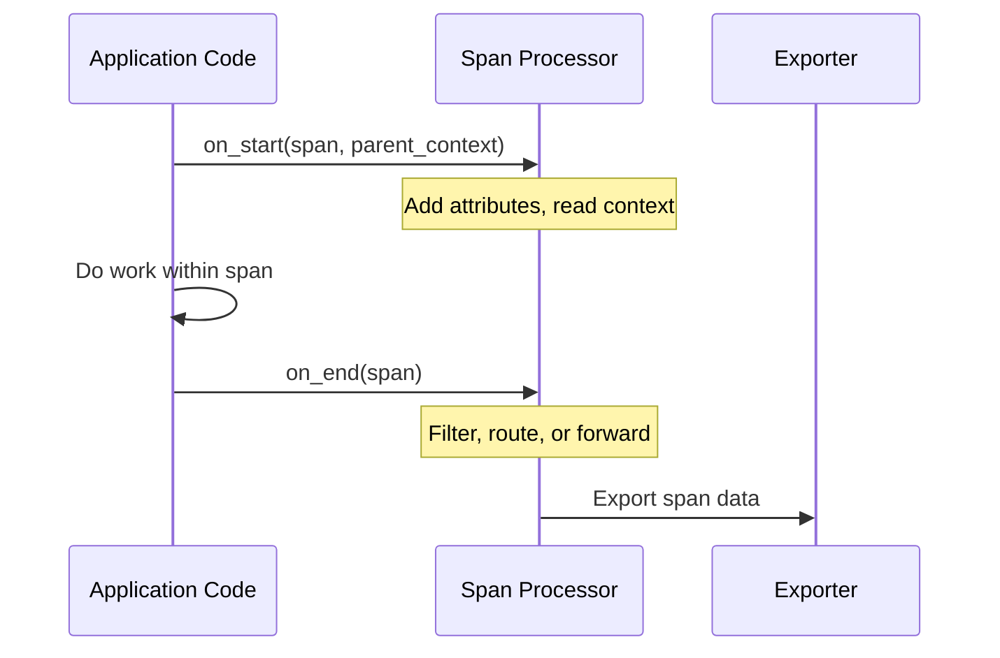

# How to Create Custom Span Processors for Attribute Enrichment

Author: [nawazdhandala](https://www.github.com/nawazdhandala)

Tags: OpenTelemetry, Tracing, Span Processors, Attribute Enrichment, Python, Observability, Custom Instrumentation

Description: Learn how to build custom OpenTelemetry span processors that automatically enrich spans with environment, deployment, and business context attributes.

---

Every span that OpenTelemetry creates carries a set of attributes. Out of the box, you get things like HTTP method, URL, and status code. But real-world debugging often requires more context. Which deployment version handled this request? What region was it routed to? Which customer tenant does it belong to? Custom span processors let you inject this information automatically, so every span in your system carries the context your team actually needs.

This guide walks through building span processors in Python that enrich spans at different lifecycle stages, from creation through export.

---

## How Span Processors Work

A span processor is a hook that the OpenTelemetry SDK calls at key points in a span's lifecycle. There are two main callbacks:

- `on_start` is called when a span begins. You can add attributes and read from the current context.
- `on_end` is called when a span finishes. The span is read-only at this point, but you can use it for filtering or forwarding.



The SDK supports chaining multiple processors, so you can compose simple, focused processors rather than building one monolithic one.

---

## Building a Basic Attribute Enrichment Processor

Let's start with a processor that adds deployment metadata to every span. This is useful when you need to know which version of your code generated a particular trace.

```python
import os
from opentelemetry.sdk.trace import SpanProcessor

class DeploymentEnrichmentProcessor(SpanProcessor):
    """Adds deployment-related attributes to every span at creation time.

    This processor reads deployment metadata from environment variables
    and attaches them as span attributes. This makes it easy to filter
    traces by version, region, or environment in your backend.
    """

    def __init__(self):
        # Read deployment info once at startup rather than on every span
        # to avoid repeated environment variable lookups
        self.deployment_env = os.getenv("DEPLOYMENT_ENV", "unknown")
        self.app_version = os.getenv("APP_VERSION", "unknown")
        self.region = os.getenv("CLOUD_REGION", "unknown")
        self.commit_sha = os.getenv("GIT_COMMIT_SHA", "unknown")

    def on_start(self, span, parent_context=None):
        # on_start receives a writable span, so we can set attributes
        span.set_attribute("deployment.environment", self.deployment_env)
        span.set_attribute("deployment.version", self.app_version)
        span.set_attribute("deployment.region", self.region)
        span.set_attribute("deployment.commit_sha", self.commit_sha)

    def on_end(self, span):
        # Nothing to do on end for this processor
        pass

    def shutdown(self):
        pass

    def force_flush(self, timeout_millis=None):
        return True
```

Register it with the tracer provider:

```python
from opentelemetry.sdk.trace import TracerProvider
from opentelemetry.sdk.trace.export import (
    BatchSpanProcessor,
    ConsoleSpanExporter,
)
from opentelemetry import trace

provider = TracerProvider()

# Add the enrichment processor first so attributes are set before export
provider.add_span_processor(DeploymentEnrichmentProcessor())

# Then add the exporter processor, which handles batching and sending
provider.add_span_processor(BatchSpanProcessor(ConsoleSpanExporter()))

trace.set_tracer_provider(provider)
```

The order matters here. Processors execute in the order they are registered. By adding the enrichment processor before the batch exporter, you ensure the attributes are present on the span when it gets exported.

---

## Enriching Spans with Request Context

A common requirement is attaching request-level information like user ID, tenant ID, or request priority. Since this data changes per request, you cannot set it once at startup. Instead, you read it from the parent context or from thread-local storage.

```python
import threading
from opentelemetry.sdk.trace import SpanProcessor

# Thread-local storage for request context that varies per request
_request_context = threading.local()


def set_request_context(user_id=None, tenant_id=None, priority=None):
    """Call this at the beginning of each request to set context
    that will be attached to all spans created during the request."""
    _request_context.user_id = user_id
    _request_context.tenant_id = tenant_id
    _request_context.priority = priority


class RequestContextProcessor(SpanProcessor):
    """Enriches spans with per-request context from thread-local storage.

    This processor reads user_id, tenant_id, and priority from
    thread-local storage and attaches them as span attributes.
    It gracefully handles the case where no request context is set.
    """

    def on_start(self, span, parent_context=None):
        # Use getattr with defaults to handle cases where
        # set_request_context was not called (e.g., background tasks)
        user_id = getattr(_request_context, "user_id", None)
        tenant_id = getattr(_request_context, "tenant_id", None)
        priority = getattr(_request_context, "priority", None)

        if user_id:
            span.set_attribute("user.id", user_id)
        if tenant_id:
            span.set_attribute("tenant.id", tenant_id)
        if priority:
            span.set_attribute("request.priority", priority)

    def on_end(self, span):
        pass

    def shutdown(self):
        pass

    def force_flush(self, timeout_millis=None):
        return True
```

In a web framework like Flask or FastAPI, you would call `set_request_context()` in middleware:

```python
from flask import Flask, request

app = Flask(__name__)

@app.before_request
def inject_request_context():
    """Flask middleware that extracts request context from headers
    and makes it available to the span processor."""
    set_request_context(
        user_id=request.headers.get("X-User-ID"),
        tenant_id=request.headers.get("X-Tenant-ID"),
        priority=request.headers.get("X-Request-Priority", "normal"),
    )
```

---

## Building a Filtering Processor

Sometimes you want to drop spans that are not useful, like health check endpoints that generate noise without providing insight. A filtering processor can suppress these before they reach the exporter.

```python
from opentelemetry.sdk.trace import SpanProcessor

class HealthCheckFilterProcessor(SpanProcessor):
    """Filters out spans from health check and readiness probe endpoints.

    These endpoints are hit frequently by load balancers and Kubernetes
    probes, generating a lot of trace data that rarely helps with
    debugging. This processor marks them as non-recording.
    """

    # URL paths that should not generate trace data
    EXCLUDED_PATHS = {"/health", "/healthz", "/ready", "/readiness", "/ping"}

    def on_start(self, span, parent_context=None):
        pass

    def on_end(self, span):
        # Check if the span represents an excluded endpoint
        url_path = span.attributes.get("http.target", "")
        if url_path in self.EXCLUDED_PATHS:
            # We cannot modify the span here since on_end receives
            # a read-only span. Instead, we use a different approach:
            # wrap the exporter to check this condition.
            pass

    def shutdown(self):
        pass

    def force_flush(self, timeout_millis=None):
        return True
```

A better approach for filtering is to use a custom exporter wrapper or a sampler. But if you want to mark spans for filtering in `on_start` while they are still writable, you can set a custom attribute:

```python
class HealthCheckMarkerProcessor(SpanProcessor):
    """Marks health check spans with a custom attribute so downstream
    processors or exporters can filter them out."""

    EXCLUDED_PATHS = {"/health", "/healthz", "/ready", "/ping"}

    def on_start(self, span, parent_context=None):
        # At on_start, we might not have http.target yet since
        # the HTTP instrumentation sets it later. Instead, check
        # the span name which is often set at creation.
        span_name = span.name.lower() if span.name else ""
        for path in self.EXCLUDED_PATHS:
            if path in span_name:
                span.set_attribute("telemetry.drop", True)
                break

    def on_end(self, span):
        pass

    def shutdown(self):
        pass

    def force_flush(self, timeout_millis=None):
        return True
```

---

## Composing Multiple Processors

In a production setup, you will likely have several processors working together. Here is how to wire them all up:

```python
from opentelemetry.sdk.trace import TracerProvider
from opentelemetry.sdk.trace.export import BatchSpanProcessor
from opentelemetry.exporter.otlp.proto.grpc.trace_exporter import (
    OTLPSpanExporter,
)
from opentelemetry import trace

provider = TracerProvider()

# 1. Mark health check spans for filtering
provider.add_span_processor(HealthCheckMarkerProcessor())

# 2. Add deployment metadata to every span
provider.add_span_processor(DeploymentEnrichmentProcessor())

# 3. Add per-request context (user, tenant, priority)
provider.add_span_processor(RequestContextProcessor())

# 4. Export to the backend via OTLP with batching enabled
exporter = OTLPSpanExporter(endpoint="https://oneuptime.com/otlp")
provider.add_span_processor(BatchSpanProcessor(exporter))

trace.set_tracer_provider(provider)
```

Each processor is responsible for one concern. This makes them individually testable and easy to enable or disable based on the environment.

---

## Testing Your Custom Processors

Unit testing span processors is straightforward because you can create spans in memory and inspect their attributes:

```python
from opentelemetry.sdk.trace import TracerProvider
from opentelemetry.sdk.trace.export import SimpleSpanProcessor
from opentelemetry.sdk.trace.export.in_memory import InMemorySpanExporter

def test_deployment_enrichment():
    """Verify that the deployment processor adds expected attributes."""
    exporter = InMemorySpanExporter()
    provider = TracerProvider()

    # Register the enrichment processor before the in-memory exporter
    provider.add_span_processor(DeploymentEnrichmentProcessor())
    provider.add_span_processor(SimpleSpanProcessor(exporter))

    tracer = provider.get_tracer("test")

    with tracer.start_as_current_span("test-span"):
        pass

    spans = exporter.get_finished_spans()
    assert len(spans) == 1

    attrs = dict(spans[0].attributes)
    # Verify the deployment attributes were injected
    assert "deployment.environment" in attrs
    assert "deployment.version" in attrs
    assert "deployment.region" in attrs
```

The `InMemorySpanExporter` collects all finished spans in a list, making it simple to assert against their attributes without needing a real backend.

---

## Performance Considerations

Span processors run on the hot path of your application. Every span creation and completion triggers all registered processors. Keep these guidelines in mind:

- Do expensive work (network calls, database lookups) in the background, not in `on_start` or `on_end`. If you need to look up a customer name from an ID, queue that work and use an async processor.
- Cache values that do not change per request, like environment variables and deployment metadata. The `DeploymentEnrichmentProcessor` above demonstrates this by reading environment variables once in `__init__`.
- Keep the number of added attributes reasonable. Each attribute increases span size and network overhead. Ten well-chosen attributes are more useful than fifty that nobody queries.

---

## Conclusion

Custom span processors give you a clean extension point for enriching your trace data with the context that matters to your team. Whether it is deployment metadata, tenant isolation tags, or request priority levels, processors let you add this information once and have it appear on every span automatically. Combined with a backend like [OneUptime](https://oneuptime.com) that supports filtering and grouping by custom attributes, this approach turns raw trace data into a powerful debugging tool.
