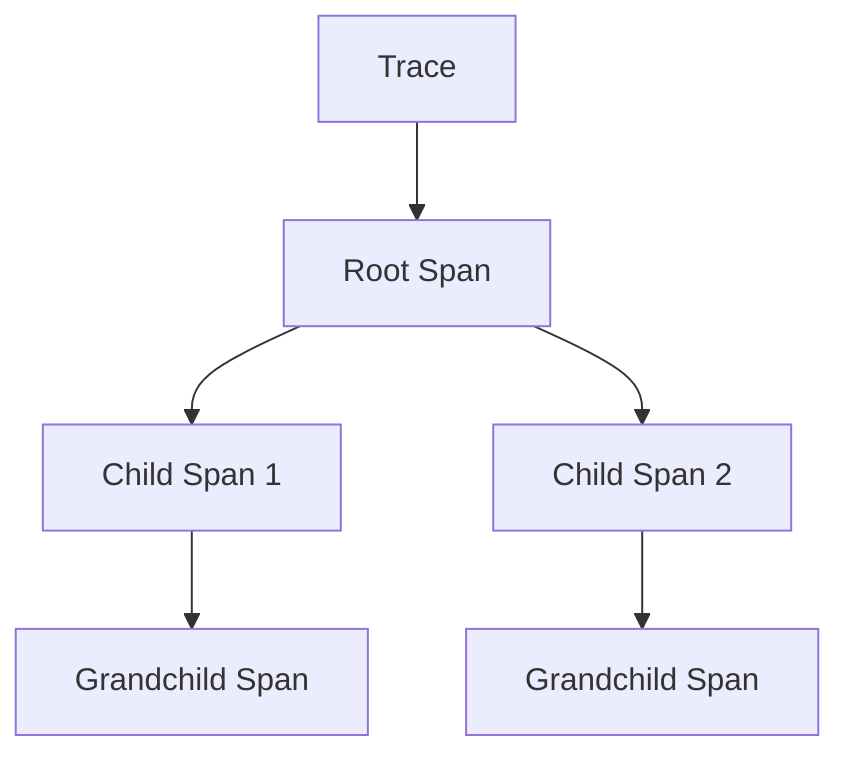

# How to Create Custom Spans and Add Attributes in C++ with OpenTelemetry

Author: [nawazdhandala](https://www.github.com/nawazdhandala)

Tags: OpenTelemetry, C++, Custom Spans, Attributes, API, SDK

Description: Learn how to create custom spans, add attributes, events, and status codes in C++ using OpenTelemetry API, including best practices for naming, context management, and performance optimization.

Custom spans and attributes form the foundation of meaningful distributed tracing. While automatic instrumentation captures basic operations, custom instrumentation reveals application-specific logic and business workflows.

## Understanding Spans

A span represents a single operation within a trace. Each span has:

- A name describing the operation
- Start and end timestamps
- Attributes (key-value pairs)
- Events (timestamped logs)
- A status code (OK, ERROR, or UNSET)
- Links to other spans
- A parent-child relationship with other spans



## Getting a Tracer

Before creating spans, obtain a tracer instance:

```cpp
#include "opentelemetry/trace/provider.h"
#include "opentelemetry/trace/tracer.h"

namespace trace_api = opentelemetry::trace;

// Get tracer from global provider
auto provider = trace_api::Provider::GetTracerProvider();
auto tracer = provider->GetTracer(
    "my-application",  // instrumentation library name
    "1.0.0"           // instrumentation library version
);
```

The instrumentation library name and version help identify which component generated spans.

## Creating Basic Spans

Create a simple span to track an operation:

```cpp
void ProcessOrder(const std::string& order_id) {
    // Start a span
    auto span = tracer->StartSpan("process_order");

    // Perform the operation
    ValidateOrder(order_id);
    CalculateTotal(order_id);
    ChargePayment(order_id);

    // End the span when done
    span->End();
}
```

Always end spans to ensure telemetry is exported. Forgetting to call `End()` causes incomplete traces.

## Using Span Scope

RAII-style scope management automatically ends spans:

```cpp
void ProcessOrder(const std::string& order_id) {
    auto span = tracer->StartSpan("process_order");
    auto scope = tracer->WithActiveSpan(span);

    // Perform operations
    ValidateOrder(order_id);  // Creates child spans automatically
    CalculateTotal(order_id);
    ChargePayment(order_id);

    // Span ends when scope is destroyed
}
```

The scope makes the span "active," allowing child operations to create nested spans automatically.

## Adding Attributes

Attributes provide context about the operation:

```cpp
void ProcessOrder(const std::string& order_id, double amount) {
    auto span = tracer->StartSpan("process_order");
    auto scope = tracer->WithActiveSpan(span);

    // Add string attribute
    span->SetAttribute("order.id", order_id);

    // Add numeric attributes
    span->SetAttribute("order.amount", amount);
    span->SetAttribute("order.item_count", 3);

    // Add boolean attribute
    span->SetAttribute("order.is_premium", true);

    // Perform operations
    ValidateOrder(order_id);

    span->End();
}
```

Attributes accept strings, numbers (int, double), and booleans. They can be added anytime before the span ends.

## Using Semantic Conventions

OpenTelemetry defines standard attribute names for common concepts:

```cpp
#include "opentelemetry/trace/semantic_conventions.h"

void HandleHttpRequest(const std::string& method, const std::string& url) {
    auto span = tracer->StartSpan("http_request");

    // Use semantic convention constants
    span->SetAttribute(
        trace_api::SemanticConventions::kHttpMethod,
        method
    );
    span->SetAttribute(
        trace_api::SemanticConventions::kHttpUrl,
        url
    );
    span->SetAttribute(
        trace_api::SemanticConventions::kHttpScheme,
        "https"
    );
    span->SetAttribute(
        trace_api::SemanticConventions::kHttpTarget,
        "/api/v1/users"
    );

    span->End();
}
```

Semantic conventions ensure consistency across different services and languages.

## Setting Span Status

Indicate whether an operation succeeded or failed:

```cpp
void ProcessPayment(const std::string& payment_id) {
    auto span = tracer->StartSpan("process_payment");
    auto scope = tracer->WithActiveSpan(span);

    try {
        ChargeCard(payment_id);

        // Operation succeeded
        span->SetStatus(trace_api::StatusCode::kOk);
    } catch (const PaymentException& e) {
        // Operation failed
        span->SetStatus(
            trace_api::StatusCode::kError,
            e.what()  // Error description
        );

        // Re-throw to propagate error
        throw;
    }

    span->End();
}
```

Setting status to `kError` marks the span as failed in tracing UIs.

## Adding Events

Events are timestamped logs within a span:

```cpp
void ProcessOrder(const std::string& order_id) {
    auto span = tracer->StartSpan("process_order");
    auto scope = tracer->WithActiveSpan(span);

    span->AddEvent("order_validation_started");
    ValidateOrder(order_id);
    span->AddEvent("order_validated");

    span->AddEvent("payment_processing_started");
    ProcessPayment(order_id);
    span->AddEvent("payment_completed");

    // Events with attributes
    span->AddEvent("notification_sent", {
        {"notification.type", "email"},
        {"notification.recipient", GetUserEmail(order_id)}
    });

    span->End();
}
```

Events help track detailed progression within an operation without creating separate spans.

## Creating Child Spans

Build a hierarchy of related operations:

```cpp
void ProcessOrder(const std::string& order_id) {
    // Parent span
    auto parent_span = tracer->StartSpan("process_order");
    auto parent_scope = tracer->WithActiveSpan(parent_span);
    parent_span->SetAttribute("order.id", order_id);

    // Child span for validation
    {
        auto validation_span = tracer->StartSpan("validate_order");
        auto validation_scope = tracer->WithActiveSpan(validation_span);

        CheckInventory(order_id);
        ValidateAddress(order_id);

        validation_span->End();
    }

    // Child span for payment
    {
        auto payment_span = tracer->StartSpan("charge_payment");
        auto payment_scope = tracer->WithActiveSpan(payment_span);
        payment_span->SetAttribute("payment.method", "credit_card");

        ChargeCard(order_id);

        payment_span->End();
    }

    parent_span->End();
}
```

Child spans automatically link to their parent through the active scope.

## Explicit Parent-Child Relationships

Create child spans without relying on scope:

```cpp
void ProcessOrder(const std::string& order_id) {
    auto parent_span = tracer->StartSpan("process_order");

    // Explicitly set parent in start options
    trace_api::StartSpanOptions options;
    options.parent = parent_span->GetContext();

    auto child_span = tracer->StartSpan("validate_order", {}, options);

    // Child span is now linked to parent
    ValidateOrder(order_id);

    child_span->End();
    parent_span->End();
}
```

## Setting Span Kind

Specify the role of a span in the trace:

```cpp
// Server span (receives request)
trace_api::StartSpanOptions server_options;
server_options.kind = trace_api::SpanKind::kServer;
auto server_span = tracer->StartSpan("handle_request", {}, server_options);

// Client span (makes request)
trace_api::StartSpanOptions client_options;
client_options.kind = trace_api::SpanKind::kClient;
auto client_span = tracer->StartSpan("call_api", {}, client_options);

// Internal span (internal operation)
trace_api::StartSpanOptions internal_options;
internal_options.kind = trace_api::SpanKind::kInternal;
auto internal_span = tracer->StartSpan("calculate_tax", {}, internal_options);

// Producer span (produces message)
trace_api::StartSpanOptions producer_options;
producer_options.kind = trace_api::SpanKind::kProducer;
auto producer_span = tracer->StartSpan("publish_event", {}, producer_options);

// Consumer span (consumes message)
trace_api::StartSpanOptions consumer_options;
consumer_options.kind = trace_api::SpanKind::kConsumer;
auto consumer_span = tracer->StartSpan("process_message", {}, consumer_options);
```

## Setting Start Time

Override the automatic start time for historical data:

```cpp
void RecordHistoricalEvent() {
    // Create timestamp for when event actually occurred
    auto event_time = std::chrono::system_clock::now() - std::chrono::hours(1);

    trace_api::StartSpanOptions options;
    options.start_system_time = event_time;

    auto span = tracer->StartSpan("historical_event", {}, options);
    span->SetAttribute("event.recorded_late", true);
    span->End();
}
```

## Complex Attribute Types

Add arrays and nested structures:

```cpp
void ProcessBatch(const std::vector<std::string>& item_ids) {
    auto span = tracer->StartSpan("process_batch");

    // Array of strings
    std::vector<opentelemetry::common::AttributeValue> items;
    for (const auto& id : item_ids) {
        items.push_back(id);
    }
    span->SetAttribute("batch.item_ids", items);

    // Array of numbers
    span->SetAttribute("batch.sizes",
        std::vector<int64_t>{10, 20, 30, 40}
    );

    span->End();
}
```

## Recording Exceptions

Capture exception details in spans:

```cpp
void ProcessRequest(const std::string& request_id) {
    auto span = tracer->StartSpan("process_request");
    auto scope = tracer->WithActiveSpan(span);

    try {
        HandleRequest(request_id);
        span->SetStatus(trace_api::StatusCode::kOk);
    } catch (const std::exception& e) {
        // Record exception as an event
        span->AddEvent("exception", {
            {"exception.type", typeid(e).name()},
            {"exception.message", e.what()},
            {"exception.escaped", false}
        });

        span->SetStatus(trace_api::StatusCode::kError, "Request failed");
        throw;
    }

    span->End();
}
```

## Span Links

Link spans that are causally related but not in a parent-child relationship:

```cpp
void ProcessBatch(const std::vector<trace_api::SpanContext>& related_contexts) {
    // Create links to related spans
    std::vector<trace_api::SpanContextKeyValueIterable::Entry> links;
    for (const auto& context : related_contexts) {
        links.push_back({
            context,
            {{"link.reason", "batch_processing"}}
        });
    }

    trace_api::StartSpanOptions options;
    options.links = links;

    auto span = tracer->StartSpan("batch_operation", {}, options);

    // Process batch
    span->End();
}
```

## Performance Considerations

Minimize overhead in hot paths:

```cpp
class HighPerformanceService {
private:
    std::shared_ptr<trace_api::Tracer> tracer_;

public:
    void ProcessRequest(const std::string& id) {
        // Only create span if tracing is enabled
        if (!IsTracingEnabled()) {
            ProcessInternal(id);
            return;
        }

        auto span = tracer_->StartSpan("process_request");
        auto scope = tracer_->WithActiveSpan(span);

        // Batch attribute setting
        span->SetAttribute("request.id", id);

        ProcessInternal(id);

        span->End();
    }

private:
    void ProcessInternal(const std::string& id) {
        // Core logic without tracing overhead
    }

    bool IsTracingEnabled() {
        return trace_api::Provider::GetTracerProvider() !=
               trace_api::Provider::GetNoopTracerProvider();
    }
};
```

## Best Practices

1. Use descriptive span names that indicate the operation (verbs, not nouns)
2. Set attributes early to ensure they appear even if the operation fails
3. Always end spans, preferably using RAII scope guards
4. Use semantic conventions for standard operations
5. Add events for significant milestones within a span
6. Set error status and include error details
7. Avoid creating spans for trivial operations in hot paths
8. Use appropriate span kinds to clarify service boundaries

## Complete Example

Here's a comprehensive example demonstrating all concepts:

```cpp
#include "opentelemetry/trace/provider.h"
#include "opentelemetry/trace/span.h"
#include <memory>
#include <string>
#include <vector>

namespace trace_api = opentelemetry::trace;

class OrderProcessor {
private:
    std::shared_ptr<trace_api::Tracer> tracer_;

public:
    OrderProcessor() {
        tracer_ = trace_api::Provider::GetTracerProvider()
            ->GetTracer("order-processor", "1.0.0");
    }

    void ProcessOrder(const std::string& order_id, double amount,
                     const std::vector<std::string>& items) {
        // Create root span
        auto span = tracer_->StartSpan("process_order");
        auto scope = tracer_->WithActiveSpan(span);

        // Set initial attributes
        span->SetAttribute("order.id", order_id);
        span->SetAttribute("order.amount", amount);
        span->SetAttribute("order.item_count", static_cast<int>(items.size()));

        try {
            span->AddEvent("validation_started");
            ValidateOrder(order_id, amount);
            span->AddEvent("validation_completed");

            span->AddEvent("payment_started");
            ProcessPayment(order_id, amount);
            span->AddEvent("payment_completed");

            span->AddEvent("fulfillment_started");
            CreateShipment(order_id, items);
            span->AddEvent("fulfillment_completed");

            span->SetStatus(trace_api::StatusCode::kOk);
        } catch (const std::exception& e) {
            span->AddEvent("exception", {
                {"exception.type", typeid(e).name()},
                {"exception.message", e.what()}
            });
            span->SetStatus(trace_api::StatusCode::kError, e.what());
            throw;
        }

        span->End();
    }

private:
    void ValidateOrder(const std::string& order_id, double amount) {
        auto span = tracer_->StartSpan("validate_order");
        auto scope = tracer_->WithActiveSpan(span);

        // Validation logic
        if (amount <= 0) {
            span->SetStatus(trace_api::StatusCode::kError, "Invalid amount");
            throw std::runtime_error("Invalid amount");
        }

        span->End();
    }

    void ProcessPayment(const std::string& order_id, double amount) {
        auto span = tracer_->StartSpan("process_payment");
        auto scope = tracer_->WithActiveSpan(span);

        span->SetAttribute("payment.amount", amount);
        span->SetAttribute("payment.method", "credit_card");

        // Payment processing logic

        span->End();
    }

    void CreateShipment(const std::string& order_id,
                       const std::vector<std::string>& items) {
        auto span = tracer_->StartSpan("create_shipment");
        auto scope = tracer_->WithActiveSpan(span);

        span->SetAttribute("shipment.item_count", static_cast<int>(items.size()));

        // Shipment creation logic

        span->End();
    }
};
```

Creating custom spans and attributes transforms raw trace data into actionable insights. Focus on capturing information that helps debug issues and understand system behavior in production.
